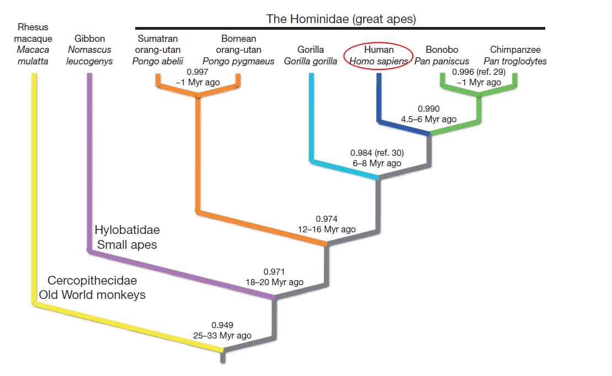
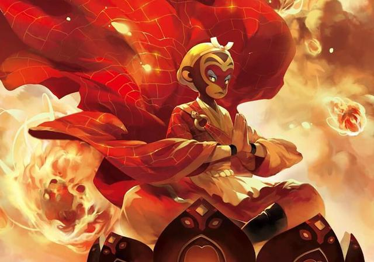

《论语》云：“取乎其上，得乎其中；取乎其中，得乎其下；取乎其下，则无所得矣。”     

《孙子兵法》也云：“求其上，得其中；求其中，得其下，求其下,必败。”  

人的一生还是蛮曲折的。       

从出生前的百米冲刺到出生后的升级打怪。       

优胜劣汰是基本的规则，一般不容商榷。      

如果摒弃高标准，争上游的心境，其实到最后都有归宿，也就不用一路向西。       

人类在几百万年前开始与黑猩猩和倭黑猩猩分化（Locke et al., 2011）。从分类学上讲，人类与黑猩猩和倭黑猩猩同属动物界、脊索动物门、脊索动物亚门、哺乳纲、灵长目、人科。人科以下分为猩猩亚科（红猩猩）和人亚科（倭黑猩猩、黑猩猩、现代人）。

   
  
而人与黑猩猩和倭黑猩猩分化之后，人类的高智力驱使人类快速进化，主要表现在智力的开发。

从某种方面上来说，有人认为人类的思想作为超物质存在，与动物区别（不一定准确，动物应该也有思想）。也正因此，人类自认为更加聪明。    

而我们，作为独立的个人，来到这个世界，同样具有超高的智力和独特的思维意识。这也是人与人在生命历程中逐渐出现同与不同的主要内因。  

更具体一点来说，是主观能动性产生主观驱动力，来驱使我们不断走向不同的方向，即内心的远方。要么走的更远，要么飞的更高，再要么幻灭。总归内心的驱动力几乎决定了走向。

不谈环境因素，是因为几乎所有的情况下我们无法选择环境，只能在既定的环境下有所同，有所不同。

生下来在北方，那就是在北方；生下来具有天神神力，谁也夺不去；生下来是石猴，就注定会有波澜壮阔的一生；取经路上也只能唐三藏作为猴子的师父。这一切不可变，唯一可变的便是修心，成佛。

   
  
从小到大，我们要历经不同的生活轨迹和环境。几乎每一个阶段都容易让人暂停，或者自己想停下来。

我在长跑的时候，其实就是这个样子，在决定周末早上长跑之前，要先在内心博弈好几次，最后下定绝心执行，开始之后又很累，跑了10公里，就想停，感觉已经跑了很远很远，十公里很完美，但显然和起初的长跑目标（起码25公里）相去甚远。总之，想要跑完最初的计划目标，蛮难的，总有各种理由让自己停下来。不过有趣的是，坚持下去的理由却只有一个，那就是产生放弃念头的一瞬立马淬灭它，然后进入下一轮的较量和博弈。

还有多远，一念之间。
 
研究生阶段，就更是如此，很容易被不同的声音所捆绑。这就像即将翱翔的飞鹰被折去翅膀，正茁壮成长的幼苗却被打了尖。 

研究生阶段，做了这些就足够毕业了……  emmm，如果仅仅是够毕业……  相信自己有时候是保护自己的翅膀。

如果因为足够，就荒废生命。

这也就好比，你不用工作了，反正饿不死……  其实是没有人性的……  人的一生，总是短暂，来不及抬头，就又到回首时。往往一回首已不再少年。

不管你飞不飞，天空就在那里。

Locke DP, Hillier LW, Warren WC, et al. Comparative and demographic analysis of orang-utan genomes. Nature. 2011;469(7331):529-533. doi:10.1038/nature09687