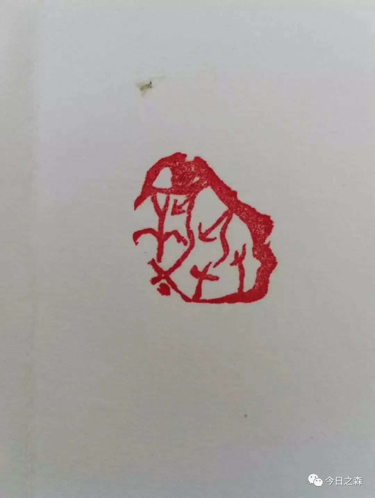

我在二营部
2016年5月8日              星期日                晴

早上营长集训走了！中午TYD班长回来了！我们三个（我、TLL、LJF）白天的训练没人问，瞎混了一整天，下午去找点，晚上六点才带回！

一直感觉自己有很多的缺点和不足，是时候改正咯！

买的健腹轮和那本书还没有到！呃！

昨天我上街了！这是我来到部队后的第一次外出，看到了来时的梅河口火车站！见到了高班长夫人！自己去逛了梅河大街！

加油吧！明晚开始看书！

依波200多。

 

2016年5月12日              星期四                阴

前天跟二炮连说了再见，跟着四连上山打枪去了！

上午  8/9/9；0、1、2；0、2、3；3、2、2

下午  10、10    11000   10000

怎么说呢！训练了大半年的迫击炮，最后我却无法参与打实弹。作为一个没有专业的人，在营部这种地方真的很难立足，就像班长问的，有什么特长一样，的确需要重新给自己一个定位了！

当然了，对于目前的各种事情我还是处理的不够妥当！

不能就这么没有目标性的混日子吧！

龙山魂，不能丢。立标准争上游！

ZQQ帮我买的《爱情，危险的投资》、《中国人史纲》另：《满月之夜白鲸现》

生活的确不容易啊！出门在外全得靠自己！

门口黑板上，杨辉写了这样一句话：要想达到既定的目标，就得耐住寂寞单干！

 

2016年5月12日         星期四                 中午小雨

今天是5月12日。汶川大地震纪念日！从2008年到今天，已经过去了八个年头了！

 

中午睡醒！窗外下着雨花，各连估计都在俱乐部组织调整吧！反正我一下午都在值班室呆着！

 

2016年5月17日     星期二                          晴

自周日一天大雨以来，山上的场地不是很好，训练已经不像当初那样认真了，从上周开始，尤其以这周较为突出，上山训练即为休息，甚至比休息还休息！

大干六十天的口号喊得很响亮，不过从上周开始也日渐消失殆尽，今天是倒计时13天了！

明天班副该休假归队了！

明天依旧是爽歪歪的“训练”。

 

2016年5月19日           星期四                大晴天

上午刚猫起来就让连长抓了个正着！昨天晚上西山的风景很好，信号弹划过天际，美极了，还有一轮明月，身后的装甲车，今天还带了手机！

(信号弹划过天际）

另：张弛推荐其同学赵洁问参军的相关事宜！

另：与普俊清、吕孝德聊天。

大干“11天”。

 

2016年5月24日         星期二   昨天大雨，今日小雨，阴天

前天（5.23）晚电影《黄继光》，昨天下午14:35开始下雨，我们几个新名蛋子在西山弹药库破房子里又冷又饿啊，几个人一起订了肉饼和烤鸭！

上周居然休息了两天，这对我来说已然算是长假了！

最近有很多人问我关于参军的事情，其实，我说的再多，也没有用，只有你真的来到了这里，才能真的懂的部队的生活是怎样的，或者说，当兵到底苦不苦，累不累。

面对大家的疑问，一直都想写一文而解之，但始终无从下手。

 

2016年5月24日         星期二                  雷阵雨

昨晚电影《梦想合伙人》，类似于像这种心灵鸡汤式的电影往往让人产生一种错觉。每次喝汤都让人迷醉其中，像打了鸡血一样，洗漱过后才觉鸡汤无味。

高数老师赵斌说得对，只有放下，才会真正觉悟，才会有质的变化，太过强求总是造成尴尬。

定位很重要！

梦想从做梦开始……

营长才吃饭……（22:45）

 

2016年6月10日           星期五                 阵雨

已经有半个月没有动笔了，这里的日子永远是重复，我不想去记录无果的流年。

最近看过的电影也忘了记。

《咆哮无声》、《捉妖记》《……》

今年的高考也落下了帷幕，也不知道HYG考的咋样，但愿考得不错吧！

人说：高考毕竟只不过一场考试而已，人生是一场马拉松，或许人们一贯的思维都把高考当成了鲤鱼跃龙门，当年的我也是，而今看来，想起当年高考，其实早就无感了！

考或者不考，一直在我心里摇摆不定。

有时候想一想，人生真的很可笑，往往都会事与愿违，不知未来，谁都不知道，明天会发生什么！

就像今年68旅赴马里维和的中士申亮亮一样。那一班岗为什么恰恰就是他！

2016年6月11日     星期六                       

今天是放假最后一天了！

 

2016年6月12日      星期日（早）                    雾

早上睁开眼，感觉状态还不错，早早地起床收拾完卫生，外面满是雾气，温度还是可以的，慢跑了一圈，虽然不累，但也微微出汗。李岩迪和黑鬼被戏说，跑步都能溢出人肉味，我们几个就在戏谑中轻松跑完了一圈！

今天周日。

很多事情还是泰然处之吧！顺其自然可能就是最美的故事！

还有，前几天维和牺牲的烈士申亮亮回家了。

今天是训练日，认真的过每一天吧！

 

2016年6月12日       星期日（晚）                  阵雨

今天听连座口谕！周三（15日）实弹，新兵就我和金天峰去，其他人都是有过实弹经验的老兵。毕竟此科目也是这么多年从未实施过的训练内容——简便设计！对于100毫米迫击炮而言，两名炮手协同实施的确危险系数较大！即使是0号装药！因为200-400米的射程实在不好把握，一不小心就会直上直下，然后……

另：西门岗取水！LT教导员要去坦克四营当营长，四连指导员LXY要去塔克二营当教导员，六连连长JW去教导队当队长！CXL任六连连长！这次的人员变动真大！晚上的体能是去西山跑的!

下午体能回来的时候，刀哥给我们上了一课！仔细想想也是，人都说部队苦，军人累，其实一点都不苦，一点都不累，说白了就是什么事都不干还给发工资！现在的兵都压不住性子！压不下心来去重复一个动作！说到重复，高中数学老师也曾强调过重复的重要性！很多东西禁得起不断地重复才能配套优秀！

他的一番话也更加坚定了参加2017年军队院校招生考试的信念和信心！或许，注定要走这条路吧！

 

2016年6月13日          星期一                   晴

新的一周开始咯！

 

2016年6月16日         星期四                  雷阵雨

有时候真的感觉给领导干通讯员，说好听点就像古代给皇帝当妃子，不好听就是奴才！

最近雨水挺足的，真没想到东北这地方夏雨冬雪，夏酷冬寒，冬夏变化分明。上次跑十公里出西山，看到那边风景还是不错的，有稻田地，池塘，有流水，有山，有人家，感觉比家乡那边要好一点！

想一想来营部已经快50天了，高班长还曾经问我有什么想法？其实心里根本还存在确切的路，不知道未来到底会走怎样的路！

唉……睡觉吧！

 

2016年6月19日       星期日                  阵雨+暴雨

又下了一整天的暴雨，今天是二营的大日子，LT教导员走了（坦克四营营长），新上任的LSL（原保卫科长），装步四连指导员LXY走了（坦克三营教导员）！

中午在雨中举行了欢送仪式！

而我，明天值班！

高班长说的对，新兵要有新兵的样子，感谢高班长教导！

最近一直在坚持篆刻的事情……

睡觉吧……

2016年6月28日      星期二                    狂风暴雨

东北，听风便是雨。听雷声，下一秒必定要风雨大作。刚在环路跑体能，不料暴雨骤降，大风呼啸，地表蒸腾着热气，雨滴打在窗玻璃上，感觉玻璃都要被打碎了。

 

2016年7月16日        星期六                      阴

半个月来都没有很特别的事情。

又买了印床，昨天创作了“不忘初心，继续前进”。

前几天买了一支笛子，想学点乐器一直都是我的梦想呢！在笛子吧张榜示意，寻得一师傅，他耐心的教了我很久，还是免费的，从无到有。

最近一直持续高温，常常汗流浃背的，短袖浸湿。FPC本来今年军考都过了线，结果体检出了问题！唉……

 

2016年7月22日      星期五                       雨

来到营部快三个月了，这里的生活显然和连队是不一样的，在基层连队的生活很踏实，生活也会很简单，甚至都可以说是纯洁。

而现在的我感觉到十分的不安，晚上失眠，晚上做梦，早上起不来。可怕的是让我感觉在这里的每一刻都是危险的，一丝一毫都不敢放松，即使睡觉的时候都要留着门缝，耳朵竖起来。至于具体是什么让我恐惧都不是很清楚。

这里的每一个人都给我一种很可怕的感觉！好像通过文字已经很难描述我现在的心绪了！人跟人之间的信任真的就那么微弱么？越长大越看不清人与人之间的很多事情了，就像关于“○”的理论，虽然年龄的增长，阅历的丰富，再加上经验的积累，自己把○越画越大，而自己所接触到的未知和迷惑的东西也更加的深远。

有时候也觉得自己可怜，二十年过去了，尽管之后的好几年，我都万万没有想到，经历也不少，但仔细想想，回首一看，竟没有几个朋友。

 

2016年7月25日         星期一                    阴

今天已经七月二十五日了，恍惚一年，总感觉自己失去了一些东西，类似朋友，但又一想，朋友若是真的，又怎么会失去呢？真是可笑！

21号驻训分队陆续返营了。

中午下起了暴雨，但空气并没有因此而清爽，反而更加闷热，这周都没有训练了，今天连队在打扫卫生，整个营区都在规整物资，清理库房，而我，今天坐在值班室看了一天的风景。

明天就是半年总结了，这一周都是总结和表彰，还有教育！

最近跟大学同学联系了一下，好像大家都很忙，很多人留校做科创！三下乡！社会实践！

哎，做平凡人，做平凡事！

八月十二日第一梯队进场，还不知道我到时候是参加演习还是留守呢！

 

2016年7月28日          星期四                   晴

这周除了半年工作总结之外，就是在我旅组织集团军创破纪录，很多人（WB、HDH……）

今天是旅半年讲评以及警示教育大会！政委指示：温水煮青蛙，米缸里的老鼠。

①2011.11.9；

②829事件——血泪镜鉴；

③李鑫鑫——警钟长鸣；

④侯福生杀人案；

七月快要结束了。

刚刚道德讲堂结束回来路上，正风雨巨变，黑云压城城欲摧！此刻已然风雨大作，整座楼都叮当作响，还是有点恐怖的。唉，明天早起准备作战拉动吧！

窗外暴雨！

