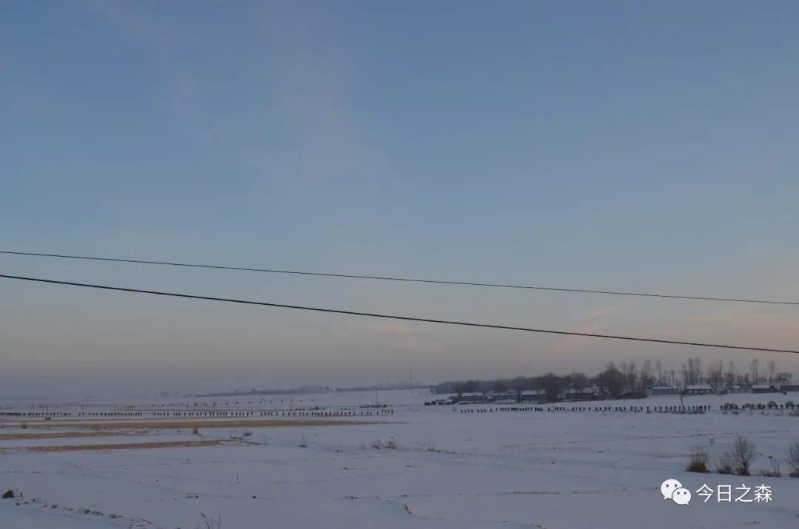
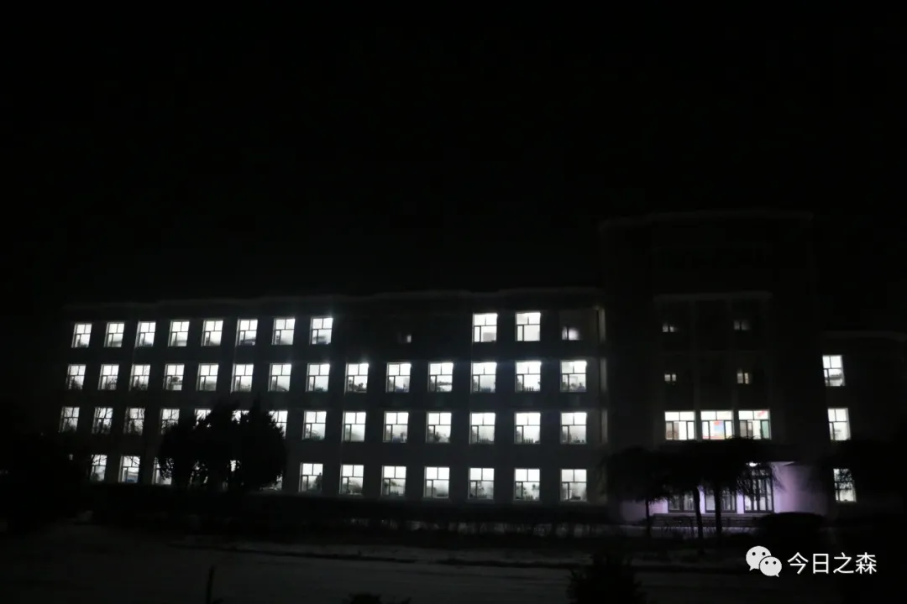

2016年1月26日                 星期二             晴

中午训练结束刚回连队，冯浩洋就塞给我一个包裹！恩，是MLL寄给我的。

内有书两本《浮生六记》、《倚梦闲话》，牛腱肉一包

晚上正常看电影《诱狼》，记得某个周二看的《唐仁》

明天教育日考军改应知应会！

此刻牛奶+面包学习室！

2016年1月29日               星期五               晴

续2016.1.26晚电影《诱狼》晚上我也是没谁了。我们班那天晚上厨房值日，看电影去晚了，我进去一看大礼堂都没位置了，就前排留了两个空座，没人坐，我就“哐”一下坐下了，没一会儿。营长指挥全营区坐下后，他过来问我，这是他的位置么？旁边有人答曰：是！

我的天！第一次跟这么大领导坐这么近！心咚咚咚的！之后他找我聊天，本来看电影是可以放松坐的，结果他坐我旁边后我坐的更加挺直！他问我哪里人？且谈及了当下大学的弊病！

2016.1.27 周三 晴 教育日。

2016.1.28 周四 营战术演习，第一次出大门岗，我们从大门岗以东向西南方向迂回前进！

2016.1.29 全营区换新床、新柜！所有的都是最新版的，挺高大上的！对了，又涨工资了，950元/月。

 

2016年1月30日            星期六                晴

续：2016.1.27晚，不知何故六连与八号首长干起来了！

场景：大礼堂全营区考条令条例。

以下是六连长（JW）与八号首长（ZCJ）的对话:

六连长：所有人，带凳子起立！

老八：JW！你什么意思！

六连长：我连带回再背一背！

老八：你以为部队是你家！

六连长：……

老八：都给我坐下！（发火ing）

此时六连全体官兵无一人动！整个会场鸦雀无声！

老八（怒吼）：都给我坐!

此时依旧无人动。

老八：JW，让你的人都给我坐下！这是命令！

六连长（迟疑了许久）：都坐下！

六连全体官兵刷一下就坐，就一个声音！

老八开始讲评！讲了有半个小时吧！

今天中午！

（这一段至今想起来都历历在目，不管是当时还是现在，我都觉得一个连长能把自己的兵带的嗷嗷叫，那就是很厉害。部队需要服从，但这种铁骨铮铮的气势更可贵。）

     

 

2016年2月4日             星期四                  晴

续2016.2.1-2.4，这周从周一开始我就没有参加白天的共同科目训练，留在家里准备春节文化的布置，再加上冻冰。周一晚上未发手机。前天晚上（2.2）肖金果班长给孙鹏补生日，从外面让小飞侠订了几个菜……

（这里解释一下，很多没去过东北的朋友可能不了解冻冰是要干嘛，其实是用来做冰雕的，用来营造春节氛围）

昨晚终于发手机了，打了好几个电话！

第一个打给了老哥，2月3日晚上到临洮，老哥快回家了。

后面几个打给了同学，感觉再也没有曾经的熟悉了。朋友们可能就这样渐行渐远了吧！就这样吧！

今天晚上电影《勇士……》，JZ4U海龙营区迎新春晚会。

晚会上有一哥们穿的抹胸，丝袜，直到整个节目结束了我们都以为是她外面请来的演出嘉宾，后来才知道是122自行榴炮营一哥们儿扮的，真是有才。

还请了梅河一个学校的舞蹈队。

家属和旅首长都在！

 

2016年1月30日            星期六                 晴

从2月4日-7日一直都是文化氛围布置，2月7日是大年三十儿，除夕晚上我们煮的火锅，晚上没有收手机，那天晚上三点多就睡了，早上六点起床，喝了两罐啤酒，说实话，这玩意不咋好喝，昨晚电影《一家老小向前冲》、《一念天堂》。

从初一到初四一直都在玩手机，该打的电话都打了一遍，该问候的也都问候了。

这几天的活动：

雪地保龄球；
极限跳绳；
雪地寻宝；
拔河比赛。
昨晚肖金果班长给我过生日，又买了400多块钱的火锅。
唉……
小学同学赵发路已经下士第三年了。
晚上电影《冰封重生之门》
 
2016年02月12日（正月初四）  星期四                   晴
上午在网吧泡了一上午！中午得知父亲要准备翻修房子了，其实作为儿子，我是不易提及此事的，怕说我不孝啊（其实他不会说）。
这也是好事，毕竟家里的土木房子已经快20年了，年成已久，再加上时有地震影响，房子整个框架已经走样了，老哥那里应该可以出五、六万吧！
今年八月我应该也能拿出四、五万吧！
晚上点名的时候却下起了雪。
恩！今天是我的生日，这算是第一次过生日吧！在家对过生日这种事情我也不愿意张罗。
生日蛋糕！撸串！火锅！还有一瓶班长冒着危险弄进来的红酒！我们全班还叫了排长和冰班。（可是心里却别样的复杂。）
诗两首
一、火车轨（改为铁轨更合适）
我爱她
自从进了那院子
最喜欢
听 火车从她身上爬过时的动静
其实
我不认识她
没有亲手去摸她一摸
便爱她爱到深沉
 
早晨，是她给我力量和生气
夜晚，是她给我安宁与平静
倘若，有一日
我有了房子，一定要让她在我的院子里
 
二、深夜
深夜里，窗外
谜一般的灯芒
霓虹灯迷裹着夜空
怪的人看错了眼？
“你害苦了我——仇家！”
她哭，他——不回答
细雨轻抚着星空
掉了，晚冬的流星
（2016年2月）
 
2016年2月14日         星期日                 晴（大风）
所谓的情人节！。
今天是新年收假后的第一天训练日，本以为会同往常一样度过，没想到我错了，下午手榴弹使用，下课带回后4:10大多都换了体能着装。
突然一声——“紧急集合哨”
所有人（新兵）都蒙圈了，背背囊于管理组三号路集合，我们全连跟以往一样在首长面前集合完毕。
首长：ZQJ，你带队，绕最大圈（2000米）跑一圈，我去，当时我心情那个复杂。
不过跑完了才有一种感觉，这才是当兵的样子！
听他们讲，今年全年都是战备，也估计今年都不用叠被子了，再加上今年跨区演习，到时候会有10公里重装奔袭，76分钟合格。
班长17号休假，冰班后天休假！
 
2016年2月16日         星期二                 晴（大风）
续2016.2.15一，小雪，大风。昨天在山上呆了一天，晚上开了营区节日总结大会。
得知全旅有三个营主官因节后未按时归队做检查。
得知三个连主官因春节期间私自使用瓦斯罐吃火锅做检查。
得知在开会过程中有人（姚忠忠）睡觉，被罚背背囊跑一圈。
得知旅长要开始查所有物品。
对了，八号首长还在会上口头表扬了我。
昨晚拆了背囊……
今天和昨天一样，上山训练，寒风瑟瑟，这几天真的是冷到爆。
晚上电影《thelast ……》
听排长讲。联合国要开始制裁朝鲜了……
对了，四班长（车路平）休假回来了，我班长明天走（四川·广元），冰班昨天也走了（安徽·亳州）。
感觉最近的形势越来越紧张，还不知道会发生什么呢？唉……
 
2016年2月21日           星期日                  晴
慢慢的对写日记自己不会再强迫着去写了。
这周三依旧上山，周四教育（又有人出去跑圈了），周五车炮场日，电影《美人鱼》。
周六周日休息，昨天往西山外面清雪，出去了三次，吃了三串糖葫芦。
从昨天起，5000米取消了，以后都是10000米科目了，今晚班里聚餐。
今天虎班休假回来了。
 
对于目前的我来说，一直都在思考是走还是留？举棋不定啊，可能还是当下最重要吧！
（此处删去一段）
从2014年9月入学到2016年2月21日，短短一年半的时间，QQ好友从100多到800多，手机联系人从几十个到300多个，空间访问量从6000多到如今的53000多，在别人看来，我一定有很多的朋友，有一个很广泛的交际圈！
殊不知，偶尔当连队发手机的时候，除了给至亲打电话之外，我再也不知道该把下一个电话打给谁，也不知道该给哪一个朋友发一条消息。我知道，离开的时间长了，慢慢的就会和以前的朋友关系淡了，也会感觉跟他们没有共同语言了，所以，我也慢慢的失去了对取手机哨音的敏感和喜悦，甚至很多时候都不想再取手机了。（4号首长说得对啊！随着时间的推移，时间会冲淡一切！或许很多人只昙花一现，但总有些人永记心中！）
明天开始专业训练了！                            
 
2016年2月28日        星期日                      晴
最近慢慢的没有写日记的习惯了，可能是琐事太多了吧，从周一到今天一直都在干活，挖坑，铺砖……
昨天晚上11；00多，那时候我刚睡着，排长着急忙慌叫醒了我，我还迷迷糊糊的，但我感觉肯定出事了，不会是家里吧？！！排长说我哥打来的电话，伯父走了，年仅54岁啊！
我赶紧把电话打给老爸，说伯父心肌梗塞，突发性死亡，当时还在医院。
今天伯父下葬，不知道为什么这么快！
侄儿不孝！
伯父大人千古，侄儿长跪龙山叩首！
生离死别，阴阳相隔，却不能见您最后一面。
伯母一人可怎么过！
 
2016年3月3日              星期四               小雪
说真的，慢慢的淡了写日记的习惯了。
仿佛是更加深入的了解这个机构，五味杂陈的琐事太多，详记已无太大意义，不过他日回忆浅浅一笑而已。
我一直在思考生命存在的意义，以及更为痛苦的问题——我是谁？
人的一生是累世的修行，功、名、利、禄到头来都是一场空，可能说，生活本就无意义，因为一直都在重复啊！
人生是累世的修行！用尽余生爱一切！追求自我的生命印记！
 
2016年3月11日晚10:30          星期五                晴
又是一周，时间不断地从我的眼皮底下流逝，抓都抓不住，唯一不让我悲伤的就是在这流逝的时光里演绎着一幕幕让人难忘的故事，丰富，烦恼且烦躁……
如果说2015年9月11日是令我永远不能忘记的日子，那我就错了，因为从那之后有太多令人难忘的日子了。
上周日（3月6日）下午3时开始和黄德华班长出板报，没想到那天晚上一直干到了凌晨一点多，是熬夜赶出来的，质量自然极差。
第二日，也就是周一（3月7日），开始专业训练，从周一到周三的一日生活制度一直很紧张。周一早上没能提前起床，是听起床哨音才起的床，孙鹏也没有起来，谁知道那天晚上竟然下了一夜雪，早上升国旗回来后就得马上扫雪，结果我们被子还没有叠好，所以早上搞得很慌乱，班副心里自然不爽快，从周一到周三（3月9日）班副一直点我！难过(ಥ﹏ಥ)
再有，这周开始体能就是三大圈了，六公里。徒手跑都挺累的，这三天的训练热火朝天的，我和孙鹏最快的一次（装一改五）59秒，周三考核1分14秒。
周四（3月10日）正常教育，至于什么内容我已经记不清了，只记得那天上午是连续4个小时的大课教育。
中午营长讲，今晚营区首长要拉动二营，本来连长说今晚考五公里的，不及格的周末不休息练体能，结果晚上连五理讲堂都取消了，改成了随时准备紧急集合。
晚上点完名之后，都快熄灯了（21时15分），一声紧急集合哨响起……
全营出动，卡卡卡……
各连报告完毕后，营长向八号首长报告。
八号：
命令！同志们！上级命令我营奔袭十公里前往指定地点待命！
晚上9时15分出发，全营200多人背背囊绕大圈跑了5圈，最后10时35分到达终点，所有的主官基本上都在跑，全程感觉背背囊比以前轻多了，而且跑的也不咋累！
最有趣的是全程我都跟着连长跑，跑到快一半的时候，在家属院的连长夫人打电话给连长，问这么晚了咋还不回去，连长边跑边淡淡的说了一句，我全连都在跑武装十公里呢。
最后跑完全程后，八号首长讲评完毕回连队卸下背囊时23点30分，沉沉睡去！
今天上午没有出操。
上午是“最美军嫂颁奖典礼”，见到了近200名军嫂。
听了他们的故事才知道，最美的人儿并不是军人，而是在军人背后默默付出和支持的军嫂们！
下午又是警示教育大会和正规化总结！
2016年3月12日            星期六                  晴
今天是植树节，好像我是全世界最后一个知道的……
48旅又来观摩了……
(没想到后来我去了48旅）
中午排长加了我的微博。
曾一度认为被qq和微信所扰乱心智而卸载了。现在我却还在用！有些东西淡然处之即可，真的放下并不是舍弃，而是拥有但不依赖！
沈阳军区已经成为过去了！
中国人民解放军陆军臂章已成为新的时代!
排长的白大褂好帅！
《黄河鬼龙馆》未完待续……
明日生活更加美好!
 
2016年3月15日21:30         星期二                 晴
时间依旧流水般消逝。上周日我干了什么都已经忘记了，只记得床单铺的很差劲，本想那天中午重新熨一下，却没有了后来……
周一我感冒了，鼻子很酸，嗓子也很难受，不过训练并没有因此而中止，中午的成绩，时间一分钟，方向差十个密位，下午成绩54秒，密位不差。
今天早上起床身体顿感不适，应该是发低烧了，昨天的症状更加严重了，体力明显不支。导致早上体能两大圈下来出了一身冷汗。跟班副说明情况后向连队请假去卫生队打了点滴，NaCl溶液250ml，葡萄糖溶液250ml，另加红霉素等……，一上午时间就这么过去了！下午的训练，成绩1分钟，无失误！
下午体能第一次接触400障碍……无感……
晚上电影《叶问》
最后，叶先生说了这样一句话：
其实身边的人才是最重要的！
人碌碌一生，追求的名、利、职业，可以说都是虚幻，只有自己才是最真实，只有亲人才是最珍贵！
这个世界不是有钱人的世界，也不是有权人的世界，而是有心人的世界！
对了，国中班长为奖励我和孙鹏一周来的成绩，各奖励乐虎一瓶！
 
2016年3月16日                星期三             晴
说实话，已经慢慢地不知道心神俱疲是什么样的感觉了！从早上八点一直训练到晚上十点……，无数次的重复……
 
2016年3月17日22：00学习室     星期四            小雪
每个教育日从早上起床便是噩梦的开始。早上2000米加1000米冲刺加10*5折返跑。
08：00-09：00大饭堂，教导员LT，睡。
10：20-11：40大礼堂，刘-智能手机的使用安全，睡。
13:20-14:30 16集团军2015年度先进单位及个人颁奖。
14:50-17:20 北部战区陆军两会学习。
教导员拉着全营30多名官兵夜跑武装十公里，其中不乏连长，排长，老兵，新兵。
孙鹏、班副。最后二班长、四班长、六班长、指挥班长替自己班兵去跑了。后来和排也去了。
其实，去跑十公里的很多人本身都没有错，都是连带！
早上营长传达紧急通报！
陆军副总司令对***旅3营进行拉动。
唉，最近的风头可谓是一天比一天紧张，一不留神那就是武装十公里！
唉，明早5:20又是拉动！
还有，昨天从上午到中午开饭一直有连队在奔跑，明天排长就要休假了，把四个地方包（65352******）托付给了我。
明天下午五公里考核，每天比拍电影还刺激。
昨晚夜训到21:00.（再看一会书就睡觉）
诗两首：
 
一、想
想你的时候
便想起我们一起走过的每一条小路
想起我们坐过的每一块石头
爱情到过哪里
哪里就永远在爱情中保留
 
二、军嫂
与军人相恋
便是爱上了尊严
以军营为家
便是选择了牺牲
同中华大地共存亡
同血气男儿共呼吸
 
知道了，什么是甘愿奉献；
知道了，什么是军令如山；
知道了，什么是无憾人生！
 
什么是乐于忍耐？明白了！
什么是聚少离多？明白了！
什么是步履蹒跚？明白了！
 
爱上了军人
便是爱上了平凡
军嫂啊！军嫂！

