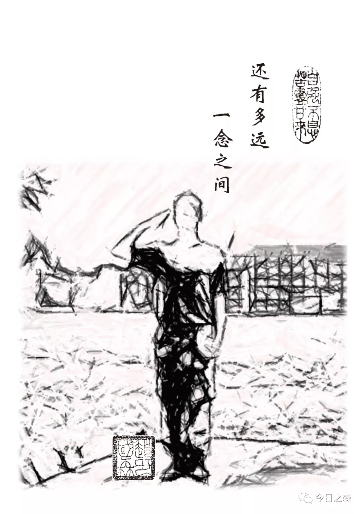

森言森语：  

围城无处不在，城外的人挤破了头想冲进去，城里的人又拼了命想冲出来。有很多人为我当兵的意义？现在看来，于我而言，最为重要的意义在于对两年军旅生涯的思考，并由此而产生的对生活的感触。

2021年4月1日

前  言

每个人心中都有一个军人梦，我并不例外。

好好的大学不上，你为什么要去当兵？这个问题很多人都问过我，我也时常会问自己，为什么要去当兵？

两年的军旅生涯已经画上了句号。我想至于当时为什么要铁心去当兵，答案已经不那么重要了。如何思考我这过去的两年，以及如何重新审视未来的生活应该更为珍贵。

2015年6月当我得知学校的征兵宣传后，我的内心抑制不住的激动，一直以来的梦想就要实现了，毅然决然报名参军，梦想做一名铁骨男儿，做一名顶天立地的男子汉。之后的几个月里，一直沉浸在就要奔赴军营的激动与惶恐中，那种感觉真的很不错。

当然，参军就意味着聚少离多，离开父母亲人，离开老师同学。临走的时候我没有告诉任何人。2015年9月11日下午两点，胸戴大红花的我代表杨陵区全体入伍新兵做了庄严宣誓：决心在部队好好锻炼，练就过硬本领，为祖国和人民站岗，保卫国家安全。

伴随着一声“登车”，伴随着鞭炮噼里啪啦的响声，来送别的亲友同学都落下了热泪，伴随着最后一次拥抱，大家便转身登车。我走时就一个人，谁都没告诉，我最后上的车，临上车转身看了一眼送别的人，看了一眼杨陵，远望了一眼学校。车发动了，我却再也忍不住，眼泪还是奔涌而出，止不住的流。

在车上的时间很漫长，途径杨陵-咸阳-西安-四平-梅河口-海龙，终于在2015年9月13日下午两点四十分到达梅河口火车站。

下车便开始分兵了，分兵完毕后便上了平头柴（皮卡）。摇摇晃晃不一会儿便到了营门口。下车后我很激动，又很恐慌，进了这个门，迎接我的会是什么呢？鬼才知道。两边迎接我们的老兵都敲锣打鼓，但看得出来他们的眼神很复杂，我说不出来。

到新兵营门口集合后，开始再次分兵。我被分到了新兵五连四排十班，新兵班长——FBB，一米六几的个子，皮肤黝黑，当时感觉和我心目中的军人相差也太大了，为啥别的班长都又高又帅。但他就是我军旅生涯第一个班长，改变不了。这两年所有的事情都应该从他说起。而我，也随着他把我领进新兵楼，我的军旅生涯就这样开始了……

目  录

新兵连

我的炮连我的班

我在二营部

学员苗子集训队

再见，四旅

初到八旅

在庙沟驻训的四十天

最后的挣扎

退伍那天

附：所学军旅歌曲

新兵连
新兵第一天。

2015年9月13日，班长领着我进入了新兵班，进门后的我看到了以前在电视上才能看到的“豆腐块”军被。进门后，先是点验所有个人物品，然后交手机，寄存个人现金等较贵重物品，填了兵情档案，班长给我倒了第一杯水，然后给我分了床，里屋靠窗户的上铺。在我进门的时候已经有几个战友比我先到了。晚上吃完饭后班长排长对我们当天刚报到的新兵逐个进行了谈心。那天晚上我大概是我这两年睡得最踏实的一晚上了，那个时候每天晚上九点五十八分我都能准时听到窗外火车经过时的声音，每当听到那个声音，我都会有一种莫名的安静与放松，这也是我新兵连三个月里唯一的精神寄托了。那天晚上我还依稀记得十点多的时候班长给我盖被子。那天晚上就那样安静的睡去了，唯一矛盾的就是今天晚上的被子我就这么拆了，明天我该怎么叠？

2015.09.13

 

自2015年9月13日下午到达部队，到今天（2015年9月20日）已经在这里度过了一周时间，这几天算是正式开训前的一个过度吧！在这里每天的节奏都很快，单个军人队列动作、停止间转法、行进间转法、齐步走、跑步走、体能跑，当然了，内务卫生也不可忽视，叠被子的要求就是“豆腐块”，擦拭屋里所有的摆设，所有的。每天都是如此，时间安排的很紧，上厕所的时间都没有，几乎每分钟都有这样那样的任务。

2015年9月21日正式开训，从这一天开始，便正式开始从地方青年向一名合格军人转变。今天是开训第二天，我就已经感觉到了这条路的不容易，这条路很长，这才刚刚开始，昨天（21日）上午首长参加了开训动员，之后便开始训练场的日子，下午两点在楼下集合，下午训练科目是操枪，集合的时候每个班一把枪，由于我是第一名（左翼排头），罗班长把枪交给了我，一会得背着它跑步去训练场，这之间的路虽不远，但也累的直喘气，枪不好玩！

2015.9.22午休记

 

今天下午（13：30）去老连队，跟着排长取枪。当然，下午又是两个小时的队列训练和持枪（95式自动步枪）动作训练，肩枪、背枪、持枪等一系列动作，在以前的我看来，电视剧中的那些画面都是那么的流畅。而此刻，当我真正把枪拿在手里的时候，才深切体会到枪的火热与冰冷。

 

9月22日晚，刚刚吹了熄灯哨，屋子里一片黑，有人要走了——MX。听他要走的消息时突然心里一下子空落落的，他特像我一个高中同学“胖子”，他留了qq，手机号。在一起的时间不长，但也算是战友一场，一起训练过，一起经历过，其实我也知道，这一走基本上就是永别了！在他收拾行装的时候，听说CJJ也要走，马上就得走，有人来换他，因为过了今晚24:00就没有后退的路了，他俩走了，我没有睡着，那天晚上又来了两个，那天晚上我没有睡着，却还是睡的很死！

2015.9.23晚

 

9.23晚，今天是开训第三天，腿已经有点酸疼，脖子也硬了，走路一瘸一拐的，走自己选择的路，因为已经没有后退之路，两个字——坚持。

今天训练了卧倒！真的是应验了“摸爬滚打”四个字！刚写了800字的新兵感想，休息吧！

2015.9.23晚

9.24晚，第四天。今天的节奏还是很快，腿已经酸痛到走路一颠一颠的，再加上肩枪跑步，停止间转法，齐步，跑步的行进与立定，卧倒与起立等单个军人队列动作及战术动作的训练，感觉整个人都不好了，还有，每天无数次的上下楼，集合等，已经感觉双腿不属于我，蹲不下去，抬不起来，唉……那酸爽也只有自己能感觉得到了，睡觉咯……

9.25早上5:00起床前的一刻，腿抽筋了……

9.25补

9.25中午，上午ICBC来办理银行卡，也没怎么训练，马上就到十点了，第三节课是《士兵读本》学习与解读。丛排说得对，每天都想一想：

1.自己为什么要当兵？

2.来当兵是为了谁？

3.来了想干嘛？

还是那句话，既来之则安之，有一个好的心态很重要，反正现在已经没有退路，奔跑吧，少年！

 

这里每周都有详细的周训练计划表和严格的作息时间表，真的是车轮不息。

今天中午下雨了，下午是战术前进（我就呵呵）。

生活的确是一座围城，城外的人想要冲进去，头破血流亦是如此，城里的人想要想方设法冲出去！

其实经历过就好！（有三个战友被罚叠被子ing）

午休……

2015.9.25中午

 

下午原本下雨，要取消战术训练，刚集合上四楼准备上教育，刚打开本子，又吹哨下楼集合队列训练，一小时后，15:00集合看电影《战狼》，而后体能训练，吃饭。现在在背条令条例。

昨晚学《三大纪律八项注意》之后就发了新装备，晚上又发了新衣服（07林地丛林迷彩，体能训练服）。

2015.9.25晚

之所以今天写了这么多是因为今天一整天对我来说都比较轻松，还有一部分因素是下雨和看电影的缘故吧！

时间过得很快，我经常在问自己，时间都去哪儿了？这又是一周快要结束了，今天周五，意味着明后两天是休息日，说是休息日，其实明天好像就是中秋节了，直到晚上发完衣服班长把月饼给我们拿来的时候，我才知道，中秋节到了。

果然，今天整个五连都比较轻松，都出来在楼道里补以前的上课笔记了。

《士兵笔记》班长是要写评语的，“工作要和写字一样认真！”

睡觉咯……

2015.9.25晚

今天上午没有早训，晴，看了两个多小时的93阅兵之后又上了一个多小时的思想教育课，这会儿十一点多了，刚吃了一块月饼，才看到上面还印有“龙山劲旅”，嘻嘻……

2015.9.26中午

今天一天都是轻松、快乐、愉悦、温馨

轻松是因为酸痛的腿终于不疼了；

快乐是因为今天吃的很舒服，也不知道为什么（其实每天都吃的差不多）；

愉悦（不难过）是因为今晚是可以打电话的，想给家人打，又不想打，心情是无法言喻的复杂，打吧！听到家里人的声音，心中的牵挂又会按耐不住，虽说男儿有泪不轻弹，其实我已经很久都没有流过眼泪了，可远在军营的我，在这皎洁的月光下，沉睡之前想的也只有家里人了，眼角也会常常湿润。上次给老哥打电话（什么时候我已经记不清了），说话间我已经少了许多的琐碎，以前每次打电话都是一两个小时，而现在只能打几分钟，又能说些什么呢！虽然什么也没说，挂下电话后，心里却忍不住的难受，涌动的泪泉止不住的往出冒，止都止不住。

今晚打电话老哥没有接，老妈也没有接……

我一直都相信一句话，在海龙也是，得到了应验：孩子，向着远方去奋斗吧！不要怕，在你要去的地方，你会遇到一些你应该认识的人，他们会进入你的生活，让你从他们身上学到一些东西：

他们是王排（WDk），LCH班长、FBB班长。我的战友：ZL、ZZH、DFW、MX、CJJ、XP、ZQB、ZPY、SP、SZ，当然了还有很多战友（后文详见）

9.26晚

军人，是一种神圣的职业，因为在部队的时间越长，愈加发现他们什么都会干，就从我的班长说起吧！自从我们来到这里，他教给了我们很多的事情，虽然都是一些生活中的小事，但处处是细节的体现，从叠被子，打扫卫生，叠衣服，铺床，熨衣服，熨床单等等。的确，细节决定成败，态度很重要，生活中的一些小事最能体现一个人的细腻程度。这便是我班长教给我的新的生活态度。记得昨天下午，班长给我们班所有人都掏了一遍耳朵，那种感觉说不出的温暖。

有时候觉得在军营中，班长真的扮演着很多的角色，朋友、战友、兄长、父母……

20.5.9.29上午

 

今天起床后一直在整理内务卫生——铺床。得把褥子都撤下来，把毛毯熨出两条线，我们十个人铺了一上午，这会儿还有人在弄呢！

2015.9.27.十点左右

今早九点左右给家里打了电话，老爸老妈依旧起早贪黑的卖命，不过听到他们的声音却也在心酸之余心安了不少，儿行千里母担忧，自我离家之后（8.19离家回到学校），他们不再看以前爱看的亲情剧场，而改看CCTV-7军事频道，他们说看到电视剧中的迷彩便就是我的样子，母亲总是担心我会跟电视剧中的训练那么苦，那么累，怕我遭罪。

其实儿子在这里一切都还好，吃得好，睡得好，我在这里适应的很快，只是前几天可能突然加大训练量的原因吧，全身酸痛，不过没几天就好了，现在得心态也好多了。班长对我们都挺好，生活中总是无微不至的关心和呵护，训练中严格要求，大家在这个新家，都能很快适应。

八月中秋，借皎皎圆月，遥寄思念。

明天又得开始新的训练科目了，听说国庆要放假七天呢！

2015.9.27中午11:00

 

记得去年中秋节晚上，是植保141班第一次班级聚餐，去年的场景依旧清晰，时光眨眼间便消逝在昨天了，今年中秋，他们还在西农，而我，已在军营，跟战友们在一起，摸爬滚打！

2015.9.27下午

 

这两天好像有点太轻松了，打电话、玩扑克、听歌、吃东西，可能因为今天是中秋节吧！

 

刚打完电话就吹哨打扫内务卫生了，刷地（用鞋刷子把地刷一遍，在用抹布擦干净）真是……

 

几个战友，不管玩的多开心，只要一提到家人，所有人都谁沉默。

有时候，我们缄默，并不代表我们没有声音。

幸福是什么？

别人受罪受苦受累的时候，你在享乐，这可称之为幸福；八月中秋，别人与家人相隔千里，你在家里，这可称之为幸福。

幸福是什么？

其实幸福就在自己眼里，握在自己手里，暖在自己心里。只是，我们常常难以发现身边幸福。不过是他们蒙住了双眼；不过是他们绑架了双手；不过是他们朽化了心灵。

2015.9.27晚上

今天是2015.9.28，新的一天已经开始，时刻准备接受暴风雨的洗礼！

凌晨4:30

