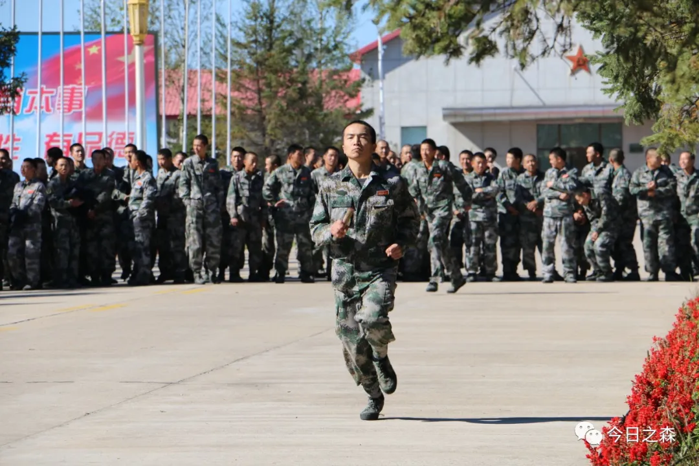
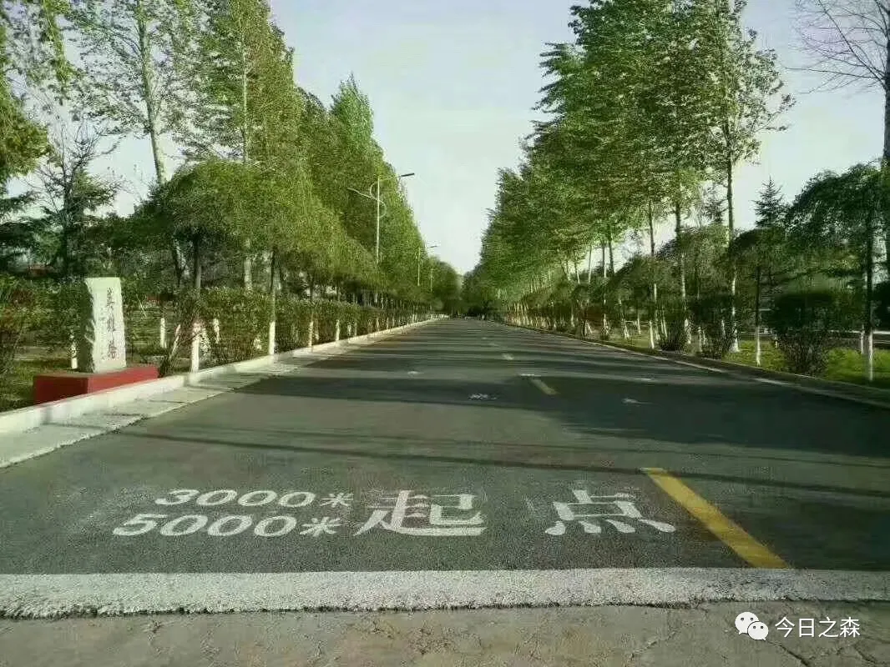

2015年11月7日13:50        星期六                  小雪

这几天的故事实在太多了，我都有点记不过来了。战友们都有点不太乐意让我记录他们的屌事了。

续2015.11.5晚，只是班长不让我们带防毒面具，那叫一个爽，集合完毕后马上又恢复原状睡觉了，9班长进屋坏坏的来了一句，孩子们都睡着了没，晚上别睡的太死，继续玩。之后我一宿没敢睡啊……

续2015.11.6，今天是旅庆祝日！

同时也是“龙山标兵”颁奖典礼，标兵就是标榜啊，单位邀请他们的家人来参加颁奖典礼。11班的晋嵩前段时间考核中全旅第七，他爸来了……（对了，昨天在中午伙食改善了一下，有鱼和烤鸭）

晚上电影《虎头要塞》

一到晚上就是噩梦的开始，紧急集合第1次，我没穿袜子，紧急集合第2次，床上乱糟糟。之后便睡了，刚躺下，班长又随意说了一句集合，刚穿好衣服，班长又随意的说了一句，睡觉吧！不一会班长过来查铺，来看都脱衣服没，我裤子脱了一半，一会排长进来，紧急集合！我们刚起床。排长又让我们紧急睡觉。睡了……之后不知道什么时候睡着了……

2015年11月7日14:20          星期六                小雪

早上四点半起床叠被子，刚把被子扔出去，就有个班拉紧急集合了，我操，四点半呐……~~o(>_<)o ~~

上午考核，手榴弹、分解结合、单双杠，分解结合失败了。

还有，早上七点多的时候晋嵩送走了他爸，他爸走了，他的眼睛却湿润了，热血男儿热泪涌啊!

考核成绩很垃圾，中午却去了服务社，买了碗和筷子，本子……

今天的雪下大了，使劲下吧，^_^

看到量化评比栏上面贴了表情。

 

雪花依旧飘飘洒洒……班长在玩游戏，有人在睡觉，有人在打电话，而我在写日记。（2015.11.7.15:00）

这次给高中同学MLL打电话了，聊了32分钟，聊了很多。（白雪皑皑……）

（2015.11.7.16:13）

 

刚写完就眯了一会，一个小时吧，沉浸在刚才的美梦中……，刚刚睡的时候张乔斌在打电话，睡醒了，他还在打。我打开窗户一看，白色一片，冬天真的来了!（2015.11..16:53）

 

晚上戴着帽子去洗澡了，哈哈……

之后……

晚上噩梦继续……

晚……

 

2015年11月8日09:15            星期日               晴

昨晚九点二十紧急集合。整个楼层都在紧急集合，有的还放了烟雾弹。而我们就是简简单单的紧急集合。之后所有人把个人的所有物资都拿出来摆在楼道里，班长要清查物品。因为有人在厕所抽烟了。全连盘查，结果最后什么也没有查出来。

昨晚还学了新技能，翻床。前前后后搞到11:30.然后所有人上床睡觉，我晚上睡觉一般都会把袜子脱了，可惜还是有人（代福伟、赵鹏雨、赵振宏、孙鹏）穿了，因为他们怕半夜拉紧急集合来不及穿，哈哈，被班长发现了，结果可想而知，他们四个啊，被拉了紧急集合。

今天周日，雪大概都化了，冻成了冰。回来后叠被子，赵振宏和孙鹏帮的我。给我把被子整明白儿的。

2015年11月8日16:40           星期日               小雪

熨床单用了一整天的时间，加上刷地，这会终于都弄好了，下午班长没让我们打电话。

下午16:00又开始下雪了，雪花儿飘飘洒洒美极了。

（还是一样，尤其昨晚开饭的时候，林立在3号路上的老兵们一个个身姿挺拔，挺让人震撼的。）

看着窗外的雪花，美好的事物总是瞬间的，可往往只有瞬间的事物才会永恒。

 

2015年11月9日18:20      星期一                   小雪

续2015.11.8今天上午一上午大课教育，“119事件”、“1207事件”、“0127事件”三大事件以警示后人，警钟长鸣。

下午两节课班排教育，端端正正的坐了一天，两条胳膊都快不是自己的了。屁股都快坐扁了。（对了，昨晚又是两次紧急集合。）

明天又是实弹射击。读报ing

 

2015年11月10日17:06        星期二                   晴

一会实弹射击，下午2点安麦穗来。（12:01）

下午实弹射击：

第一次     1个10环，4个9环     共46环

点射    10发     命中9发

打靶回来一路歌唱《打靶归来》

听排长讲，晚上要睡在我们班，说我们班火力不够！

 

2015年11月11日18:30             星期三             晴

在大操场投了一整天的手榴弹，右胳膊都快要断了，我作为十班的独苗，也只能勉强抛出30米开外。

班排长们为我们也是费劲了心思。各种奖励诱惑，却激起了十一班的激情，我班，仍无起色。

下午3000米，我和翟磊拉着商振，从起跑线出发不到200m，他就不行了，其实就是不想跑，也不知道咋整了！唉！

由于晚上体能后大家换衣服速度太慢，排长说晚上又要拉动了。

续2015.11.10.昨晚洗漱完后，体能都没有做就和排长去包库谈了，谈了很多，谈了很久，一直到十一点四十左右，我悄悄回屋后，班长和战友们都睡着了，睡得呼呼的……

唉，我还是准备好今晚的紧急集合吧！

（晚上还去了服务社）

 

2015年11月12日12:10（农历十月初一）  星期三             晴

昨天的双十一就这么平平淡淡的过去了，估计此时的学校早已快递满天飞了。昨晚又拉了紧急集合，前前后后拉了三次，哇咔咔……

这几天每天都特别困，尤其是中午饭后和晚上看新闻做体能那会。

今早起床后，雾气很大，能见度不足50米，本来早上是打靶，结果由于天气原因没有去，不过还是去了西山靶场。然后11班虎班给我们扯犊子，还挺有意思的。

他说：“其实，曾经我也很辉煌，后年回家就结婚。”

又有

 

2015年11月13日16:50        星期五                  晴

烽火影视

1.《日本侵华前传》

2.《铁在烧》

3.《大棋局》

4.《雪域雄鹰》

5.《烈火海洋》

6.《冲锋》

7.《反恐特战队》

 

2015年11月14日            星期六                晴

今日考核：防护、卫生与救护（100分）、分解结合（45s）、实弹射击、战术基础动作（27s）。

实弹射击：

第一次     5发     10环、8环、7环、2个6环

第二次     10发     命中6发

 

2015年11月16日12:30        星期一                晴转阴

续2015.11.14.一天的考核过得很快，最后的结果却很差，全新兵营倒数第三。差一点班长就要上台做检查了。总的来说是我们亲手把他送上断头台的，但是由于考核过程中，有的单位考风不严，营区首长决定抽出三天时间进行重考。

那一天，时间过得很慢，到了晚上，暴风雨来临。到了21:30，熄灯后班长让所有人上床睡觉，我们都知道，这么早让我们上床休息也太便宜我们了，其实大家心里都清楚，可谁也没敢说，大家明白，一会肯定要紧急集合，大家刚脱衣服躺下，班长就说他要去连部开会，我知道，他一出门，紧急集合肯定就会吹响。果然，门刚关上，班长吹了一阵连续而短促的紧急集合哨，所有人紧急集合至楼下路灯处，说时迟那时快，我噼里啪啦就打好背包，穿好装备赶紧往楼下跑，我是全排第5个到的。用时7分07秒。检查过后让我们把背包都拆了，其实我也想到了，他这让全部拆开，肯定还要反拉回去，我磨磨唧唧没把背包往开拆，果然，班长又是一句，所有人紧急集合至楼上，我是第二个，^_^。

之后回屋恢复了内务。之后排长又拉了一动，结束后我们继续恢复内务。刚恢复好，班长又拉，又恢复，紧急集合，又恢复……最后一次拉动时已经晚上12点20了，我睡的时候大概一点半，其实我和孙鹏，翟磊三个都没睡，大概12点45的时候，排长进屋了，让翟磊给大家悄悄传达一下，明早5:30之前所有人不得提前起床，5:30之后有行动。

他出去不一会，又进屋在门窗上面写下“十班的兄弟们，……”，真操蛋，折腾一晚上了还不够。那天晚上前前后后拉了八次紧急集合。

第二天早上4:10我就醒了，一直在床上呆到5:35，终于又拉动了，完事之后我们又恢复内务，之后我们都去走廊叠被子了，排长从十一班屋里出来后，慢悠悠从我们身边跨过去，手里还拿着扩音器，快走到9班门口时笑眯眯的来了一句，四排紧急集合，我擦，当然大家都醉了，刚叠好被子，这是干嘛啊，大家虽然心里这么想，可谁都不敢磨蹭，很快又把被子抱回屋打背包，之后又拉了一次，早上就拉了这两动，之后我们继续叠被子，恢复内务卫生，熨床单。

（现在想起来，那天晚上真是噩梦啊，现在就记忆犹新，那天晚上早第二条上午，前前后后紧急集合十几次。那个时候真是有精力。现在如果被那样折腾一次，没个十天半个月肯定缓不过来。）
续2015.11.15         星期日                    晴

晚上排务会、班务会，从晚上六点半一直开到九点半，醉了，晚上又洗不了漱了。晚上体能也没做，也没有其他事，直接睡了。

早上考核，手榴弹32米，防护100分，单杠6个，双杠15个，早上考的都不错。

2015.11.16.12:32

下午考完了，都还不错，我早就说过，我们班是有实力的，只是那个

2015.11.16.21:20

2015年11月18日20;43         星期三                  晴

续2015.11.17             星期二               晴

昨天又发了新衣服，春秋常服、冬常服、试穿了一下，还是蛮帅的。

2015年11月18日20;55        星期三                  晴

今天实弹射击：

5发     40环

10发     命中4发

这次是我打的最差的一次，比上次还差，我们和班长约定，40环以下的一环一瓶红牛，45环以上的，一人得一瓶红牛，上次我就输了三瓶，这次虽然没输，但还是感觉很差。张乔斌上次就打了15环，他买了一箱，这次12环，好像是他那个7号靶位的枪不准，因为同是七号靶位的孙伟脱靶了。

晚上一块看了《寻找最美孝心少年》，十个感天动地的人间大爱之事，十多个令人动容的小伙伴。

晚上连队又讲了有关大学生报考军队院校的事，真的很迷茫，不知道该去往何方，这会他们都去十一班擦枪了，我和……还有班长在屋里呆着。

 

日子一天天过去了，每天都在重复一样的事情，或许有这种感觉是因为我们进步吧!

 

2015年11月19日15：00          星期四               小雪

昨晚的夜异常的安静，静的让我感觉整个世界都在沉默。早上我刷的起床，打开窗户一看，寒风嗖嗖的吹，风打在脸上，有点疼，我赶紧把窗户猛地一下又关上了，本以为今早可以不用出操了，结果还是和往常一样列队集合，班长让我们面向西北，迎着风，我知道他是为了历练我们。之后又是一个上午的教育，大家都睡得昏天暗地的，我也是。

窗外依旧白茫茫一片，昨天打靶归来的时候看到装甲车在西山飞驰，太帅了！

 

2015年11月18日20;43           星期三                 晴

现在班长也开始讲下连的事了，听排长说，好像下周六旅里就要开始组织考核了，真是太快了。

续2015.11.22.16:40          星期日               晴

这个周日是新兵连最后一个周末了，昨天紧急集合，晚上我刚从连部回来就紧急集合了，两动，之后就没了，前天打枪，（8环、8环、3个7环、）、10发点射命中5发。唉。一次比一次打的差。

今早去老连队画板报，回去已经九点半了，我的内务还没有整理，他们在打电话，后来我们十点四十集合去练队列，又考了100米，（15秒16）刚及格，唉。

 

2015年11月23日22：23         星期一               小雪

海龙的天总是这样，昨天晚上睡得很香，窗外异常安静，早上下楼集合出操才知道昨晚又下雪了，而且还下的不小，雪很厚，都能没过鞋面了，早上一直没有停，风刮得很烈，我们却个个昂首挺胸，雪花狠狠的打在脸上，生疼生疼的，其实这样的天气，战术前进也毫不逊色。

恩，昨晚营区举行阶段性考核表彰大会，我们四排全营区第二名，可能戏剧就是这样诞生的吧，上周六的考核由于某些原因而作废了，之后三个连队重新考了，我们排第一，我们班有两个病号没有上，考核那天大家好像都跟吃了火药一样，手榴弹居然5人及格了。虽然得了第一的奖牌，但我深知，这个奖牌会像一座大山一样压在全排人的身上，大会过去，各连排班开始表决心，我们班的决心是及格率90%，唉……

今天下午本来让我去参加座谈会，，结果我们几个座谈代表在二楼俱乐部睡了一下午，^_^幸福来得太突然。

晚上出去练体能，老汉推车……俯卧撑……

这会都在写笔记，还有些检查的……

对了，昨晚又发生一件大事（张乔斌）

(应该又是乔斌挨揍了，我想不起来了）

 

2015年11月26日20：45       星期四                    晴

下连的日子一天天逼近，而我们的训练依旧没有多大的突破，每个人心里都很焦虑和烦躁，可是并没有什么用。

从11月24日（周二）开始，营长、教导员都紧紧围绕军政委来我旅视察做相关的准备工作，周二下午去西山实投场进行实投，做流程练习，也从那天晚上开始，我们每天都按时休息，早上准时起床。

最近练习最多的训练就是手榴弹投掷，一提起手榴弹我就蒙圈，好像已经投了好十几天了，说实话，我的胳膊已经疲软了，只要投一次，胳膊就疼得难以忍受，即使这样，手榴弹该不及格还是不及格。可以说，现在只要一提起手榴弹，我这胳膊就条件反射性的开始隐隐作痛。

（说来奇怪，现在看到这里，都感觉胳膊疼。）

今天上午11:20左右，我投出了第一枚手榴弹实弹！由班排长，营长，教导员全程指导。

定了！我们12月6日下连，12月5日授衔！

昨天，指导员找我谈心，说看我是否愿意当他的通讯员，我说得看班长的意思。

后面的路还不知道怎么走，听天由命吧！

今晚的月亮很圆，大概是农历十月十五左右了吧，时间过得太快了。昨天晚上，躺在床上，想着回忆回忆以前的时候，可惜，还没开始回忆就已经开始做梦了。

2015年11月29日12:25          星期日               小雨

原本计划12月6日下连的，但是一拖再拖，到12月10日左右了，这就意味着我们又多了几天的训练，从11月23日起就没有休息日了。

昨晚排长讲我可能要去学侦查计算，但连长说还要测试一下，择优选取。

今早起床后又下雪了，伴着寒风，战术前进很多人都不合格，我们便去环路练习，当然了，及格的不用爬！不过我看着他们一遍一遍的爬，心里很不是滋味的，眼睛一直都湿润着，只能看着他们爬冰卧雪，一遍一遍，又一遍，唉……

 

2015年11月30日18:50        星期一                  晴

昨天晚上莫名其妙又拉了一动紧急集合……

今天又是训练日，手榴弹、战术基础动作，现在战术基础动作基本上不成问题了，但是手榴弹不能抛就成了我的一大弊端，这可怎么办呢！而且手榴弹真的是一碰胳膊就疼得不行。

上午练习防护的时候，不知道谁的防毒面具里面又有一枚弹壳，唉……

下午是老兵送别晚会，《今年退伍的老兵》响起，老兵不老，只会逐渐消亡。

 

2015年12月3日07:50        星期四                  小雪

电影《再见》

从昨天开始，算上今天，已经开始进入整休状态了。

时间过得太快了。

昨天老兵都走了，《今年退伍的老兵》，虽然未曾相识，但看着远去的车影，心里也是莫名的伤感。

老兵啊！老兵！

（这首歌我喜欢）

2015年12月3日         星期四                   中雪

马上就要下连队了，战友们！你们准备好了吗？

2015年12月4日           星期五                  晴

新兵下连考核结束了，新兵三个月画上了句号！

所有人都

 

 

2015年12月5日07:01          星期六                 晴

早上05:45全新兵营紧急集合。本来说今天拉练背背囊，结果又临时更改，打背包，我滴个神……

 

唉，说好的拉练居然只是绕营区最大圈走了四圈，不过脚还是磨得够呛！本来说好的休息，结果班长让我写讨论记录本，班务会，班总结，个人总结，影评，唉，我这个大学生，尽当笔杆子使了。从中午一直写到现在（22:50，所有人都睡了）。

现在只有我和晋嵩苦逼的在楼道里写东西，唉，太遭罪了。

明天早上授衔咯，列兵！哈哈……

下午四点多的时候，给老哥打了电话，什么也没说，我突然不想给大家打电话了，哎哎……

 

2015年12月6日            星期日                 晴

这两天一天比一天热，上午班排长一顿总结。

2015年12月6日14时30分，授衔了！

从今天起，我就正式成为一名中国人民解放军军人，列兵军衔！

 

2015年12月9日07:50        星期三                   晴

不得不说。

三个月的新训结束了，全旅新兵下连普考我自己虽然都过了、

俯卧撑65个；

仰卧起坐51个；

蹲起100个；

救护80分；

单杠14个；

战术28秒01；

实弹射击   未知；

手榴弹31米；

分解结合53秒；

3000米13分；

理论94分；

防护100分

但是全班的成绩总体还是很差，不过是十一班全营第三，很不错。旅里的考核结束了，但是集团军的抽考还是让人担忧，所有人都不希望我们被抽中！

集团军来抽考的时候，全营分为15路，每路20人，就是这么巧，第九路，出列！我滴个神呐，当时所有人都蒙圈了。

不过这次抽考，不仅仅是一次考验，更是一次证明自己的机会。

救护合格，我的任务是头顶部帽式包扎、左大臂骨折、右大腿骨折

单杠10个；

战术25秒；

实弹射击   未知；

手榴弹36米；

3000米   13分；

理论

防护

全班只有两个人手榴弹不及格，一个人单杠不及格。

到此为止，三个月的新兵连就结束了。

其实最喜欢下面这张照片，很多次跑步都从这里出发。

