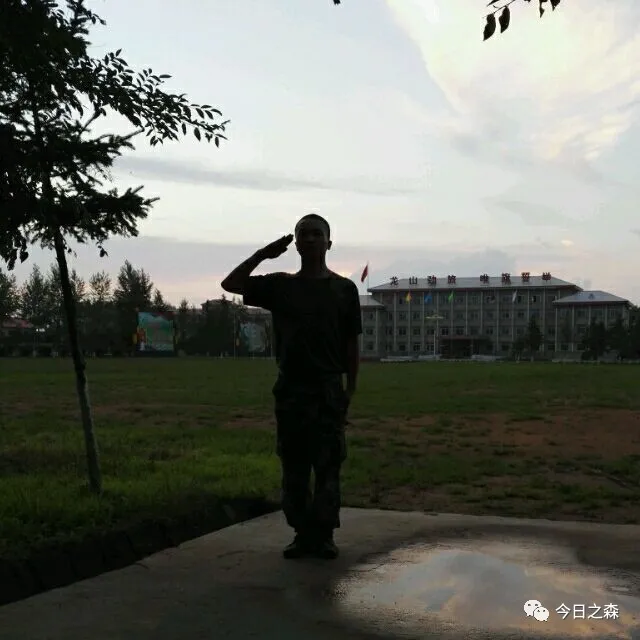
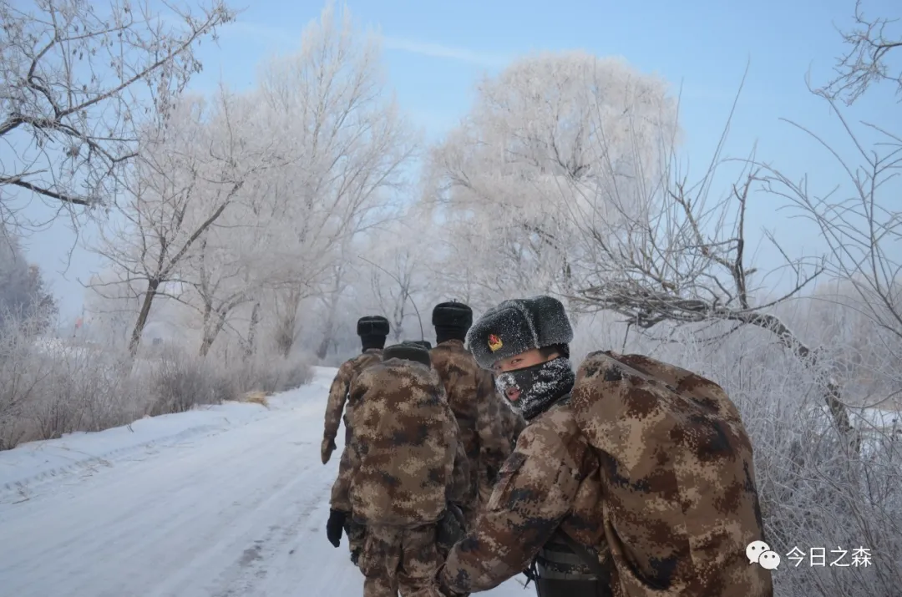

再见，四旅
2017年5月15日21:33  星期一                         晴
这几天像是一次飞跃，又像是一场电影。
5月11日上午体检结束便由作训科CPF把涉及分流的人员送返营区。
（体检心电图需要复查，血压偏高）
（去年体检的时候，也有点血压高，但是后来又正常了，这两天抽空要去再量一下血压了。）
闻讯副营也转业回家了。
5月11日下午在海龙营区剪了头发，洗了衣服。
5月12日早上洗的迷彩服刚挂上去便被人顺走了。5月12日中午个人物品上车。
5月12日晚上WDK排长安排我们在服务中心吃的饭，烤羊腿。
5月12日中午炮连上等兵聚餐了。
今天这两顿饭大概是最后的晚餐了。
5月13日早上充在学习室的充电宝丢了。
5月13日早上9:00大饭堂吃的的饺子。
10:40登车，去往梅河口火车站。八号首长ZCJ，营长SZ，教导员LSL，以及各连主管都去了。
最后的最后，营长指挥全营集体唱歌，所有人眼里都浸满了泪水。
13:30登车，很多送站的主官都哭了，营长也哭了，他哭的最伤心了。***旅的副主任也来了。车动了，送站的主官向我们敬了最后一个军礼。
目的地：通化！！！
下午4:10分到达通化站，接站的兄弟们敲锣打鼓迎接我们。
4:30到了营区。
合成**旅*营。
今天是第一天训练，训得很扎实，很真，这才是部队啊！这才像是当兵的，而我，好像被编入卫生员队伍。
唉……
昨天下午参加了“儿子的奖章·母亲的荣光”母亲节颁奖典礼，很多英雄人物。

 
初到八旅
2017年5月16日15:51    星期二                     晴
早上听所长给我们讲他曾经的过往。曾是侦察兵的他把握住了机会，争取了全团唯一一个名额——第二军医大学，由此可见啊，机会只垂青于有准备的人。
他讲：人要有规划，立足本职，谋求长远发展。终生学习。
一上午就在靶场度过了，据说冲山头是家常便饭，40分钟一趟。
下午刚去3:00，说让回去拍照片。唉，昨天白跑一趟，钱白花了。
机枪连的（原四连）兄弟们都在学习室学习呢！
人这一辈子啊！
16:01连队带回了，一会训队列。
 
2017年5月19日21:55    星期五                     晴
为期两天半的军事共同科目中午告一段落。
100米14秒70——6.5分
俯卧撑43个——7.5分
3000米12分32秒——30分
队列8分
射击5发——27分
战术基础动作27秒整——7.2分
共计86.2分，折合43.1分
这两天半过得很不舒服。
17日上午8时于雷锋团集合，看完场地后11时带回。
13时集合考核战术基础动作
13时40分带回换作战靴
14时30分考核100米
19时15分带回营区，被纠察一次。
18日早上6时50分集合
11时30分射击完毕
14时30分集合
19时3000米完毕
20时集合，21时队列完毕
19日7时集合
12时30分战术完毕
13时集合
16时30分语文考试结束
18时30分集合
21时00分英语考试结束
这几天真的是心力交瘁啊！
家里的房子基本上完事了，还盖了三间人字梁。
考学的事情就这样吧！顺其自然，认真对待，重在参与。
明天上午也就完事了。
 
2017年5月22日9:17    星期一                         晴
昨天下午公布了成绩，KX第二，我第七。第一550分，我450分。分差还是很大的。
昨天下午去收发室拿到了我的新生录取名册，老爸把团表和身份证明也邮过来了。
高班长前几天去六连当文书了。
昨天下午潼江社区和通化志愿者协会来慰问演出。《雪童话》
离考试还有十四天了，就当是又一次经历吧。
2017年5月22日21:55         星期一                 小雨
晚上搬到了旁边学员苗子集训队。住在连勤。刚搬到四班的时候，有个大学毕业生问我哪人。问完之后又问我甘肃是哪个省的……
好好学几天吧！
 
2017年5月26日6:10（五月初一）  星期五             大雾（烟）
我这几天是怎么了？从前天晚上开始就睡不安稳，是不是有点想的太多了。昨天中午午睡就两个小时的时间，我却好像做了很多梦。昨晚也是。十点多躺在床上半夜又莫名其妙醒来好几次。本打算今早五点起床洗澡的，可五点的闹钟我没有听到。我最近这是怎么了，怎么会这样？
这几天估计快报志愿了。
2017年5月28日15:21         星期日                   阴
时间总是留不住。昨天老哥请假回家。我这身份证过期还要开具证明。呃。
电影《勇士》
 
2017年6月1日14:09         星期四                暴雨天气
东北的天气是很暴躁的，狂风暴雪，疾风暴雨，雷雨冰雹是常有的事儿。
就跟东北人讲话一样，声音也很大。
昨天下午就是，弹珠一般大的冰雹说下就下了。很迅速的。分秒钟的事儿，就把整个营区的面貌给渲染了。沟壑纵横。冲的路上全是沙子，早上战士们又接的消防栓清水冲洗了一上午，还有的兄弟们中午不睡觉在冲洗路面。结果，中午刚起床，两点钟，不到几分钟的时间，外面又是阴云怒号，风雨大作，四面原本绿茵茵的山峰都黑下了脸，这里的山是会变脸的。这几日在集训队睡得很不好，每天晚上都会做梦，就连午睡都有做不完的梦。今天中午总算是找到原因了，大概是我睡觉的时候头这边太低了。
2017年6月3日8:12         星期六                     阴
早上看新闻，宝兰高铁已全线试车了。真是个激动人心的消息！
2017年6月3日14:28             阴雨雷暴，特大冰雹
前后不过两分钟的阴雨雷暴，冰珠子很大的，比玻璃球还要大一点，瞬间就汇成河了，水汽很大，四面的山仿佛都消失了，雨天同色。只是各连队门前的单杠模型又遭殃了，修吧！
 
2017年6月11日21:14         星期日                    晴
这一晃十天又过去了。
6月4号下午5:30由通化站至金州站，次日7:30分到达，于大连综合训练基地进行北陆生长干部文化科目考试，9日下午5:00由金州站返回通化，次日8:00到达。
第二次参加高考，没怎么复习，考试过程中失误很多，考题也能达到选拔之目的，考风严肃，组织正规。
集合过程中也有幸再次见到了以前老部队的学员苗子，不过只是远远地看见。
最后一日临走前在金州站前买了些樱桃，尝了下西农的味道，不甚美好。
路途中也难免招致人民群众注意和好奇。但我们本身素质亟待提高。真的是毫不顾忌军人形象。
一小孩问妈妈，妈妈妈妈。是要打仗了吗？
妈妈说：解放军叔叔是抓坏人的！
有不少路人拍照纪念！
今日知二班列兵LX系中南大学学生，2013年参加自主招生被保送。高考比一本线高出130分。其中物理满分。
此LX与彼LX之别：唉！
我这来回没几天的日子，就从卫生班调出去当了无线兵。其中的原由，唉……
等等事宜不再累述。
明天训练！
 
2017年6月18日16:40         星期日                  晴
又是星期天，生活就像。
21:05刚让WZ班长拔了个罐，喜东班长讲以前在美容院给人服务时，技师讲没什么事情不能随便拔罐，容易破坏皮肤组织。
大学毕业季又到了、曾经的大二学长学姐们就要离开学校了，看到了他们的毕业照。
今天是个整理档案的日子，也都齐全了，挺长时间没给家里打电话了，也不知道老父老母怎么样了？
2017年6月20日17:30         星期二                 晴
今天下午我去206检查身体，是一次很不舒心的过程，作为部队体系医院，当医务人员面对军人时，我却从他们内心里看到浮出的嘲讽意思，我不知道为什么，反而地方的打工人员至少是抱有一种同情的，示例如下：
例一：
我去窗口交费处刷保障卡，30多岁的女工作人员三翻四次问我到底给不给她票单，事实上我已经把票单递到了她手边！

例二：
同行去检查的战友去医院食堂吃饭，点菜时的木讷和迟钝的动作让其工作人员悄悄地说：部队把小孩弄得成啥样了。
唉……部队啊部队、

 
在庙沟驻训的四十天
2017年7月3日19:12           星期一                 晴
军考416分
语文115分，英语75分，数学102分，综合115分。
军事成绩：43.15
总计459分
 
今早凌晨三点钟起床，四点钟开饭，五点从营区出发至三区（庙沟）开始为期两个月的驻训。
刚到这一下车我就惊呆了。荒草丛生，一片破败。之后从六点钟一直干活干到十点。我那屋被分到四连吃饭，结果早上居然不让我们吃饭。死皮赖脸，简单吃了一点又干到十二点半，之后午睡到2:30.下午拔了一下午草，一个比一个能靠啊！我看时间不早了，说去打饭吧！结果人四连早就打完饭了，去别的连队，人直接说你们营部的人不让打，回去吧！我就呵呵了！
结果，没想到，快退伍还有50天，温饱却成了大问题，吃饭都不让吃，能不出问题？何谈打胜仗啊！
下午我去打饭的时候，ZS先吃了。其他人外出取东西时在门口吃了包子，吃饭这东西自己不操心！
 
2017年7月10日         星期一                     暴雨
近一个月都没有写点什么了，疲于从三区到机关之间奔波，也算是莫名其妙为今后很长一段人生路选了一个方向，在这种两难的境地下，我不知道这条路到底是一条怎样的旅途，也不知道接下来的行程中会有怎样的境遇，但可以肯定的是，这种选择对于家庭来说，是灿烂的，是骄傲的。
不论以后在军营或地方，这人生路还很长很长，不管走向哪里，初心不能改！这一路上能够遇到很多人，有的人可能只一面之缘，有的人甚至都未曾谋面，这一路上，没几个能够长伴，但他们都或多或少交给我们一些受用的东西。
昨晚我第一班岗，又是狂风暴雨，电闪雷鸣，雨下了一夜。
 
2017年7月12日6:14    星期三                      暴雨
惊雷轰鸣，巨响惊醒了睡梦中的我，转身一看时间才04:18,之后便再难以入睡，雷声一声比一声响，5:50倾盆大雨降临，重新洗涤了周围的一切，没过几分钟，驻训场周围连绵的山丘升腾起浓浓的雾气，这山便把自己隐藏在我眼前，不见了踪影。
在东北这两年，从未见过绵柔细雨，从来都是疾风暴雨，电闪雷鸣。
2017年7月14日9:20    星期五                   暴雨
早饭过后，又是一阵暴风雨，来得很急，这几日的天气便像我这几天的心绪一般，阴冷，焦躁。
前天，裴兄和吴班长（WYH）出差，山西运城。
今天又是名义上的开假的日子，事假可以回家。WSM，WZ，YH，LH今天休假回家了。
自从上周从长春返回之后，心情一直很压抑，总感觉这次的选择太草率了，而且违心所为，才致使心中结成疙瘩。
这一周以来，每每往训练场一坐，看着眼前的一幕幕场景，大概便可以看到今后的生活和工作，再难有激情和想法了。或许我还一直都抱有很大的希望，回西农之后，还能学到很多想学的东西，还可以走很多想走的路。一辈子这么长，又这么短，真的不想就此断送了对生活的爱与向往。我还梦想之后几年大约还可以再有意外和奇迹吧！
（当兵不后悔，退伍不后悔！）
随心随我！
2017年7月16日18:37        星期日                    晴
就因为那天晚上一个“是”字，今天我快要迎来人生的暴风雨，我已就主动放弃入学资格……暴风雨啊！
我也不知道这件事我到底是做对了还是做错了，但还是跟着心走了。
当兵两年，大概犯了两次错误，这是一次，痛彻心扉啊！决心已经下了，只能静静的听候发落了。
教导员说，人人都冲破了头往干部队伍里挤，你轻轻松松进去了，本来可以成就一代人，却又往回走，人生这一辈子，怎么都是过，或许你的选择是对的。
18岁以后的日子真的很难过。
 
2017年7月20日        星期四                    小雨
昨天营里上报了……。
 
离退伍不到一个月了，没想到两年的军旅生涯竟走的这么快。回西农后，我的生活又会是怎样呢?
 
2017年7月23日19:38        星期日                    晴
昨天小雨，跟ZHJ，TLL上街，直奔高丽火盆，之后去欧亚买了点水果就急急忙忙带回了！
 
2017年7月27日6:30        星期四                 小雨转晴
《将改革进行到底》十集大型专题纪录片昨晚播出了最后一集——《人民的获得感》
昨天下午听了音频教育。
一周以来都是在训练场那排树下度过的，真没什么意思，看着连队战士没日没夜的跑。
前天发了17陆士兵夏常服帽。
今明两天全国多家媒体将来我旅参观一营智能手机使用管理试运行效果。
这个月马上就要结束了。
（开饭前记）
2017年7月29日        星期六                       晴
日子一天天流逝，同样消逝的还有父母的躯干。
前天晚上和家里视频，一辈子出于苦难中的父母这两年我不在的日子里又消瘦了许多。等老哥一结婚啊，是时候让老爸老妈闲下来了，劳累了一辈子，苦了一辈子，做儿子的，真该奋斗，用拓荒的精神出人头地，大变个样！
能不能翻过这座山，就看我们这一代人！
（庙沟驻训场）
 
 
2017年7月30日17:50     星期日                      晴
今天，朱日和训练基地举行中国人民解放军建军九十周年阅兵。
在这个伟大的日子，全世界都将目光聚焦，全军最高统帅向全世界宣告，中国必须打败一切来犯的敌人！
我们作为基层战士，奉献出个人的有限力量尤为重要。
下一步回到地方，为建设共产主义事业奋斗终生！
 
2017年7月31日10:23        星期一                    晴
今天讲一讲庙沟这个地方。
庙沟驻训场依山而建，以山为界，山上满是苍翠的红松，随山势建成的驾驶车道蜿蜒曲折，山下东西向两排营房，前排居住用，后排则为食堂，东西两头各一个训练场。
训练场是从来不分白天黑夜，到处都是挥洒的汗水，战士们的衣服从来没有干过，没日没夜的奔跑，除了跑就是跑，负重的，有武装的，有携带武器的，还有穿雨衣跑的，总之，所有人都在奔跑。
 
很多同学都在这个暑假忙着做毕设了，再要不就是准备考研的。
两年的军旅生涯，归来已不再是了少年了!
 
2017年8月2日11：35       星期三                  小雨
昨天是八一建军节。
上午7:30从庙沟驻训场出发，前往四区实投场进行手雷实投，单程近9公里山路，大概用了一小时四十分钟，一路上全是丛林陡坡，实投完毕后立即返回，大汗淋漓的感觉真是爽歪歪，来回喝了近六瓶水！
这个八一节真是湿身了。下午两点半回到营区。
 
 
2017年8月11日20:06        星期五                   晴
今天不得不记下一篇日记了，自从转隶到该死的八旅，还有该死的文书WXB。真是，人为刀俎我为鱼肉。“微腐败”一事真像曾经的十年文化革命，无中生有，欲加之罪何患无辞。
 
影子
 
丑时初生的太阳向人间
洒下无尽的光和热
烈日啊，它眼皮子底下
都成了黑色的影子
笼罩着的躯壳
哪里还能看见真的光和热
 
2017年8月12日21:46        星期六                     晴
再忍七天便可释放！
今晚又没发手机啊！
 
2017年8月13日18:19        星期日                    晴
之前的小道消息在中午揭晓答案了，原本19日杀羊，20日带回的计划由于今天的紧急通知提前了，刚才我去打饭的时候，看见窗外杀羊了！屠夫是从地方叫来的，是夫妻俩，屠夫上身穿红色背心，腰间系一塑料布，娴熟的技法，让羊顷刻间毙命，没有一声嚎叫，大约不到十分钟就可以处理一只羊，第三只羊是一只母羊，剖开腹部却发现胚胎中已然成形的羊羔，可之前大家没有发觉啊！
他们且称为仁义的屠夫吧15日带回营区，永远的离开庙沟了!

 
最后的挣扎
2017年8月18日5：51        星期五                中雨转晴
最近几日的生活又开始飞快的转起来了，不经回忆就18号了，还有一周的时间吧！就该脱下军装了！
前天8月16日下午，集团军举办“十佳军嫂”和入围奖获得者共28名军嫂颁奖典礼。以黑龙江省双拥办共同主办并报道。以感谢在军队改革大潮中军嫂及军属背后默默地支持和理解。
有跟随丈夫从河南奔赴黑龙江，放弃河南广告公司经理一职而赴黑龙江再创业以求夫妻团聚的；
有跟随丈夫的步伐从辽阳到吉林，从吉林到延吉，从延吉再回到吉林，几次参加教师岗位录用考试，均以第一名的成绩进入当地高中任教的；
有从河南科技大学研究生毕业，放弃地方工作，而与同学聚会时的老兵同学成为恋人，走进婚姻殿堂，跟着丈夫到军营干起了洗衣店缝缝补补的生活，平时上班之余帮战士们缝洗衣物，还利用晚上的空闲时间主动帮助辅导营区战士考学，前前后后辅导8人考上军校，不离不弃，陪在丈夫身边，默默付出；
还有身穿戎装的军嫂，夫妻两人双双为军人，一个是合成204旅1营2连指导员洪超，一个是火箭军65基地通信团1营1连指导员满津露。她说，当他荣立二等功时，回到家中激动地告诉她，这个二等功，你一半，我一半，咱俩就一个立了一个一等功。
这样的军嫂，很多很多。她们共有的品质却都一样，她们爱军，拥军，追求军人之追求，热爱军人之热爱。
 
昨天早操，9:00，昨天下午，不同程度地进行了战备演练，而我则成为一名报话员，保障六连通信！
今天是8月18日，上午九时，旅拉动，以检验我旅战备能力和打仗能力。
 
2017年8月18日18:26          星期五              特大暴雨
下午天气变幻莫测，时晴时阴，时亮时暗，16时许，东南方向黑云袭来，不一会儿便是疾风暴雨，就这样的天气，三营八连仍全副武装奔袭五公里！
 
2017年8月19日6:55          星期六               小雨转晴
昨晚和前晚都做了真实又缥缈的梦，晚上睡得并不踏实。
就目前而言，在这里的每一秒都是一种煎熬，这个群体真可谓社会群体中素质最为低劣的了，自上而下，由里及外，无不透漏着低俗，恶劣，在这种环境下生存可谓艰难！
诸如：吃饭问题，说话问题，卫生问题，智商问题，等等。
有人说：在这里多待一天少活一天；
有人说：这种生活让人厌倦；
有人说：在这里每一刻都是煎熬；
有人说：……
唯一有人说的乐观的无非就是**，除此之外，再无吸引人之处了！
 
2017年8月22日6:56           星期二                 阴
昨天下午干部考五公里，今天上午又过车炮场日，退伍的消息到现在一点动静都没有，恐怕又得到九月初了。
2017年8月23日20:55         星期三                  小雨
今日小雨。
对于这个营部，我已经彻底绝望了。
人与人之间，竟然真是这样的。对于刚才去卫生队送书一事，我忍住了心中的怒火，差一点爆发，但对于这些人和事，我一定不忘。铭记！
（当时发生什么事早就忘记了）
退伍那天
2017年9月3日21:08         星期日                    晴
九月伊始，离退伍的日子越来越近了，前几日还抱怨日子过得太慢，这会，才觉时间过得真快啊！这周以来。2017年度士官选晋工作到今日也算落下帷幕，LJF退伍，TLL最后也放弃了。今年有意愿套改的上等兵基本上都如数晋选下士了。可惜了……
明天开始，老兵退伍工作也正式开始了！
4日：老兵退伍合影留念；
5日：组织老兵上街购物，交装；
6日：行李邮寄，穿夏常服长袖；
7日：凌晨4点出发→杨陵！
 
今晚评功评奖，我由于放弃了入学资格，不能参与此次评功评奖，TLL被直接剥夺评选资格。LJF获得旅嘉奖，YHB获优秀义务兵。
这两年我也是笑了！

后  记

2015年9月11日，我胸戴大红花踏上去往吉林的火车，现在（2017年9月9日）又戴着大红花回到杨陵。

两年的军旅生涯，短暂又漫长，700多个日日夜夜，每一幕都像昨天刚刚发生。现在脱下了军装，回想起来，这一切，就像做了一场梦。好像很真，又好像什么都没有发生过。

人生还有很长一段路要走，我想，现在如何思考过去两年的经历，以及如何畅想未来的生活该怎么去过，是这一生需要思考的。该做怎样一个人？从事什么样的职业？以什么样的态度面对生活？如何做自己尊重的人？如何做一个有趣的人？如何做一个乐观的人？……

  用心生活！
  

