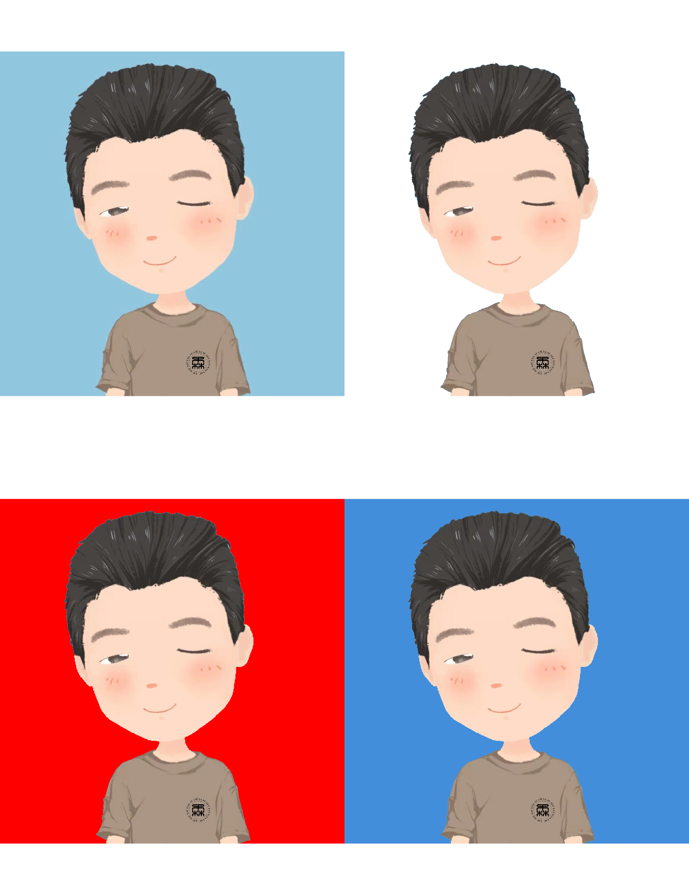
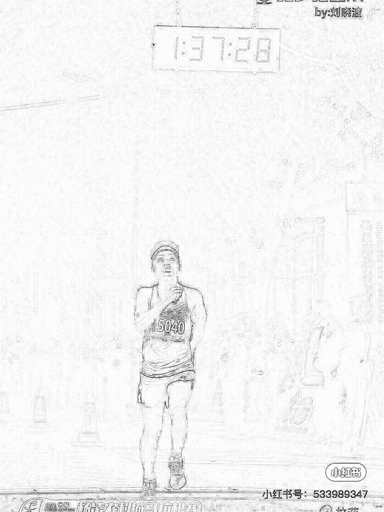
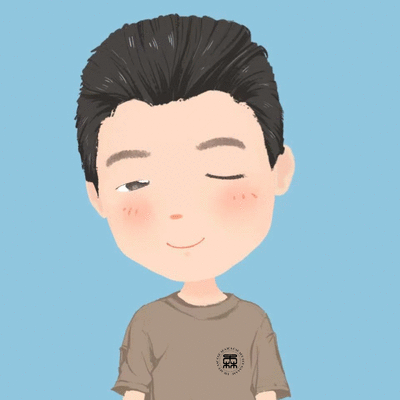
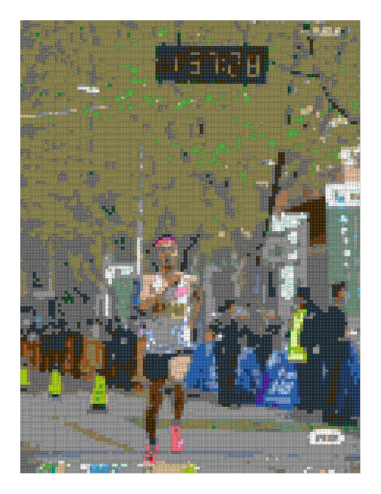

## 森言森语
>现实情况是，既不擅长设计和开展实验，更没有能力处理数据和图像。PS对我来说就太难了，安装卸载n多次，还是不会用……
## 主题
- **1 快速更改证件照底色**
- **2 图片转变为乐高马赛克**
## R包
```R
install.packages("brickr")    
install.packages("magick")   
```
#### 1 快速更改证件照底色
- **1换底色**
```
install.packages("magick")    
install.packages("ggplotify") 
install.packages("ggplotify") 
library(magick)   
library(ggplotify)    
library(ggplotify) 
a = image_read("karto.png") 
b = image_fill(a,"white",fuzz = 20) 
c = image_fill(a,"red",fuzz = 20) 
d = image_fill(a,"#438EDB",fuzz = 20)  
combine = cowplot::plot_grid(as.ggplot(a),
                             as.ggplot(b), 
                             as.ggplot(c),
                             as.ggplot(d),
                             ncol = 2)      
ggsave(all,filename = "combine.png")   
```


这效果一点不比PS差啊，真的有用。haha……

- **2 查看图片基本信息**
```
marathon = image_read("marathon.png")
image_info(marathon)

```

```
# A tibble: 1 x 7
  format width height colorspace matte filesize density
  <chr>  <int>  <int> <chr>      <lgl>    <int> <chr>  
1 PNG     1080   1440 sRGB       FALSE  1782692 29x29 
```
- **3 图片格式转换**
```
image_write(marathon, path = "marathon.tif", format = "tif")
```
- **4 勾勒线稿**
```
image_charcoal(marathon)
```



- **5 换件短袖试穿一下**
```
karto = image_read("karto.png")    
image_fill(karto, "white", point = "+2000+3800", fuzz = 20)
```


- **6 还可以这样**
```
karto <- image_scale(image_read("karto.png"))  
white <- image_scale(image_read("preview2.png"))  
red <- image_scale(image_read("preview3.png"))  
blue <- image_scale(image_read("preview4.png"))  
combine = image_resize(c(karto,white,red,blue), 
  '400x400!') %>%      
  image_background('white') %>%      
  image_morph() %>%      
  image_animate(optimize = TRUE)
```


有趣……

#### 2 图片转变为乐高马赛克 
```R
install.packages("png")    
install.packages("brickr")   
library(png) 
library(brickr)
readPNG("marathon.png") %>%   
  image_to_mosaic(img_size = c(108,144)) %>%   
  build_mosaic()
```


