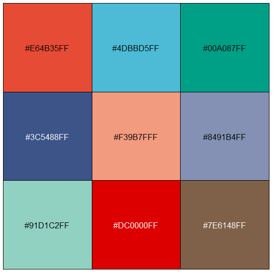

##### 森言森语 
>千磨万击还坚韧，任尔东西南北风。                                
——郑板桥《竹石》 

##### 导语 

>绘制Figure时，想要搭配出优雅的配色还是很不容易的。在仅需要2-3种色彩的时候，通常黑、白、灰也是不错的选择，起码不会出问题，就好比牛仔裤+白T恤。当需要多种色彩的时候，这一问题就变得棘手。

### Nature配色欣赏 
首先来看看刚才随便在Nature杂志看到的图片。
  


总体的配色给人的感觉是基本保持了全文配色的统一性，两张图片采用了相似的色系，且避免了亮色调。感觉不错。

 即使下面这张看起来有些复杂的图，看起来依然还不错。用到的主色调也就五六种。
 


总的来说，在色彩搭配过程中如果遵循这样的感觉，应该会为图的颜值增色不少：  

- 使用尽可能少的主色调  

- 避免使用晃眼的亮色  

- 尽可能保持全文色彩统一  

- 同样的变量尽量使用同一种色调       
（比如上调用红色，下调用蓝色。避免上调一会儿用红色，一会儿用别的色）  
- 尽可能让配色包含作者个性的情况下有格调一些。

 ##### NCS杂志使用较多的色彩 
 
 网上可以随便搜到很多在线颜色网站，不同格式还可以转换，但其实我感觉还是解决不了多少实际问题，颜色太多，其实也用不上，等于没用。
 
  所以，这里只推荐R包ggsci，具体到只推荐ggsci包中几种主流期刊的颜色方案。毕竟在作图得时候很少有超过10种色调的。如果不够用，那就把下面这些颜色适当调一调，基本足够。
  
```R 
#安装ggsci包用于提取主流科研期刊的配色 
install.packages("ggsci") 
#安装scales用以显示提取的颜色 
install.packages("scales") 
#加载以上两个包 
library(ggsci) 
library(scales) 
#提取AAAS配色 
color1 = pal_aaas()(10) 
show_col(color1) 
#提取Lancet配色 
color2 = pal_lancet()(9) 
show_col(color2) 
#提取NPJ配色 
color3 = pal_npg()(10) 
show_col(color3) 
#提取NEJM配色 
color4 = pal_nejm()(8) 
show_col(color4) 
#提取AAAS配色，如果不够用，可以设置透明度 
color5 = pal_aaas(alpha = 0.5)(10) show_col(color5) 
``` 
##### color1 
 
##### color2 
 
##### color3 
 
##### color4 
 
##### color5 
 

## 结语 

配色方案那么多，其实也用不过来，上述这些配色方案已经基本足够用了。有了这些配色方案，实际上就解决了很多的麻烦，也避免了在考虑配色时纠结来纠结去。配色方案倒是解决了，可惜没文章呀，哈哈……  
## Reference 

Zhang L, Chen F, Zhang X, et al. The water lily genome and the early evolution of flowering plants. Nature. 2020;577(7788):79-84. doi:10.1038/s41586-019-1852-5