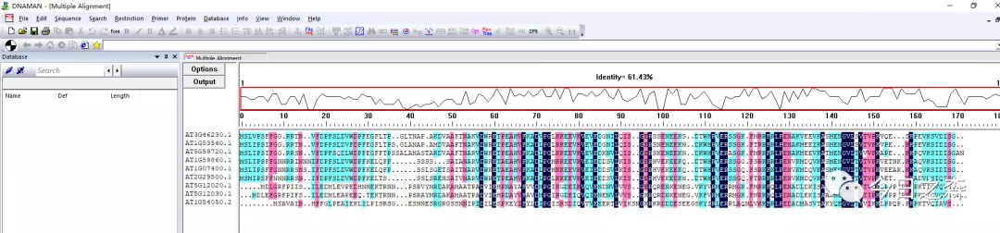
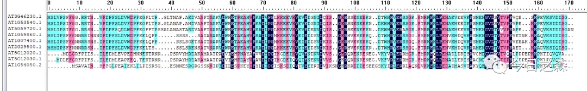
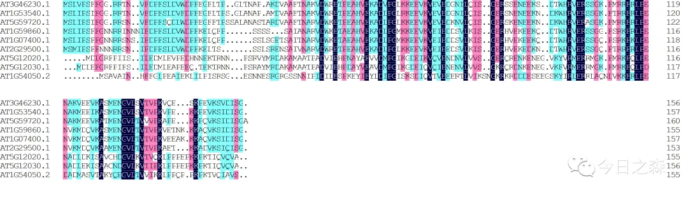
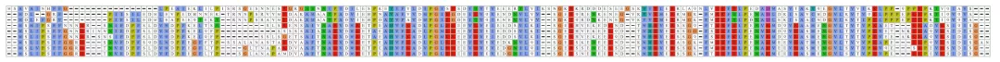

尽管我不怎么会用R语言，但是今天还是想斗胆写一些关于R语言的认识。

（以下内容，仅仅是一枚R小白的粗浅认识，仅供参考，毕竟每个人的学习路径都不尽相同。）

记得第一次听说并接触R语言是在两年前差不多这个时候，但那个时候的接触仅限于只是安装了R语言，然后大概知道可以通过R语言来分析数据。

两年前的夏天用了几个月的时间学习了第一个R包——mobsim，但是学了几个月都不怎么明白这个包是干嘛的，而且学的很痛苦。

我就在想，我还连R是什么都不知道，就在学R包的具体用法，是不是有点顺序颠倒。于是在网上找到一本书《R语言实战》，这本书在网上的评价极高。

之后我翻开这本书一看，和大多数编程语言的书籍一样，内容过于系统，过于基础。所以这本书就很厚，500多页。那这本书到底好不好呢？

答案是肯定的，肯定好！很好，因为它很系统，很基础。

翻开这本书后就开始从头到尾一页一页的看。那种感觉有点像拿一本单词书，然后“abandon、abandon、abandon”。其结果可想而知，匆匆翻过“几遍”之后，就失去了耐心，起码英语我还记得“abandon”，而《R语言实战》在那段时间翻过几遍之后我毫无长进，从那之后到现在都没有翻过这本书了。

因为通过翻看这本书我还是无法准确的理解并运用mobsim，看了mobsim的官方说明文档也无济于事。那这是为什么呢？不是《R语言实战》写的不好，更不是mobsim的官方说明文档写的不够详细，而是那个时候对这个包所要描述和分析的实际问题我并不理解，所以才导致我对这个包的使用以失败和放弃而告终。

那在现在看来，其实我还是会说这本书很好！

在之后通过断断续续的学习R，最终也一无所获。去年到现在的一年多就再也没有打开过R。

最近我又在用R，是因为对R有需求。

有了需求，然后针对需求有指向的学习就很方便了。在最近的作图过程中发现有些软件并不能很好的满足我的要求，所以就把苗头指向了R。

这就再次回到两年前面临的问题了。两年前我使用R以失败告终，最终也没有解决这一问题，那现在还不是一样要解决这一问题。

当然，现在又开始学习R，除了一些软件不能满足我的作图要求之外，还有一个原因是因为我发现我们常用的几乎全部的生物学软件的功能都可以使用R来解决，某种程度上效果都要比单一的软件要好。

安装这么多形形色色的软件还要占据本就拮据的C盘和软件盘的内存，这就让人很不爽。尽管我的C盘和两个软件盘还有足够的空间，但还是不舒服。

既然如此，那为什么不用R来整合这些软件呢，何苦在电脑上一个个安装一些功能单一的大型软件呢。

我喜欢简单，所以我的电脑桌面永远都是下面这个样子，我很不习惯把软件快捷图标都摆在桌面上。

所以我也想通过R来进一步简化很多事情。
图片
何况多数软件需要付费才能使用，对于没有获取许可的软件，我们及时通过各种方式做好图了，也不方便在论文中引用。

下面的内容才是重点。——那就是学习R语言的方法论。

先重复一个大多数人都遭遇过的例子，学英语先从背单词开始，本身没有错，但是一直苦苦陷于“abandon”显然不是一个好的开始。

这里没有说全部是因为也有人通过苦背单词而达到一定的状态，这种情况我不讨论。毕竟每个人的学习路径各不相同，获取知识的方式也不一样。

我再来描述一个现象。
现在我们买了新手机之后，好像几乎看不到很厚很厚的《手机使用说明书》，现在手机的功能都很多，使用过程中的各种参数设置更多，如果要写一本详尽的使用说明书，我估计至少也要几百页，都不一定穷尽各个功能。

当然，这是针对使用者而言。对于手机用户来说，并不需要了解手机的芯片制造，也不用研究系统本身。因为手机用户最大的需求是使用手机，而非掌握手机产生的原理及系统开发。

另外，我相信手机中大部分本身的功能和可操作页面大多数人不会去用，甚至从新手机到被丢弃都不会去触碰的功能，因为根本用不到。更多时候我们都是选择下载自己需要的感兴趣的app。

那么，学习R也是一样的。我们大多数人想学习R其实并不会把R作为一门编程语言来学习，更多的时候是想通过R来分析和处理数据，并对数据进行可视化，然后对可视化结果进行个性化设计，以满足论文发表的要求。

说了这么多，那到底如何学习R呢？

>如果捧着一本单词书疯狂背，不是学不好英语，只是大多数人都坚持不住。
如果打开一本《R语言实战》，不是学不好R语言，只是大多数人看不下去。

所以从我个人的认知出发，想要掌握R语言的日常使用。最好的方式就是先要设想一个问题情境，然后了解这一问题的常规解决思路和方法，可以先用替代软件实现可视化，然后再尝试用R来解决它，起码在R运行过程中，可以对照参数说明很容易知道每一个参数的实际作用以及和常规软件之间的对于关系，这样下来，通过几次参数调试和熟练，基本上就可以掌握一些简单的包中涉及的函数，及其相关的参数。这一过程至少要过很多遍，代码最好自己手动敲，不要直接复制，因为在敲代码的过程中可以遇到很多坑，将来也可以更好地避免这些坑。

等到可以用R熟练掌握情景一之后，就可以继续设想情景二……

如果可以熟练的对十几个情景进行准确分析，并可视化分析结果的时候，基本上就对R有一个初印象。

这个时候或许就知道自己再设想情景可能很难再进阶，此时就十分有必要把《R语言实战》重新搬出来研读，这个时候再看，那种感觉肯定就不一样，起码自己就知道看的过程中哪些可以暂时略过，而哪些需要研读。

我相信，只要长期坚持使用R环境，很快就可以用R来解决一些日常科研作图的需求。

另外，R和常规软件相比，其优势是可以对数据进行非常个性化的进行可视化。并且在导出图表时也有很大的方便之处。

好了，废话说这么多，下面就来举个例子。

比如我们设想一个情景：如何通过R来进行序列比对，并对比对结果进行可视化。
说起序列比对，我首先想到DNAMAN，前面刚好写过一篇推文，主要介绍了DNAMAN的一些功能，推文中介绍了很多内置功能，但看来看去，DNAMAN最核心的功能其实就是序列比对，可以说是一个功能及其单一的软件。先不说这个。

我们先用DNAMAN来解决上述情景。

好，问题已经解决。DNAMAN很快就可以实现我们的可视化诉求。

但是这里我还想贴上比对后的大图和导出后的图片。（考一下大家的眼力，看能发现什么？如果你发现了，而且你也遇到了这个问题，可以在后台私信我，我可以告诉你怎么规避。）
比对后的截图

导出后的图片

好，下面就用R来实现这一情景
通过简单搜索，很快知道要实现多序列比对，可以使用msa和ggmsa这两个包，好的，那就先安装。
msa用来进行多序列比对，ggmsa用来对比对结果进行可视化及美化。

安装好，然后来查看这个两个包的help文档。

>??msa
??ggmsa

这个help文档对msa进行了详细说明。往下看：
首先是安装说明，刚才已经安装过了，就不用管了。
然后载入数据，这里帮助文档提供了内置数据，我不想用，为了和前面DNAMAN的比对进行对标，我们还是使用前述的fasta文件。
下面是比对结果可视化

总体的效果还是蛮不错的。但是这个图放大后看不清，这里放个局部图。

但还是有一些没有解决的问题，很明显看到上面的图没有分行。
总之，通过这样一种方式去学习R，去适应R的运行环境，经过多次尝试和调试，使用的
包和函数多了之后，再随便翻翻《R语言实战》，应该就会方便很多。

下面是全部的代码：
>BiocManager::install("msa")
BiocManager::install("Biostrings")
install.packages("ggmsa")
library(msa)
library(ggmsa)
library(Biostrings)
hsp20<-readAAStringSet("H:/今日之森微信公众号/基因家族2/At_hsp20.sim.fasta")
myFirstAlignment<-msa(hsp20,method = "Muscle")
print(myFirstAlignment,show="complete")
##比对结果
MsaAAMultipleAlignment with 9 rows and 175 columns
    aln (1..95) names
[1] MSAVAINHFFG----------------LPEAIEKLILPISRSGESNNESRGRGSSNNIPIDILESPKEYIFYLDIPGISKSDIQVTVEEERTLVI AT1G54050.2
[2] --MDL--GRF--------PIISILEDMLEVPEDHNNEK-TRNNPSRVYMRDAKAMAATPADVIEHPNAYAFVVDMPGIKGDEIKVQVENDNVLVV AT5G12020.1
[3] --MDLEFGRF--------PIFSILEDMLEAPEEQTEKT--RNNPSRAYMRDAKAMAATPADVIEHPDAYVFAVDMPGIKGDEIQVQIENENVLVV AT5G12030.1
[4] --MSMIPSFFNNNRR--SNIFDPFSLDVWDPFKELTSS--------SLSRENSAIVNARVDWRETPEAHVFKADLPGLKKEEVKVEIEEDSVLKI AT2G29500.1
[5] --MSLIPSFFGNNRRINNNIFDPFSLDVWDPFKELQFP----------SSSSSAIANARVDWKETAEAHVFKADLPGMKKEEVKVEIEDDSVLKI AT1G59860.1
[6] --MSLIPSFFGNNRR-SNSIFDPFSLDVWDPFKELQFP-------SSLSGETSAITNARVDWKETAEAHVFKADLPGMKKEEVKVEIEDDSVLKI AT1G07400.1
[7] --MSLIPSIFGGRR---SNVFDPFSQDLWDPFEGFFTP-SSALANASTARDVAAFTNARVDWKETPEAHVFKADLPGLKKEEVKVEVEDKNVLQI AT5G59720.1
[8] --MSLVPSFFGGRR---TNVFDPFSLDVWDPFEGFLTP----GLTNAPAKDVAAFTNAKVDWRETPEAHVFKADVPGLKKEEVKVEVEDGNILQI AT3G46230.1
[9] --MSLIPSIFGGRR---TNVFDPFSLDVFDPFEGFLTP---SGLANAPAMDVAAFTNAKVDWRETPEAHVFKADLPGLRKEEVKVEVEDGNILQI AT1G53540.1
Con --MSLIPSFFG??R---?NIFDPFSLDVWDPFE????P---????????RD??A??NA?VDW?ETPEAHVFKADLPG?KKEEVKVEVED?NVL?I Consensus
    aln (96..175) names
[1] KSNGKRKRDDDESEEGSKYIRLERRLAQNLVKKFRLPEDADMASVTAKYQEGVLTVVIKKLPP-QPPKPKTVQIAVS--- AT1G54050.2
[2] --SGERQRENKENEG-VKYVRMERRMGK-FMRKFQLPENADLDKISAVCHDGVLKVTVQKLPPPEPKKPKTIQVQVA--- AT5G12020.1
[3] --SGKRQRDNKENEG-VKFVRMERRMGK-FMRKFQLPDNADLEKISAACNDGVLKVTIPKLPPPEPKKPKTIQVQVA--- AT5G12030.1
[4] --SGERHVEKEDKND--TWHRVERSSGQ-FTRRFRLPENVKMDQVKAAMENGVLTVTVPKAET---KKADVKSIQISG-- AT2G29500.1
[5] --SGERHVEKEEKQD--TWHRVERSSGG-FSRKFRLPENVKMDQVKASMENGVLTVTVPKVET-NKKKAQVKSIDISG-- AT1G59860.1
[6] --SGERHVEKEEKQD--TWHRVERSSGQ-FSRKFKLPENVKMDQVKASMENGVLTVTVPKVEE-AKKKAQVKSIDISG-- AT1G07400.1
[7] --SGERSKENEEKND--KWHRVERASGK-FMRRFRLPENAKMEEVKATMENGVLTVVVPKAPE---KKPQVKSIDISGAN AT5G59720.1
[8] --SGERSSENEEKSD--TWHRVERSSGK-FMRRFRLPENAKVEEVKASMENGVLSVTVPKVQE---SKPEVKSVDISG-- AT3G46230.1
[9] --SGERSNENEEKND--KWHRVERSSGK-FTRRFRLPENAKMEEIKASMENGVLSVTVPKVPE---KKPEVKSIDISG-- AT1G53540.1
Con --SGER??ENEEK?D--KWHRVERSSGK-F?RKFRLPENAKM??VKA?MENGVLTVTVPK?P?-??KKP?VKSIDISG-- Consensus
msaPrettyPrint(myFirstAlignment,alFile="./hsp20.msa1.fasta")
hsp20 <- readBStringSet("H:/Rstudio/hsp20.msa1.fasta")
ggmsa(hsp20,0,175,color = "Clustal",font = "TimesNewRoman",char_width = 0.5)

这里的标题为“新手学习R语言方法论”，名字起的有点大，总之是我一些学习R的想法，或许会对同样想学习R的你有些参考。

