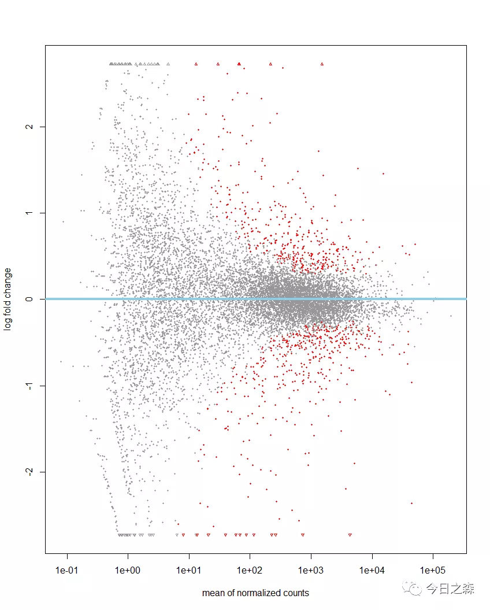
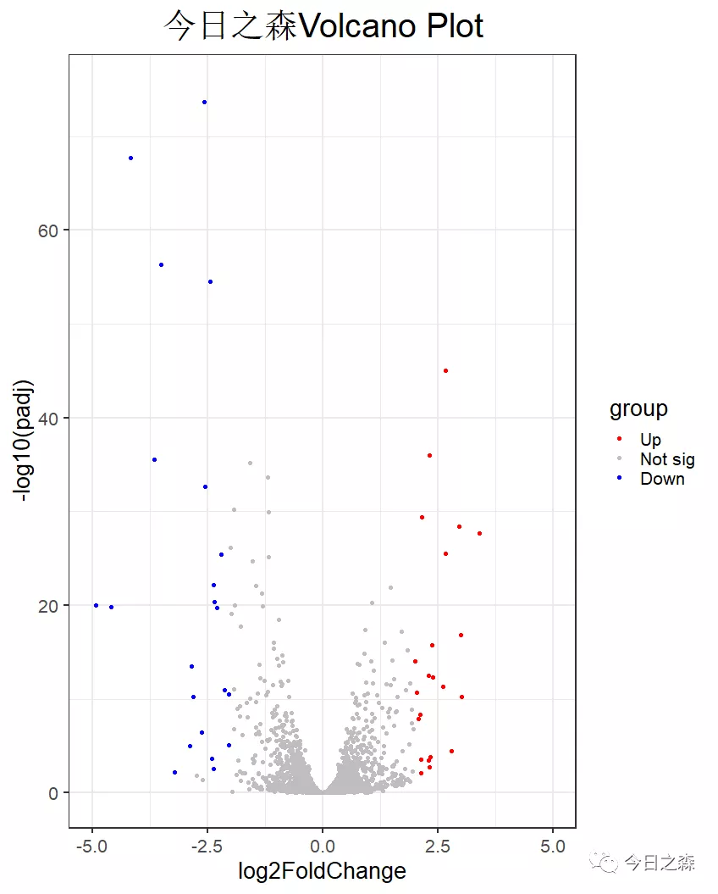

差异表达基因分析
即筛选处理组与对照组相比，呈现差异表达的基因，Up,No sig,Down.

今天使用的R包为：DESeq2[1]

这个包基于RNA Seq data-count data（也就是说这里要求输入的数据矩阵必须为count，而不是已经标准化后的TPM，FRAM），基于负二项广义线性模型估算样本间基因差异表达概率。

获取示例数据
这里我没有合适的数据进行演示，于是搜索到pasilla包中有一个示例数据可用。那我们就从pasilla包中获取今天的示例数据。
code1

1> if (!requireNamespace("BiocManager", quietly = TRUE))  
2  install.packages("BiocManager")  
3> BiocManager::install("pasilla")  
4> library(pasilla)  
5> pasCts<-system.file("extdata",  
6+                     "pasilla_gene_counts.tsv",  
7+                     package="pasilla",  
8+                     mustWork = T)  
9> pasCts 
10[1] "E:/R-4.1.0/library/pasilla/extdata/pasilla_gene_counts.tsv" 
11> pasAnno<-system.file("extdata", 
12+                      "pasilla_sample_annotation.csv", 
13+                      package="pasilla", 
14+                      mustWork=T) 
15> pasAnno 
16[1] "E:/R-4.1.0/library/pasilla/extdata/pasilla_sample_annotation.csv" 
17> df<-read.csv(pasCts,sep="\t",row.names = "gene_id") 
18> cts<-as.matrix(df) 
19   > coldata<-read.csv(pasAnno,row.names = 1)

这样就获得了今天我们需要的两个示例数据集，即表达矩阵cts，样本分组数据集coldata。如下：
code2

1> head(coldata)  
2           condition        type  
3treated1     treated single-read  
4treated2     treated  paired-end  
5treated3     treated  paired-end  
6untreated1 untreated single-read  
7untreated2 untreated single-read  
8untreated3 untreated  paired-end  
9> head(cts) 
10            treated1 treated2 treated3 untreated1 untreated2 untreated3 untreated4 
11FBgn0000003        0        0        1          0          0          0          0 
12FBgn0000008      140       88       70         92        161         76         70 
13FBgn0000014        4        0        0          5          1          0          0 
14FBgn0000015        1        0        0          0          2          1          2 
15FBgn0000017     6205     3072     3334       4664       8714       3564       3150 
16FBgn0000018      722      299      308        583        761        245        310

实际上仔细看看code1中row10和row16即可知道我们需要的数据集所在位置。
示例数据获取完毕，下面利用DESeq2进行差异表达分析：
code3

1dds <- DESeqDataSetFromMatrix(countData = cts,  
2colData = coldata, design = ~ condition) 
3dds <- DESeqDataSetFromMatrix(countData = cts,  
4colData = coldata, design = ~ condition) 
5dds <- DESeq(dds)    

画火山图
code4

1sum(res$padj < 0.05, na.rm = TRUE)    #统计padj<0.05显著差异的基因
2plotMA(res)    #画火山图
3plotMA(res, alpha = 0.05, colSig = 'red', colLine = 'skyblue')    #稍微设置一下参数

通常，画出火山图不是目的，目的是需要知道差异表达的基因到底是哪些？
于是，需要统计差异表达基因的信息。
code5

1filter_up <- subset(res, pvalue < 0.05 & log2FoldChange > 1) #过滤上调基因
2filter_down <- subset(res, pvalue < 0.05 & log2FoldChange < -1) #过滤下调基因
3print(paste('差异上调基因数量: ', nrow(filter_up)))  #打印上调基因数量
4print(paste('差异下调基因数量: ', nrow(filter_down)))  #打印下调基因数量

统计完成，我们当然还需要对统计结果进行保存。
code6

1write.table(res, file = "example_differential_gene.txt")  
2write.table(filter_up, file="example_filter_up_gene.txt", quote = F)   
3write.table(filter_down, file="example_filter_down_gene.txt", quote = F)

到这里，基本的分析就算是完成了。但是还可以继续：

1###读取刚才保存的差异表达基因分析数据
 2df = read.table("example_differential_gene.txt",header =T,stringsAsFactor = F)
 3###查看前6行
 4head(df)
 5                baseMean log2FoldChange     lfcSE         stat    pvalue      padj
 6FBgn0000003    0.1715687    1.026045410 3.8055034  0.269621465 0.7874515        NA
 7FBgn0000008   95.1440790    0.002151424 0.2238838  0.009609555 0.9923328 0.9969271
 8FBgn0000014    1.0565722   -0.496735569 2.1602643 -0.229942039 0.8181368        NA
 9FBgn0000015    0.8467233   -1.882761702 2.1064322 -0.893815463 0.3714206        NA
10FBgn0000017 4352.5928988   -0.240025230 0.1260243 -1.904594503 0.0568328 0.2823611
11FBgn0000018  418.6149305   -0.104799112 0.1482803 -0.706763605 0.4797134 0.8239073
12###可以看到我们一会儿重新绘图需要的padj列有NA值，故需要删掉包含NA的行
13df = na.omit(df)
14##再次查看，可以看到包含NA的行已被删除
15head(df)
16               baseMean log2FoldChange     lfcSE         stat     pvalue      padj
17FBgn0000008    95.14408    0.002151424 0.2238838  0.009609555 0.99233280 0.9969271
18FBgn0000017  4352.59290   -0.240025230 0.1260243 -1.904594503 0.05683280 0.2823611
19FBgn0000018   418.61493   -0.104799112 0.1482803 -0.706763605 0.47971340 0.8239073
20FBgn0000032   989.73003   -0.091905049 0.1476974 -0.622252169 0.53377607 0.8497739
21FBgn0000037    14.09481    0.463068060 0.4914026  0.942339492 0.34601886 0.7409094
22FBgn0000042 82207.72464    0.314524848 0.1405415  2.237949545 0.02522435 0.1645315
23###接下来需要设置限定值
24df$group = ifelse(df$log2FoldChange>=1&df$padj<=0.05,"Up",
25                  ifelse(df$log2FoldChange<=-1&df$padj<=0.05,"Down","Not sig"))
26table(df$group)
27   Down Not sig      Up 
28    105    8103     115 
29###可以看到，这里有105个下调gene，115个上调基因。但是还是太多了，毕竟后面的分析中我希望得到限制条件更严格的结果。那就重新设定限定值
30df$group = ifelse(df$log2FoldChange>=2&df$padj<=0.01,"Up",
31                  ifelse(df$log2FoldChange<=-2&df$padj<=0.01,"Down","Not sig"))
32table(df$group)
33   Down Not sig      Up 
34    25    8275     23
35#好，差不多了下面开始用ggplot2绘图 
36install.packages("ggplot2")
37library(ggplot2)
38ggplot(df,aes(x=log2FoldChange,y = -log10(padj)))+
39  geom_point(aes(color=group))+
40  scale_color_manual(values = c("red","grey","blue"),limit = c('Up','Not sig',"Down"))+
41  theme_bw(base_size = 20)+
42  ggtitle("今日之森Volcano Plot")+
43  theme(plot.title = element_text(size=30,hjust = 0.5))+
44  coord_cartesian(xlim = c(-5,5),ylim = c(0,75))

[1]Anders S, Huber W. Differential expression analysis for sequence count data. Genome Biol. 2010;11(10):R106. doi:10.1186/gb-2010-11-10-r106  