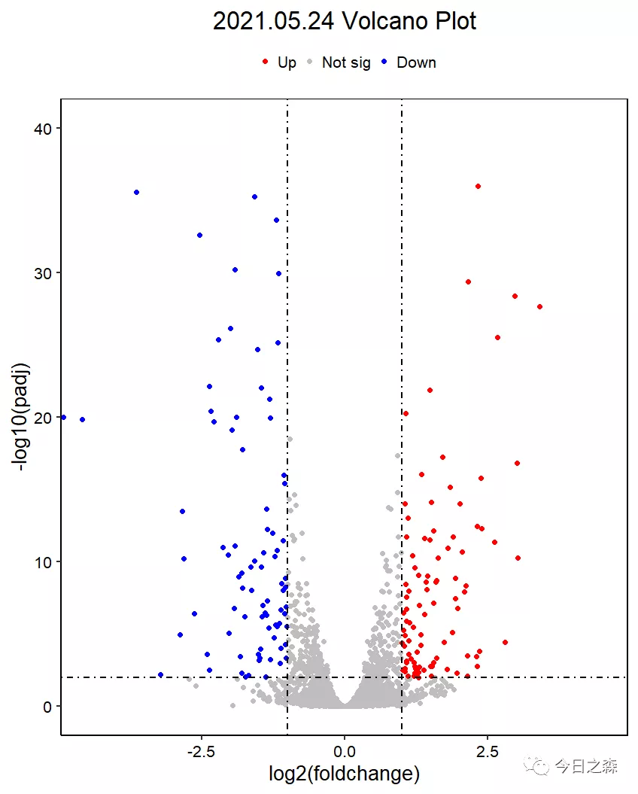

R语言 | 差异表达基因分析（DEGs）| 原始数据处理&火山图绘制中介绍了差异表达基因原始数据的分析及火山图的绘制。

今天接着昨天的分析对火山图进行精修。并在一定程度上对差异表达基因和火山图相关内容进行说明。

差异表达基因分析是RNA-seq数据分析的一部分，常用的RNA-seq表达差异分析工具有edgeR（TMM）、DESeq2（Various）等。

|Gene Name|Sample1|Sample2|Sample3|
|---|---|---|---|
|geneA（10kb）|10|5|15|
|geneB（2kb）|5|10|15|
|Sum（reads）|15|15|30|

两个问题：

在Sample1中，geneA的表达量是否比geneB表达量高？

geneA在Sample3中的表达量是否比在Sample2的高？

FRKM基因长度标准化

Step1：Mapped fragments/Exon length

|Gene Name|Sample1|Sample2|Sample3| 
|---|---|---|---| 
|geneA（10kb）|1|0.5|1.5| 
|geneB（2kb）|2.5|5|7.5| 
|Sum（reads）|3.5|5.5|9|

Step2：Mapped fragments/（Exon length*Sum mapped read counts）

|Gene Name|Sample1|Sample2|Sample3|  
|---|---|---|---|  
|geneA（10kb）|0.06667|0.03333|0.05|  
|geneB（2kb）|0.16667|0.33333|0.25|  

TPM基因长度标准化  

Step1：Mapped fragments/Exon length

|Gene Name|Sample1|Sample2|Sample3|  
|---|---|---|---|  
|geneA（10kb）|1|0.5|1.5|  
|geneB（2kb）|2.5|5|7.5|  
|Sum（reads）|3.5|5.5|9|

Step2：Mapped fragments/（Exon length*Sum（mapped read counts/exonlength））

|Gene Name|Sample1|Sample2|Sample3|  
|---|---|---|---|  
|geneA（10kb）|0.28571|0.09090|0.16667|  
|geneB（2kb）|0.71428|0.90909|0.83333|  
|Sum（reads）|1|1|1|

使用DESeq进行差异表达分析

（完整代码，该代码为练习代码，有冗余）

1library(ggplot2)
 2library(EnhancedVolcano)
 3library(pasilla)
 4library(DESeq2)
 5library(ggrepel)
 6library(ggpubr)
 7library(ggmaplot)
 8pasCts<-system.file("extdata",
 9                    "pasilla_gene_counts.tsv",
10                    package="pasilla",
11                    mustWork = T)
12pasCts
13pasAnno<-system.file("extdata",
14                     "pasilla_sample_annotation.csv",
15                     package="pasilla",
16                     mustWork=T)
17pasAnno
18df<-read.csv(pasCts,sep="\t",row.names = "gene_id")
19cts<-as.matrix(df)
20head(cts)
21coldata<-read.csv(pasAnno,row.names = 1)
22head(coldata)
23coldata<-coldata[,c("condition","type")]
24rownames(coldata)<-sub("fb","",rownames(coldata))
25all(rownames(coldata) %in% colnames(cts))
26cts<-cts[,rownames(coldata)]
27all(rownames(coldata) == colnames(cts))
28head(coldata)
29head(cts)
30View(coldata)
31View(cts)
32dds <- DESeqDataSetFromMatrix(countData = cts, colData = coldata, design = ~ condition)
33dds <- DESeqDataSetFromMatrix(countData = cts, colData = coldata, design = ~ condition,tidy = TRUE)
34dds = dds[rowSums(counts(dds))>1,]
35dds <- DESeq(dds)    
36res <- results(dds, contrast = c("condition", "treated", "untreated")) 
37head(res)
38summary(res)
39res_deseq = res[order(res$padj),]
40head(res_deseq)
41df1 = na.omit(res_deseq)
42head(df1)
43###EnhancedVolcano火山图初始图
44EnhancedVolcano(df1,
45                lab = rownames(df1),
46                x = "log2FoldChange",
47                y = "padj",
48                xlim = c(-4.5,4.5),
49                ylim = c(0,50),
50                gridlines.major = F,gridlines.minor = F,
51                border = "full")
52df$group = ifelse(df$log2FoldChange>=1&df$padj<=0.01,"Up",
53                  ifelse(df$log2FoldChange<=-1&df$padj<=0.01,"Down","Not sig"))
54###火山图草图
55ggplot(df,aes(x=log2FoldChange,y = -log10(padj)))+
56  geom_point(aes(color=group))+
57  scale_color_manual(values = c("red","grey","blue"),limit = c('Up','Not sig',"Down"))+
58  theme_bw()
59###火山图精修
60ggplot(df,aes(x=log2FoldChange,y = -log10(padj)))+
61  geom_point(aes(color=group),size = 2)+
62  scale_color_manual(values = c("red","grey","blue"),limit = c('Up','Not sig',"Down"))+
63  geom_hline(yintercept = -log10(0.01),linetype = 4,size = 0.8)+
64  geom_vline(xintercept = c(-1,1),linetype = 4, size = 0.8)+
65  theme_bw(base_size = 20)+
66  theme_classic(base_size = 20) + 
67  ggtitle("2021.05.24 Volcano Plot")+
68  theme(plot.title = element_text(size=25,hjust = 0.5),
69        panel.background = element_rect(fill = 'transparent',color = 'black'),
70        axis.text = element_text(color = 'black'),
71        legend.key.size = unit(0.2,'cm'),
72        legend.direction = 'horizontal',
73        legend.position = 'top',
74        legend.title = element_blank())+
75  coord_cartesian(xlim = c(-4.5,4.5),ylim = c(0,40))+
76  labs(x = "log2(foldchange)",y = "-log10(padj)")
77###MA图绘制
78head(df1)
79ggmaplot(df1,main = expression("Group 1"%->%"Group 2"),fdr = 0.05,fc = 1, 
80         size = 0.4, palette = c("red", "blue", "black"),
81         genenames = as.vector(df$name),legend = "top",top = 20, 
82         font.label = c("bold",11),font.legend = "plain",font.main = "bold",
83         ggtheme = ggplot2::theme_minimal(),
84         label.rectangle = T)+
85  theme(plot.title = element_text(size=25,hjust = 0.5),
86        panel.background = element_rect(fill = 'transparent',color = 'black'),
87        axis.text = element_text(color = 'black'),
88        legend.direction = 'horizontal',
89        legend.position = 'top',
90        legend.title = element_blank())+
91  coord_cartesian(xlim = c(2,18),ylim = c(-5,5))+
92  labs(x = "logCounts",y = "-log2FC")
93##保存上述分析数据
94filter_up <- subset(res, pvalue < 0.05 & log2FoldChange > 1) 
95filter_down <- subset(res, pvalue < 0.05 & log2FoldChange < -1) 
96write.table(res, file = "example_differential_gene.txt") #log2FoldChange + pvalue + padj
97write.table(filter_up, file="example_filter_up_gene.txt", quote = F)  
98write.table(filter_down, file="example_filter_down_gene.txt", quote = F)