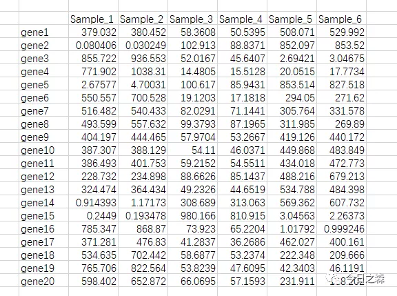
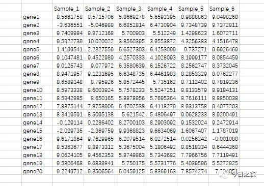
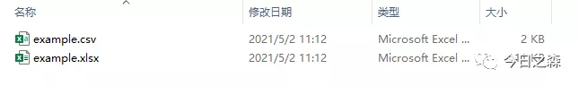
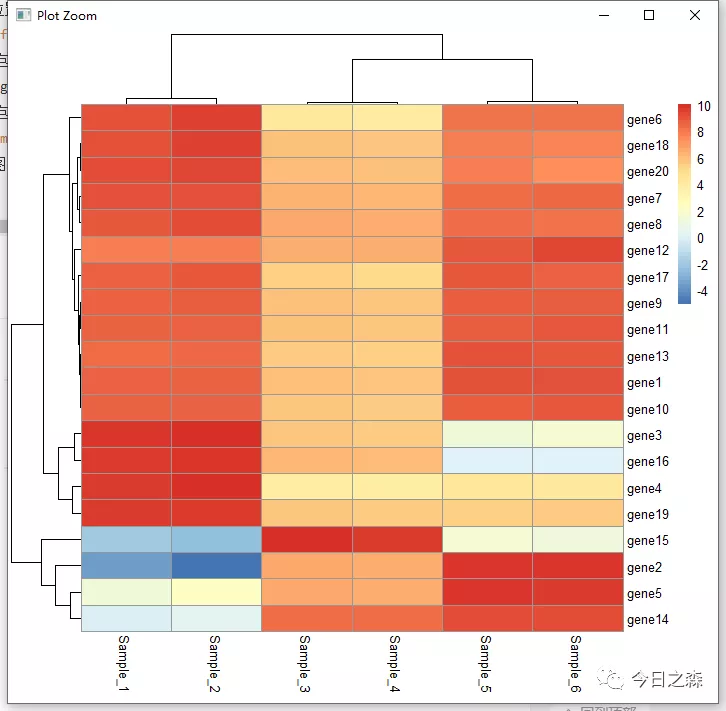
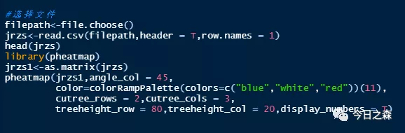
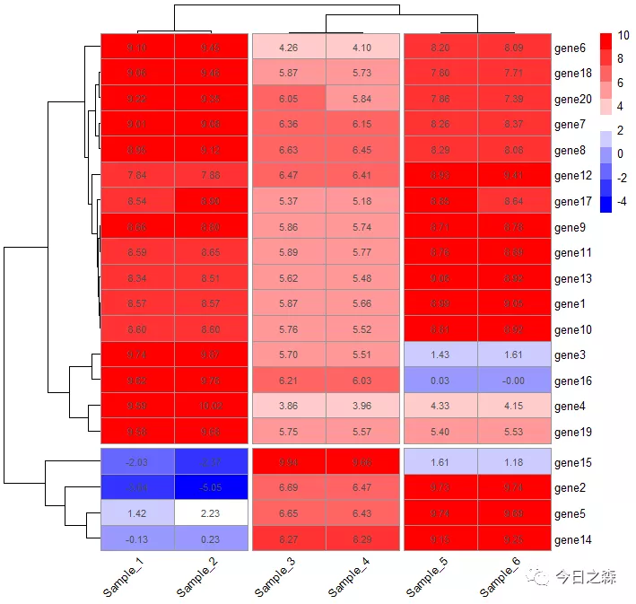

森言森语：  

之前几次写到关于热图的一些推文，《Origin——绘制热图（若干在线网站绘heatmap）》和《试图厘清热图相关的一些细节》。不同的方法各有千秋，但有时为了满足一些需求，不得不使用R来绘图。
   

【进入正题】  

R中可以用来绘制热图的Packages很多，起码有10个左右，今天我想写一下关于pheatmap的一些简单用法。数据还是使用之前例子中用过的数据。

【数据准备】  

暂且将上述数据理解为tpm值，这里通过log2(X)进行标准化，这一步在excel里面实现即可。

将该excel文件保存为csv文件。

【R绘图】

1、打开Rstudio

#选择文件，这里只提供一种方式而已。

filepath<-file.choose()   #run之后选择刚才的example.csv即可 

#定义文件所在位置，并赋值给df 

jrzs<-read.csv(filepath,header = T,row.names = 1)   #header意为有表头，row.names意为设置行标题 

#安装pheatmap包 

install.packages("pheatmap") 

#加载pheatmap包 

library(pheatmap) 

#数据框矩阵化 

jrzs1<-as.matrix(jrzs) 

#绘最简单的热图 

pheatmap(jrzs1)    #run

这样就可以得到pheatmap函数默认状态下最基础的热图了。

 
 
 下面对几个我认为比较实用的参数进行说明。   
 1、行列是否聚类    
 
 #列聚类 
 
 cluster_cols = F 
 
 #行聚类 
 
 cluster_rows = F 
 
 以T或F选择是或否
 
 2、列标签角度
 
 #列标签角度设置 (0, 45, 90, 270 and 315) 
 
 angle_col =
 
 3、热图色块设置
 
 #热图色块设置
color=colorRampPalette(colors=c("blue","white","red"))

#还可设置色阶,如果是三色，最好设置奇数，这样可以把中间色凸显出来

color=colorRampPalette(colors=c("blue","white","red"))(10)

4、色块的高和宽

#色块的高度和宽度设置 

cellwidth = 30,cellheight = 10

5、按照聚类情况进行切割

cutree_rows = 3,cutree_cols = 3

6、聚类树的高低

#如果不设置，则默认值为50 

treeheight_row = 80,treeheight_col = 20

7、热图中显示表达量

display_numbers = T

总体来说还是不错的。

当然，这里仅对最基本的参数进行了说明。还可以进行更为丰富的设置。