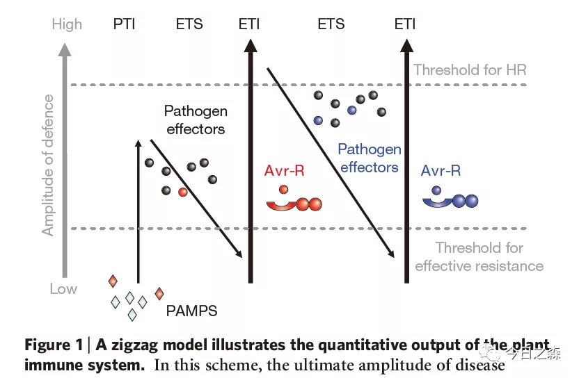
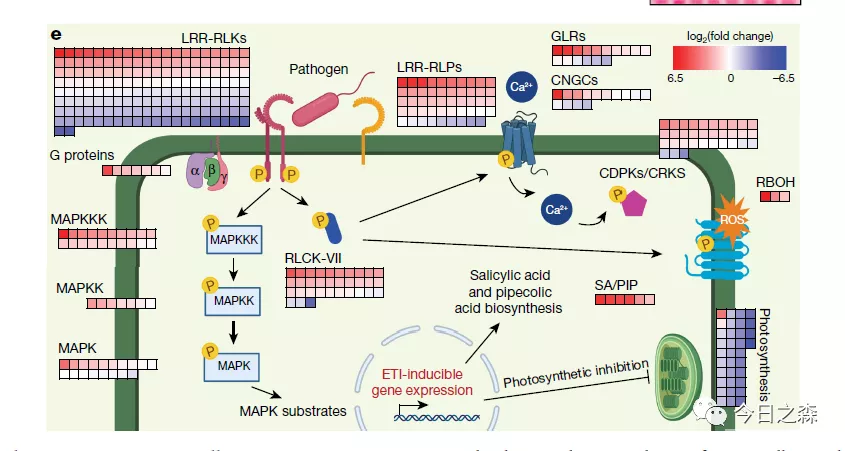
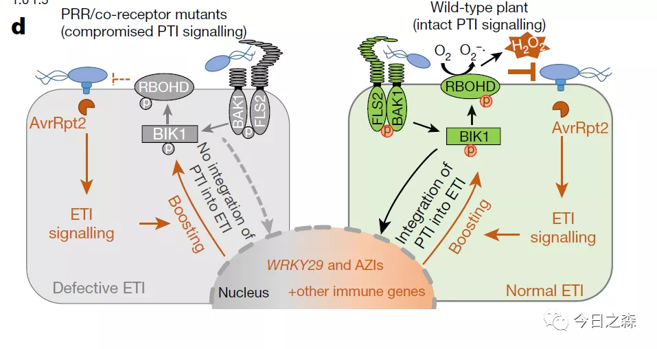

英国学者Jonathan Jones和美国学者Jeffery Dangl 于2006年提出“Zig-Zag”模型，该模型总结了病原相关分子模式触发的免疫反应PTI、效应子触发的敏感性ETS和效应子触发的免疫ETI之间的关系。

起初，人们认为PTI和ETI是有层次的，且独立发挥作用，但随着对植物免疫系统研究的不断深入，越来越多的研究者发现PTI和ETI存在很多相似之处。

但究竟是泾渭分明，还是相互交联？

这一问题的答案随着辛秀芳研究团队和Jonathan Jones研究团队于2021年3月11日发表在Nature杂志上的两篇研究论文而日渐清晰。

这三篇论文分别为：

Jones, J., Dangl, J. The plant immune system. Nature 444, 323–329 (2006). https://doi.org/10.1038/nature05286

Yuan, M., Jiang, Z., Bi, G. et al. Pattern-recognition receptors are required for NLR-mediated plant immunity. Nature (2021). https://doi.org/10.1038/s41586-021-03316-6

Ngou, B.P.M., Ahn, HK., Ding, P. et al. Mutual potentiation of plant immunity by cell-surface and intracellular receptors. Nature (2021). https://doi.org/10.1038/s41586-021-03315-7

正式学习这三篇文献之前，我们先来温习一下什么是PTI和ETI？

当受到病原菌侵染时, 植物会利用位于细胞膜表面的PRRs迅速识别病原菌保守的PAMPs, 通过与共受体(co-receptor)结合并磷酸化激活RLCKs, 如BIK1 和BSK1, 进而激活MAPKs级联信号通路、CDPKs通路和引起ROS爆发等, 这些反应统称为PTI免疫反应。

为了抑制植物PTI免疫反应, 一些病原菌向宿主细胞分泌效应因子(effectors)以干扰免疫进程, 使植物感病。面对病原菌的入侵, 植物进化出细胞内受体蛋白NLRs, 通过识别效应因子激活更强烈的ETI免疫反应, 通常在病原菌入侵位点诱导HR抑制病原菌的生长。ETI免疫反应同样可以引起MAPKs信号通路激活和ROS爆发。

我们首先来回顾一下Jonathan Jones和Jeffery Dangl于2006年提出的“Zig-Zag”模型。

论文中是这样描述“Zig-Zag”模型的，共分为4个阶段。

第一阶段：

PAMPs（MAMPs）被PRRs识别，产生PTI，且能阻止PAMPs的进一步定殖。

第二阶段：

成功定殖的病原体释放毒力更强的效应子，效应子会干扰PTI，由此导致效应子触发的ETS。

第三阶段：

特定的效应子被NBS-LRR蛋白“特异性识别”，产生ETI。识别要么是间接的，要么是通过效应子的直接NB-LRR识别。ETI可以加速和放大PTI反应，导致免疫的加强，通常是侵染部位的细胞过敏性死亡反应。

第四阶段：

自然选择驱使病原体避开ETI，要么通过效应子基因多样化，要么通过形成抑制ETI的额外效应子。自然选择导致新的受体特异性，导致ETI再次被触发。

至此，Jonathan Jones和Jeffery Dangl便奠定了植物免疫理论的基调。

十几年来，人们普遍认为PTI和ETI是相互独立，且具有先后顺序和层次的免疫机制。

直至今年3月份辛秀芳研究团队和Jonathan Jones研究团队的研究成果才让人们对PTI和ETI有更深层次的认知，也因此对早先的“Zig-zag”模型进行了完善和补充。

下面就简单介绍一下他们的成果。

先来看Jonathan Jones研究团队的研究成果。

一直以来，植物细胞表面受体介导的免疫已被广泛研究，但在缺乏细胞表面受体的情况下，植物所启动的免疫反应很少被研究。

以往人们认为，PTI和ETI都能产生很强的免疫反应。而他们的研究表明，ETI本身并不能激活很强的抗性反应。但是ETI可通过诱导，提高PTI信号通路中某些组分的转录量来促进PTI，而PTI通过MAPKs和NADPH信号来保证ETI完整抗性功能的正常发挥。

该研究使用早前报道的雌二醇介导的ETI诱导系统。

主要结论有：

ETI本身并不能激活很强的信号通路与抗性反应。但ETI可通过诱导提高PTI信号成分的转录量来促进PTI，而PTI通过MAPKs和NADPH信号来保证ETI完整抗性功能的正常发挥。

在PTI激活条件下，ETI的激活可以增强PTI所激发的免疫反应 。

ETI自身并不足以激活完整的植物抗性，ETI的功能是通过PTI实现的。

ETI与PTI的同时激活使得BIK1, RBOHD, MPK3, BAK1等重要PTI元件表达量增多，但是其他重要元件 (如MPK4, MPK6, FLS2等) 并没有呈现蛋白量的变化。

ETIAvrRps4的转录组数据说明ETI自身激活可以诱导很多PTI元件的表达量显著提高。

但ETI增强PTI的机制仍然错综复杂，需要更加全面和深层次的研究来完善和揭示ETI和PTI之间的关系。

接着，我们再来看辛秀芳研究团队的成果。

他们则利用了拟南芥(Arabidopsis thaliana)与丁香假单胞杆菌(Pseudomonas syringae)互作系统。

主要结论有：

拟南芥ETI免疫反应的发生依赖PTI通路中的多种元件。

在缺失多种PTI途径的重要PRRs或共受体的拟南芥突变体fls2/efr/cerk1 (fec)和bak1/bkk1/cerk1 (bbc)中, 由效应因子avrRpt2、avrPphB和avrRps4诱导的ETI免疫反应明显受到影响, 说明ETI免疫反应也受PRRs受体的调控, 暗示ETI依赖PTI。

PRRs信号通路的持续激活是ETI-ROS爆发的关键。

ETI-ROS爆发可能促进ETI免疫反应。

PRRs信号和NLRs信号通过协调RbohD活性和丰度来调控ETI-ROS爆发。

BIK1是ETI免疫反应中ROS爆发和免疫基因表达调控的一个重要节点。

总的来说，PTI和ETI之间的关系依然需要更加充分和全面的证据来厘清。
缩略词：
|BIK1|BOTRYTIS-INDUCED KINASE 1|
|BSK1|BR-SIGNALING KINASE 1|
|CDPKs|calcium dependent protein kinases|
|ETI|effector- triggered immunity|
|HR|hypersensitive response|
|MAPKs|mitogen-activated protein kinases|
|NLRs|nucleotide-binding site and leucine-rich repeat domain receptors|
|PAMPs|pathogen-associated molecular patterns|
|PRRs|pattern-recognition receptors|
|PTI|pattern-triggered immunity|
|RLCKs|receptor-like cytoplasmic kinases|
|ROS|reactive oxygen species|
|RTS|effector-triggered susceptibility|

今天喝的有点多了，就先简单写到这里，下周再详细研读并介绍这两篇论文。