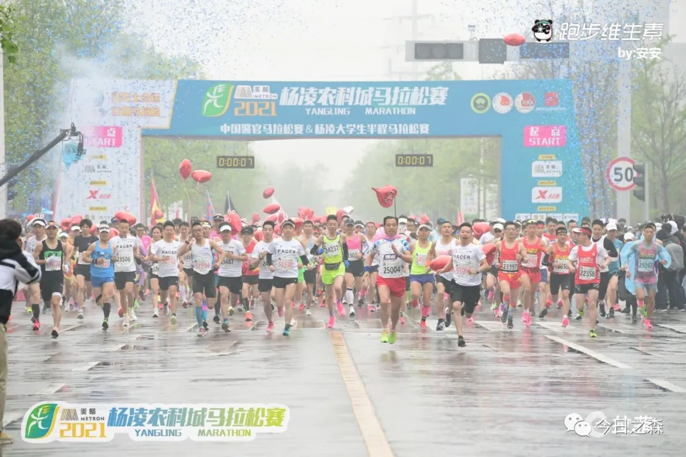
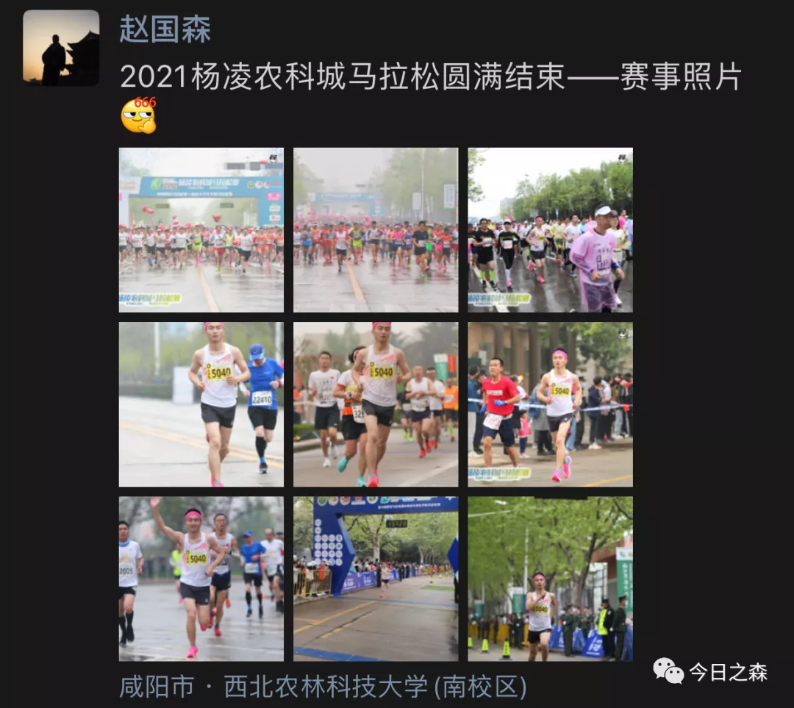
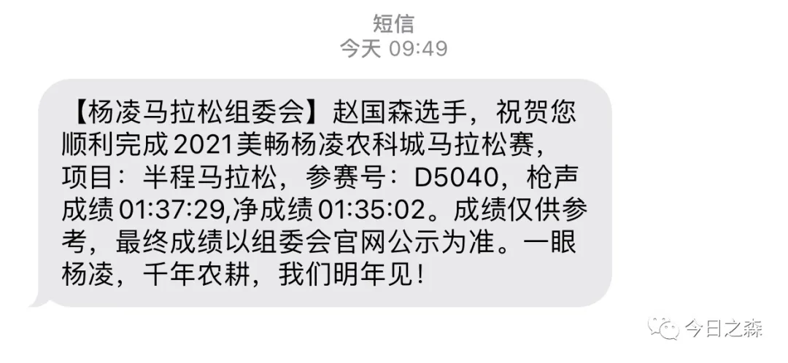
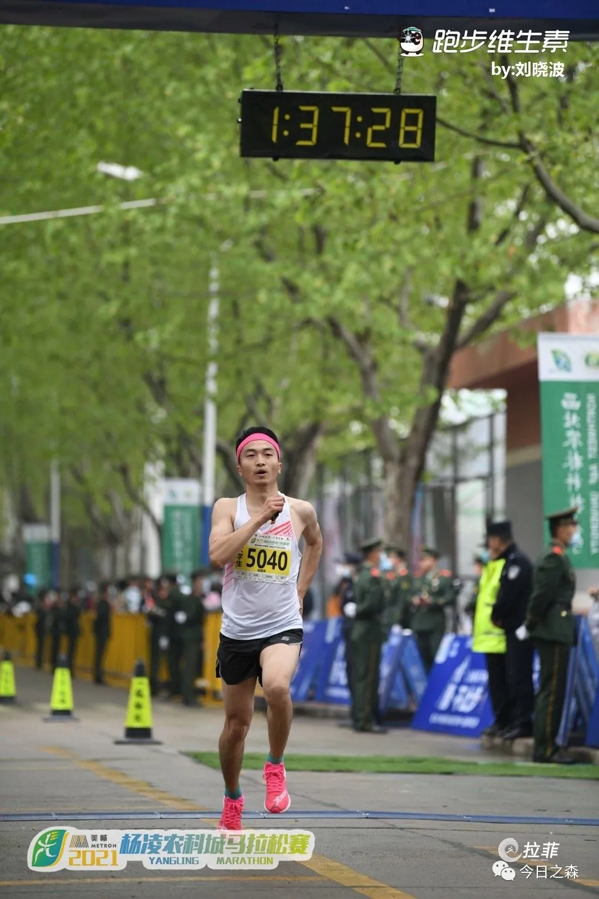

早上六点半起床后赶紧跑到阳台看看天气怎么样，推开门便是扑面而来的水汽，昨晚下了小雨，地面湿漉漉的。

简单收拾了一下，师弟就骑车送我去起点，刚到起点没多大会儿就下起了小雨，还好只飘了一会儿就停了。

从早上起床就感觉整体状态很好，很轻松。

这次没有跑的很快，15-18公里这段路就放慢了速度，在补给站喝了两次水，3支能量胶，不过最后一公里的确跑的超快！遗憾的是没有刷新2018年PB（131）。

不过今天一整天都是超开心！

与前两届马拉松不同的是，这次跑马拉松总体感觉很纯粹，什么也没想，也没有纠结。

总之，今天一整天都很开心！

今年12月如果能中签，就参加广州马拉松图片，出去走走看看。

跑马拉松这事真的会上瘾，而且戒不掉！

记忆中最早的一次长跑应该是初中毕业那年的暑假，中考完到高中开学之间有三个月的空档，突然在某一天，我就开启了这个未经考虑的计划，而且是立马执行。

当时计划从家里到县城，再从县城折返回到家中，单程20km，往返差不多就是一个全马的距离。那个时候很佩服自己，为了防止中途不想坚持而搭车，所以出门就一分钱没带，索性那次走走停停，最终还是完成了。

再往后的记忆就是高中的时候，有一段时间和室友晚上下自习就去跑圈，无奈那个时候每次跑圈我都跑不过他们，每次都是最后一名，每次我都不想跑。

再往后其实就没什么长跑的经历了。

真正的长跑是从17年退伍后才开始的，也因此而结交了一些跑友，刚才有朋友在朋友圈还留言说当时一起跑步的日子历历在目。甚至当时和一个战友（同学）每天早上晨跑坚持了一整个学期，也因此在2018年半程马拉松跑出了个人最好成绩131.

19-20年之间的时间里，也偶尔跑步，但都是断断续续，也就逐渐荒废了。

最近的长跑是去年11月份左右开始的，那段时间跑步很疯狂，因为急于在短时间内恢复以前的水平，在某一周的周一，周三，周六分别进行了3次25公里的长跑，结果膝盖受伤，足足养了3个月，上个月的时候跑完步还会隐隐作痛，但在最近一段时间集中的跑步锻炼后，已经完全恢复。

最终在今天2021年4月11日，杨凌农科城马拉松比赛中跑出了135的成绩，基本恢复了以前的水平。

但最为珍贵的是，跑了这么久，我依旧热爱跑步，喜欢在路上的感觉。

今年开始，我也将正式开启马拉松之旅。

相信这终将是我人生中不可抹去的记忆。

