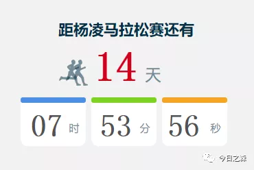
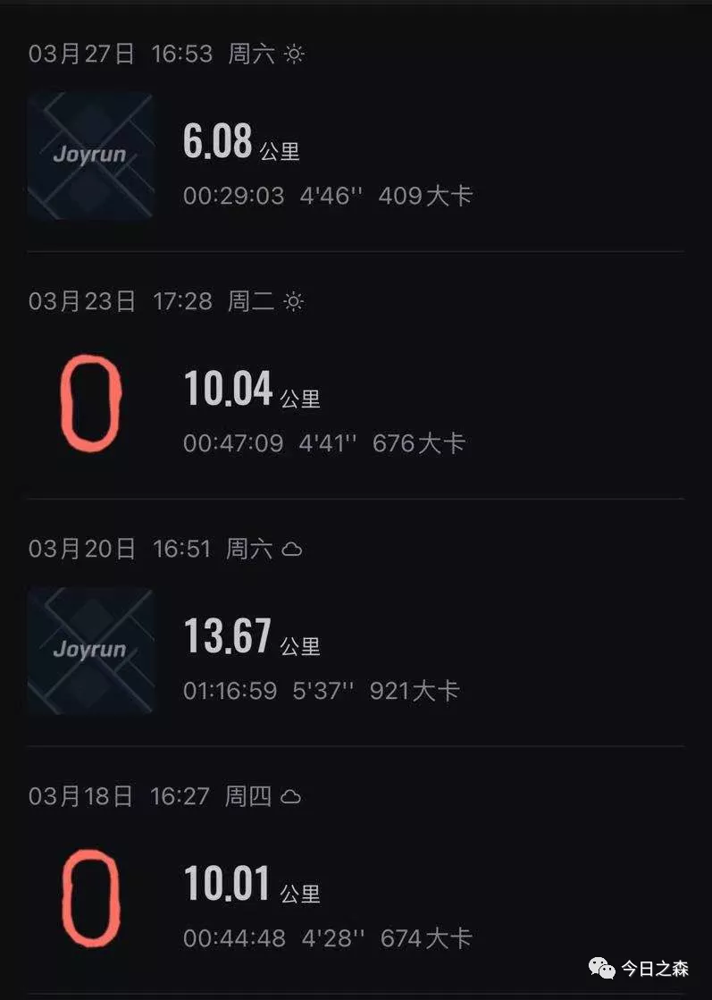

作为跑步小白或者不经常跑步的伙伴来说，10公里以上的中长跑就需要认真对待，切不可盲目尝试。

杨陵马拉松还有两周就要开跑了，正好谈一谈我对备战半程马拉松的几点经验。

以下仅为个人经验，实际还应以个人具体情况进行准备。

跑前两周应该注意哪些？
正式参加半程马拉松之前，一定要有单次跑步超过20公里的经历，正式开跑前一个月也至少要有一至两次超过20公里的跑步经历。只有经历过，才能坦然面对。

跑前两周，每天都至少保证半个小时的运动，可以慢跑、速度跑相结合。因为跑步需要长期坚持，才能保持速度与耐力并存。中间听两三天不仅人容易懒惰，也容易丧失对跑步的激情和习惯。

跑前一周应保持清淡的饮食，不可饮酒，不可过度熬夜，避免食用辛辣的食物。

如果准备正式参赛时穿新鞋，一定要在开跑前两周进行至少30公里的适应，这样才能让脚和跑鞋有一定程度的磨合与适应。千万不要比赛当天穿新鞋，容易导致脚部受伤和磨损。同样，袜子也要避免穿新的，至少要穿过三次以上，洗过三次以上。

跑前一天应该注意哪些？

首先应该提前准备好第二条参赛的装备，比如跑鞋、袜子及其他装备（手机、手表、头带、背包等）。避免第二天早上找不到装备而影响心情和跑步成绩。

如果不够自信，请联系一个朋友作为外援，第二天跑步时带上手机，出现任何状况除了求助马拉松志愿者外还可以第一时间联系到朋友以提供帮助。

跑前一天不应过度运动，以5公里左右的放松跑或者热身运动为主。

跑前一天晚上一定要早睡，最好从跑前一周就开始适应早睡。毕竟第二天早上最晚七点就要起床，八点正式开跑。因此保证一个好的睡眠很重要。

然后就是调整好心态。一个好的心态比什么都重要。

跑步当天应该注意哪些？

至少七点就要起床，洗漱完，吃完早餐，一定要保证十几分钟的热身。

早餐一定要吃一点，可以少吃一点，最好以粥等为主。千万不要什么都不吃，因为跑步过程中很容易饿，如果没有足够的能量，很容易出现状况。

跑步过程中，我没有在补给站吃过东西，也没有喝过水。但还是建议，如果中途需要补给，在途径补给站的时候可以放慢速度，但千万不要停下来，一旦停下来可能就再也跑不起来了。所以可以慢跑至补给站，食物一般会有水果或巧克力之类，我建议最好吃一点点香蕉之类的，可以吃一小块，不能多吃。喝水的话一定要少量，最好只喝半口到一口，以保持口腔和嘴唇湿润为主。切不可大口饮水。

跑步过程中可以找一个和自己节奏匹配的伙伴，跟着跑。避免扎堆和很多人一起跑，最好和前后的人保持一定的距离。因为马拉松跑步过程中很容易出状况，和别人保持较大的距离很有必要。

最好匀速跑，可以慢慢加速。避免时快时慢。

到达终点后也要切记不可大量饮水，可以少量吃一点食物。

跑步结束之后一定要先走一走，放松身体，如果有朋友在终点，可以协助按摩。切记跑完就坐地上或者蹲着。

跑步结束切记立马洗澡，应等身体恢复平静状态之后方可洗澡。

大概能想到的就这些。

最近几天的成绩，还是有点差强人意。

