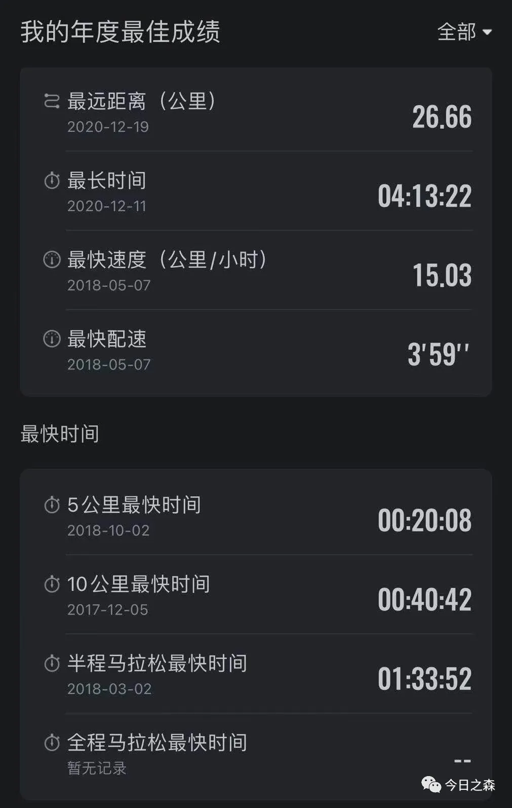

跑步和其他运动一样，是检验身体机能状态良好与否的一种方式。我不善于长跑，但总有进行长跑的冲动。
记得我进行的第一次长跑应该是初三（或者高三，大概率是高三）毕业的那个暑假，有一天下午四点多，临时决定进行一次长跑，从家里到县城约20公里，我准备跑个来回，也就是40多公里。那个时候对跑步，尤其长跑没有什么过多的认识，对跑步装备也是一无所知，随便穿了身衣服和鞋就出门了，走的时候和老妈说今晚可能回来的晚，我要去跑步，没等老妈回应我就跑了出去，出发之前就想好了不给自己留后路，于是没有带钱，避免跑不动会半路打车（现在想想还挺可怕的）。出发的时候信心满满，大太阳底下沿着公路狂奔，跑到中途盘山公路时，路上没有车，也没有人，时不时几只鸟儿或者野鸡唰的一下窜出来，真是吓人，于是越跑越快，边跑边回头看，总觉得有人在后面跟着我，一路上都是这种心理在作祟，也一路上在和自己谈话，一边奔跑，一边对自己说，大白天哪儿有什么鬼魅，总之一路上就这样反反复复，偶尔看到小卖铺和村庄时就会安心很多。跑了多久我也不记得了，只记得晚上回来的时候已经快九点多了。其实我没有跑到终点，只跑到能看到县城里的楼房的时候就赶紧折返了。
这应该是我人生中第一次长跑，跑完之后休息了好久才缓过来。

再往后过了很久都没有过长跑运动了，2014年上大学后偶尔会去北门后山那里徒步，绕一圈再回到学校。

再后来，就到2017年重返校园之后了。那个时候我真的是谜一般的热爱跑步，而且经常性进行中长跑（十几公里或者二十几公里），那年也创造了长跑过程中全所未有的成绩（图1）。

图1 悦跑圈app跑步数据统计

如图所示，去年一整年和今年上半年几乎没有数据。当然了，以上数据也是不完全统计，因为有时候出去跑步也不带手机。
除了跑步本身，更有趣的就是在中长跑过程中，用时往往都会超过一个小时，这么长一段时间，跑步的时候在想什么呢？
春夏秋三季的跑步过程中我基本上都在唱歌，嗯，没错，跑步的时候唱歌，越唱越来劲，也就跑的越快，也越想跑。不想唱歌的时候还是会选择和自己对话，跑步的时候可以拥有一段难得的独处时光，可以什么也不用想；有时候也与自己对话，跟自己博弈其乐无穷。冬季跑步时，大致就是在不断地克服寒冷中思考一些有的没的。
关于跑步的记忆大致如此。
先写到这里。接下来会写一些如何具体准备长跑运动的经验和想法。