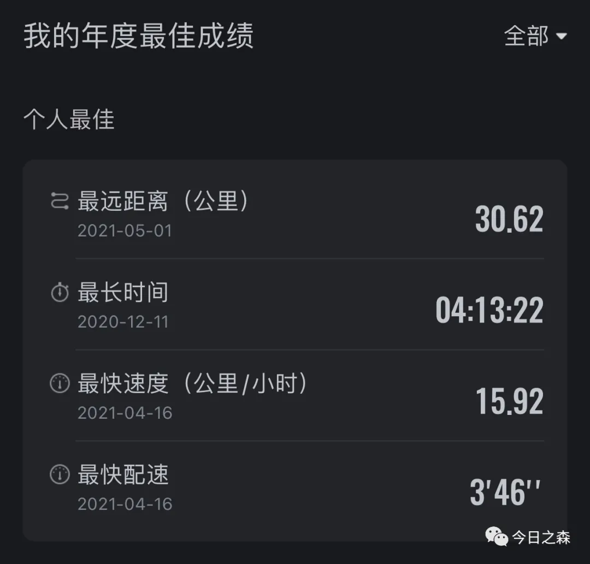

每一次正式跑步（长跑）之前都需要提前一天下定决心。

4月16日，也就是杨马结束后的第五天，我跑出了5km最好成绩，18分52秒，这是我从来不敢想，也没想过的事情，毕竟这一成绩在我还在东北的时候，都不敢想，更没达到过，却没想到在这个四月突破了5km最好成绩，差不多记得上一个5km记录应该还是2018年的，其实很多记录都是2018年创造的，然后很多记录在此后的几年里都没有突破。

我也因为在4月16日打破了个人5公里最快速度，而高兴了至少三天！

下面是5km数据：

由于五一要放假，再加上没有出游计划，于是肯定把跑步安排在第一位。4月30日上午我就开始谋划，原计划要在5月1日上午六点起床，六点半开始跑步，并完成全程马拉松。

但是4月30日晚上因为加班又回去的很晚，于是就在自助售货机买了2瓶水，一包桂花糕，作为第二天跑全马的补给。

很遗憾，5月1日早上起床就七点了，虽然很早，但是如果要跑全马，显然已经起迟了。因为上午十点之后天气很热，阳光很烈，就不适合跑步了。

虽然起晚了，但还是赶紧起床，简单收拾收拾就出门吃早饭了。吃完早饭，简单活动活动。

终于在8点整开始跑步。其实早上起床，我又萌生了一个想法，那就是五一节嘛，既然要跑全马，何不跑个51公里。于是在吃早饭了过程中我又下定决心，不仅要跑完全马，还要突破50km长距离跑。

跑步开始，头8公里时最艰难的，8公里之后才慢慢进入跑步状态，后面的十公里就很轻松了，在17公里的时候第一次喝水，跑到19公里的时候，是真的想放弃，因为马上就是完成一个小目标，半程马拉松。所以在19公里之后的一两公里最容易放弃，于是展开思想搏斗，最终还没等我作出决定，已经跑到22公里，出现了第二个好状态，于是又轻轻松松跑了七八公里，快到30km时，手机提示电量低。好吧，出门时100%的电量，跑了30公里就没电了，但是那会儿状态还很好，感觉跑完51公里应该问题不大，所以，过段时间，还是考虑入手一块表，才能在不远的一两个月内再一次下定决心完成50km大关。

下面是五一劳动节30km跑的数据：

51公里最终还是没有完成。但总是有人能够完成。我跑完之后，刚打开小红书，就看到有个哥们儿同样在五一当天上午绕着北京天安门完成了51.51km的壮举。

另外，我想上面很多年前保持的记录，今年夏天应该都能刷新吧！图片

之所以要跑马拉松，其实很大程度上吸引我的点在于，每次都需要说服自己，并且在每次开跑之前和跑步过程中都需要和自己进行谈判。这一过程，其乐无穷。