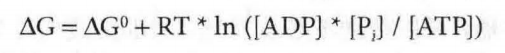
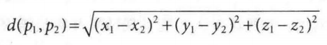

# 森言森语 
>有一个现象蛮有趣，以前在东北的时候，每天都要奔跑，定期还要考核，偶尔5公里跑进21分半的时候，还很沾沾自喜。后来我可以以很快的速度跑完30公里或更远，甚至5公里可以跑进18分30秒的时候，反而觉得平静。

 ## 1 Python shell 
 ##### 案例1 计算ATG水解的△G  
   
 ```python 
 ATP = 3.5 
 ADP = 1.8 
 Pi = 5.0 
 R = 0.00831 
 T = 298 
 deltaGO = -30.5 
 import math 
 print(deltaGO + R * T * math.log(ADP * Pi / ATP)) 
 ``` 
 ##### 案例2 如何计算两点间距离？
  
 ```python 
 from math import * 
 x1 , y1 , z1 = 0.1 , 0.0 , -0.7 
 x2 , y2 , z2 = 0.5 , -1.0 , 2.7 
 dx = x1 - x2 
 dy = y1 - y2 
 dz = z1 - z2 
 dsquare = pow(dx, 2) + pow(dy, 2) + pow(dz , 2) 
 print(sqrt(dsquare)) 
 ``` 
 ## 2 第一个Python程序 
 ##### 案例3 如何计算胰岛素序列中的氨基酸频率 
 
```python 
 # insulin [Homo sapiensl GI:386828 
 # axtracted 51 amino acids of A+B chain 
 insulin = "GlVEQCCTSICSLYQLENYCNFVNQHLCGSHLVEALYLVCGERGFFYTPKT" 
 for amino_acid in "ACDEFGHIKLMNPQRSTVWY":     
     number = insulin.count(amino_acid)   
     print(amino_acid, number) 
``` 

##### 案例4 如何创建随机序列 
```python 
import random 
alphabet = "AGCT" 
sequence = "" 
for i in range(10):     
index = random.randint(0, 3)     
sequence = sequence + alphabet[index] print(sequence) 
``` 

##### 案例5 如何在序列中运行滑动窗口 
```python 
seq = "PRQTEINSEQWENCE"  
for i in range(len(seq)-4):     
print(seq[i:i+5]) 
``` 

通过案例代码来想输出。哈哈。
