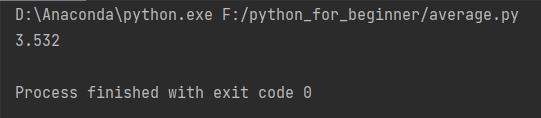
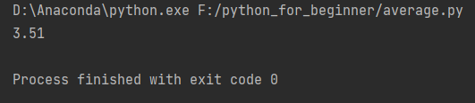
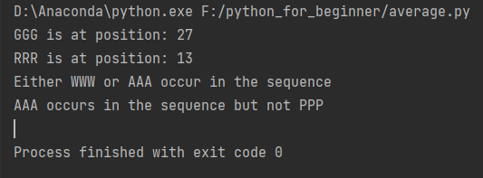
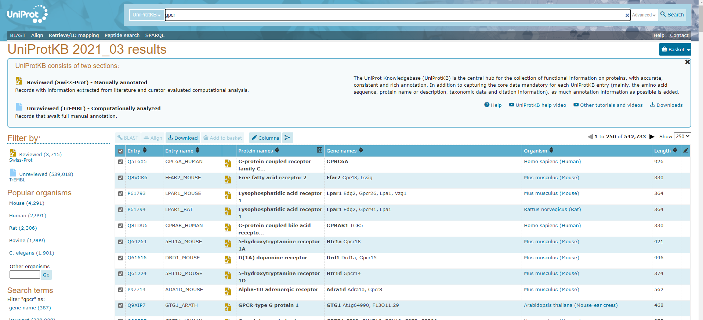
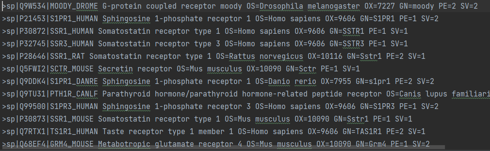
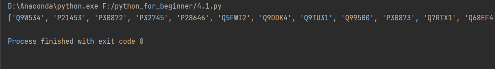
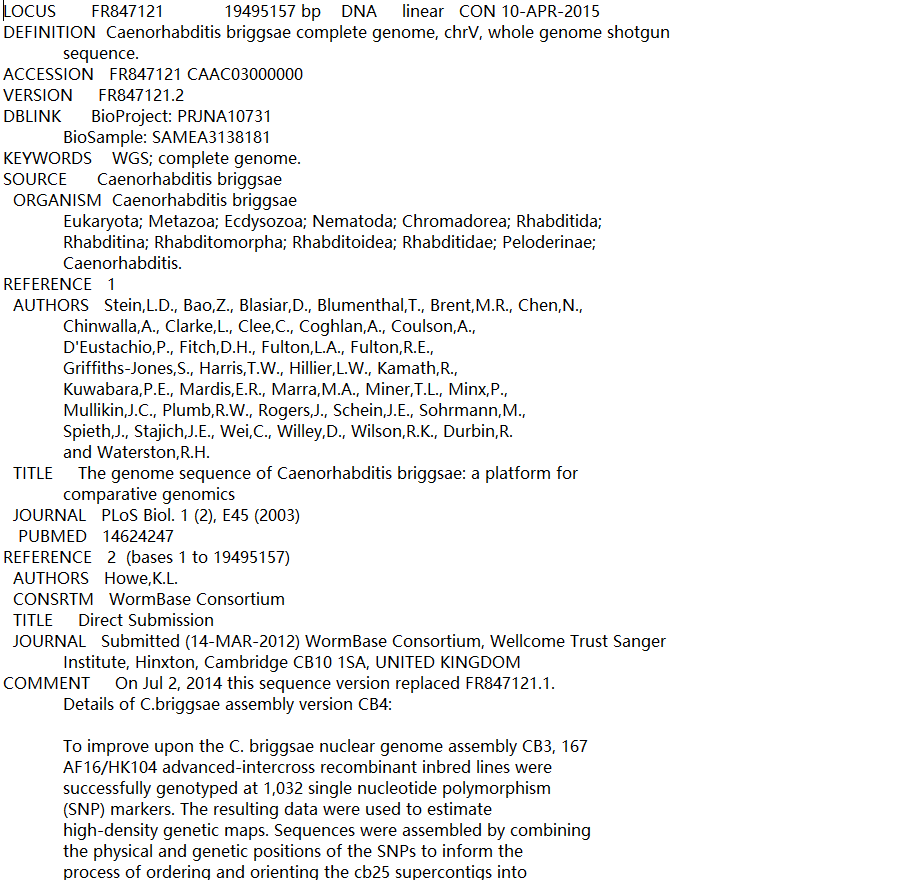
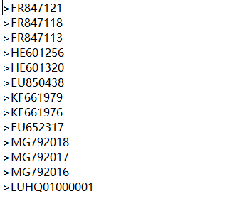
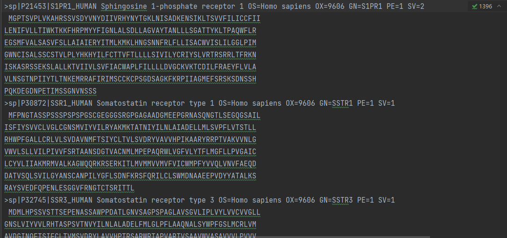

# 森言森语
>Bioinformatics is an interdisciplinary field that develops methods and software tools for understanding biological data. As an interdisciplinary field of science, bioinformatics combines biology, computer science, information engineering, mathematics and statistics to analyze and interpret biological data.
## 3 分析数据列
##### 案例6.1 如何计算平均值
```python
data = [3.53 , 3.47 , 3.51 , 3.72 , 3.43]
average = sum(data) / len(data)
print(average)
```



##### 案例6.2 如何计算标准差
```python
data = [3.53, 3.88, 3.51, 3.72, 3.43]
data.sort()
mid = len(data) % 2
if len(data) % 2 == 0:
    median = (data[mid-1] + data[mid])/2.0今日之森
else:
    median = data[mid]
print(median)
```



## 4 解析数据记录


##### 案例7.2 if/elif/else 语句
```python
sss = "MGSNKSKPKDASQRRRSLEPAENVHGAGGGA \
    FPASQTPSKPASADGHRGPSAAFAPAAAE"今日之森
if 'GGG' in sss and 'RRR'in sss:
    print('GGG is at position:', sss.find('GGG'))
    print('RRR is at position:', sss.find('RRR'))
if 'WWW' in sss or 'AAA' in sss:
    print('Either WWW or AAA occur in the sequence')
if 'AAA' in sss and not 'PPP' in sss:
    print('AAA occurs in the sequence but not PPP')
```



##### 案例8.1 读取FASTA格式序列文件，并只将序列标题写到一个新文件中



```python
fasta_file = open('SwissProt.fasta','r')
out_file = open ('SwissProt.header', "w")
for line in fasta_file:
    if line[0:1] == '>':
        out_file.write(line)
out_file.close()
```

##### 案例8.2 如何从多序列FASTA文件中提取登记码的列表

```python
input_file = open('SwissProt.fasta','r')
ac_list = []
for line in input_file:
    if line[0] == '>':
        fields = line.split ('|')
        ac_list.append(fields[1])
print(ac_list)
```

##### 案例9.1 如何解析Genbank中的序列记录


```python
InputFile = open("genbank.txt")
OutputFile = open("genbank.fasta","w")
flag = 0
for line in InputFile:
    if line[0:9] == "ACCESSION":
        AC = line.split()[1].strip()
        OutputFile.write(">" + AC + "\n")
    elif line[0:6] == "Origin":
        flag = 1
    elif flag == 1:
        fields = line.split()
        if fields != []:
            seq = ' '.join(fields[1:])
            OutputFile.write(seq.upper() + "\n")
InputFile.close()
OutputFile.close()

```


##### 案例9.2 读取FASTA格式的多序列文件，并把Homo sapiens登记记录写入一个新文件
```python
InputFile = open("SwissProt.fasta")
OutputFile = open("SwissProtHuman.fasta","w")
seq = ' '今日之森
for line in InputFile:
    if line[0] == ">" and seq == ' ':
# process the first line of the input file
        header = line
    elif line[0] != ">":
# join the lines with sequence
        seq =seq + line
    elif line[0] =='>' and seq !=' ':
#in subsequent lines starting with '>'
#write the previous header and sequence
#to the output file. Then re-initialize
#the header and seq variables for the next record
今日之森
        if "Homo sapiens" in header:
            OutputFile.write(header + seq)
        seq = ' '
        header = line
#take care of the very last record of the input file
if "Homo sapiens" in header:
    OutputFile.write(header + seq)
OutputFile.close()

```

