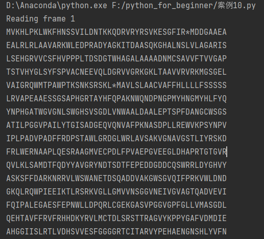
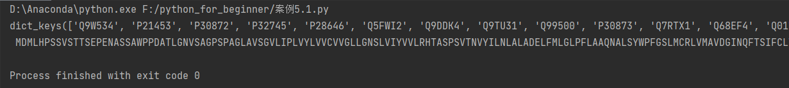
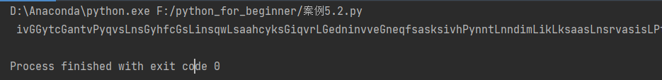
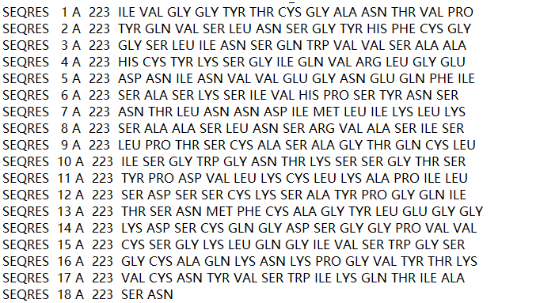
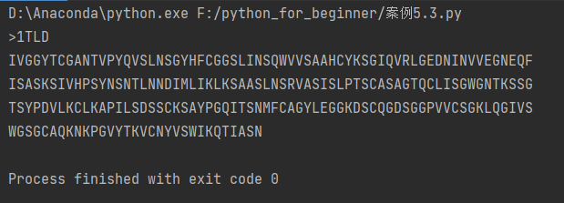

## 森言森语
>

## 5 搜索数据
##### 案例10 将RNA序列翻译为相应的蛋白质序列
```python
# 这是一个字典，键必须是唯一的。否则新的值就会覆盖掉旧值
codon_table = {
    'GCU':'A', 'GCC':'A', 'GCA':'A', 'GCG':'A', 'CGU':'R', 'CGC':'R',
    'CGA':'R', 'CGG':'R', 'AGA':'R', 'AGG':'R', 'UCU':'S', 'UCC':'S',
    'UCA':'S', 'UCG':'S', 'AGU':'S', 'AGC':'S', 'AUU':'I', 'AUC':'I',
    'AUA':'I', 'UUA':'L', 'UUG':'L', 'CUU':'L', 'CUC':'L', 'CUA':'L',
    'CUG':'L', 'GGU':'G', 'GGC':'G', 'GGA':'G', 'GGG':'G', 'GUU':'V',
    'GUC':'V', 'GUA':'V', 'GUG':'V', 'ACU':'T', 'ACC':'T', 'ACA':'T',
    'ACG':'T', 'CCU':'P', 'CCC':'P', 'CCA':'P', 'CCG':'P', 'AAU':'N',
    'AAC':'N', 'GAU':'D', 'GAC':'D', 'UGU':'C', 'UGC':'C', 'CAA':'Q',
    'CAG':'Q', 'GAA':'E', 'GAG':'E', 'CAU':'H', 'CAC':'H', 'AAA':'K',
    'AAG':'K', 'UUU':'F', 'UUC':'F', 'UAU':'Y', 'UAC':'Y', 'AUG':'M',
    'UGG':'W',
    'UAG':'STOP', 'UGA':'STOP', 'UAA':'STOP'
    }
# read the RNA sequence
rna = ''今日之森
for line in open('cds.fasta'):
    if not line.startswith('>'):
        rna = rna + line.strip()
# translate one frame at a time
今日之森
for frame in range(3):
    prot = ''
    print('Reading frame ' + str(frame + 1))
    for i in range(frame, len(rna), 3):
        #搜索codon_table字典
        codon = rna[i:i + 3]
        if codon in codon_table:
            if codon_table[codon] == 'STOP':
                prot = prot + '*'
                今日之森
            else:
                prot = prot + codon_table[codon]
        else:
            # handle too short codons
            prot = prot + '-'
    # format to blocks of 48 columns
    i = 0
为了便于阅读，蛋白质序列按照每行48个符号进行输出
    while i < len(prot):
        print(prot[i:i + 48])
        i = i + 48
```


这里输入的`cds.fasta`文件其实是多个序列，但是翻译后连续输出了。后面再解决。
##### 案例11 如何用FASTA文件填充字典，其中UniProt AC作为键，相应的序列作为值
```python
sequences = {}
ac =' '
seq =' '
今日之森
for line in open("SwissProt.fasta"):
    if line.startswith('>') and seq != ' ':
        sequences[ac] = seq
        seq = ' '
        今日之森
    if line.startswith('>'):
        ac = line.split('|')[1]
    else:
        seq = seq + line.strip()
sequences[ac] = seq
print(sequences.keys())
print(sequences['P32745'])
```


##### 案例12 如何写一个简单的蛋白质无规卷曲的预测程序
>概念：肽链中，具有重要的生物学功用，但相对没有规律性的排布的环或者卷曲结构，称为无规卷曲（Random coil）。无规卷曲是除α-螺旋、β-折叠、β-转角之外的蛋白质常见的二级结构。

这里简单了解到一个新的知识点：
>即无规卷曲的预测思路：
每个氨基酸都有个特定的二级结元件倾向，可以通过大量己知蛋白质结构 （PDB) 级结构元件中各类氨基酸类型出现的频率f，来估计氨基酸的倾向。氨基酸"无序"(即成环)的倾向可用1-f计算。
要得知给定氨基酸是否无序，必须设定一个阔值（如0.3)，然后将所有氨基酸序列的倾向值加起来。

```python
propensities = {
  'N': 0.2299 , 'P': 0.5523, 'Q' :-0.18770, 'A':-0.2615 ,
  'R' :-0.1766,'S': 0.1429 , 'C' : -0.01515 , 'T': 0.0089 ,
  'D': 0.2276 , 'E':-0.2047,'V' : -0.38620 , 'F' :-0.2256 ,
  'W': -0.2434 , 'G': 0.4332 , 'H':-0.00120,'Y':-0.2075 ,
  'I':-0.4222 , 'K' :-0.1001, 'L': 0.33793 , 'M' :-0.2259
  }
threshold = 0.3
input_seq = "IVGGYTCGANTVPYQVSLNSGYHFCGSLINS\
QWLSAAHCYKSGIQVRLGEDNINVVEGNEQFSASKSIVH\
PYNNTLNNDIMLIKLKSAASLNSRVASISLPTSCASAGTQ\
CLISGSGTSYPDVLKCLKAPILSDSSCKSAYPGQI\
TSNMFCAGYLEGGKDSCQGDSGGPVVCSGKLQGIVSWG\
SGCAQKNKPGVYTKVCNYVSWIKQTIASN"
output_seq = " "
今日之森
# Cyc1e over every amino acid in input_seq
for res in input_seq:
    if res in propensities:
        if propensities[res] >= threshold:
            output_seq += res.upper( )
        else:
            output_seq += res.lower()
    else:
        print('unrecognized character:',res)
        break
print(output_seq)
```

##### 案例13 如何从PDB文件中提取氨基酸序列


```python
aa_codes = {
     'ALA':'A', 'CYS':'C', 'ASP':'D', 'GLU':'E',
     'PHE':'F', 'GLY':'G', 'HIS':'H', 'LYS':'K',
     'ILE':'I', 'LEU':'L', 'MET':'M', 'ASN':'N',
     'PRO':'P', 'GLN':'Q', 'ARG':'R', 'SER':'S',
     'THR':'T', 'VAL':'V', 'TYR':'Y', 'TRP':'W'}
seq = ''
今日之森
for line in open("1TLD.pdb"):
    if line[0:6] == "SEQRES":
        columns = line.split()
        for resname in columns[4:]:
            seq = seq + aa_codes[resname]
i = 0
print(">1TLD")
while i < len(seq):
    print (seq[i:i + 64])
    i = i + 64
```


