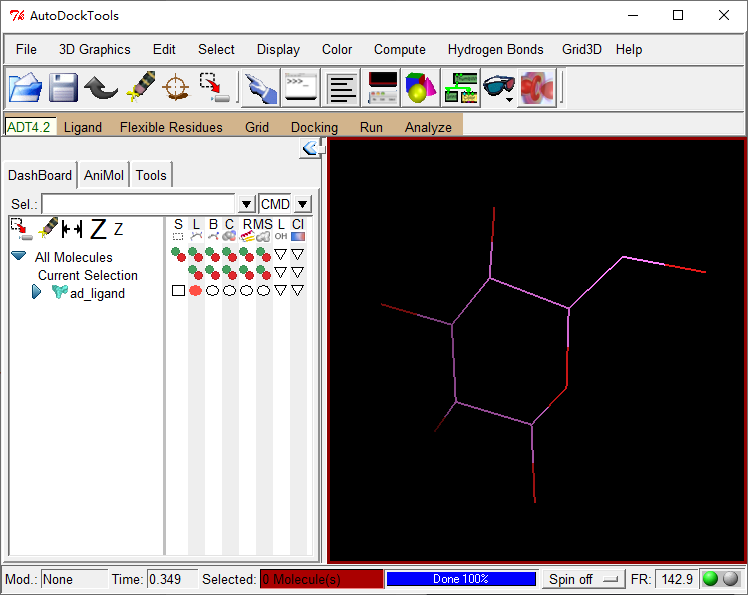
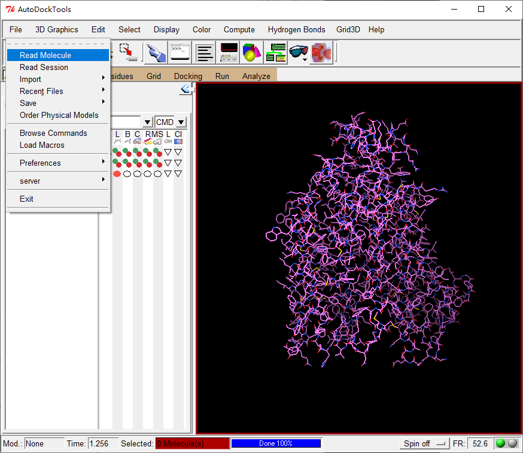

### 叠合两个蛋白质三维结构

##### 蛋白质三级结构的比对

  蛋白质三维结构比对就是对蛋白质三维空间结构的相似性进行比较。

  - 可用于探索蛋白质进化及同源关系
  - 改进序列比对的精度
  - 改进蛋白质结构预测工具
  - 为蛋白质结构分类提供依据
  - 帮助了解蛋白质功能

  结构比对的结果可以用很多种参数来衡量，最常用的是root mean squared deviations（RMSD）。如果两个结构的RMSD为0埃，则结构一致，可以完全重合；一般来说RMSD小于3埃时，认为两个结构相似。

 ###### superpose蛋白结构叠合

  ```
  http://superpose.wishartlab.com/
  ```


 ###### SPDVB叠合
  ```
  https://spdbv.vital-it.ch/
  ```

  载入需要叠合的两个蛋白质PDB文件。

 


  自动叠合


  也可以选择性叠合


##### ## 蛋白质表面的分子性质

- 表面形状
- 表面电荷分布
- 表面残基可溶性

首先需要下载VMD插件-APBS，下载后放入VMD安装目录。

- 读取需要分析的蛋白质PDB文件jinrizhisen.PDB


- 为jinrizhisen.PDB创建psf文件，psf文件是另一种存储蛋白质结构信息的文件，


可以看到生成了以下文件


到这里，准备工作结束，下面开始做电荷分布

此时需要关闭VMD再重新打开，依次载入刚创建的jinrizhisen_autopsf.pdb文件和jinrizhisen_autopsf.psf文件。


run结束后产生了一个文件夹


删除原来的分子，需要重新依次载入四个文件夹，分别为jinrizhisen_autopsf.pdb，jinrizhisen_autopsf.psf，jinrizhisen_autopsf.pqr，pot.dx


上图中蓝色代表正电荷，红色代表负电荷。白色不带电荷。

换个姿势


同样的方法也可以做残基可溶性分布图

谁能猜到这个蛋白是哪一类型的蛋白呢？或者具有哪些特别的结构和功能？

## 蛋白质四级结构的获取
- 数据库获取
```
https://dip.doe-mbi.ucla.edu/dip/Main.cgi
https://thebiogrid.org/
https://string-db.org/
```
- 分子对接（docking）     
两种蛋白质-蛋白质分子对接
- Rigid Docking
- Flexible Docking

ZDOCK：全能在线对接工具
```
https://zdock.umassmed.edu/
```


半天打不开……
分析一下
```
https://www.ebi.ac.uk/msd-srv/prot_int/cgi-bin/piserver
```
由于没有上一步结果，这里也就先不分析了。     
蛋白质-小分子对接
```
#需要安装python2.5环境，所有安装路径不能出现中文
#然后安装autodock
http://autodock.scripps.edu/
#再安装myltools
http://mgltools.scripps.edu/downloads
```
所有软件安装完毕后打开autodocktools

首先加工处理小分子ad_ligand.pdb


给小分子加H原子


给小分子加电荷


加工完成后指定为要对接的ligand


自动确定扭矩中心


确定对接过程中键的旋转与否，绿色为可旋转。


加工完成，将加工结果保存为pdbqt文件。


接下来处理蛋白质分子
先把刚才载入的小分子删除


载入蛋白质分子


然后和处理小分子的过程一样，加H，加电荷


蛋白质处理完成后，将其指定为要对接的蛋白质


指定完成后，自动保存为pdbqt文件
载入要涉及到的原子


指定盒子的范围


设定完成后保存


保存目前的设置


下面运行autogrid,为蛋白质分子创建map
```
autogrid4 -p test.gpf -l test.glg

autogrid4: Successful Completion.
```
运行完成后产生了一系列map文件


下面设置docking的参数文件，选定蛋白质和小分子


选择docking算法


输出docking参数文件


开始docking
```
E:\Autodocktest>autodock4 -p test.dpf -l test.dlg

________________________________________________________________________________

autodock4: Successful Completion on "DESKTOP-H3AAFU3"

________________________________________________________________________________
```
这就是最终的输出结果文件


下面将结果显示出来，首先同样删除之前载入的所有文件


再打开蛋白质文件


现在小分子的位置是docking之前的位置

看看docking之后的位置


看一下前50个对接结果


下面看一下排名第一的对接结果的具体情况


可以看到小分子与蛋白质上的哪些氨基酸产生作用，并列出了产生氢键的位置
保存排名第一的对接状态
删除除了小分子之外的全部分子


然后保存


看一下rank1.pdb


将其内容拷贝至ad.protein.pdb,保存为result.pdb    
此时result.pdb就是既包含蛋白质也包含小分子的复合体结构     
然后就可以用VMD打开result.pdb进行可视化     


## 分子对接（docking）：虚拟筛选Virtual screening（VS）

>虚拟筛选(virtual screening，VS)也称计算机筛选，即在进行生物活性筛选之前，利用计算机上的分子对接软件模拟目标靶点与候选药物之间的相互作用，计算两者之间的亲和力大小，以降低实际筛选化合物数目，同时提高先导化合物发现效率。
化合物小分子库ZINC
```
https://zinc.docking.org/
```
```
http://vina.scripps.edu/tutorial.html
```
## 分子对接（docking）：反向对接
靶标数据库
```
http://bioinfo-pharma.u-strasbg.fr/scPDB/
```
## 分子动力学模拟（molecular dynamic simulation）
涉及软件：NAMD，CHARMM，DESMOND，GAUSS等
```
https://www.ks.uiuc.edu/Gallery/Movies/ChannelProteins/
```

Water Channels in Cell Membranes

How Bacteria Makes a Tail

Electrical Current through a Bacterial Toxin

注：整理自山东大学《生物信息学》  