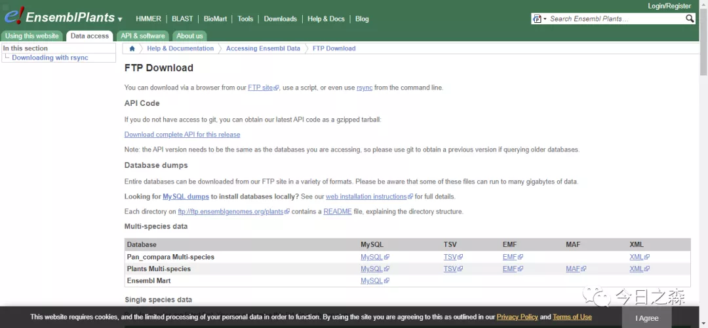

【除夕当天】

平日里也不知道忙的啥，总是疏于和朋友们联络。

今年是牛年，可以牛气冲天。

吃过年夜饭，趁着过年的喜庆日子，和朋友们联系联系，挺好的。

有的朋友从不联系，有的朋友久不联系，有的朋友偶有联系。

不管怎样，过年的日子就总有理由可以联系联系。

晚上六点多吃过饭看了会儿春晚就和朋友们陆续开始联络起来，主要是和平日里很少联系的朋友们联络。简单聊了一会儿就开始和去年相识的几个小朋友吃鸡了，打游戏还是好玩的，到了晚上十二点，与兄弟三人去了家门口庙里烧香，家里人说是讨个来年吉祥，往年去庙里磕头还能有个期许，今年就比较简单了，磕完头就完事儿了，心里也没想啥有的没的。烧完香回来也睡不着，那就简单写点东西。

祝愿朋友们来年牛气冲天，事事顺顺利利。

【废话当头】

之前说过，我一直在想一些关于基因家族分析的事情。今天开始就写一个基因家族分析的专题，一方面是想把一些简单的事情分享给朋友们，有问题的地方或许还可以得到朋友们的指导和批评，另一方面也是把自己学到的东西整理一下，以备将来需要。

由于自己学习的局限，有错误的地方大家需要自行斟酌，当然最好可以给我指出来。

【前言】

关于基因家族分析的概念和内容，想必大家很轻松就可以查到，这里就不再重复，相关的文献更是不胜枚举，总体来看，文献中关于基因家族分析的常规套路是很容易重复出来的，思路也会很简单。但是有一件事情必须清楚，简单的做一些基因家族分析并不能发很好的文章，当然也最好不要为了发文章而学基因家族分析。要不然很容易误入歧途而不能自拔，因为按照常规套路做基因家族分析太过简单，水水文章也很轻松，但是这样，很多时候也就背离了初心。因此，我更倾向于将基因家族分析理解为科研入门过程中对基因序列所包含的信息进行较为深入的认识，可以对自己所研究的相关内容起到很好的辅助作用。

【进入主题——基因家族成员的确定】
基因家族成员的确定是进行分析的第一步，也是最为关键的一步。由于我是研究作物的，所以后面的介绍都以植物为主进行。

首先需要明确，对于想要研究的基因家族是否已有主要的保守结构域的隐马尔可夫（HMM）模型，若有，则直接从Pfam网站下载相关模型，然后使用模型文件去目标物种基因组（蛋白）中搜索即可；若无，则需要从文献中整理可靠的基因家族序列，以这些序列构建HMM模型，然后同上；若文献中不好找，或者找不到，那就请使用NCBI中Protein数据库搜索相似的序列，以这些序列构建HMM模型，然后同上。

整体的鉴定思路或许可以参考下面的建议：

首先使用文献中已发表序列集合作为种子序列，使用本地blastp比对到目标序列。然后再使用基因家族结构域HMM模型文件去hmmsearch第一步的结果。最后去除重复序列。

大致思路如上，至于上述提及的一些有疑惑的地方会在后面的介绍中提到。

【实际操作】

1、首先，不管目标基因到底是个什么情况，先不管，我们首先将目标物种的相关基因组数据和注释文件下载下来，推荐使用EnsemblPlants数据库http://plants.ensembl.org/info/data/ftp/index.html

选择这个网站，一是因为大多数植物数据都有，二是因为注释文件比较友好，三是因为网页容易打开，下载速度较快（推荐IDM下载神器进行下载）。

比如拟南芥（Arabidopsis thaliana ），可以将DNA，cDNA，CDS，Protein sequence，Gene sets（GTF&GFF3）这几个文件都下载下来，以后会用到。其他的文件大家就自行探索吧。下载好之后在后续分析过程中直接使用就好，不建议进行手动修改，尤其不建议对注释文件（GTF，GFF3）进行修改。

2、在Pfam网站https://pfam.xfam.org/下载隐马尔可夫模型，

比如先随便以WD40这个结构域为例，可以看到HMM information中可以下载该结构域的HMM模型。
3、以下载好的HMM模型向目标物种基因组序列（蛋白）搜索，以得到大致的基因家族成员。
这一步需要用到hmmer程序http://hmmer.org/下的子程序hmmsearch。

先写到这里，睡觉，晚安。