直奔主题
基因家族分析（1）——基因家族成员的确定①简单介绍了一下分析策略和数据下载。
今天就随便找一篇文章，通过实践操作来快速重复出文章的主要结果。

那就以下面这篇文章为例，事先没有看，直接进行分析。
Genome-wide analysis of the potato Hsp20 gene family: identification, genomic organization and expression profiles in response to heat stress.DOI: 10.1186/s12864-018-4443-1
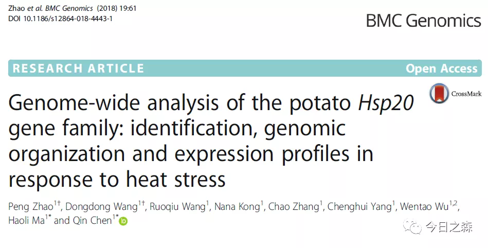
第一步：由于是对马铃薯Hsp20基因家族进行鉴定和分析，所以，首先需要下载马铃薯基因组的相关数据，下载方法在基因家族分析（1）——基因家族成员的确定①中已经提及。
进入EnsemblPlants数据库http://plants.ensembl.org/info/data/ftp/index.html搜索Solanum tuberosum，下载这几项即可。
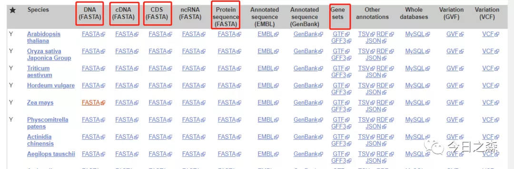
因为之前下载过，就不重复下载了，就是下面的四个文件。
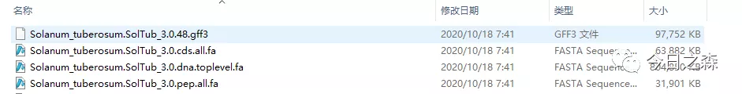
第二步：从Pfam网站https://pfam.xfam.org/下载Hsp20的隐马尔可夫模型。
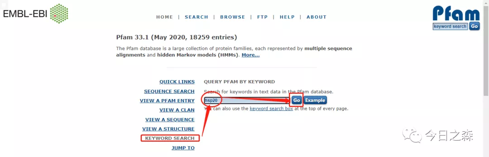
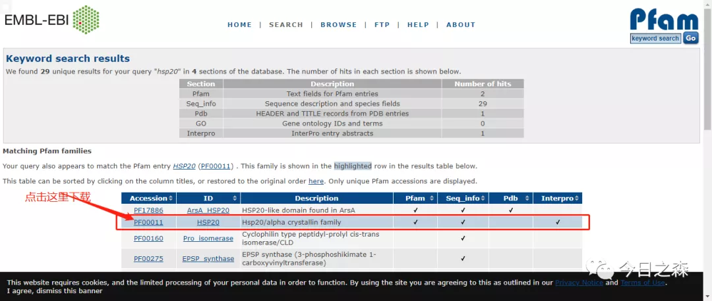
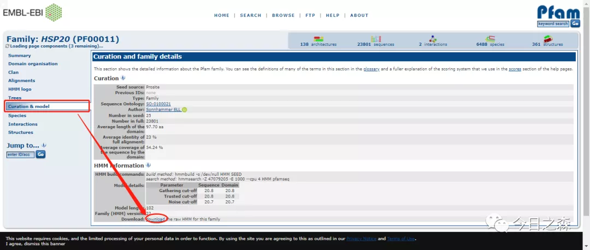

ps.感兴趣的可以用记事本打开这个Hsp20.hmm看看。
第三步：即用下载好的hmm模型作为query，来搜索马铃薯蛋白序列数据。在这里就需要用到hmmer子程序hmmsearch。
（具体安装这里先不写，感兴趣的可以自行解决，很简单，稍微百度就可以，和一般的程序安装差不多。但其实很多大佬早就把基于命令行的操作打包在便于Windows下操作的软件中了，这里不得不提CJ大神开发的Tbtools，但是我没有用过这个软件里面的hmmsearch功能，但由于Tbtools的操作过于简单，就不进行操作了，感兴趣可自行操作。另外还有SPDE，也是一位大佬一直打磨的软件，应该也有很多功能，但是我从来没用过任何相关功能，感兴趣的都可以去搜一下。）
3.1 先使用基于ubuntu/Linus环境，在Windows中操作，由于还要安装ubuntu等，我也忘记怎么安装了，所以感兴趣的自己琢磨安装即可，很简单。
由于我安装过，界面如下：
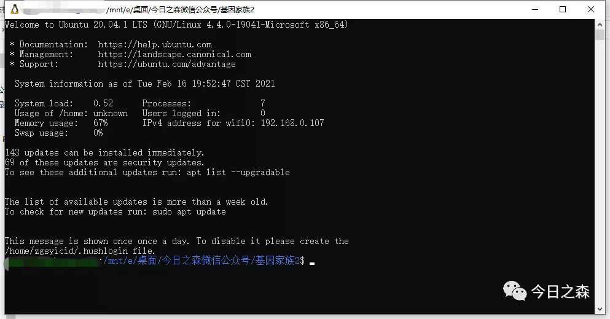
然后运行以下命令行即可。
hmmsearch HSP20.hmm Solanum_tuberosum.SolTub_3.0.pep.all.fa > St_hmmsearch_hsp20.out
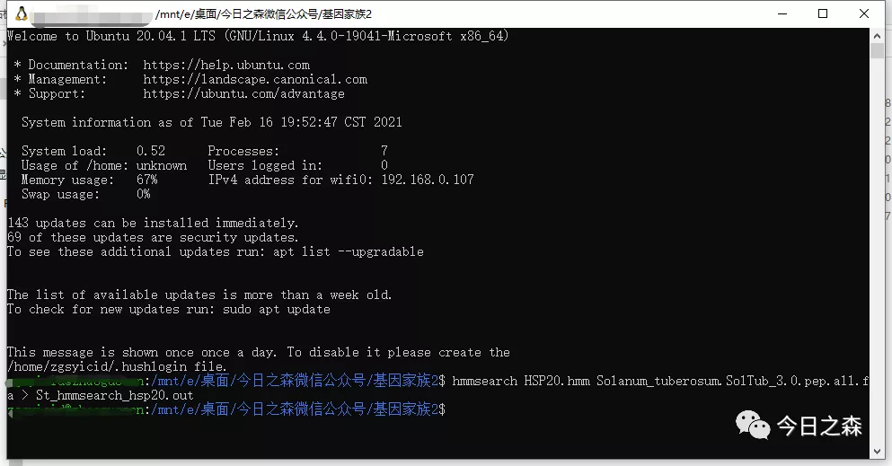
很简单，输入代码之后回车即可。没错，一行命令即可完成搜索，由于命令行过于简单，简单解释一下，hmmsearch：使用hmm模型搜索；HSP20.hmm：刚才下载的模型文件；Solanum_tuberosum.SolTub_3.0.pep.all.fa：马铃薯蛋白序列文件；St_hmmsearch_hsp20.out为输出结果文件，可以自行命名，以.out结尾。
运行结束后，即可生成St_hmmsearch_hsp20.out文件。如下：
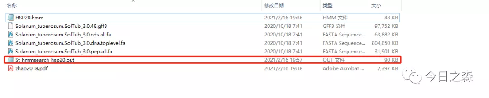
将该文件用记事本打开（由于这个文件很小，记事本可以轻松打开，但由于记事本太不友好，因此，这里推荐使用Notepad软件（安装很容易，搜索下载并安装即可）打开文本文档）。打开后如下：
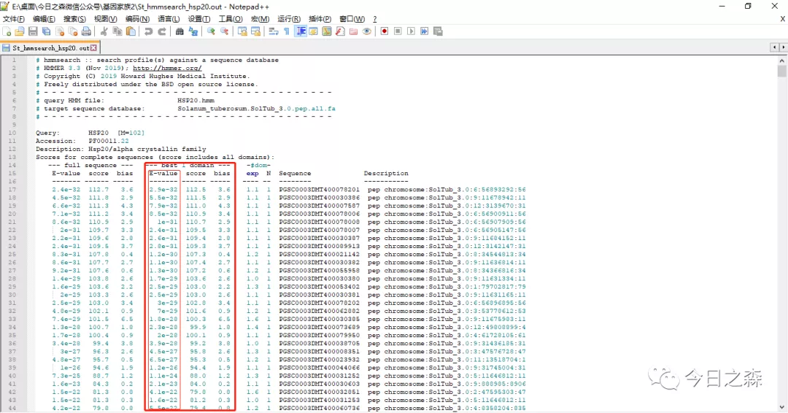
这里展示了几列信息，很好辨识，左边三列是全序列比对结果（按score从高到低排序），红框中的三列是hmm模型结构域最佳匹配结果（排序同上）。
这里我们主要以红色框中的搜索结果为准，由于搜索到的序列较少，故不以e值限制（一般以10-5进行限制），即将搜索到的结果全部保留。
第四步：文章中还通过拟南芥hsp20基因作为query进行本地blastp马铃薯蛋白序列。通过查看文章附件发现，附件一包含拟南芥hsp20基因家族的ID信息。
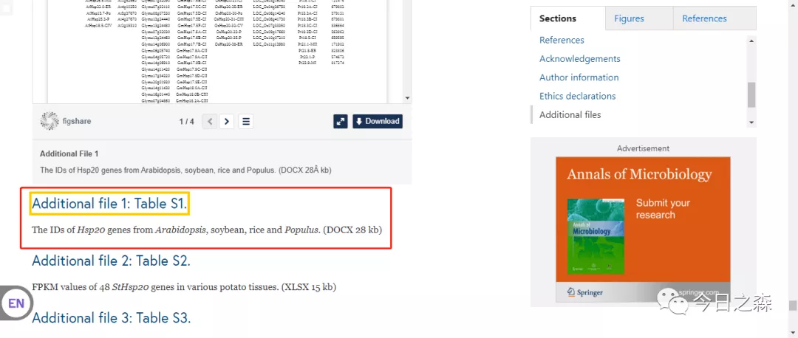
下载后打开附件
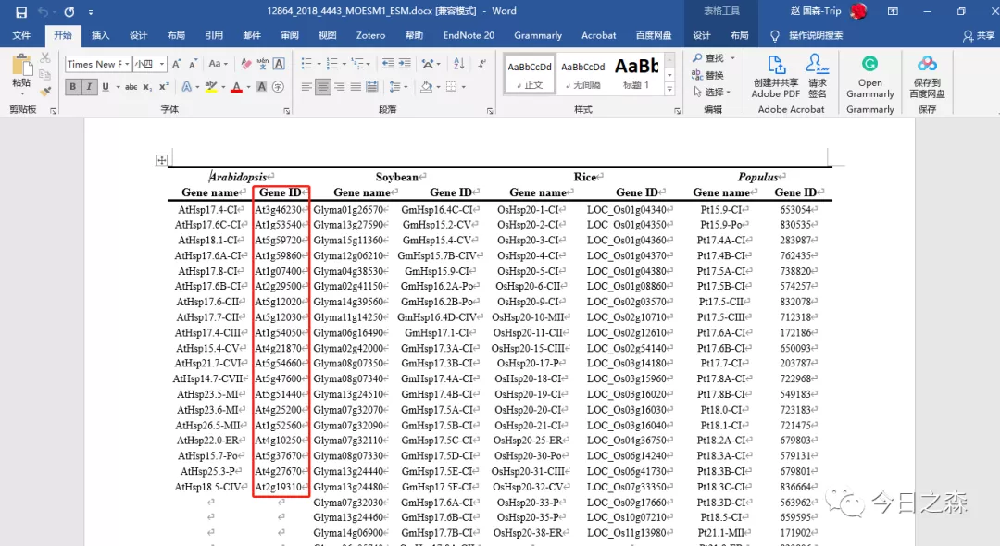
红色方框中即为我们需要的信息。得到了拟南芥hsp20基因ID，接下来肯定要获取拟南芥hsp20基因家族成员的蛋白序列，这里就不得不提Cj博士的Tbtools软件了。

操作之前需要说明，由于同一基因在基因组数据库中会有多个转录本，例如经常见到的基因A.1    A.2    A.3，其实这三个不同的转录本是同一个基因，所以习惯上经常取最长的一个转录本作为该基因的代表。都说清楚了，就请大家阅读Cj博士的文章TBtools: An Integrative Toolkit Developed for Interactive Analyses of Big Biological Data，了解tbtools，并下载安装该软件。
马铃薯基因组似乎每个基因都只保留了一个转录本，所以就不需要取最长序列作为代表。直接进行操作。
4.1打开tbtools，获取拟南芥每个基因的最长转录本。（当然，刚才下载马铃薯基因组信息的时候，也要下载拟南芥的基因组信息）
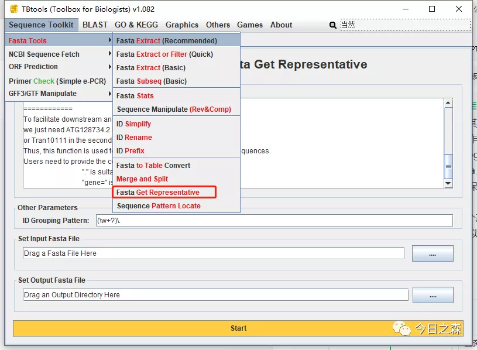
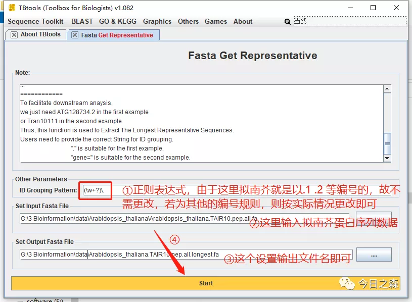
start后即可生成以最长转录本为代表的拟南芥蛋白序列数据。

接下来获取拟南芥hsp20基因蛋白序列（At_hsp20）
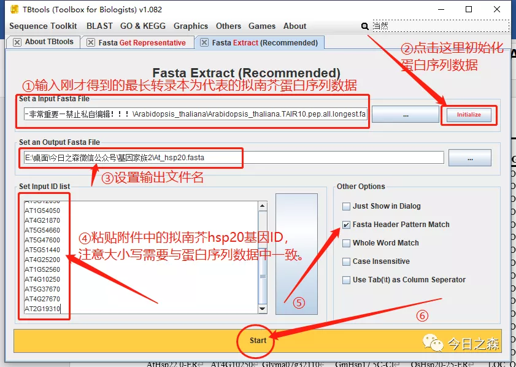
start之后得到At_hsp20.fasta文件，即为获取到的蛋白序列。
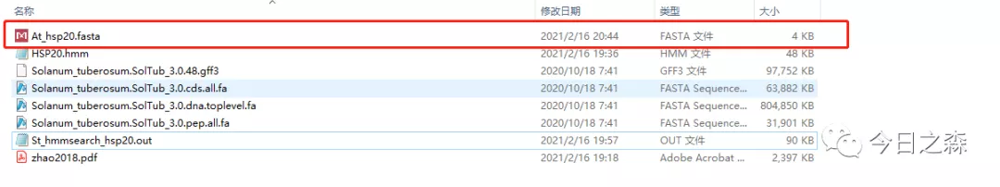
记事本打开后如下：
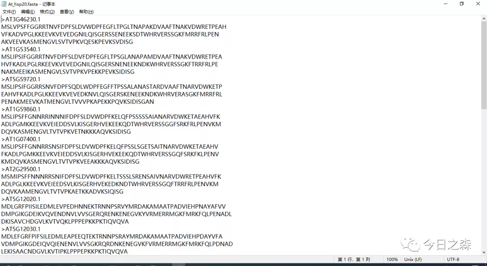

4.2 本地blastp，这里需要下载本地blast软件。看起来需要安装的软件还蛮多的，那就这里也先不提软件安装了，等有机会统一写一下全部软件的安装。
首先，输入如下代码，先建立马铃薯蛋白数据库。
makeblastdb -in Solanum_tuberosum.SolTub_3.0.pep.all.fa -dbtype prot -out ref
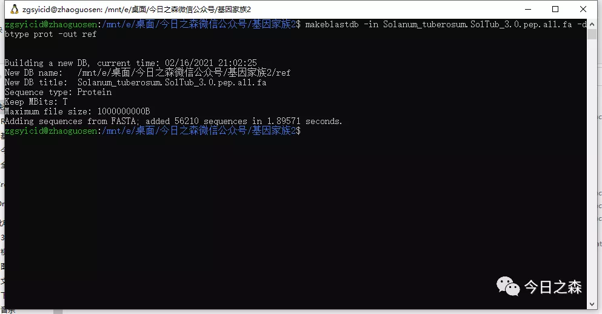
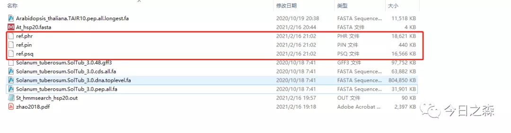
出现这三个文件即表示建库成功。
然后进行本地blastp，输入如下代码：
blastp -query At_hsp20.fasta -db ref -evalue 1e-5 -num_threads 4 -max_target_seqs 5 -out blast_hsp20.txt -outfmt 6
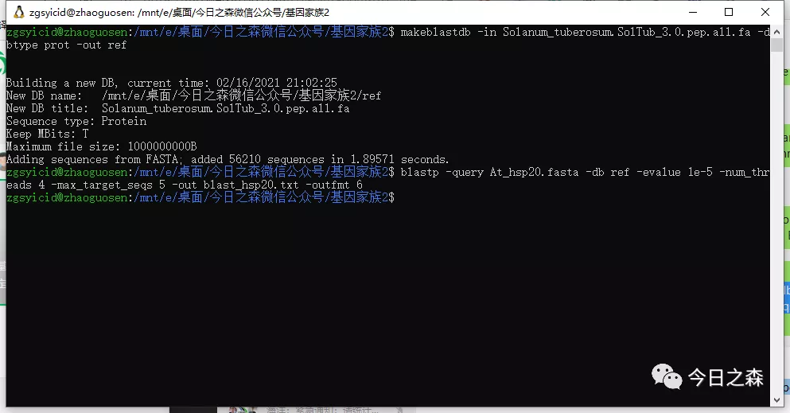
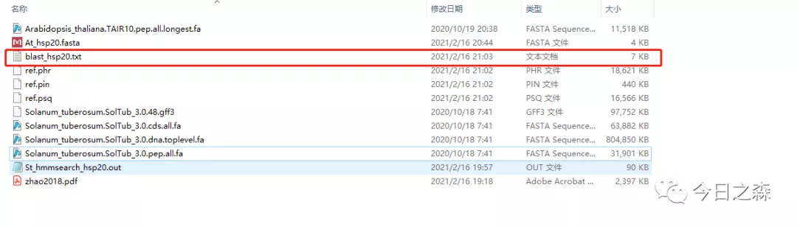
输出文件即为比对结果。打开后如下：
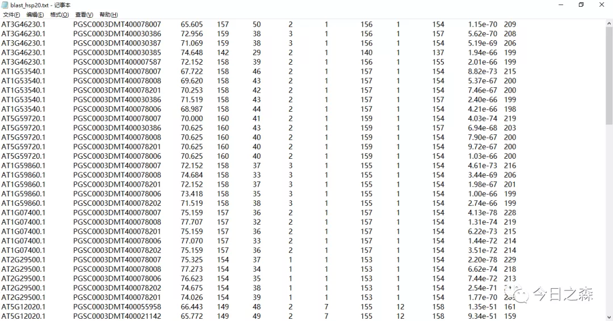
第五步：通过第三步获得了hmmsearch后得到的St_hsp20基因家族成员，通过第四步获得了本地blastp后得到的St_hsp20基因家族成员。接下来，就需要将两种方式获得的基因进行合并，去掉重复值，注意，这里仅仅是去掉重复值，并不意味着去掉重复值后就是马铃薯hsp20基因家族的成员，因为，去掉重复值后还需要进一步研究每个基因所包含的结构域，这就需要明确hsp20基因包含哪些保守domain。
好，先讲两次获得的基因ID进行合并删除重复值。在Excel中操作。
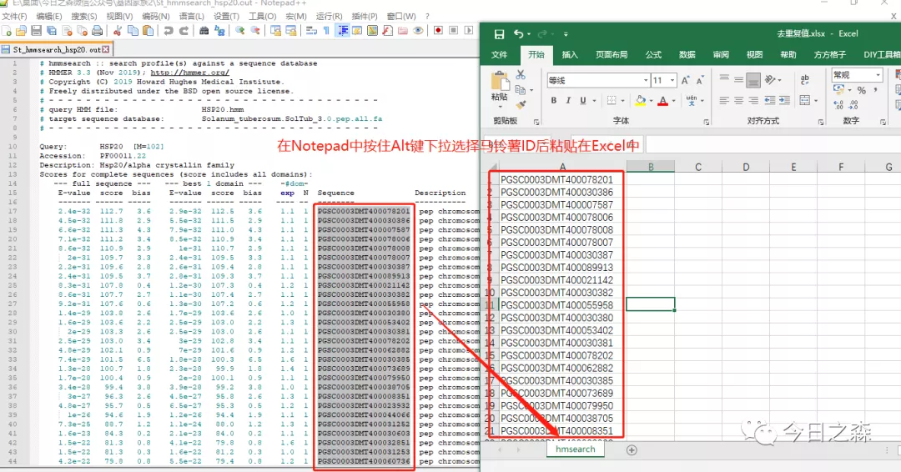
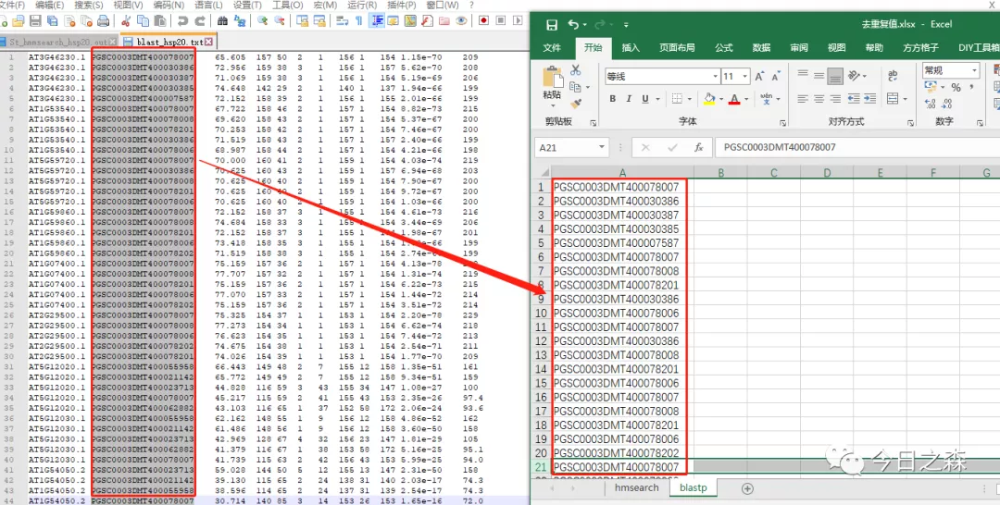
通过合并删除重复值后保留了60个基因，其实仔细看会发现这60个就是hmmsearch搜索的结果，包含了blastp得到的全部结果。这是因为起初没有限定e值得原因，没有关系。
继续分析。
第六步：同样的方式获取这60个基因的蛋白序列。
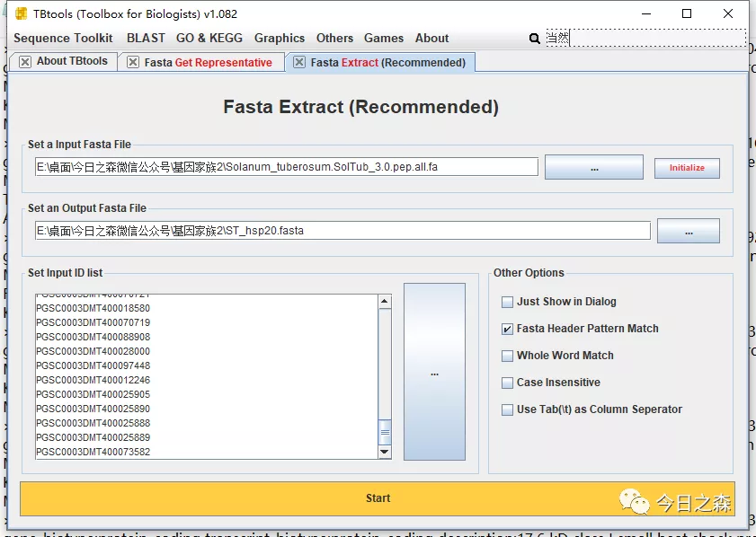
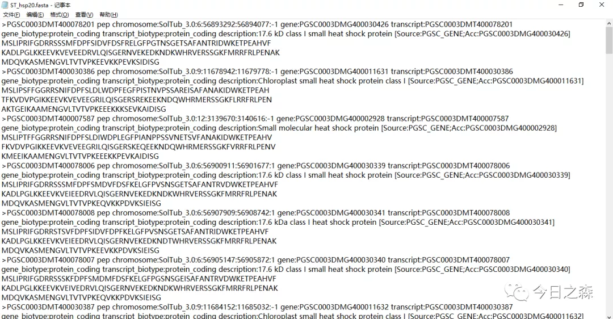
注意看，得到的基因ID后面有很多描述信息，这是我们不需要的，因此还需要借助tbtools进行ID简化。
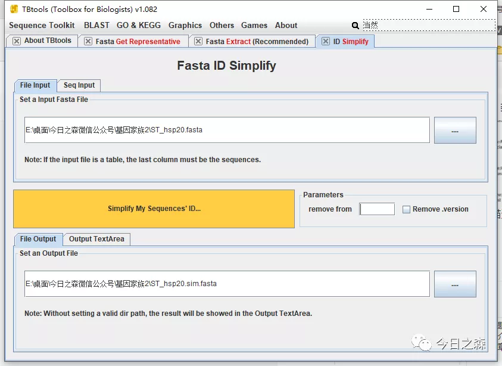
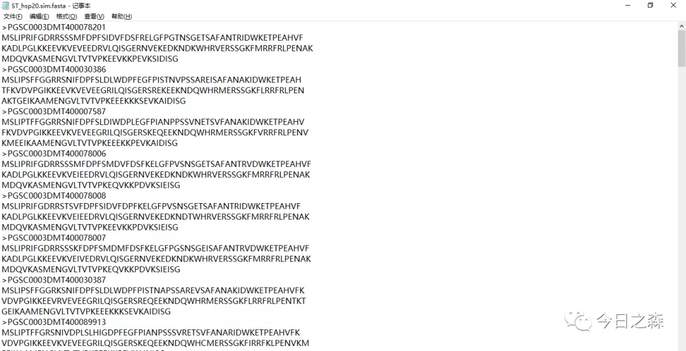
简化后就美好了很多。
但是问题来了，我们确定了60个基因。明显比文章中的48个基因要多，那是因为没有进行结构域和分子量分析。
因此在进行基因家族分析之前很有必要研究一下该基因家族的具体信息。
好，先进行分子量计算，由于hsp20基因分子量在15-42kDa之间，不在区间之内的需要排除。
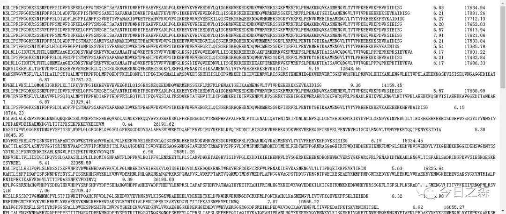
（最右两列一列的等电点，一列是分子量。在excel中简单处理即可排除不在15-42kDa范围内的基因。排除9个，保留51个。通过smart查看结构域发现其中有两个基因不包含hsp20结构域，故最终鉴定该基因家族有49个成员。这段分析可以忽略，由于使用的马铃薯基因组版本和文章中使用的不同，故在鉴定过程中会有差异，其实通过smart结构域查看即可，无需刻意通过分子量进行筛选。详细的分析如果需要可自行探索，由于文章中后续涉及的套路式的分析过于简单，这里不再进行），如果朋友需要了解，可在后台私信。

先写到这里。