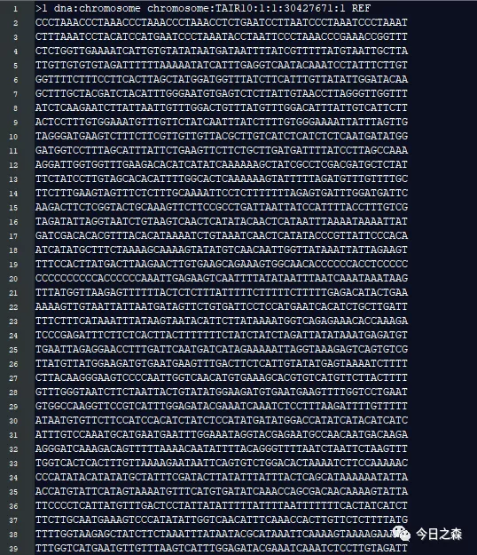
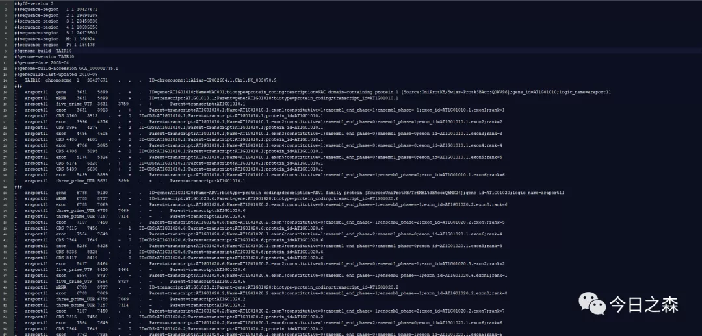

对于大多数研究者而言，基因组文件中需要关注的也就两个文件，基因组文件和注释文件。

比如Arabidopsis thaliana

Arabidopsis_thaliana.TAIR10.48.gff3
Arabidopsis_thaliana.TAIR10.dna.toplevel.fa

但是很多时候可能搞不清楚这些文件到底是怎么组成的，具体包含哪些信息。如果不了解这些，那在使用的时候就会遇到各种各样的问题，遇到问题也不知道从哪里下手解决。

所以，本着要想了解谁，就先打开谁的原则，我们打开看看。

首先打开Arabidopsis_thaliana.TAIR10.dna.toplevel.fa看看。

很简单，就是按照染色体测序结果直接展示了，没什么可说的。

下面再打开基因组注释文件gff看看。

GFF是 general feature format的缩写，是储存基因结构信息的文件格式，主要是用来注释基因组。包含染色体，基因，转录本的信息。

由上图可见，gff文件由tab键分隔的9列信息组成。

GFF文件是由tab键分割的9列组成，这九列的内容分别是：

第一列：chr id，一般为基因所在chr的编号；
第二列：source，注释的来源，一般为数据库或者注释的机构，如果未知，则用点“.”代替；
第三列：type，注释信息的类型，比如Gene、CDS、mRNA、five_prime_UTR、three_prime_UTR、exon等；
第四列：start position，该基因或转录本在参考序列上的起始位置；
第五列：end position，该基因或转录本在参考序列上的终止位置；
第六列：score，表示该行feature的分数，比如序列相似性等，如果没有对应的分数可以用.代替；
第七列：strand，feature所在链，+表示正链，-表示负链，.表示不确定或者与链无关；
第八列：phase，与蛋白质编码相关，一般是用于CDS，值的范围为0-2，表示编码时阅读框的移动相位；
第九列：attributes。

只要能够对gff3文件有个基本的了解，很多事情就会简单很多，同样，也可以做很多事情。