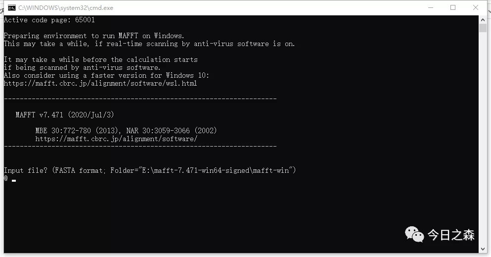

构建进化树过程中，我们常用到MEGA软件集成中的Muscle等进行多序列比对，这针对小数据集（几百条序列以内）的进化树构建或许还是可以的，针对大数据集（几千条序列以上）的进化树构建就不现实了。

由于大多数集成软件在面对大文件时，或多或少会面临运行卡顿，甚至使电脑卡死，或者根本无法运行大文件。

比如Windows自带的记事本根本打不开几十Mb以上的文本文件，我们常用的基因组蛋白数据大都在几Mb至几十Mb，根本无法操作，小麦基因组数据甚至有十几个G那么大。因此针对这些大文本文件再次推荐使用Notepad软件进行操作，毕竟大多数文件我们要能打开并看到具体内容才放心。

MEGA面临的问题也是一样的，我们在进行几百甚至上千条序列比对时，速度之慢对于大多数人来说实在等不及，慢就慢吧，由于实在太慢，很多时候在中途就会导致电脑死机等突发情况，再加上很多时候几千条需要至少需要2天以上的时间，如果遇到突发停电等情况那就无疑是给满心期待，等待比对结果的同学浇了一盆凉水，因为要重新来过。

这时候，就需要多序列比对利器mafft软件了。

mafft软件官网

>https://mafft.cbrc.jp/alignment/software/windows.html

（网站今天好像打不开，后台回复   mafft     即可快速获取）

支持Mac、linux、windows。Mafft软件进行多重序列比对具有速度快，准确性高的优势，序列比对结果可以输出多种格式，包括clastual、fasta、phylip，可用于MEGA、Fasttree等软件构建系统发育进化树。

主要以Windows版本的软件进行操作。

这里使用的版本为mafft-7.471-win64-signed

下面对mafft软件的使用进行说明并操作

mafft软件不需要安装，进入官网下载Windows版本的软件压缩包，解压后双击mafft.bat文件即可使用。

双击后界面如下：

这里需要注意一点：如果下载后想直接在解压目录下使用，则需要将fasta格式的蛋白序列文件也放在该目录下，如下面这样：

但是每次都把待比对的fasta格式的蛋白序列文件往这里放也很麻烦。聪明的你肯定在想，如果能在任何目录下都能随时调用mafft软件就好了。这就需要对mafft软件进行环境配置，配置成功后就可以在任何目录下都能轻松调用mafft软件。

Input file？

需要输入待比对的文件名，这里使用之前的hsp20数据进行操作，输入文件名后按Enter进入下一步。如下图：

output file？

需要输入比对后的输出文件名，以.fasta为后缀，例如这里设置为alignment.fasta。（注：这个输出文件需要提前新建并命名为alignment.fasta后才可以输入）。如下图：

output format？

输出格式，这里选择fasta格式，所以输入3，然后Enter。如下图

Strategy？

算法，选择1会自动选择最优算法，其他的算法在括号中有简单介绍，具体的区别可以查看官网的说明文件。这里我们输入1，然后Enter。如下图：

稍等几秒，出现如下界面则说明比对完成。如下图：

我们这里使用了约80条序列，比对完成用时约5s。

可以看到，刚才新建的空白alignment.fasta已经有了内容。如下图：

打开之后看一下。

接下来就可以用这个比对好的文件alignment.fasta进行建树了。

可以使用MEGA，Fasttree等建树软件进行建树了。

当然，如有需要，可以进一步对比对结果进行修剪。

到这里，相信对于mafft的使用方法有了大致了解，详细信息可以进入官网查看。

问题来了：mafft会用了，可是mafft比对结果的准确度到底如何？

可以参考下面两篇文献深入了解。

Wong KM, Suchard MA, Huelsenbeck JP. Alignment uncertainty and genomic analysis. Science. 2008 Jan 25;319(5862):473-6. doi: 10.1126/science.1151532. PMID: 18218900.

Edgar RC. MUSCLE: multiple sequence alignment with high accuracy and high throughput. Nucleic Acids Res. 2004 Mar 19;32(5):1792-7. doi: 10.1093/nar/gkh340. PMID: 15034147; PMCID: PMC390337.

最后，如果满足这个条件

Important note: This tool can align up to 500 sequences or a maximum file size of 1 MB.

可以使用这个在线mafft

>https://www.ebi.ac.uk/Tools/msa/mafft/