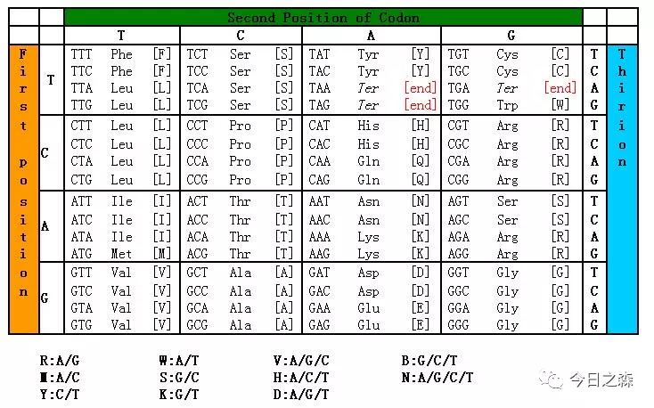

不知道为什么，最近比较喜欢“悬而未决”一词。

去年早些时候就有接触Ka/Ks或dn/ds，也简单查询过这一比值的生物学意义，但一直没有彻底理解和熟悉这一名词。

暂且把这种状态称为“悬而未决”。

好吧，想起来一个单词backlog。释义为积压未办之事。

这两个词或许可以对应起来吧？

我想，对这一概念的了解将对生物学领域的研究者颇为必要。

【进入正题】

在遗传学中，Ka/Ks或者dN/dS表示的是异义替换（Ka）和同义替换（Ks）之间的比例。这个比例可以判断是否有选择压力作用于这个蛋白质编码基因。

不导致氨基酸改变的核苷酸变异我们称为同义突变，反之则称为非同义突变。一般认为，同义突变不受自然选择，而非同义突变则受到自然选择作用。在进化分析中，了解同义突变和非同义突变发生的速率是很有意义的。

Ka=发生非同义替换的SNP数/非同义替换位点数

Ks=发生同义替换的SNP数/同义替换位点数

其中：

非同义替换位点数：会造成氨基酸变化的位点数的总和，比如编码丝氨酸（ser）的第一二位碱基。

同义替换位点数：不会造成氨基酸变化的位点数的总和，比如编码丝氨酸的第三位碱基。

常用的参数有以下几种：

同义突变频率(Ks)、非同义突变频率(Ka)、非同义突变率与同义突变率的比值(Ka/Ks)。

如果Ka/Ks>1，则认为有正选择效应。

如果Ka/Ks=1，则认为存在中性选择。

如果Ka/Ks<1，则认为有纯化选择作用。

但是到这里并没有结束，Ka/Ks还需要我们进一步了解。

【举个例子】

在比对两物种的一对同源基因序列时，大多数时候你会发现，两条DNA序列多少会有些差异。这是什么原因造成的呢？

进化的力量！

但是由于密码子简并性，有的碱基差异会导致翻译出的氨基酸发生改变（非同义突变），有的碱基差异却不会导致氨基酸的改变（同义突变）。

统计出这两条序列之间发生的非同义与同义替换的所有次数，我们就可以观察到序列的变化情况了。接下来就是对数据做些调整了。

但是这里又有几个问题需要我们思考。

疑惑一:

不同碱基之间发生替换的速率的不同，即，转换（嘌呤变嘌呤，嘧啶变嘧啶）发生的概率要高于颠换（嘌呤变嘧啶，嘧啶变嘌呤）发生的概率。当然，很多计算方法都会考虑到这些替换发生概率的不同。

疑惑二：

两个物种分化时间的长短也会影响到Ka/Ks的比值。

比如有一个位点，原来是A，后来变成了T，再后来又变成了C，虽然发生了两次替换，但最后仅有一次替换被用于计算替换率。

再比如有一个位点，原来是A，后来变成T，但同时与它相对应的另一物种中的该序列同一位置也发生了A到T的替换，那么我们也是无法用上面的方法来计算替换率。对于这种复杂的情况，我们可以用最大似然法来计算最可能的替换率。

Ka/Ks和进化的关系是什么？

图片来源：https://pic3.zhimg.com/v2-5f946db3f6acb4ecc46db8fb3c6c23ae_r.jpg?source=172ae18b

一般来讲，因为非同义替换会造成氨基酸变化，可能会改变蛋白质的构象和功能，因此会造成适应性的变化，从而带来自然选择的优势或劣势（一般是劣势）。而非同义替换没有改变蛋白质的组成，因此不受自然选择的影响（忽略密码子偏好性的影响），那么Ks就能反映进化过程的背景碱基替换率。Ka/Ks的比值就能说明这个基因是受到了何种选择。

一般情况下，在某个个体中偶然发生的一个碱基替换（突变），如果没有额外的好处或者坏处的话，慢慢地也就消失了。但是自然选择中会有很多巧合，某些突变就很幸运地被保留了下来，并且被固定了（突变频率由极小变为100%）。

对于一个没有受到自然选择压力的基因来说，我们可以计算得到这样的结果：Ka/Ks=1。但实际情况下，这个比值都是远小于1的：Ks/Ks<<1，因为一般非同义替换带来的都是有害的性状，只有极少数情况下会造成进化上的优势。

先写到这里。