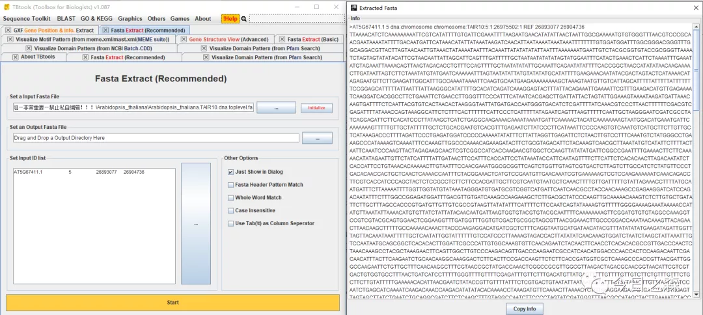

什么？基因注释文件出错？

往下看！

有时候在做进化树+结构域这种组合图时，会发现偶尔有个别基因的结构域与同一基因家族的其他成员相比，会出现“缺胳膊短腿”的情况。

比如下面这种情况：
找了半天也没找到合适的例子，那就采用CJ在推文中用到的GRAS基因家族。由于我没下载菠萝基因组信息，所以就在拟南芥试试看。

花了几分钟，搞出来这个组合图。大致就是下面这个样子。但具体是不是我想要描述的问题，现在还不知道。

接下来试试看。从下图可以看出，AT5G67411.1这个基因的GRAS结构域明显比其他成员要短半截，对应到motif，应该是N端和C端都缺了一段。

那这是由什么原因造成的呢？

（当然，这个现象不是个别，是普遍）

大致就是两个原因：

要么就是注释文件出错了！导致该基因两端缺失。

要么就是它本身就是一个假基因，不应该被列入后续的分析。

下面我们具体看看，到底是注释文件错了还是这个基因本身就是假基因呢？
如果注释文件错了，那我们就需要矫正它！如果本身就是假基因，那就需要舍弃它！

1、简单粗暴从gff文件获取AT5G67411.1的位置信息。

2、提取AT5G67411.1上下游5000bp内的序列。

3、提交序列至softberry网站

http://www.softberry.com/berry.phtml?topic=fgenesh&group=programs&subgroup=gfind

打开这个网站还比较费劲。

结果如下：

我们直接打开PDF报告，可以看到具体的编码情况。

但是仔细看起来还是比较头疼。

4、我们直接把刚才的mRNA序列依次提交到NCBI CDD-search

最终发现，将这段长1179bp的序列提交后，结果如下：

然后我们再把上述序列提交至Pfam。结果一致：

这个结果有什么用呢？其实还是让人有点小惊喜。
仔细看会发现，第一张图中AT5G67411.1的GRAS结构域只有约200aa。而其他成员均在350-370aa。

现在我们已经得到了AT5G67411.1基因的新序列，至少补全了GRAS结构域。所以还是有所改善的。

那么既然得到了新的序列，下一步该怎么办呢？

也许这个结果只是一个坑，如果不是坑，那我们需要矫正注释文件。

那这里如果有坑，会有几个坑呢？

坑一：
刚才我们选取了基因本身的序列及上下游各5000bp，那么刚才预测得到的长1179 bp的基因是在AT5G67411.1基础上向5‘端延伸了几百bp呢？还是只是另外一个基因呢？

坑二：
这里假设1179bp的新序列是在AT5G67411.1基础上向5‘端延伸了几百bp后补全了，那么有没有和其他基因有overlap呢?

带着这些问题，那我们继续。
先不着急对注释文件进行注释。我们先来看看刚才选取的序列有没有overlap。其实这一步在刚提取序列的时候就该考虑，既然刚才没有考虑。那现在就来看看。

果不其然，前后都有overlap。

那怎么办呢？那就不要在上下游取5000了，缩短一点再试试。

那就取刚刚不overlap的区间。AT5G67411.1    26897680    26903865

结果如下：

看到这个结果就放心了。说明刚才我们选取的长度为1179的序列是没问题的。

好，到这里，就算对AT5G67411.1这个基因的GRAS结构域进行了完善。

我们再来比对一下完善之前和完善之后的序列。

可以看到，我们对5'和3'都进行了补充。

到这里，我们的分析就告一段落了。基本可以确定这个基因的注释信息有些问题，那我们发现之后就需要对原始的注释文件进行矫正。

既然写到这里了，那就一气呵成。

下面开始对注释文件进行矫正。

最后只需要将矫正后的注释文件粘贴进原始gff文件即可。

题外话：

说到gff文件，大家都感到陌生。其实到底是什么，我们打开看看就知道了。

比如：

很清楚。应该不需要解释吧。

先写到这里。明天下午应该抽空先跑个半马适应适应。图片

身体和灵魂总要有一个在路上嘛。