早先写过物种内共线性circus——作图步骤，但是有不少朋友还是在后台留言，无法完全重复。我仔细看了之后发现，的确是我在有些细节上写的不够详细。但是不想去完善了。毕竟tbtools的实现逻辑已经很简单了。

那就是IOS，即input，output，start。

最近又有读者在做物种间共线性，其实和物种内也没差。那今天就写一下物种间的共线性circos作图。

这篇推文不只是演示物种间的共线性，而是更进一步让大家体会使用tbtools时需要注意的问题。以便指导大家下次使用tbtools其他功能时能够具备自行解决和筛查可能出现的报错原因。

看到下图即可知道需要准备哪些文件。（这一步不要急着操作，往下看，看完再说）

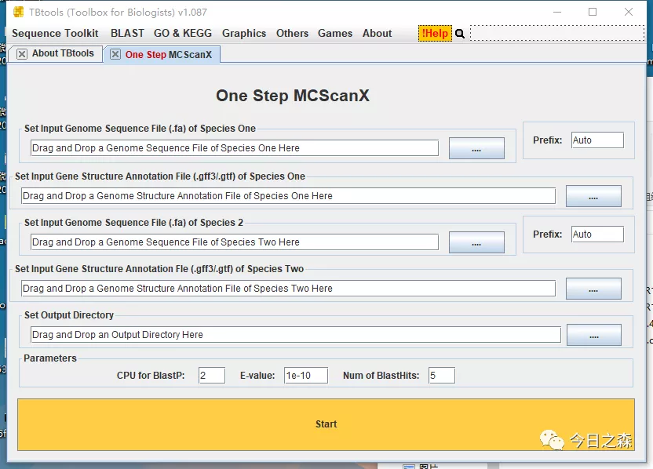

第一步：准备物种1和物种2基因组序列文件和注释文件。

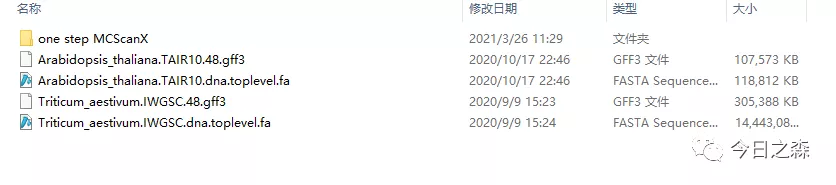

然后打开One Step MCScanX（这一步不要急着操作，往下看，看完再说）

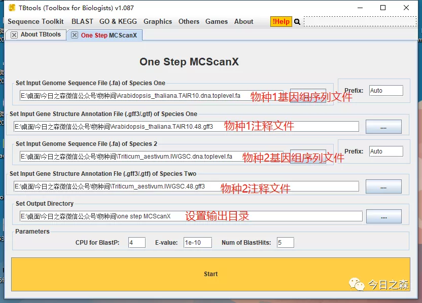

start之后，通常会有黑框弹出。不用管，继续等待。

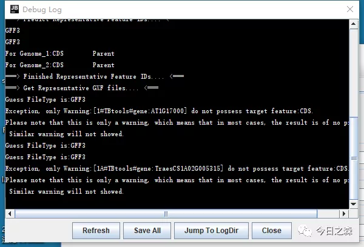

11:37开始运行。

中午电脑在运行，我就去吃饭了。晚上七点多过来一看卡死了。突然想起来早上的上一步出了点小状况。

好，及时纠正。突然想起来有个super fast的插件。打开One Step MCScanX-Super Fast，真的超快，super fast！！！

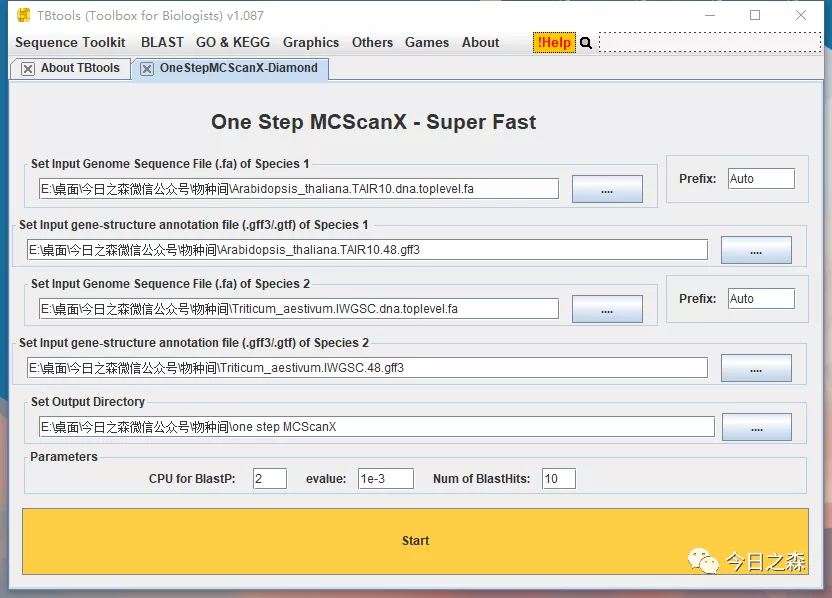

大约等待20min就finished。输出文件如下：

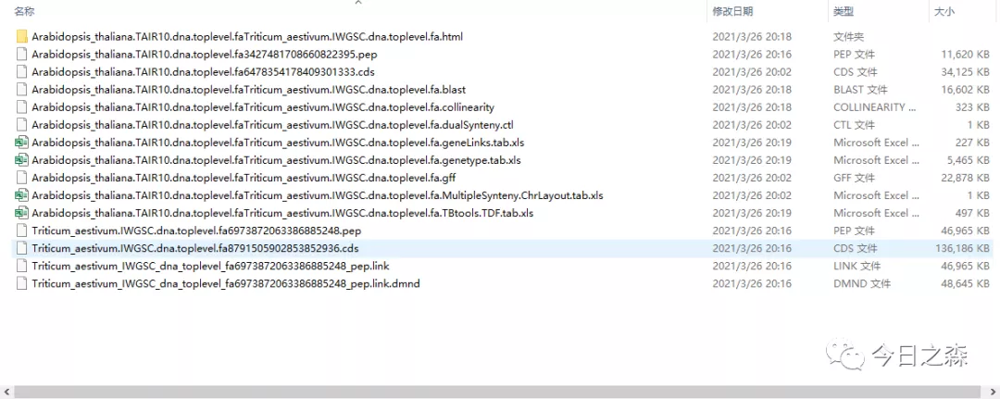

下面出图

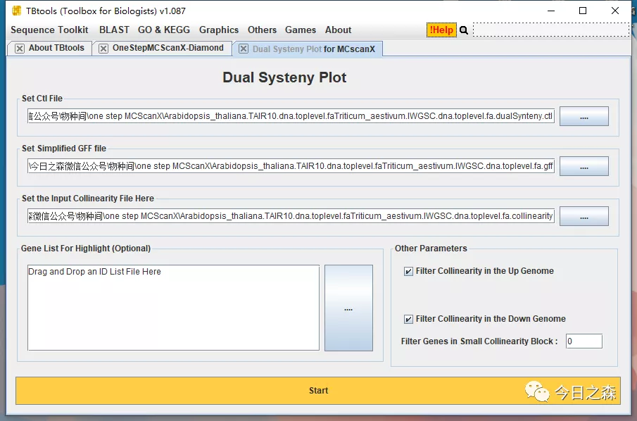

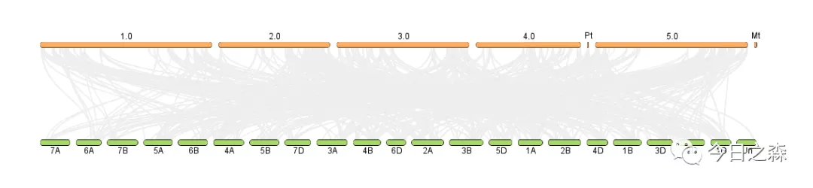

然后，同样需要高亮一些我们需要展示的基因，我这里就从头取20个基因，用以展示。

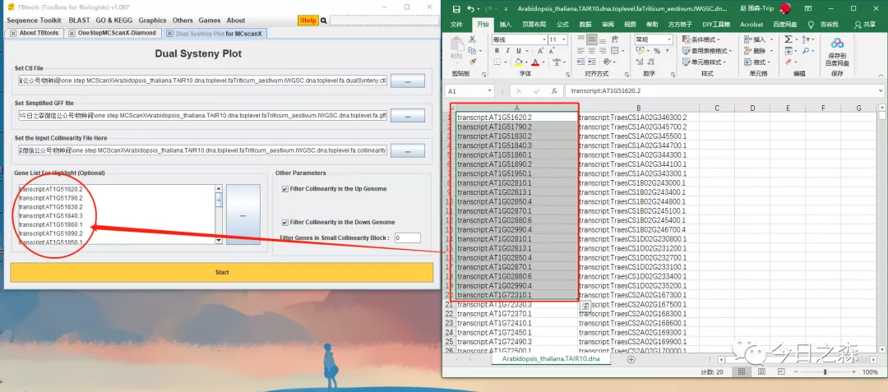

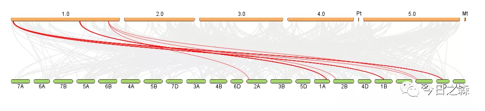

到这里，两物种间的共线性就做好了。

下面我们接着看多物种间的共线性怎么做？

上面对拟南芥和小麦进行了共线性。由于我电脑上之前下载过马铃薯的，而且马铃薯基因组相对小很多。操作起来会快一点，所以我们就对马铃薯和拟南芥进行共线性。

同样。

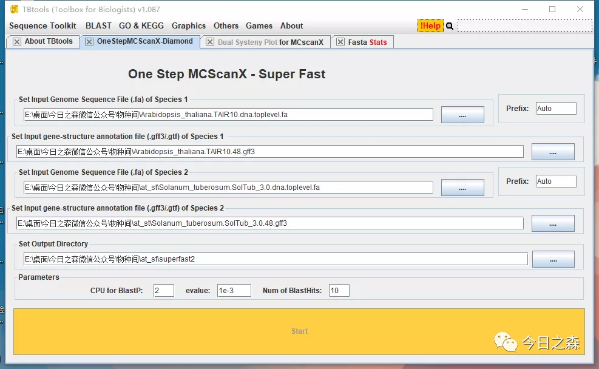

如果弹出黑框，请忽略，基本不影响。

21:22start

21:24finished

输出文件如下：

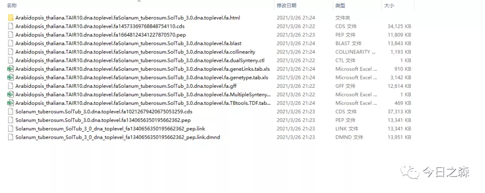

下面我们来作图

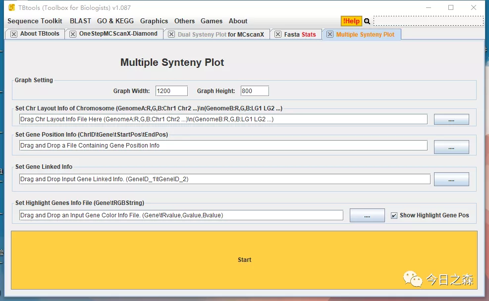

看到这个界面，就知道我们需要准备哪几个文件。

好，那就合并这几个文件。然后出图。

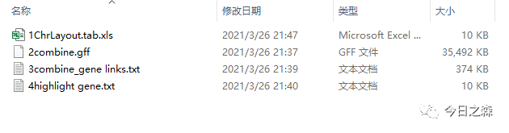

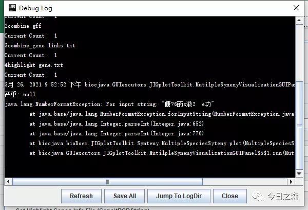

显然，肯定会报错。刚才两两比对的输出文件肯定没有错。那问题出在哪里呢？由于我们在操作之前没有对3个物种的染色体ID进行重命名。由于拟南芥和马铃薯的染色体都是以数字1、2、3……进行命名的，因此在后续分析和作图过程中肯定会报错。

----------------------------强制分割线-------------------------------------

【下面正式进入多物种间共线性】

第一步：数据准备

好，那就重新来过，对染色体ID进行统一。

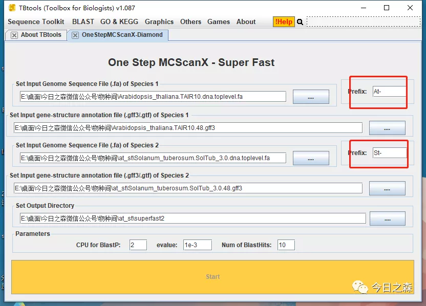

然后准备出图，这里需要对两次各自比对的文件进行合并整理。具体看个人了，这里不进行演示。有需要的后台私信。

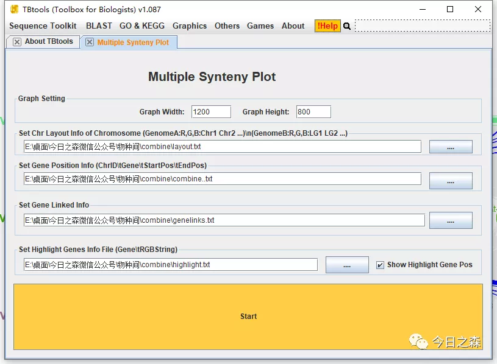

出图如下:（这里只选取了前拟南芥前100个基因进行高亮显示）

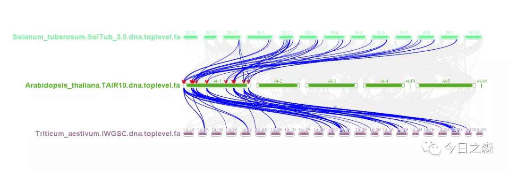

大致就是如此。但仔细一看，除了拟南芥染色体是按顺序排列的，St和Ta的染色体是乱序的。这就需要简单调整一下了。

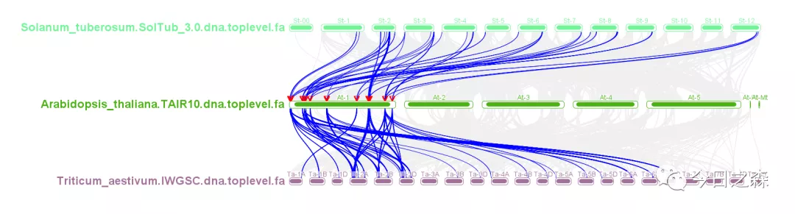

这样看起来就好多了。

当然对于这个图还有很多地方可以调整。

就先写到这里吧。明天该跑步了。图片