iTOL对进化树的编辑与美化

主要有基础的界面化操作和丰富的数据集配置文件操作两种方式。

>https://itol.embl.de/itol.cgi

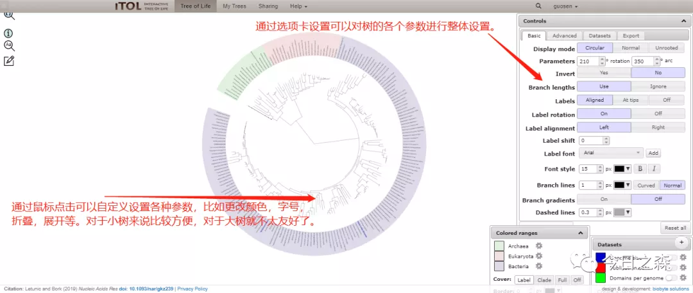

选项卡设置可通过逐一点击进行了解。

iTOL强大之处还是在于利用配置文件对进化树进行编辑和美化。

下面对常用的一些配置文件进行简单介绍。

（以下示例中的数据均不具有实际意义，开心就好）

示例树文件：

>(((((((1:0.06281598,2:0.04539760)0.9880:0.06197648,3:0.08904354)0.9990:0.06862191,(6:0.07605055,(4:0.02818150,5:0.04543031)0.9880:0.05449036)0.9930:0.11391521)0.8880:0.08625101,16:0.46729519)0.4440:0.07542292,(11:0.84431569,19:0.65232673)0.2590:0.08586299)0.0910:0.01612800,(10:0.69475272,17:0.43203045)0.3210:0.05311594)0.1210:0.02363346,(9:0.52881161,(7:0.08673532,8:0.09687740)1.0000:0.32586877)0.8840:0.17660549,((12:0.87437840,18:0.60560145)0.4010:0.05689763,(15:0.74041321,(13:0.26936068,14:0.26382186)1.0000:0.27717881)0.7150:0.10120088)0.3960:0.09858079);

1.标签替换

功能：对原始ID进行重新命名。

替换前标签为原始基因ID，但后续想要重新命名。比如：

>#复制以下代码保存为.txt文件后拖入iTOL即可，但需注意SEPARATOR设置为TAB（制表符）分隔时，DATA下面的ID与新定义名称之间也必须为TAB。
LABELS
SEPARATOR TAB
DATA
#代码说明：原始ID 制表符 新定义名称
1  Agricus bisporus sing.
2  Allium cepa L.
3  Allium chinensis G.Don.
4  Allium fistulosum L. Var.giganteum Makino.
5  Allium sativum L.
6  Allium tuberosum Rottl.ex spr.
7  Amaranthus mangostanus L.
8  Amorphophallus rivieri Durieu 
9  Apium grareolens L.  
10  Arctium lappa L.  
11  Asparagus officinalis L.  
12  Auricularia auricula Underw  
13  Benicasa hispida Cogn.  
14  Beta vulgaris L.var.cicla L. 
15  Beta vulgaris L.var.rapacea W.D.J.Koch 
16  Brassica alboglabra Bailey.  
17  Brassica oleracea L.var.botrylis L. 
18  Brassica chinensis L.  
19  Brassica napus

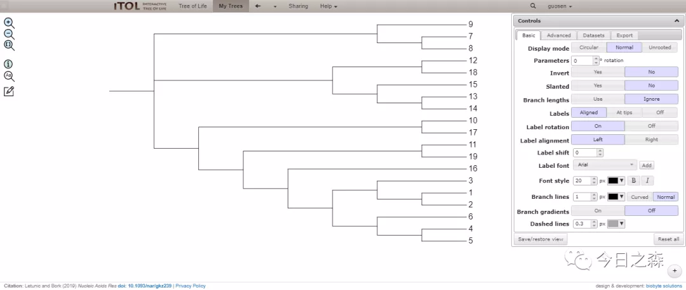

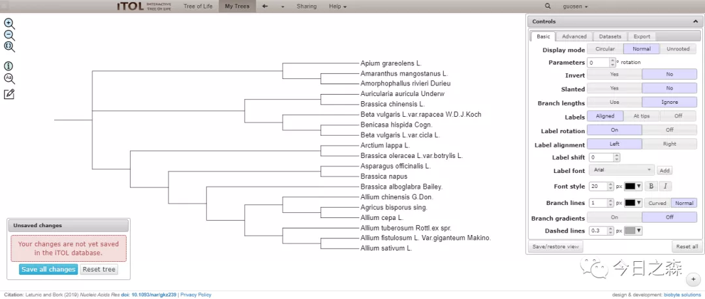

这样就对原始ID进行了替换。

2.分支样式更改

功能：对特定分支进行更改颜色及线条的粗细。比如：

>TREE_COLORS
SEPARATOR COMMA
DATA
#代码说明：需设置分支范围的起始ID|终止ID,clade/branch,16位颜色,normal/dashed,线条粗细
3|5,clade,#0000ff,normal,5
12|14,branch,#00ff00,dashed,8

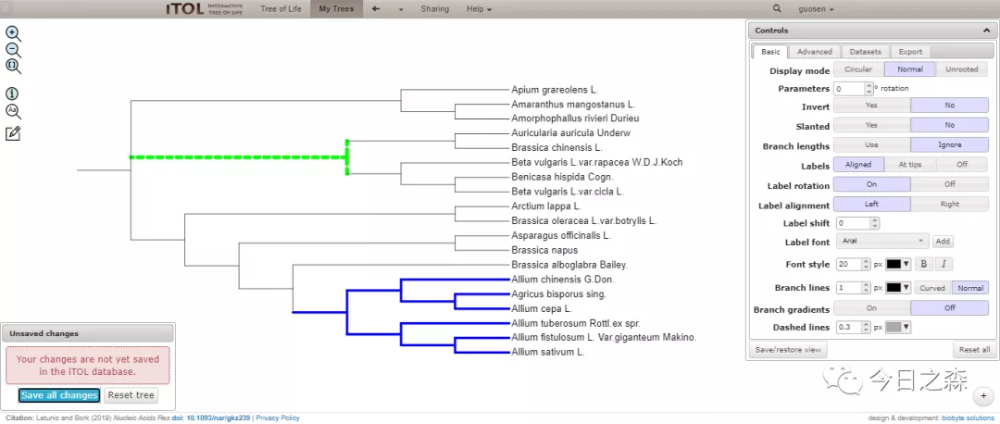

3.设置Label样式

>TREE_COLORS
SEPARATOR TAB
DATA
#代码说明：ID label color bold/italic/bold-italic font size
1  label  #1b0a3d  bold-italic  3
2  label  #894b2e  italic  1.6
3  label  #155549    2.9
4  label  #139183  italic  0.6
5  label  #9b5939  italic  2.2
6  label  #142ad6    0.3
7  label  #002e63  italic  0.3
8  label  #a2f54f    0.3
9  label  #3c902e  bold  0.7
10  label  #ca5280  italic  1.4
11  label  #12ce81    1.6
12  label  #e3be5e  bold-italic  2.5
13  label  #44d02c  italic  1.8
14  label  #61a868  italic  0.6
15  label  #610095  bold  1.6
16  label  #a79539  italic  0.1
17  label  #548c6d  italic  2.6
18  label  #197192    2.8
19  label  #d5f00f  italic  

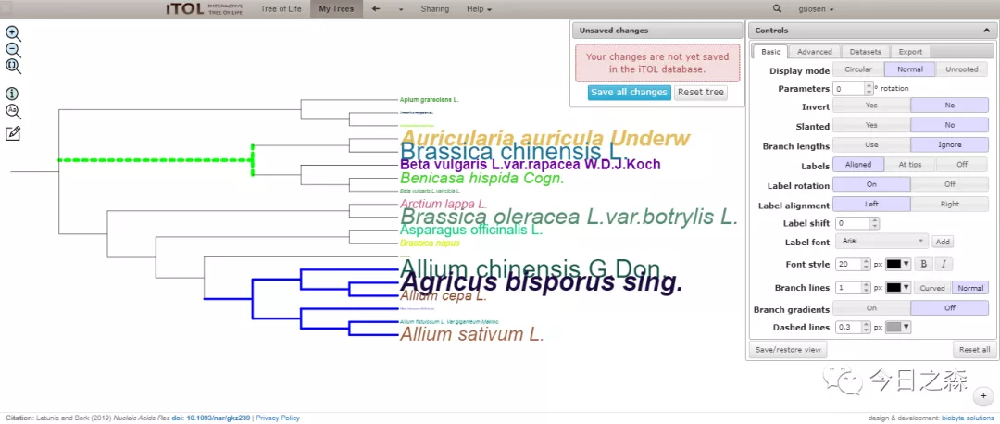

4.给Label设置颜色背景

>TREE_COLORS
SEPARATOR TAB
DATA
1  range  #e3be5e
2  range  #e3be5e
3  range  #e3be5e
4  range  #e3be5e
5  range  #e3be5e
6  range  #e3be5e
7  range  #44d02c
8  range  #44d02c
9  range  #44d02c
10  range  #e3be5e
11  range  #e3be5e
12  range  #002e63
13  range  #002e63
14  range  #002e63
15  range  #002e63
16  range  #e3be5e
17  range  #e3be5e
18  range  #002e63
19  range  #e3be5e

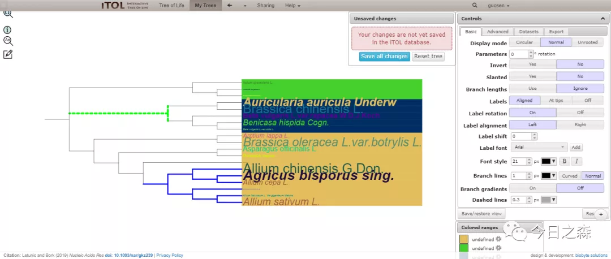

5.添加序列比对信息

>DATASET_ALIGNMENT
SEPARATOR COMMA
DATASET_LABEL,example alignment
COLOR,#ff0000
#define one or more custom alignment coloring schemes. They will appear in the color scheme selection box
#first field defines the scheme name, followed by a list of letters and their color assignments. Letters which do not
#have a color defined will be displayed with a white background
CUSTOM_COLOR_SCHEME,MY_SCHEME1,A=#d2d0c9,M=#d2d0c9,I=#d2d0c9,L=#d2d0c9,V=#d2d0c9,P=#746f69,G=#746f69,C=#746f69,F=#d0ad16,Y=#d0ad16,W=#d0ad16,S=#34acfb,T=#34acfb,N=#34acfb,Q=#34acfb,R=#34fb54,K=#34fb54,H=#34fb54,D=#fb4034,E=#fb4034
CUSTOM_COLOR_SCHEME,MY_SCHEME2,A=#30a040,R=#2015a5,N=#10ffa0,D=#6048c0,C=#608a80,Q=#601f00,E=#5048c0,G=#702048,H=#a5a4a4,I=#1a30f0,L=#11a0f0,K=#003505,M=#00a0f0,F=#10a0f0,P=#0ff300,S=#93f300,T=#33ff00,W=#0a30f0,Y=#25a4a4,V=#90a3f0
#left margin, used to increase/decrease the spacing to the next dataset. Can be negative, causing datasets to overlap. Used only for text labels which are displayed on the outside
MARGIN,0
#font size factor; default font size will be slightly less than the available space between leaves, but you can set a multiplication factor here to increase/decrease it (values from 0 to 1 will decrease it, values above 1 will increase it)
SIZE_FACTOR,1
DATA
>1
---------------------------------MSLVPSFF------GGRR--------TN--------------------VFDPFSL-----------DVW-----DPF-----EGFLTP---GLTNAPAKDVAAFTNAK-VD-------WRETPEAHVFKADVPGLKKEEVKVEVE-DGNILQI-S-GERSSENEE--KSDTWHRVERSS-----GKFMRRFRLPENA-KVEEVKASMEN----GVLSVTV--------PK-------V-QE--SKPEVKSVDISG---------------
>2
---------------------------------MSLIPSIF------GGRR--------TN--------------------VFDPFSL-----------DVF-----DPF-----EGFLTP--SGLANAPAMDVAAFTNAK-VD-------WRETPEAHVFKADLPGLRKEEVKVEVE-DGNILQI-S-GERSNENEE--KNDKWHRVERSS-----GKFTRRFRLPENA-KMEEIKASMEN----GVLSVTV--------PK-------V-PE--KKPEVKSIDISG---------------
>3
---------------------------------MSLIPSIF------GGRR--------SN--------------------VFDPFSQ-----------DLW-----DPF-----EGFFTPSSALANASTARDVAAFTNAR-VD-------WKETPEAHVFKADLPGLKKEEVKVEVE-DKNVLQI-S-GERSKENEE--KNDKWHRVERAS-----GKFMRRFRLPENA-KMEEVKATMEN----GVLTVVV--------PK-------A-PE--KKPQVKSIDISGAN-------------
>4
---------------------------------MSLIPSFF------GNNRRIN-----NN--------------------IFDPFSL-----------DVW-----DPF-----KELQFP---------SSSSSAIANAR-VD-------WKETAEAHVFKADLPGMKKEEVKVEIE-DDSVLKI-S-GERHVEKEE--KQDTWHRVERSS-----GGFSRKFRLPENV-KMDQVKASMEN----GVLTVTV--------PK-------V-ETNKKKAQVKSIDISGD--------------
>5
---------------------------------MSLIPSFF------GNNRR-S-----NS--------------------IFDPFSL-----------DVW-----DPF-----KELQFP------SSLSGETSAITNAR-VD-------WKETAEAHVFKADLPGMKKEEVKVEIE-DDSVLKI-S-GERHVEKEE--KQDTWHRVERSS-----GQFSRKFKLPENV-KMDQVKASMEN----GVLTVTV--------PK-------V-EEAKKKAQVKSIDISGS--------------
>6
---------------------------------MSMIPSFF------NNNRRSN---------------------------IFDPFSL-----------DVW-----DPF-----KELTSS-------SLSRENSAIVNAR-VD-------WRETPEAHVFKADLPGLKKEEVKVEIE-EDSVLKI-S-GERHVEKED--KNDTWHRVERSS-----GQFTRRFRLPENV-KMDQVKAAMEN----GVLTVTV--------PK-------A-ET--KKADVKSIQISGD--------------
>7
-------------------------------MDLGRFPIIS----------------------------------------ILEDMLE-------------------VPE-----DHNNEKTRNNPSRVYMRDAKAMAATP-AD-------VIEHPNAYAFVVDMPGIKGDEIKVQVE-NDNVLVV-S-GERQRENKEN-EGVKYVRMERRM-----GKFMRKFQLPENA-DLDKISAVCHD----GVLKVTV--------QK-------LPPPEPKKPKTIQVQVAS---------------
>8
-----------------------------MDLEFGRFPIFS----------------------------------------ILEDMLE-------------------AP------EEQTEKTRNNPSRAYMRDAKAMAATP-AD-------VIEHPDAYVFAVDMPGIKGDEIQVQIE-NENVLVV-S-GKRQRDNKEN-EGVKFVRMERRM-----GKFMRKFQLPDNA-DLEKISAACND----GVLKVTI--------PK-------LPPPEPKKPKTIQVQVAG---------------
>9
-------------------------------MSAVAINHFF----------------------------------------GLPEAIE---------------------------KLILPISRSGESNNESRGRGSSNNIP-ID-------ILESPKEYIFYLDIPGISKSDIQVTVE-EERTLVIKSNGKRKRDDDESEEGSKYIRLERRL----AQNLVKKFRLPEDA-DMASVTAKYQE----GVLTVVI--------KK-------L-PPQPPKPKTVQIAVSA---------------
>10
------------------------------------------------------------M--------------------DFQTIQV-------------------MPW-----EYVLAS----------QSLNNYQENH-VR-------WSQSPDSHTFSVDLPGLRKEEIKVEIE-DSIYLII-R-TEATPMSPP----------DQPL-----KTFKRKFRLPESI-DMIGISAGYED----GVLTVIV--------PKRIMTRRLIDPSDVPESLQLLARAAV---------------
>11
----------MTSSSGSLKLEIHTDDKTPGKWSVPLGDDVFRRFLSGGGGSEKAVFGEGS---------------------LFSPFLF----------GKYF-----DPS-----DAF--PLWEFEAEVLLASLRSLGQCR-VD-------WSQTDQAYVLKSDIPVVGKNNVQVYVDINGRVMEI-S-GQWNSNKKAA-TNSDWRSGRWWE-----HGYVRRLELPSDA-DAKYSEAFLSNNDDYSFLEIRI--------PK-------I----NSKNKF----------------------
>12
-----------------------------------------------------------MS------------------------RNM---------------------------EVNAGSSGEIPSPIRNRFQKSGSQAV-YE-------VTETKKSCVTRVDMPGCPESDLTYWVD-ANNVHFF-A-DEPAMPEYEN-AG---------------RKYGGSMIFNPEAYDVKKTKVKLIN----GVLWITV--------PK-------I-PGKNASINVKERILHYN--------------
>13
MASSSALALRRLLSSSTVAVPRALRAVRPVAASSRLFNTNAARNYEDGVDRNHHSNRHVSRHGGDFFSH------------ILDPFTPTRSL---------------SQM-----LNFMDQVSEIPLVSATRGMGASGVRRGWN-------VKEKDDALHLRIDMPGLSREDVKLALE--QNTLVI-R-GEGETEEGEDVSGDG-------------RRFTSRIELPEKVYKTDEIKAEMKN----GVLKVVI--------PK-------I--KEDERNNIRHINVD----------------
>14
-------------MASALALKRLLSSSIAPRSRSVLRPAVSSRLFNTNAVRSYDDDGE-NGDGVDLYRRSVPRRRGDFFSDVFDPFSPTRSV---------------SQV-----LNLMDQFMENPLLSATRGMGASGARRGWD-------IKEKDDALYLRIDMPGLSREDVKLALE--QDTLVI-R-GEGKNEEDGGEEGESGN-----------RRFTSRIGLPDKIYKIDEIKAEMKN----GVLKVVI--------PK-------M--KEQERNDVRQIEIN----------------
>15
---------------------MALARLALRNLQQKLSPSLMGQSCERGLVGNRHNPMKLNRFMATSAGEQEDKMNTEVS--VSEKKSPRQNFPRRRGRKSLWRNTDDHGYFTPTLNEFFPPTIGNTLIQATENMNRIFDNFNVNPFQLMGQVKEQDDCYKLRYEVPGLTKEDVKITV--NDGILTI-K-GDHKAEEEKGSPEEDEYWSSKSY-----GYYNTSLSLPDDA-KVEDIKAELKN----GVLNLVI--------PR----------TEKPKKNVQEISVE----------------
>16
-------------------------------MMKHLLSIFFIGALLLGNIKTSEGSLSSAL--------------------ETTPGSL---------LSDLWLDRFPDPF------KILER---IPLGLERDTSVALSPAR-VD-------WKETAEGHEIMLDIPGLKKDEVKIEVE-ENGVLRV-S-GERKREEEK--KGDQWHRVERSY-----GKFWRQFKLPDNV-DMESVKAKLEN----GVLTINL--------TK-------LSPEKVKGPRVVNIAAEEDQTAKISSSESKELD
>17
---------------------------------MADRGIFL------------------------------------------------------------------YPF-----RRFQEWSRSTAL---------------ID-------WMESNNSHIFKINVPGYNKEDIKVQIE-EGNVLSI-R-GEGIKEEKK--ENLVWHVAEREAFSGGGSEFLRRIELPENV-KVDQVKAYVEN----GVLTVVV--------PK---------DTSSKSSKVRNVNITSKLK------------
>18
---MASTLSFAASALCSPLAPSPSVSSKSATPFSVSFPRKIPSRIRAQDQRENSIDVVQQGQQKGNQGSSVEKRPQQRLTMDVSPFGLLDPLSPMRTMRQML-----DTM-----DRMFEDTMPVSGRNRGGSGVSEIRAP-WD-------IKEEEHEIKMRFDMPGLSKEDVKISVE--DNVLVI-K-GEQKKEDSD----DSWS--GRSV-----SSYGTRLQLPDNC-EKDKIKAELKN----GVLFITI--------PK-------T----KVERKVIDVQIQE---------------
>19
---------------------------------MSMIPISNRRRLSPGDR-------------------------------IWEPFEL------MNTFLDFP-----SPA-----LFLSHHFPSLSREIFPQTSSSTVNTQ-LN-------WTETPTAHVFKAYLPGVDQDEVIAFVD-EEGYLQICT-GD--------------------------NKFMSRFKLPNNA-LTDQVTAWMED----EFLVVFVEKDASSSPPQ-------L-PEIEENRNVRVVEITGDDD------------

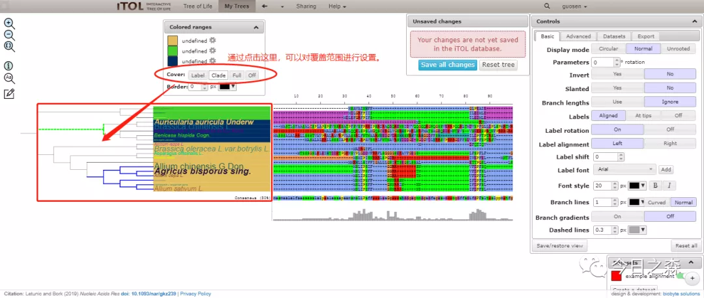

6.增加彩色长条图

>DATASET_COLORSTRIP
#lines starting with a hash are comments and ignored during parsing
#select the separator which is used to delimit the data below (TAB,SPACE or COMMA).This separator must be used throught this file (except in the SEPARATOR line, which uses space).
#SEPARATOR TAB
SEPARATOR SPACE
#SEPARATOR COMMA
#label is used in the legend table (can be changed later)
DATASET_LABEL color_strip1
#dataset color (can be changed later)
COLOR #ff0000
#optional settings
#all other optional settings can be set or changed later in the web interface (under 'Datasets' tab)
COLOR_BRANCHES 1
#maximum width
STRIP_WIDTH 25
#left margin, used to increase/decrease the spacing to the next dataset. Can be negative, causing datasets to overlap.
MARGIN 0
#border width; if set above 0, a black border of specified width (in pixels) will be drawn around the color strip 
BORDER_WIDTH 1
BORDER_COLOR #000
#show internal values; if set, values associated to internal nodes will be displayed even if these nodes are not collapsed. It could cause overlapping in the dataset display.
SHOW_INTERNAL 0
#In colored strip charts, each ID is associated to a color. Color can be specified in hexadecimal, RGB or RGBA notation
#Internal tree nodes can be specified using IDs directly, or using the 'last common ancestor' method described in iTOL help pages
#Actual data follows after the "DATA" keyword
DATA
#ID1 value1
#ID2 value2
12 #caf390 COL#caf390
13 #caf390 COL#caf390
14 #caf390 COL#caf390
15 #caf390 COL#caf390
18 #caf390 COL#caf390
7 #404c05 COL#404c05
8 #404c05 COL#404c05
9 #404c05 COL#404c05
1 #de4758 COL#de4758
2 #de4758 COL#de4758
3 #de4758 COL#de4758
4 #de4758 COL#de4758
5 #de4758 COL#de4758
6 #de4758 COL#de4758
10 #de4758 COL#de4758
11 #de4758 COL#de4758
16 #de4758 COL#de4758
17 #de4758 COL#de4758
19 #de4758 COL#de4758

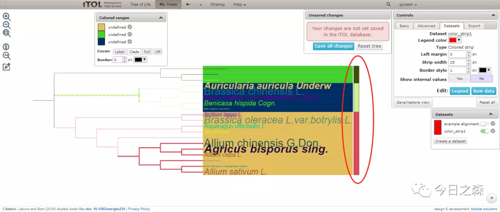

7.建立一些联系（下图为明显起见，隐藏掉之前的配置文件）

>DATASET_CONNECTION
#Connections datasets allow the drawing of straight or curved lines between any two nodes in the tree. Width, color and opacity can be set for each line.
#Optionally, arrowheads can be displayed on the lines.
#lines starting with a hash are comments and ignored during parsing
#=================================================================#
#                    MANDATORY SETTINGS                           #
#=================================================================#
#select the separator which is used to delimit the data below (TAB,SPACE or COMMA).This separator must be used throughout this file (except in the SEPARATOR line, which uses space).
SEPARATOR TAB
#SEPARATOR SPACE
#SEPARATOR COMMA
#label is used in the legend table (can be changed later)
DATASET_LABEL  example connections
#dataset color (can be changed later)
COLOR  #ff0ff0
#=================================================================#
#                    OPTIONAL SETTINGS                            #
#=================================================================#
#=================================================================#
#     all other optional settings can be set or changed later     #
#           in the web interface (under 'Datasets' tab)           #
#=================================================================#
#if set to 1, arrows will be drawn on the destination end of each connection line
DRAW_ARROWS  0
CENTER_CURVES  1
#when arrows are displayed, this option sets their size
ARROW_SIZE  20
#maximum width specified in the dataset will be drawn with this value. All other widths will be scaled down proportionally.
MAXIMUM_LINE_WIDTH  10
#Angle can be any value between -80 and 80. With angle set to 0 lines will be straight.
CURVE_ANGLE  45
#Internal tree nodes can be specified using IDs directly, or using the 'last common ancestor' method described in iTOL help pages
#=================================================================#
#       Actual data follows after the "DATA" keyword              #
#=================================================================#
DATA
#Each line defines a single connection between 2 nodes and consists of the following fields:
#NODE1,NODE2,WIDTH,COLOR,LABEL
#all connection widths will be normalized based on the MAXIMUM_LINE_WIDTH specified for the whole dataset
#color can be specified in hexadecimal, RGB or RGBA notation (if transparency is required). Note that you cannot use COMMA as the delimiter if RGB or RGBA color notation is used.
12  1  5  rgba(23,170,99,0.2)  dashed  Connection 12 to somewhere...
13  2  10  rgba(2,22,43,0.3)  normal  Connection 13 to somewhere...
14  6  20  rgba(146,215,157,0.1)  normal  Connection 14 to somewhere...
11  19  12  rgba(229,177,249,0.8)  dashed  Connection 11 to somewhere...

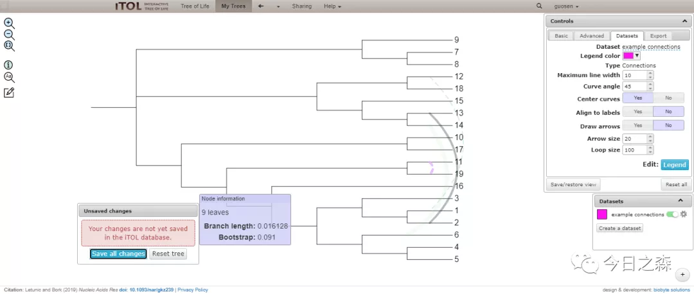

8.给每个基因添加结构域信息

（其实这里批量进行结构域配置文件的准备，过程还是及其繁琐的，在准备这个文件之前，需要首先获得每个结构域的位置信息，蛋白长度，此外还要进行合理的形状和颜色搭配，最终将这些信息组合起来，才能被用作不错的结构域注释文件）

>DATASET_DOMAINS
#Protein domain datasets are visualized as schematic representations of proteins, with a protein backbone and various shapes depicting the locations of individual domains
#lines starting with a hash are comments and ignored during parsing
#=================================================================#
#                    MANDATORY SETTINGS                           #
#=================================================================#
#select the separator which is used to delimit the data below (TAB,SPACE or COMMA).This separator must be used throughout this file (except in the SEPARATOR line, which uses space).
#SEPARATOR TAB
#SEPARATOR SPACE
SEPARATOR COMMA
#label is used in the legend table (can be changed later)
DATASET_LABEL,domain testing
#dataset color (can be changed later)
COLOR,#ff00aa
#=================================================================#
#                    OPTIONAL SETTINGS                            #
#=================================================================#
LEGEND_TITLE,Example domains legend
LEGEND_SHAPES,RE,EL,HH,HV,DI
LEGEND_COLORS,#ff0000,#00ff00,#00ffff,#0000ff,#fa0ef0
LEGEND_LABELS,value1,value2,value3,value4,domain with a very long name is here
#dataset scale: you can simply set the values where the scale will be drawn
#DATASET_SCALE,100,500,1000,2000
#or you can specify value, label, color, width, style and label size factor for each scale line (dash separated, format: VALUE-LABEL-COLOR-WIDTH-DASHED-LABEL_SCALE_FACTOR)) 
DATASET_SCALE,100-amino_acid_100-#0000ff-5-1-1,500-line at aa500-#ff0000-1-0-2,1000-aa1000-#00ff00-1-0-1
#=================================================================#
#     all other optional settings can be set or changed later     #
#           in the web interface (under 'Datasets' tab)           #
#=================================================================#
#always show internal values; if set, values associated to internal nodes will be displayed even if these nodes are not collapsed. It could cause overlapping in the dataset display.
#SHOW_INTERNAL,0
#left margin, used to increase/decrease the spacing to the next dataset. Can be negative, causing datasets to overlap.
#MARGIN,0
#protein height factor; Default height of each domain will be slightly less than the available space between leaves, but you can set a multiplication factor here to increase/decrease it (values from 0 to 1 will decrease it, values above 1 will increase it)
#HEIGHT_FACTOR,1
#proteins are aligned to the node lines by default. Using BAR_SHIFT, you can move them all up/down by a fixed amount
#BAR_SHIFT,0
#display or hide the text labels for each domain
SHOW_DOMAIN_LABELS,1
#with LABELS_ON_TOP set to 0, label text which does not fit into the shape will be hidden
LABELS_ON_TOP,0
#color of the background rectangle representing the protein amino acid backbone
BACKBONE_COLOR,#ffaaaa
#=================================================================#
#       Actual data follows after the "DATA" keyword              #
#=================================================================#
#Internal tree nodes can be specified using IDs directly, or using the 'last common ancestor' method described in iTOL help pages
DATA
#Each node can have one protein definition assigned, with total protein length defined in field 2, followed by an unlimited number of domain definitions
#Each domain definition consists of 5 parts, separated with vertical lines:
#SHAPE|START|END|COLOR|LABEL
#there are 13 different possible shapes:
#RE  rectangle
#HH  horizontal hexagon
#HV  vertical hexagon
#EL  ellipse
#DI  rhombus (diamond)
#TR  right pointing triangle
#TL  left pointing triangle
#PL  left pointing pentagram
#PR  right pointing pentagram
#PU  up pointing pentagram
#PD  down pointing pentagram
#OC  octagon
#GP  rectangle (gap; black filled rectangle with 1/3 normal height)
#for example, a 1200 amino acid protein with 3 domains, displayed on node 9606:
#red colored rectangle representing a SH2 domain at positions 100 - 150
#blue colored ellipse representing a SH3 domain at positions 400 - 500
#green colored octagon representing a PH domain at positions 700 - 900
#9606,1200,RE|100|150|#ff0000|SH2,EL|400|500|#0000ff|SH3,OC|700|900|#00ff00|PH
1,975,HV|28|43|#f526e4|rand2843,HV|86|285|#6a16cf|rand86285,EL|343|516|#a1ca0b|rand343516,DI|592|784|#bc52c6|rand592784,DI|859|965|#877a40|rand859965
2,702,EL|76|213|#a58144|rand76213,HV|230|410|#b8c30e|rand230410,HH|506|692|#ac2520|rand506692
3,1009,TL|17|125|#8bedd5|rand17125,RE|161|340|#0af686|rand161340,TR|427|518|#f7334b|rand427518,HH|554|736|#d2a66f|rand554736,HH|800|999|#b5e063|rand800999
4,854,TL|67|168|#ec7ed1|rand67168,TL|266|294|#fc809c|rand266294,TL|357|365|#cd4377|rand357365,HV|462|631|#9a2657|rand462631,TR|652|844|#abe0e0|rand652844
5,1022,RE|74|260|#69e812|rand74260,TL|293|429|#b5abeb|rand293429,DI|487|686|#9ba965|rand487686,HH|775|824|#e5ae72|rand775824,RE|901|1012|#407d75|rand9011012
6,972,RE|84|98|#ae5479|rand8498,TR|122|318|#c3c2fa|rand122318,DI|378|422|#75e3c9|rand378422,DI|466|492|#786c85|rand466492,EL|515|597|#d8e640|rand515597,DI|693|882|#d9a7dd|rand693882,TL|929|962|#85d232|rand929962
7,841,RE|92|269|#e879f8|rand92269,TR|327|418|#37ed3c|rand327418,TL|498|607|#3bab6d|rand498607,DI|691|694|#779608|rand691694,RE|733|831|#4dd7d4|rand733831
8,1175,RE|3|111|#fdca50|rand3111,TR|181|212|#26f995|rand181212,EL|289|417|#59c7a3|rand289417,DI|461|615|#6f5a95|rand461615,DI|713|772|#6b6049|rand713772,RE|874|933|#3c2a0a|rand874933,HH|1022|1165|#d5ba76|rand10221165
9,916,HH|2|85|#27fb51|rand285,RE|141|281|#62a505|rand141281,HV|376|528|#19fb29|rand376528,TR|557|564|#6e5196|rand557564,RE|668|743|#b9f82c|rand668743,TR|777|906|#e5870e|rand777906
10,936,TL|11|63|#47f863|rand1163,DI|165|169|#57a99c|rand165169,EL|251|335|#b0842a|rand251335,HV|367|412|#7157bf|rand367412,HV|512|547|#5183e2|rand512547,EL|641|670|#fb2840|rand641670,TL|758|926|#adfc88|rand758926
11,956,HH|38|192|#0643f9|rand38192,HV|236|401|#ff9c3e|rand236401,TR|417|488|#c406d5|rand417488,HH|569|710|#686143|rand569710,TL|755|946|#0553f2|rand755946
12,793,EL|90|231|#baddfb|rand90231,RE|303|313|#f37779|rand303313,RE|342|408|#44a6be|rand342408,TL|505|522|#4bfd20|rand505522,HV|582|670|#8e5248|rand582670,DI|743|783|#0af206|rand743783
13,858,TR|64|243|#20310e|rand64243,TL|305|470|#748f0f|rand305470,EL|549|744|#8f58c5|rand549744,RE|824|848|#fff761|rand824848
14,866,RE|96|211|#7e675a|rand96211,EL|267|339|#d797de|rand267339,TL|431|539|#900720|rand431539,DI|612|663|#39d174|rand612663,TR|757|856|#b1f0e8|rand757856
15,966,TR|16|89|#a10fa3|rand1689,TR|143|238|#878c1c|rand143238,HV|262|290|#a26f57|rand262290,HV|373|495|#1229c6|rand373495,HV|562|621|#749b09|rand562621,HV|641|648|#5874a0|rand641648,DI|688|698|#c86ed6|rand688698,HH|757|956|#d7930a|rand757956
16,792,HH|18|126|#2edf4a|rand18126,HV|193|338|#634dda|rand193338,HH|409|573|#fdf741|rand409573,HH|586|587|#26670f|rand586587,TL|665|782|#8c04fd|rand665782
17,796,TR|7|144|#18619a|rand7144,TR|250|251|#25269f|rand250251,RE|302|376|#87fd9e|rand302376,HV|422|479|#9c05a1|rand422479,HV|553|607|#ecf610|rand553607,TL|622|625|#1bda09|rand622625,DI|730|786|#57f2d6|rand730786
18,716,DI|67|220|#ae8a68|rand67220,TR|280|457|#99f9f0|rand280457,HV|509|706|#410cb3|rand509706
19,853,DI|80|222|#bf1e43|rand80222,HV|240|359|#1fa8e2|rand240359,TL|397|449|#20124c|rand397449,HV|509|512|#33c557|rand509512,EL|598|763|#3f2f4f|rand598763,HV|778|843|#de7a67|rand778843

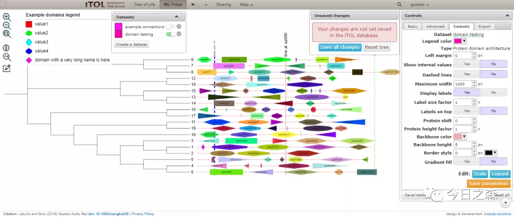

9.热图

>DATASET_HEATMAP
#In heatmaps, each ID is associated to multiple numeric values, which are displayed as a set of colored boxes defined by a color gradient
#lines starting with a hash are comments and ignored during parsing
#=================================================================#
#                    MANDATORY SETTINGS                           #
#=================================================================#
#select the separator which is used to delimit the data below (TAB,SPACE or COMMA).This separator must be used throughout this file (except in the SEPARATOR line, which uses space).
#SEPARATOR TAB
SEPARATOR SPACE
#SEPARATOR COMMA
#label is used in the legend table (can be changed later)
DATASET_LABEL example_heatmap_60
#dataset color (can be changed later)
COLOR #ff0000
#define labels for each individual field column
#=================================================================#
#                    OPTIONAL SETTINGS                            #
#=================================================================#
#Heatmaps can have an optional Newick formatted tree assigned. Its leaf IDs must exactly match the dataset FIELD_LABELS.
#The tree will be used to sort the dataset fields, and will be displayed above the dataset. It can have branch lengths defined.
#All newlines and spaces should be stripped from the tree, and COMMA cannot be used as the dataset separator if a FIELD_TREE is provided.
#FIELD_TREE (((f1,f5),(f2,f3)),(f4,f7));
FIELD_TREE (440-16843009:0.16,(((((((((590-16843009:0.55,530-16843009:0.98):0.54,490-16843009:0.11):0.25,510-16843009:0.23):0.60,(50-16843009:0.42,((420-16843009:0.43,(250-16843009:0.40,40-16843009:0.38):0.03):0.82,(220-16843009:0.06,270-16843009:0.97):0.46):0.21):0.85):0.06,180-16843009:0.10):0.82,110-16843009:0.71):0.19,(((0-1635528704-1:0.10,310-16843009:0.53):0.61,(((580-16843009:0.78,350-16843009:0.38):0.42,(500-16843009:0.97,((30-16843009:0.02,550-16843009:0.23):0.30,(((460-16843009:0.27,90-16843009:0.40):0.85,(320-16843009:0.07,(190-16843009:0.34,((170-16843009:0.97,280-16843009:0.86):0.08,((380-16843009:0.98,70-16843009:0.65):0.40,520-16843009:0.90):0.66):0.89):0.92):0.85):0.11,((370-16843009:0.60,140-16843009:0.60):0.47,(120-16843009:0.61,((80-16843009:0.40,60-16843009:0.85):0.56,300-16843009:0.77):0.46):0.42):0.18):0.95):0.24):0.41):0.46,((360-16843009:0.26,((340-16843009:0.14,400-16843009:0.57):0.67,430-16843009:0.10):0.96):0.81,(((100-16843009:0.97,130-16843009:0.21):0.69,160-16843009:0.07):0.31,(560-16843009:0.30,540-16843009:0.44):0.09):0.72):0.10):0.46):0.79,((240-16843009:0.39,((390-16843009:0.09,470-16843009:0.01):0.14,20-16843009:0.58):0.77):0.87,(260-16843009:0.88,((210-16843009:0.17,(570-16843009:0.18,150-16843009:0.64):0.23):0.36,(330-16843009:0.95,((10-16843009:0.86,(290-16843009:0.24,200-16843009:0.13):0.62):0.42,480-16843009:0.02):0.77):0.41):0.85):0.69):0.47):0.05):0.16,410-16843009:0.91):0.84,(230-16843009:0.81,450-16843009:0.59):0.63):0.09);
#=================================================================#
#     all other optional settings can be set or changed later     #
#           in the web interface (under 'Datasets' tab)           #
#=================================================================#
#left margin, used to increase/decrease the spacing to the next dataset. Can be negative, causing datasets to overlap.
MARGIN 0
#width of the individual boxes
STRIP_WIDTH 25
#always show internal values; if set, values associated to internal nodes will be displayed even if these nodes are not collapsed. It could cause overlapping in the dataset display.
SHOW_INTERNAL 0
#if a FIELD_TREE is present, it can be hidden by setting this option to 0
SHOW_TREE 1
#if a FIELD_TREE is present, it will have this height in pixels 
TREE_HEIGHT 1000
#define the heatmap gradient colors. Values in the dataset will be mapped onto the corresponding color gradient.
COLOR_MIN #ff0000
COLOR_MAX #0000ff
#you can specify a gradient with three colors (e.g red to yellow to green) by setting 'USE_MID_COLOR' to 1, and specifying the midpoint color
USE_MID_COLOR 1
COLOR_MID #ffff00
#Internal tree nodes can be specified using IDs directly, or using the 'last common ancestor' method described in iTOL help pages
#=================================================================#
#       Actual data follows after the "DATA" keyword              #
#=================================================================#
FIELD_LABELS 440-16843009 590-16843009 530-16843009 490-16843009 510-16843009 50-16843009 420-16843009 250-16843009 40-16843009 220-16843009 270-16843009 180-16843009 110-16843009 0-1635528704-1 310-16843009 580-16843009 350-16843009 500-16843009 30-16843009 550-16843009 460-16843009 90-16843009 320-16843009 190-16843009 170-16843009 280-16843009 380-16843009 70-16843009 520-16843009 370-16843009 140-16843009 120-16843009 80-16843009 60-16843009 300-16843009 360-16843009 340-16843009 400-16843009 430-16843009 100-16843009 130-16843009 160-16843009 560-16843009 540-16843009 240-16843009 390-16843009 470-16843009 20-16843009 260-16843009 210-16843009 570-16843009 150-16843009 330-16843009 10-16843009 290-16843009 200-16843009 480-16843009 410-16843009 230-16843009 450-16843009
DATA
#ID1 value1 value2 value3 value4 value5 value6
#9606 100 300 250 100 50 210
1 999 413 562 -438 788 -380 679 71 963 -848 -211 961 -912 -317 -810 -543 115 -564 193 630 61 -596 -190 -430 313 974 886 -29 -274 -210 131 -618 920 -386 396 126 -74 719 479 353 -306 -811 -549 459 350 434 -341 379 -461 377 -27 659 -459 711 -337 -596 -971 172 914 993
2 -705 321 -821 -918 -813 720 675 -703 -638 -643 405 -206 -830 833 289 361 532 382 -400 607 -936 242 -806 -850 44 -98 -233 658 879 -148 -35 856 550 -698 -978 889 443 279 124 336 705 -617 195 181 -912 -120 -785 761 -696 658 825 638 -989 156 -296 -430 380 -655 -550 240
3 3 -113 -909 -173 -829 50 268 -540 -451 444 -740 -330 -23 -917 176 -793 636 795 39 938 674 -30 -101 -854 441 555 631 -117 249 -18 -228 -670 666 218 603 486 56 0 -128 713 579 -885 1 927 900 -747 251 -690 363 -447 555 359 267 787 -599 559 -670 -754 258 905
4 994 245 961 520 11 532 335 -431 -246 127 269 95 -744 -345 675 835 -996 972 -123 -690 130 149 -115 994 -470 403 69 830 -636 -487 103 -16 -396 673 -391 -281 153 -962 -550 358 809 723 505 -778 -888 -448 -8 472 392 -731 -207 329 858 3 -306 -758 436 0 -734 181
5 -452 358 -743 -337 -315 -415 211 -607 -833 -834 -387 549 340 -618 -714 747 655 -96 895 663 872 82 -200 392 765 -183 -230 709 -37 -137 385 131 216 731 123 -410 196 -82 -729 -437 -438 -76 206 -875 288 -199 -637 -135 132 -253 246 870 -102 -659 262 -996 -223 -22 832 -757
6 -774 -627 947 808 888 -385 863 -424 -819 218 853 487 -285 310 963 418 -276 28 -705 -729 -709 -878 294 -81 -464 1 -808 -57 -575 668 253 289 471 37 288 372 -532 298 -776 -334 754 100 509 295 290 -330 178 -189 658 -344 -918 -784 -990 682 924 -992 -550 10 -351 318
7 -248 460 439 -556 837 -825 -262 857 -569 263 983 390 -121 695 -628 -126 844 203 773 627 -829 774 57 203 892 290 477 -596 -354 806 584 -663 -836 -71 -321 114 -68 668 -311 98 500 -446 483 -680 -145 -827 -463 -378 -202 -338 62 -613 24 678 -800 247 -493 76 -286 -735
8 231 -859 -689 64 147 721 523 -221 -225 -3 802 -2 333 356 -280 -79 -239 -45 -403 746 -697 615 -390 673 978 826 221 -597 -474 -79 726 813 62 -629 379 -738 950 -313 21 -155 -526 -317 -66 -182 -565 -594 958 -967 -321 -537 283 -319 436 -931 -18 946 -779 549 -96 -746
9 267 -355 215 508 15 633 770 -486 -177 -659 -696 -580 108 -542 597 582 365 -872 493 293 -104 -538 -277 596 -866 597 -83 876 -512 235 -819 280 64 256 -875 563 -308 227 891 -486 319 -937 901 -73 261 -494 -896 672 900 630 451 386 960 55 844 302 145 -793 496 935
10 -897 -450 -843 910 -824 318 -985 -881 -983 -108 935 -544 -604 -361 747 219 857 342 834 -743 943 -992 -220 -578 267 -936 -509 734 -117 -657 -509 321 143 703 -664 83 791 -815 -674 -456 -693 118 -291 824 -889 -301 -494 -362 -3 -569 28 769 -978 662 440 235 -280 -149 126 362
11 -364 694 -271 35 -861 483 -847 438 -982 -452 97 668 -357 506 485 -845 833 -38 957 849 303 -496 -516 289 -869 413 857 -621 -826 -302 214 -798 -727 825 377 -32 -258 -115 -369 -878 -919 -792 -88 -512 -769 984 957 622 213 -298 -388 140 -116 113 488 -497 730 43 660 -485
12 -73 791 -903 216 880 226 -754 -151 567 -266 237 -922 -45 719 68 -588 776 183 984 -631 -90 957 -223 347 -406 -893 87 -609 -913 -173 -368 -422 442 9 679 622 87 862 -686 226 765 962 71 40 974 433 -518 -563 -944 -912 7 715 -281 222 519 615 -937 791 -759 -278
13 814 -138 883 -723 -213 -108 51 -9 -469 -738 942 -91 -738 804 353 33 -179 611 106 788 984 -957 -691 187 310 482 -891 245 486 988 332 473 -818 -967 767 -388 -970 -333 -879 576 506 7 -793 -273 -678 613 -982 328 628 584 -803 276 -53 666 280 359 996 208 567 -525
14 -993 -985 -46 710 -385 884 815 -310 203 -658 -880 24 955 650 -813 -334 -312 -9 726 -443 3 -105 882 -124 190 863 766 -148 -504 -808 83 -614 -75 803 -363 -267 -892 -251 -912 759 -869 -658 -716 258 -864 508 -67 -411 721 975 623 609 516 31 338 598 -254 -524 -613 -232
15 912 -785 -557 -902 -310 -852 474 461 192 -393 -362 -636 -270 -580 917 177 -889 -290 820 557 163 -412 288 594 -706 968 224 955 -996 -919 162 332 25 767 857 -294 -405 893 -213 168 -841 -558 -428 19 594 629 -162 99 523 -41 685 -476 87 -31 -503 -393 971 -686 795 188
16 -619 -82 -392 -5 866 -917 -90 908 -861 -543 167 -883 -301 -538 944 560 -633 592 -503 -115 340 -204 76 36 -774 199 -360 124 -410 482 578 -227 881 -60 645 892 -655 275 -12 770 844 -492 -48 372 315 -375 -266 680 413 -765 -625 -606 -633 58 -477 826 198 -453 427 -12
17 931 -89 -715 -900 169 878 641 -91 -700 510 583 904 -362 -513 293 -572 387 820 -204 955 903 -738 -455 643 852 -101 44 -243 965 126 -568 -279 351 88 728 656 766 -468 842 767 82 506 340 10 -469 -498 -9 -795 -949 -484 -16 19 591 230 870 921 687 -938 454 -912
18 -973 -736 532 601 -414 192 993 380 -604 645 -624 -570 383 308 -924 49 -40 -326 970 -29 -315 682 337 866 623 -859 556 -845 -420 790 -271 682 -248 -115 509 52 472 -60 202 -554 407 -135 -214 248 -27 600 -18 -228 282 667 -673 590 -30 487 -190 -248 255 501 920 215
19 920 785 145 390 -854 -793 -789 283 557 -867 103 -927 707 -341 -103 917 -842 -472 -599 385 -496 -16 -819 -365 -902 709 951 -949 -995 -546 -710 -996 -164 -856 -880 111 399 -59 -43 -979 -327 985 754 787 925 -926 290 400 -893 471 353 231 123 758 206 -512 -562 628 930 -477

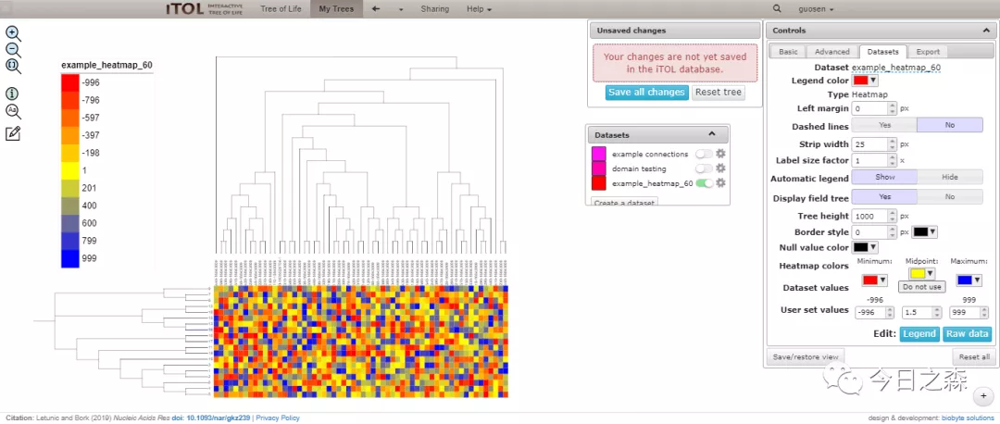

10.分类群或标记单个基因

>DATASET_TEXT
#In text datasets, each ID is associated to text label, which can be displayed directly on the node branch, or outside the tree
#lines starting with a hash are comments and ignored during parsing
#=================================================================#
#                    MANDATORY SETTINGS                           #
#=================================================================#
#select the separator which is used to delimit the data below (TAB,SPACE or COMMA).This separator must be used throughout this file (except in the SEPARATOR line, which uses space).
#SEPARATOR TAB
#SEPARATOR SPACE
SEPARATOR COMMA
#label is used in the legend table (can be changed later)
DATASET_LABEL,example text dataset 2
#dataset color (can be changed later)
COLOR,#ff00ff
#=================================================================#
#                    OPTIONAL SETTINGS                            #
#=================================================================#
#=================================================================#
#     all other optional settings can be set or changed later     #
#           in the web interface (under 'Datasets' tab)           #
#=================================================================#
#left margin, used to increase/decrease the spacing to the next dataset. Can be negative, causing datasets to overlap. Used only for text labels which are displayed on the outside
MARGIN,0
#applies to external text labels only; if set, text labels associated to internal nodes will be displayed even if these nodes are not collapsed. It could cause overlapping in the dataset display.
SHOW_INTERNAL,0
#Rotate all labels by the specified angle
LABEL_ROTATION,0
#applies to external text labels only; If set to 1, labels will be displayed in arcs aligned to the tree (in circular mode) or vertically (in normal mode). All rotation parameters (global or individual) will be ignored.
ALIGN_TO_TREE,0
#font size factor; For external text labels, default font size will be slightly less than the available space between leaves, but you can set a multiplication factor here to increase/decrease it (values from 0 to 1 will decrease it, values above 1 will increase it)
SIZE_FACTOR,1
#Internal tree nodes can be specified using IDs directly, or using the 'last common ancestor' method described in iTOL help pages
#=================================================================#
#       Actual data follows after the "DATA" keyword              #
#=================================================================#
#the following fields are possible for each node:
#ID,label,position,color,style,size_factor,rotation
#position defines the position of the pie chart on the tree:
#  -1 = external label
#  a number between 0 and 1 = internal label positioned at the specified value along the node branch (for example, position 0 is exactly at the start of node branch, position 0.5 is in the middle, and position 1 is at the end)
#style can be 'normal',''bold','italic' or 'bold-italic'
#size factor will be multiplied with the standard font size
DATA
#Examples
#内部标签
7,Homo sapiens,-1,#ff0000,bold,0.2,0
12,Eukaryota,-1,#000000,italic,2,90
10,Bacteria,-1,#0000ff,bold,2,90
3,Archaea,-1,#0000ff,normal,2,-45
5,Something is here with a long label,0,#ff0000,bold-italic,0.5,0
#外部标签
9,Homo sapiens,0,#ff0000,bold,1,0
15,Oryza sativa,0,#0000ff,bold-italic,1,0
11|19,Eukaryota,0,#00ff00,italic,1,90
1|2,testing,0,#ff00ff,normal,2,-90

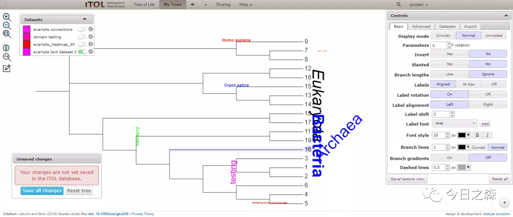

iTOL常用配置文件的使用简单说到这里，对于示例中使用的乱七八糟的数据大家看看就好，都是胡编乱造的。

会使用是一方面，最后能否优雅且不失科学的对进化树进行编辑和美化还需要不断探索与实践。

其实说实话，对于超过几百个以上的基因进行编辑时，有时候还是有些头疼。如果不会基本的R语言等的操作，处理起来会相当棘手，我也不会正确使用R，因此就需要对Excel有稍微掌握，才能顺利的进行编辑配置文件。

当然，iTOL有以下这些工具可以很好地起辅助编辑配置文件作用，但我一个都不会用，只能用Excel进行操作了。图片

iTOL annotation editor: access your iTOL trees, create and edit datasets directly in Microsoft Excel

phyloT: a tree generator based on NCBI taxonomy which can visualize trees directly in iTOL

table2itol: an R script that makes it easy to generate iTOL annotations from spreadsheet files

Gotree: GoTree is a set of command line tools to manipulate phylogenetic trees, implemented in Go language.

itolAPI: phyton API for iTOL batch access.

当然，有任何疑问可以后台交流。或者自行查看帮助信息

>https://itol.embl.de/help.cgi

正月十五已至，晚上送完火把，明天也该返校了。

先写到这里。