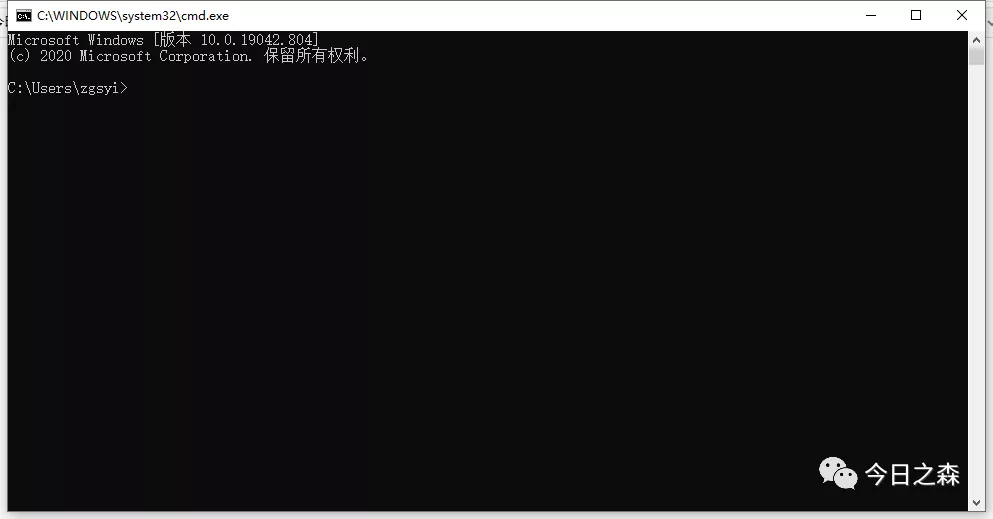
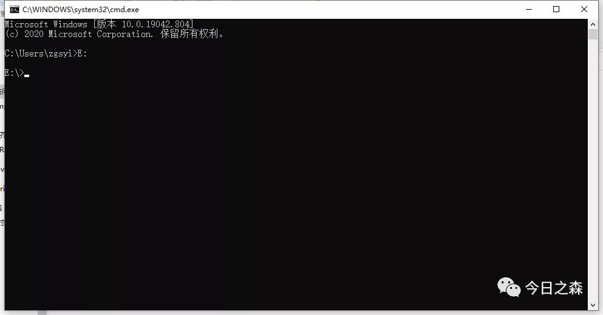
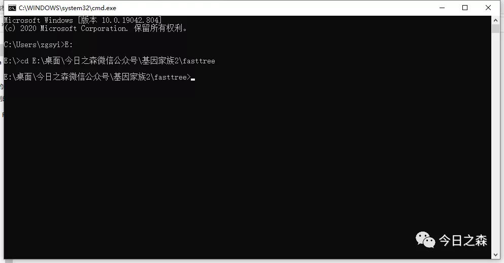
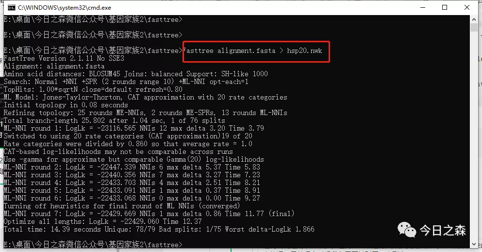
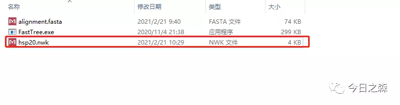

进化树构建的软件很多，但同样面临运行大数据集的文件时会出现软件未响应情况。另外很多时候我们需要针对同一序列文件不止一次建树，如果每次都耗时过长，无疑会大大降低我们的工作效率。

我之前对约2000条序列使用MEGA构建进化树，耗时约24h。这个时间虽然很快了，但还是有点等不起。

于是昨晚尝试使用Fasttree对约7000条序列构建进化树，耗时约4h30min。这就很快了。

下面还是使用hsp20基因的alignment.fasta进行操作。

Fasttree软件官网

>http://www.microbesonline.org/fasttree/

（后台回复   Fasttree    即可快速获取）

Fasttree官网的介绍：

FastTree infers approximately-maximum-likelihood phylogenetic trees from alignments of nucleotide or protein sequences. FastTree can handle alignments with up to a million of sequences in a reasonable amount of time and memory. For large alignments, FastTree is 100-1,000 times faster than PhyML 3.0 or RAxML 7. 

FastTree is more accurate than PhyML 3 with default settings, and much more accurate than the distance-matrix methods that are traditionally used for large alignments. FastTree uses the Jukes-Cantor or generalized time-reversible (GTR) models of nucleotide evolution and the JTT (Jones-Taylor-Thornton 1992), WAG (Whelan & Goldman 2001), or LG (Le and Gascuel 2008) models of amino acid evolution. To account for the varying rates of evolution across sites, FastTree uses a single rate for each site (the "CAT" approximation). To quickly estimate the reliability of each split in the tree, FastTree computes local support values with the Shimodaira-Hasegawa test (these are the same as PhyML 3's "SH-like local supports").

具体更多细节可以进入官网查看。

下面开始操作：

Fasttree不需要安装，下载后即可使用

鼠标停在fasttree.exe目录中，按下WIN+R键 输入cmd，打开cmd窗口。

>下面需要将工作目录定位到当前文件夹下，我这里是E:\桌面\今日之森微信公众号\基因家族2\fasttree

所以先输入E：      按Enter进入E盘。

>然后输入cd E:\桌面\今日之森微信公众号\基因家族2\fasttree，按Enter，进入当前工作目录。

下面就可以使用Fasttree建树了。

下面是fastatree的使用说明：

Running FastTree
To infer a tree for a protein alignment with the JTT+CAT model, use

FastTree < alignment_file > tree_file 
or
FastTree alignment.file > tree_file 
Use the -wag or -lg options to use the WAG+CAT or LG+CAT model instead. You can also use your own transition matrix

To infer a tree for a nucleotide alignment with the GTR+CAT model, use

FastTree -gtr -nt < alignment.file > tree_file 
or
FastTree -gtr -nt alignment_file > tree_file 
If you do not specify -gtr, then FastTree will use the Jukes-Cantor + CAT model instead.
Use the -gamma option (about 5% slower) if you want to rescale the branch lengths and compute a Gamma20-based likelihood. Gamma likelihoods are more comparable across runs. These also allow for statistical comparisons of the likelihood of different topologies if you use the -log logfile option (see details). The change in the scale of the tree is usually modest (10% or less).

If you are using Windows, run FastTree within the command-line environment (use Start / Run / "cmd"). If you are using MacOS or Linux, you may need to specify the path of the executable by using "./FastTree" rather than "FastTree".

To see what version of FastTree you have and for information on FastTree's options, run FastTree without any arguments or with the -help option.
安装上述使用说明，那我们这里就运行以下代码进行建树，其中hasp20.nwk为输出文件名。

Fasttree alignment.fasta > hsp20.nwk
运行结束，耗时约5s。

打开文件夹，可以看到hsp20.nwk树文件已经生成。

如果需要使用其他算法，则按上述说明文件运行相应代码即可。

