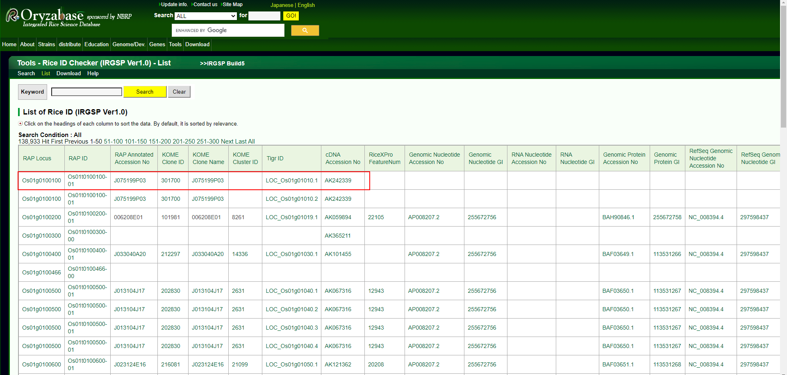

## 关于水稻基因组信息

去年的时候我注意到水稻基因组序列中有这种格式的`LOC_Os01g01010.1`基因，后来通过各种搜索偶然从一篇`nature genetic`文中中找到了这种格式的水稻全基因组蛋白序列，由于那是个直链，下载链接中仅有蛋白序列。后来就不了了之了。  

最近又需要找一下这种格式的基因组信息，无奈还是找不见。后来发现在ensemb中的水稻数据库中可以检索到`LOC_Os01g01010.1`，但是下载下来一看又不完全一样。
```
http://plants.ensembl.org/Multi/Search/Results?species=all;idx=;q=LOC_Os01g01010;site=ensemblunit
```


点开看一下


结果检索之后由图可见，还有一种`Os01t0100100-01`的ID与`LOC_Os01g01010.1`对应，由此知，`LOC_Os01g01010.1`对应的应该是MSU gene格式，但是显然，这里提供的MSU gene是打不开的。


但实际上好像这两种版本的水稻基因组应该就是对应起来的。比如下面这样：
```
https://www.ricedata.cn/gene/
```


于是问题又来了，这个网站只能一个一个检索，无法对全基因组进行一一对应。     
于是我就直接biying搜索了`LOC_Os01g01010.1`。发现这样下面这个列表。



很明显，这是一个专为水稻ID转换的网站啊！     
进入之后，居然可以下载到各种各样的水稻ID转换列表。一切都是那么刚刚好。  
下载链接
```
https://shigen.nig.ac.jp/rice/oryzabase/download/riceId
```
但还是想不明白，为啥每个物种都有各式各样的ID，弄得人头晕眼花。再加上文章中又有各种作者命名的名字。想把几个基因一一对应起来还真是件麻烦事儿。    

其实我一直都有个疑惑。拿这个基因`LOC_Os01g01010.1`来举个栗子，如果我命名为TBC1，别人的文章中
是TBC4，另外也许还有TBC7、8、9等等，甚至可能会被命名为其他什么。所以说，大家研究这个研究那个，最后到底在研究哪个哎？这是很混乱的。     

大家在做基因家族分析构建系统发育树的时候，实际上会对基因进行重命名。     

有的会以在染色体上的位置顺序进行命名，这种方式还相对好一些；        

有的时候会以模式物种的命名方式进行重命名，这个时候其实就已经容易出现混乱了，由于建树的时候不停的策略建树后的树结构是会有差别的，这一次在上面的，可能重新做一次系统发育树，就会跑到下面去，尽管发育关系不变，但是树分支的位置不同了。而建树者就会通过这种聚类关系去重命名，于是就越来越混乱了。

也许我说的有问题，一些粗浅理解，先写在这里。

