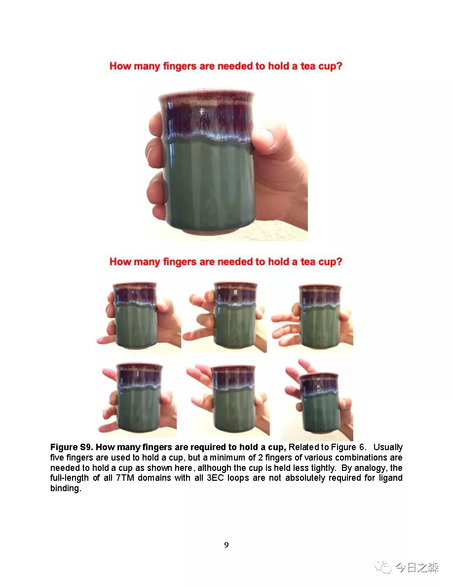

Reference：

Qing, R., Tao, F., Chatterjee, P., Yang, G., Han, Q., Chung, H., Ni, J., Suter, B. P., Kubicek, J., Maertens, B., Schubert, T., Blackburn, C., & Zhang, S. (2020). Non-full-length Water-Soluble CXCR4QTY and CCR5QTY Chemokine Receptors: Implication for Overlooked Truncated but Functional Membrane Receptors. iScience, 23(12), 101670. https://doi.org/10.1016/j.isci.2020.101670