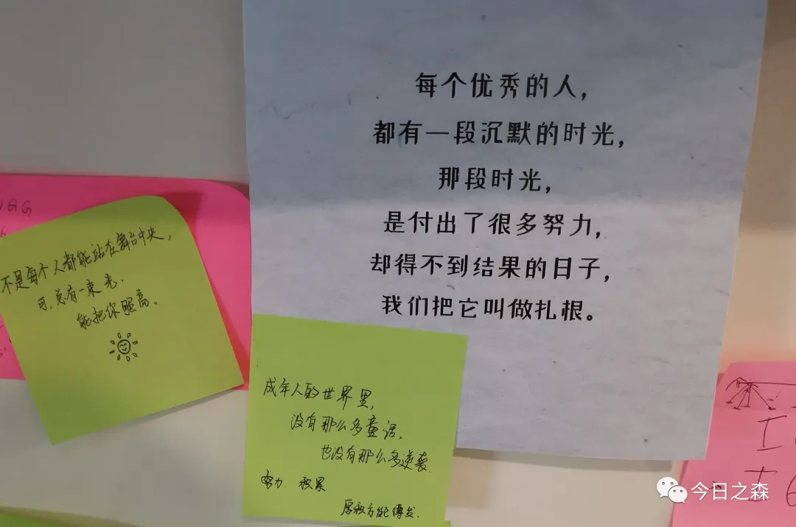

公众号【今日之森】名字的由来
其实没有什么特别的意味，非要冠以含义的话，就是敦促和提醒自己要日日新，不纠结，……

自我简介
在读硕士研究生
除了做一些湿实验（比如常规的蛋白互作实验）
我更喜欢学习一些新的内容

此外，我最喜欢长跑
我可以跑很远很远
还可以跑的很快很快
跑步是我这五六年来持续热爱的事
跑步的时候
大概是最轻松的时刻
可以放下手头所有的琐事
纯粹的和自己对话
每隔一段时间
我都会进行一次长跑
（大约30Km，因为我的手机在音乐外放时大概只能坚持这么久）
定期的长跑
可以让我有一个轻松的状态
思考过去一段时间
并畅想未来一段时间

公众号定位
每个人的学习路径都不甚相同，而我的学习也是磕磕绊绊。从上研究开始，就需要从零学习很多的内容，包括分子生物学实验背景，蛋白互作验证实验的原理及操作，生物信息学基础的了解等等。各方面的知识点都需要从零开始积累。

所以在年初重拾公众号，开始持续的写作，一方面是梳理自己所学，也方便自己经常性回过头温习，再者分享出来，也是希望看到推文的读者能有所收获。

今日之森学术交流QQ群
上研究生之后，我们所处实验环境都相对闭塞，每天可以接触的人也都有限，这是极不利于学术交流和对话的。随着读者越来越多，也本着开放、共享的初心，创建了学术交流qq群，希望给大家提供一个平台。

感兴趣的读者可以加入进来，参与讨论和学习。

QQ群号：908235922
（欢迎但不限于生命科学大类，农学大类，及生物信息学相关专业的读者加入） 进群请备注：姓名-院校-研究方向（否则不予通过）

关于我
欢迎大家与我沟通、互动、交流。

写到最后
但愿每次回忆，对生活都不感到负疚。

from Ying

2021年7月19日凌晨0:00更新