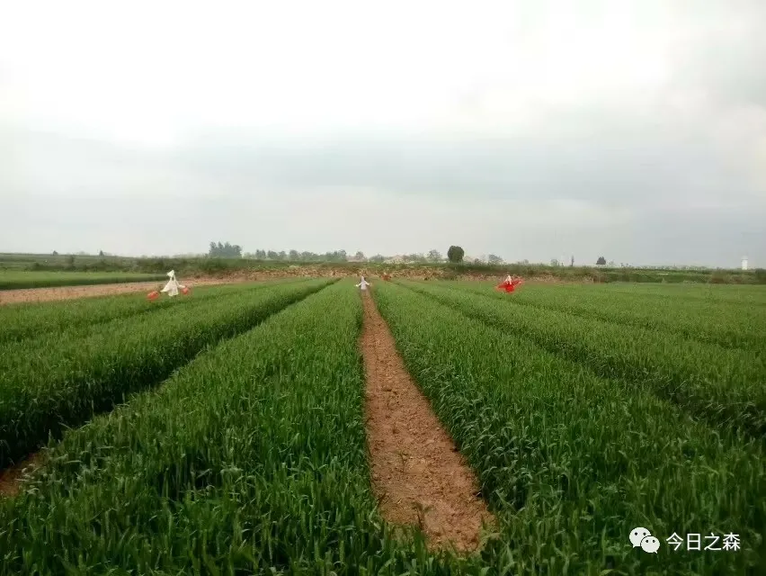
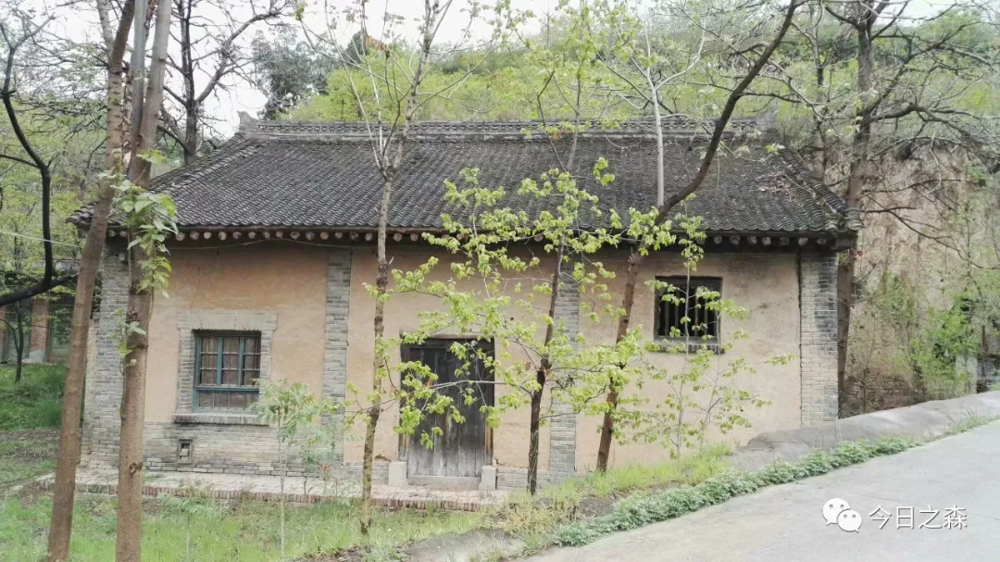
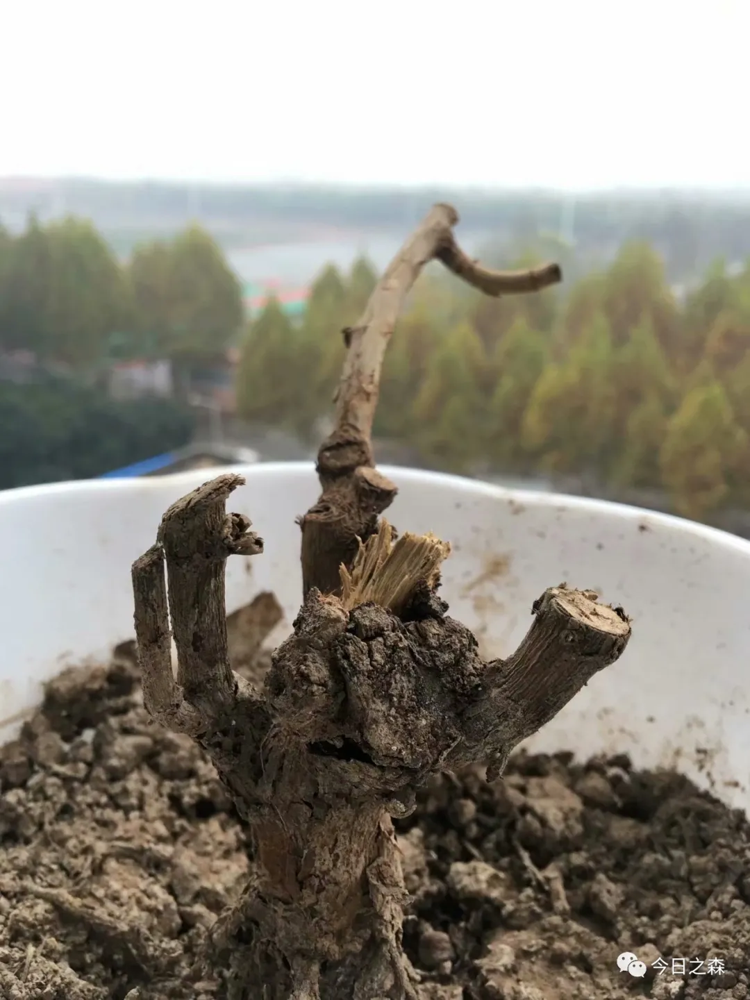
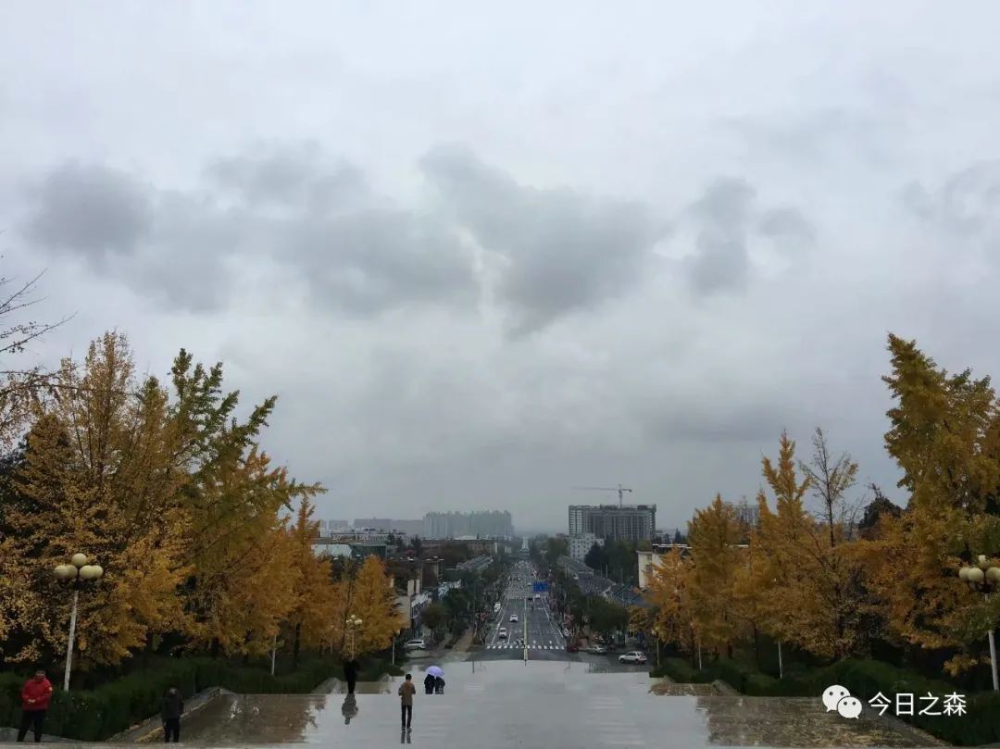
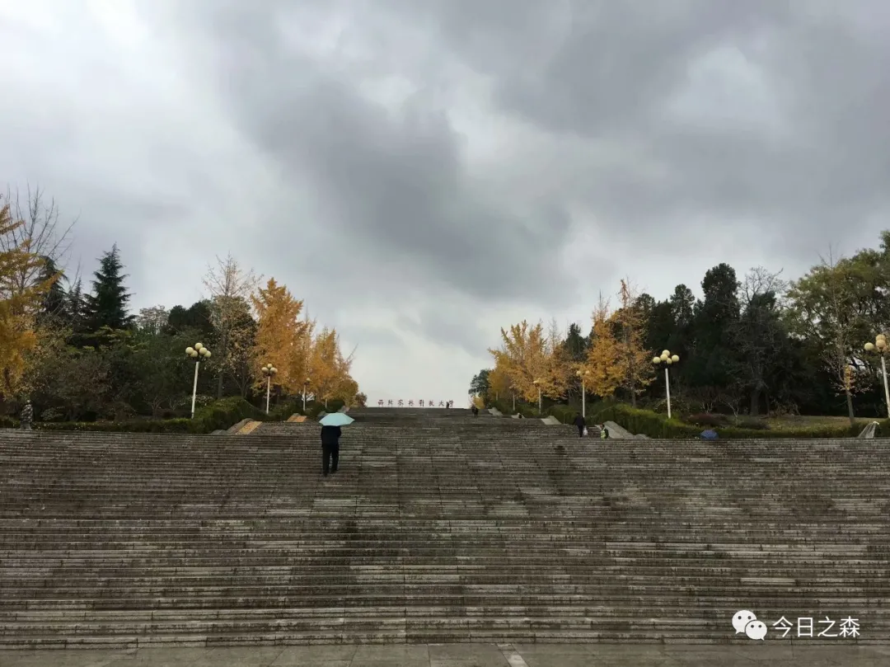
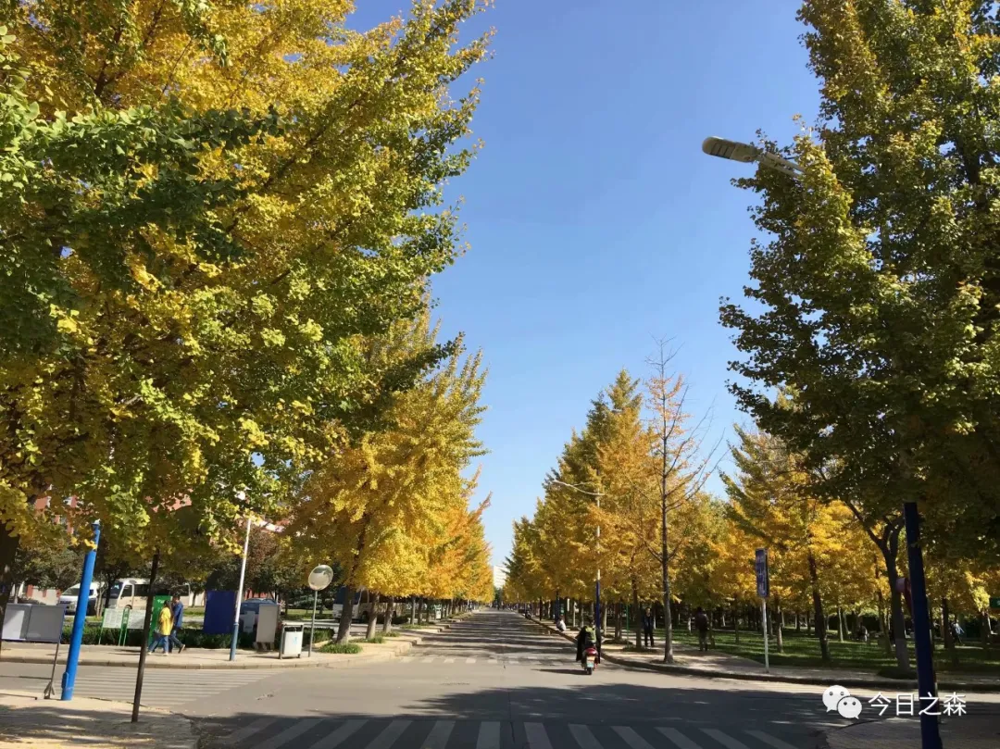
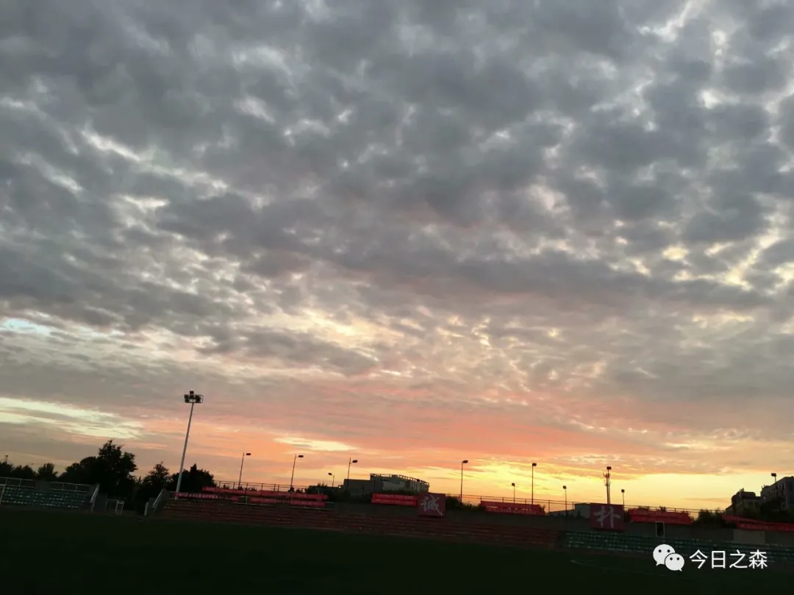
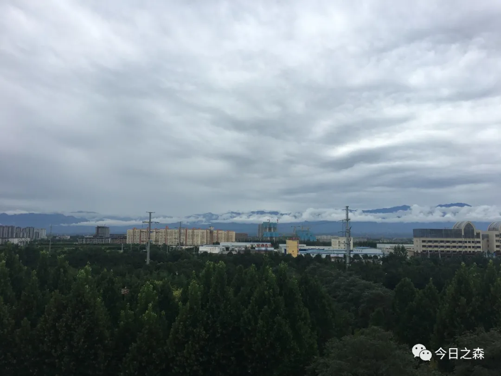

记得高中的时候，我们班是当时为数不多换过很多数学老师的班级，当时大家心中的偶像级数学老师“强哥”，之所以称为强哥，是因为这位老师常常向我们班推崇当时的”浙大强哥“郑强教授的思想，再加上他本身是郑强教授的铁杆粉丝，而当时我们是他的铁杆粉丝。由此而来，他便是我们的强哥。

2014年，高中毕业前夕，老师们都给予我们很多希冀和祝福。而我们这位强哥的一句话我相信深深烙在每一位毕业生的心里。

强哥只说了一句话：高中毕业后，用十年时间让自己成为一个不可或缺的有价值的人。

现在已经2021年，高中毕业快七年了。

想想都可怕，七年时间过去了，很显然没有成为一个不可或缺的有价值的人。

造成这一现状的原因或者借口肯定能找出一箩筐，人嘛，总是倾向于放过自己或者宽恕自己。

我想最大的原因还是得从大一的高数老师说起。有趣的是，很多事情都能和数学老师挂钩。

大一还没正式入学的时候，就在qq群里听学长学姐们说这位神一样的数学老师（当时这位老师的自我介绍是：走错一步路），所以下面就称他为“走错一步路”老师。

之所以称他是神一样的数学老师，原因有以下几个：

当时两个小时的数学课他可能5min就讲完了，剩下的时间让大家自习，有不懂的再找他讨论；

他喜欢喝水，每隔两分钟就要喝一次；

他不修边幅，其实就是穿衣服随便一点。

（因此好像还被学校教务处的老师们约谈过，当时我碰巧就在旁边。）

甚至2年后的某一天中午我偶尔还在教学楼里再次碰见过这一场景，后来“走错一步路”老师离开的时候走得急忘记拿水杯，我急忙送下去。

其实最神的不是上面这些，而是当时上课过程中，面对我们这些刚上大一，对大学生活还充满各种好奇和期待的小萌新，“走错一步路”老师常对我们说，要学会放下，“放下”一词也成为他课堂上的高频词汇，伴随高数课堂始终。

放下手机，就会离网络远一点，离生活近一点。

放下杂念，就可以静下心做事情。

我想这两句话所传达的理念才是这位“走错一步路”老师的初心。一来让我们不要总把手机捧在手心，而与生活和身边的人渐行渐远；二来让我们摒弃杂念，静下心来做事情。

我不知道这算不算巧合。高中数学老师强哥给了我们定了一个总的目标：十年之内让自己成为一个不可或缺的有价值的人。而高数老师给我们具体的实践方法：放下杂念，然后安静努力的成长。

说到这里，起码我是幸运的。两位值得尊敬的老师为班上的每一位学生都指明了方向和方法。

但回过头看，六、七年过去了。显然两位老师的话我都没有听到心里去。哪怕听进去一点点，我想都会很不一样。

而现在读研究生，也无疑又是一场赛道之外自我较量的马拉松，在这个过程中想的也会越来越多，堆积起来就是无限的焦虑。平时不想这事的时候其实倒也没什么，日子也会在平淡中一日日流逝。有时候漫无目的忙碌起来的时候也容易忘记这事儿。

但总会有那么一瞬，就会突然思考，这段时间做了什么？有没有什么进步？实验上有没有结果？思路上有没有新的想法？亦或是最近过的是否有趣？有没有尝试一些有趣的事情？等等一大堆的问号就会接踵而至，然后就会瞬间陷入无尽的懊恼，纠结和焦虑当中，于是这几天肯定都很糟糕，什么也不想做，吃饭也没胃口，当黑夜来临，又失眠。

这种情况并不总是发生，但时常会冒出来。扰乱思绪的同时又是对现状的狠狠一击，因此也得以再次整理情绪重新出发。

这种往复循环的状态就像是努力向渐近线靠近的双曲线，尽管逐渐远离，但始终最靠近。就好比每个人都奉行的初心。

而读研之后的焦虑更多的原因还是归结于没有真正“放下”，没有静下心来思考，没有认真做事情，由此产生的浮躁的思绪只会让时间被无情消耗，而自己却一无所获。

这其实和马拉松一样，我参加过几次正式的半程马拉松，平时也跑过不下几十次25km以上的长跑。长跑是很容易失败的，失败的原因很多：

比如定好第二天早起长跑，结果起不来，然后放过自己；

比如第二天跑前”不舒服“，又不想跑，然后又找借口；

比如第二天天冷，又想放弃；

比如终于开跑了，心里不静，想七想八，随时都想停下来；

比如自我博弈终于跑了快一大半了，又要打退堂鼓，好吧，总是很容易半路中止。

但千说万说，想要成功跑完全程，又很容易，那就是什么都不要想，简简单单，一定会有好的成绩，沿路也能看到美丽的风景。

说起来容易，却又难以做到。虽是废话，可事实如此。这就是人性的弱点吧。

记得本科期间，其实还认认真真研读过几篇硕士论文，那个时候看一篇完整的硕士论文对我来说还是很庞杂的，起初看过很多遍都难以在脑海中形成一个清晰的导图，最后只能一章一章的看。当时由于刚接触实验相关，论文中每一页都有不懂的地方，除了请教导师和师兄师姐们，自己则需要查阅很多相关的文献来找到一个解释。慢慢的，到后来课题做完了，对实验思路也有了清晰的认识，尽管认识依旧浅显，但总归是更进一步了。有了这样的积累和沉淀，在后期做毕业论文的时候也是得心应手，很快就高效的做完了全部的实验和论文撰写。

读研之后，其实说心里话，很少系统全面的研读过一些论文了，大多数时候都是东一榔头西一榔头，这瞅一瞅，那看一看。

读研之后，需要了解的知识面更广，在学习过程中也更觉自己无知，这个时候内心产生的恐惧和焦虑是巨大的。

虽然我也通过各种方式在积累和沉淀，但总觉沉淀和积累的速度远远不如焦虑来的迅猛。

很多时候我的状态就是，文献看不进去，也不知道自己想做什么？可是日子一天天流逝。

这种状态不好不坏，更像一把双刃剑。

显然，我在思考这个问题的解决办法，说明我是在寻找一种出路。因此这把剑于我而言，是一把定期自我警醒的反思之剑。

说到最后，我觉得还是有必要重新思索“放下”的含义，在马拉松赛道上，丢弃所有影响状态的其它，调整好心态和节奏，在领略赛道上以及赛道两边的风景的同时，奔向终点。

我想，这也必定是一场激情洋溢的马拉松比赛，在这条赛道上有必要时常和自己对话。

最后，我们何其相似，又何其不同。图片

