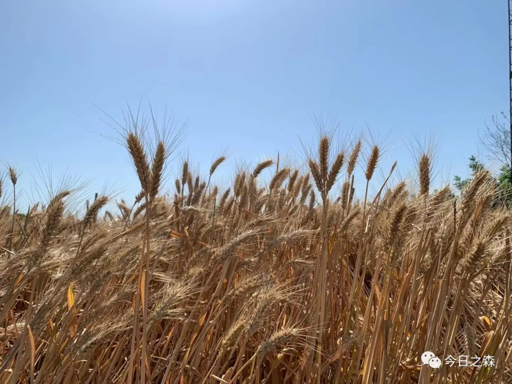

我们经常会处于必须要做出抉择的时候，尤其关于人生的下一步要怎么走！

在思考这一问题的时候一般来说还有机会做出一些选择，人生没有回头路，过往的抉择都无法更改，但下一步的路，自己理应思考，并可以在充分探索的过程中做出抉择！

我的人生中有两次最重要的抉择，现在看来对我影响重大。

第一次抉择，报考高中学校。

当时临近初中毕业，要提前报考高中学校，由于初中三年我的成绩一直呈直线上升，所以在成绩能不能达标县里面最好高中的要求上倒没有怎么担心过，唯一的不自信来源于对城市的恐惧。

我家祖辈都在甘肃的小镇，从出生后一直生活在偏远农村，直到初二的时候，有一天，数学老师推荐我参加县初中数学竞赛，参加竞赛的那天下了雪，那是我自出生以来第一次来到县城。（其实在我八九岁的时候父亲带我去兰州玩过几天，尽管有些印象，但那个时候太小了。）也正是这些因素，在报考县里面高中的的时候我有些不自信，也有些犹豫。

当时父亲跟我说，我建议你报考县里面的省级示范性高中，至于最后到底要不要报，你自己考虑，总之，如果报考县里面的高中，家里全力支持，如果不报，在原来的中学继续读高中，几年以后你不要埋怨我们就行。

听到父亲的这番话，我只在中午回学校的路上犹豫思考了一番，下午就决心义无反顾报考县里面最好的高中。

显然，不管在当时，还是现在，这对我来说是人生中第一个最为重要的选择。这次选择父亲起到了关键的作用。从某种程度上来说是我听了父亲的话。

第二次抉择，参军入伍。

这次的选择，是我自己做出的。当时由于告知家里的时间仓促，父亲和母亲都不是很愿意让我参军入伍，主要还是担心我在部队遭罪。这一次我没有听父母的话，毅然决然报名参军。

两年的军旅生涯对我而言，至关重要，对我后来的学习和生活也产生了重要的影响。

对于人生路，每个人都有不同的思考，但通常除了反思过往，更重要的就是对下一步做出规划。

总之，但愿每次回忆，对生活都不感到负疚就好。

图片来源：史漂亮