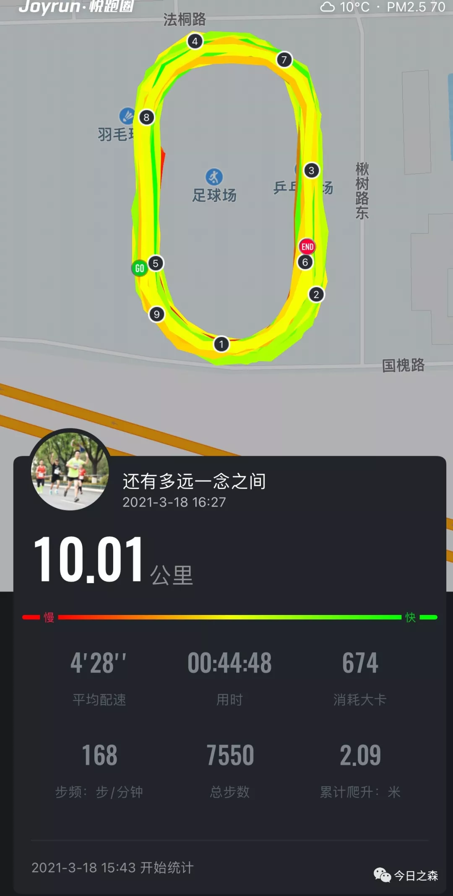
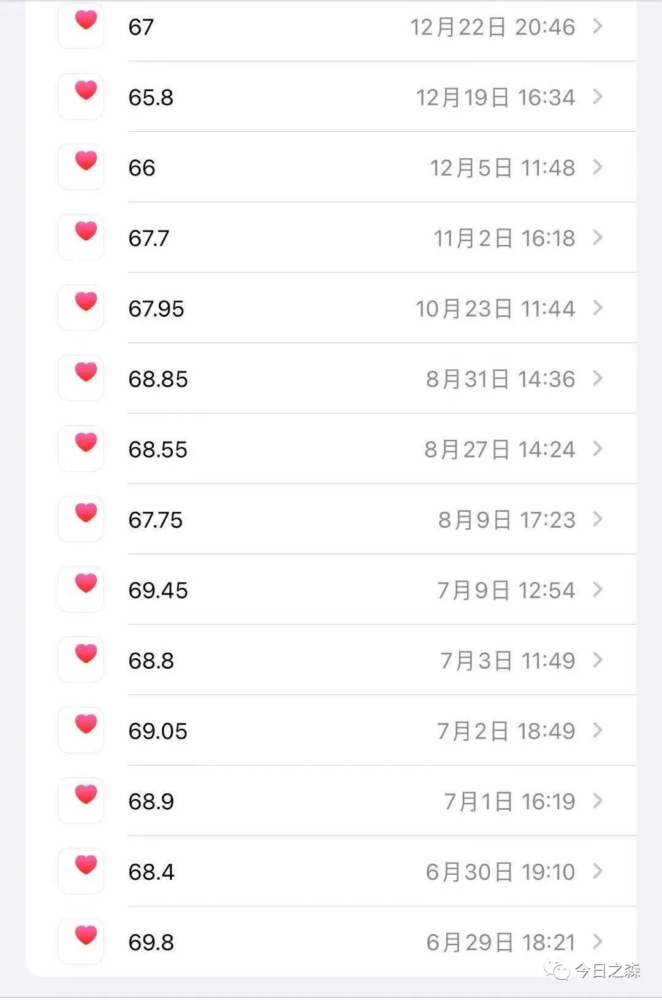

还有多远，一念之间。

是我很早之前脑海中思索的一句话。

有时候想想，还真是还有多远，就在一念之间。

小时候看西游记，只觉得有趣。

现在看来，或许唐僧西去取经意志坚定，从未动摇。但在遭逢妖魔鬼怪和坎坷磨难的时候，唐僧作为取经队伍的主心骨，肯定也在心里不断和自己博弈，西天就在不远处，再坚持一下，马上就能求取真经。

在这十几年的取经历程中，不知道唐僧要经历多少次还有多远一念之间的考验，但终究师徒四人取得真经，修成金身。

跑步的时候亦是如此。

每次跑着跑着就不想跑了。一个人在长跑过程中总是很无聊，很容易疲倦，也就容易中途停下来。尤其跑到八九公里的时候最容易放弃，可是这个时候放弃了，再想达成目标又得重新来过，所以每次快要放弃的时候就需要快速调整心态，边调整呼吸，边暗示自己，不要胡思乱想，不要往前看，低头再跑一会儿。等从刚才的纠结中反应过来的时候又多跑了两三公里。

我觉得跑步过程中最难克服的有两个过程，一是开跑之前的心理活动很难克服，虽然我经常跑步，也经常长跑，但偶尔在开跑之前还是充满恐惧。二是刚才说的过程中提到的一念之间的较量和自我博弈。

前天下午跑步的时候，也是这种情况。

由于前天下午天气还算好，空气也还可以，所以跑前没有心理作祟，但是跑到五六公里的时候就开始打退堂鼓了，因为那会儿跑步的人不多，总共就七八个，我没有找到和我配速差不多的跑者。

结果正在进行自我博弈的时候，有一小朋友骑着自行车来跟我赛跑，他骑着自行车在前面，我追着自行车跑。哈哈，有趣的追逐。不经意间便跑完了十公里。

10km用时约45min。
跑步就是这样，只有一直坚持，才能基本保持较好的状态和水平。我记得最快的时候10km只需40min，现在足足就慢了5min。但是还算恢复的比较快。这次杨马应该还可以追平以前的半马的成绩（半程马拉松，91min）。

持续跑步伴随而来的就是体重持续下降。
去年这个时候，经过三四个月在家蜗居，体重一度从60kg飙升到70kg，足足中了10kg，并以70kg的体重持续到去年九月份。

这就让我很害怕，担心体重一旦超过70kg就很难控制。也就慢慢开始恢复跑步了，到今年一月份基本就维持在65kg左右了。而最近一段时间以来的间歇性跑步（隔一天跑一次，约5-10km），导致体重一再下降。到现在的62.9kg。   

还有多远？

一念之间。

外面空气还算可以，我想，该跑步了。