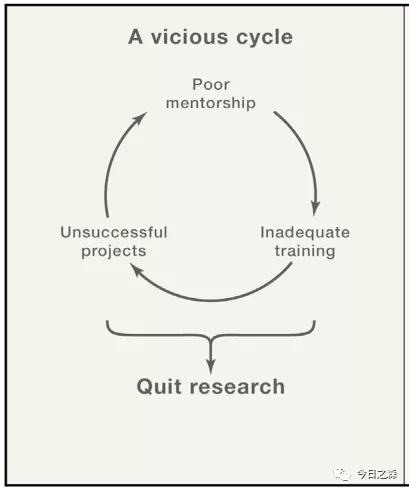
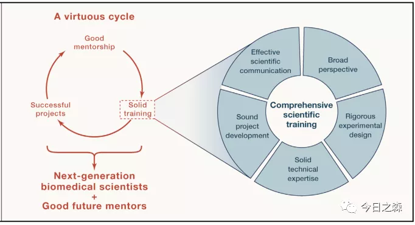

森言森语
去年7月9日，骆利群院士在Cell发表特别评论“Nurturing Undergraduate Researchers in Biomedical Sciences”。就如何培养医学本科研究人员发表了自己的看法。

>骆利群，神经生物学家，美国科学院院士。

下面结合评论并就相关内容阐述我的一些思考。

不论是本科生、硕士研究生、还是低年级的博士生，都是下一代科学家。如何在科研早期接受良好的培养，并形成相对完善的科研素养尤其重要，毕竟这一阶段还具备一定的可塑性，尤其在本科大三大四，及硕士研究生阶段。

培养“下一代”
培养下一代研究人员应该是生命科学的中心任务。绝大多数愿意主动进入实验室接受训练的学生，通常来讲，在接触科学实验的早期大多数学生是具有浓烈的科研兴趣的，尽管此时的认知或许是朦胧的。本科生如此，研究生亦是这样。

这也就意味着学生在接受初步科研训练的阶段尤为重要，几乎决定了将来的发展和兴趣是否继续持续。

然而，在多数情况下，有一个普遍的认知，即只有博士/博士后才是真正的科研人员，只有博士/博士后是下一代科学家，而通常就忽略了本科生和研究生，但事实是，他们中的许多人在进入实验室后努力学习，最终也将成为博士/博士后。这种普遍忽视源自一种普遍的心态。即本科生和研究生不是真正的科研受训者，而只是次于博士生的实验室助手。因此，他们常常需要做重复的，枯燥的，劳动密集型工作。

在这种情况下，忽视也就导致了一部分在刚刚接触科学实验时稍有兴趣并初露头角的学生在将来不久的时间里逐渐远离科学研究。

这其实是值得被讨论的。

通常来讲，与训练博士不同，本科生和研究生的培训很少被讨论。实际上，很多本科生和博士生由高年级的博士生/博士后训练，而博士和博士后也仍然在寻求自己的科学道路，并且通常很少具备指导经验。

（下文将本科生和研究生用“研究生”一词表示。博士和博士后用“博士”一词表示。）
因此，研究生接受的科学训练在很大程度上取决于博士的动机、能力、知识和个性。这一状况在刚接触科学训练时尤其有害。我们可以看到，许多硕士研究生毕业时，都有着不符合标准的研究习惯和科学判断，而这很有可能是他们在本科阶段或者硕士阶段遗留下来的，这严重阻碍了他们未来的发展，也增加了未来很快的时间内放弃科学研究的可能性。

而关键在于，训练有素的科学家不太可能=花精力给受训者提供不合格的指导，从而造成不良指导的恶性循环。

实际上，在这种模式下培养出来的博士生在博士阶段往往会遭遇更多问题，通常来讲，这一阶段培训者需要为受训者花费巨大的精力，然而，多数情况下效果并不好。因为此时的博士生多数已经丧失重塑和再造的可能性。在前期培训中遗留的问题不断积累后，造成未来不具备自主发展的事实。

当然，培训研究生是需要时间和精力的。但从长远看，初期的训练有素，可以吸引许多有才华和创造力的年轻人加入生命科学的领域，并且，在科学培养的过程中，也可以促进培训者的教学发展和职业成功。因此这是值得的。

即便从短期来看，训练有素的研究生也可以为实验室做出很大贡献，在一定程度上也可以加速实验室的研究进展。因此，为研究生提供扎实的培训，创造一个良性循环，尤其值得。

初级同事，而非劳工
培养研究生最常见的问题是，他们被当做廉价劳动力对待，从事重复和耗时的实验室工作。虽然每个人都应该从基本技能开始，通过重复掌握这些技能。

而且重复是一个不可获取的过程，在许多事情上都是如此。在高中阶段，数学老师强哥就持续强调重复的重要性，数学，一定要重复，重复，再重复。而实际上，强哥并没有拿一道十分相似的数学题让学生反复解答，而是每次都会从不同角度针对同一问题设计题目。这可谓科学的数学培训。所以，七年之后，我认为强哥是合格的数学老师和培训者。

培训者似乎真的需要用科学的美和奇迹来激励研究生，避免把研究生仅仅当做一双手。

阐明研究原理和关键方法
比如在开展一次项目之前，培训者应该首先安排一次充分准备大讨论，讨论项目背景，依据和科学目标，以及关键方法的机制。这些讨论将以更广的角度提出了研究生将要进行的实验，并帮助他们相信这一方向值得追求。

应该鼓励研究生大胆的提出问题，直到脑海中每一个难题都得到解决。

培训者应该消除任何的等级观念，将从事科学训练的研究生视为同事，而不是“二流”劳力。

这不仅有利于研究生未来的发展，也有助于保护研究本身。

在不知道原理和方法机制的情况下，任何人都可能会经常在不知不觉中犯错误。而且通常来说，由于缺乏基本认知或“常识”而导致的错误最难被发现，并且可能会在未来华为大量的时间进行故障排除。如果从一开始就对研究生进行全面而科学的培训，就可以顺其自然的尽可能避免很多问题，从而节约时间。

从文献中训练广阔的视野
从三年级研究生身上，我们经常可以看到一种常见的情况，勤奋，精通多种技术，但缺乏广阔的视野。这通常是由于他们在研究生初期接受的不平衡的培训造成的。除了掌握一些培训者希望有人帮助的技巧之外，其它什么都没有教。

然而，要积累知识，从而建立一个领域的大局，最有效的方法是阅读论文。

这一阶段相对较难，很大程度上需要研究生自己克服。一开始就独立阅读领域内的论文可能会让人感到害怕和沮丧。

以下三种类型的论文会提供一个很不错的开端：

>1.与课题组正在进行的项目密切相关的研究论文，这些论文提供了背景，并描述了常用的方法。（高质量的博士论文是一个不错的选择）
2.平衡全面的观点，涵盖相关领域
3.具有卓越实验设计的深远影响的经典里程碑论文

在此基础上，研究生应该学会如何从不断扩展的文献中探索和选择相关的论文，并定期与导师讨论，递进式的更新矫正自己的科研认知。避免将思维固化在一个狭隘的领域。

在阅读文献的过程中，处于好奇心趋势，也会主动了解一个领域的科学史，这可能更加有趣，更有助于未来的研究。

培养有效的科学交流
研究生真正参与到课题讨论中不可被忽略。让研究生参与到课题讨论中，可以提高每个人陈述的技能，因为这需要陈述者更好的准备实验背景的理论基础，而不是简单粗暴的罗列数据，以便研究生能够更好的理解他们的研究。这也将迫使博士更加严谨的要求自己，导师更好的培训研究生。

因为如果一个受训者只展示了数百个DNA凝胶电泳，而没有讨论为什么做了某些实验以及结果的含义，那肯定是一种耻辱。

扎实的研究技能
与成功的导师合作，对研究生来说，也是一把双刃剑。

这可能是一个鼓舞人心的，富有成效的旅程。因为此时的导师正在取得进展，并在过程中发表了一些高水平的论文。

然而，凝视一颗发光的恒星往往会产生错觉。研究生可能看不到导师数年的苦苦挣扎，因此低估了科学发现背后艰难。

通常。研究生可能会迷失在简单的成功中，而忽视了扎实的研究技能，从而在未来的研究生涯中埋下了一颗定时炸弹。

随后，研究生的自信往往就掩盖了他们自我认知和真实能力之间的差异，这使得自己和导师很难察觉。

不幸的是，他们可能没有想象中那样有能力独立开展研究项目。

方向选择、项目开发和技术技能导致的失败会浪费他们的时间，侵蚀他们的信心，并导致一部分人永久放弃科学研究。

除非，在未来的研究中，有人发现并及时干预。

获得技术专长
虽然，不应该把研究生仅仅当做一双手，但适当的技术培训不能被忽略。但这一过程应该尽早完成，比如在本科阶段。科研初期，培养扎实的技术技能尤其重要。

在了解了实验原理和技术背景之后，培训者应该指导一些实验的每一步，并预见他们可能会犯的错误。当一个错误发生时，应该和受训者一起剖析错误，并讨论研究如何在今后的类似实验中避免同样的错误，而不是疯狂的接管其他的工作。

只有具备扎实的技术执行力，一个人的实验结果才能令人信服。

实验习惯一旦养成，就很难改变，而且试验标准只要降低一次就会一次比一次低。

所以，从一开始就坚持最高技术标准并养成良好的研究习惯，至关重要。

学习设计和管理课题
这部分内容，我深有感触。因为这一阶段是我本科阶段感触最深的科研训练。

研究生培训过程中通常缺少课题设计和管理，这主要是因为他们的实验室工作往往是由几个独立的实验而不是一个完整的科学项目来定义的。

而这一阶段最有效的培训，就是尝试设计一个相对独立的科学项目，在研究生阶段尽可能的全部执行。这个过程中可以获得一套完整的研究技能，并学会如何在出现不受欢迎的意外时排除故障。

最重要的是，在这一过程中，研究生可以基本具备管理课题的能力。

我很幸运。在本科阶段的科学训练中与我的导师相识，导师在获悉我想加入他们的研究团队后，非常重视，在和我简单交流之后，专门安排助理教授和我当面交流并讨论。尽管那个时候我对科学研究的认知十分陌生，甚至不怎么清楚将来的几年内会做什么。但在和导师几次讨论和交流之后，初步确定了一个完全独立的课题：“稻瘟病菌对肟菌酯的抗药性风险评估和抗性机制研究”。

实际上那个时候一开始我对这一课题不怎么了解，但导师还是多次专门抽出一整个下午的时间，与博士后共同讨论，交流，一方面是让我初步明确开展这一课题的研究意义和目的，另一方面也是通过多次耳濡目染的交流，加深我的印象。而博士后在后来的具体实验过程中给予我很多指导，甚至多次示范实验操作技能。后来通过阅读相关课题的硕士毕业论文，逐渐对课题有了清晰的认识和把握。在半年之后，已经基本具备独立开展类似研究的技能。以至于在本科阶段仅仅用了半年多的时间就完成了第二个独立类似课题的全部研究结果和数据整理过程。

在整个过程中，离不开导师对我科学全面的培养。使得我在后来的研究生阶段能够尽快进入状态，并逐步进行自我培养和塑造。可以说，本科阶段接受的科研训练几乎决定了我后来的发展轨迹。

在本科阶段的独立实验过程中，基本可以在以下几个方面的取得长足的进步：

独立管理课题，并具备随机应变的能力；
系统的掌握一整套实验技能，足够对领域内类似实验有基本的把握；
具备实验数据的整理和分析能力；
具备一定的讲演能力，毕竟在结题后需要汇报自己的研究进展；
具备撰写文稿的基本能力。
最重要的是这一过程中培养科研的兴趣和严谨的科学态度。

自我培养和塑造最难能可贵
不论如何，都应该主动出击，而不是坐等机会。通常来讲，自上大学起，尤其进入研究生阶段后，基本具备独立判断和思考的能力，应该抽出专门的时间思考自己的未来，并初步绘制一个蓝图，并主动和导师交流并分享自己的想法。

等待只会被动，只有尽可能调动主观能动性，主动思考科学问题，就感兴趣的领域深入了解，并不断阅读和积累经典文献，才能逐步具备科学研究的能力和水平。