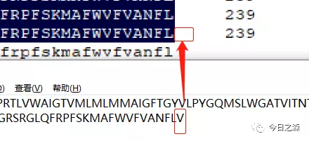

前段时间给同学修改硕士毕业论文的时候，我发现DNAMAN比对结果输出后存在一个bug，这个bug在这篇推文《新手学习R语言方法论》中特意提到了，感兴趣的同学可以去看一下，看能不能发现哪里有bug。

因为多序列比对在我本科毕业论文中也涉及到了，其中放置了一张氨基酸多序列比对图，刚才实在无聊，就找到本科毕业论文把图和原始序列核对了一下，果然又发现了这个bug。

很明显，在输出的图片中，原始氨基酸序列中的末位氨基酸V丢失了。

虽然这个bug不影响什么，但是是一个瑕疵。

两年前这个bug就存在，而今年又遇到，可是两年前我却没有发现……

于是我拿原始序列用之前推过的《科研作图Jalview软件：多序列比对结果-美化-编辑》进行比对。

从上图看到比对过程中是有V的。那输出之后再看看。

输出之后，多序列比对结果还是完整的。

那怎么解决呢？

就很简单了，既然末位在输出图片后会丢失，那就在比对前在原始序列最后加一个任意字符。

比如我在最后加X。（其实加什么都可以）

可以看到，比对过程中X还在。

然后导出为图片。

可以看到，导出为图片后末位的X神奇的丢失了。这样就算暂时规避了这个小bug，但规避之后肯定会存在一些问题。当序列较短时，就会很明显出现这样的情况：

最后，关于这个比对结果，还有一些小瑕疵。比如下面这个放大图：

再来看小图：

好像没毛病。

总之，这个瑕疵我还没有解决，因为我没找到DNAMAN中哪里可以设置这个。这个问题在两年前我本科毕业论文中也存在，那个时候还没有对DNAMN的参数进行设定，使用的都是默认参数。

所以，最后我就很好奇，有没有同学使用正版DNAMAN的，看看这两个bug是不是真的存在。

最后的最后，大家最近在写毕业论文过程中或者曾经的毕业论文中有没有遇到这个问题。

哈哈哈……图片