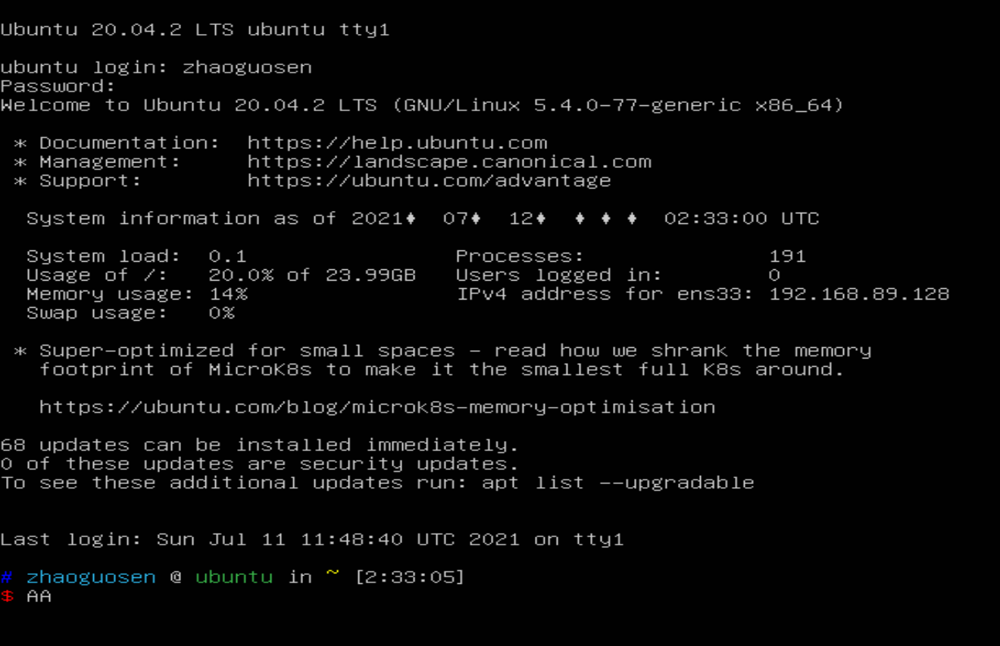
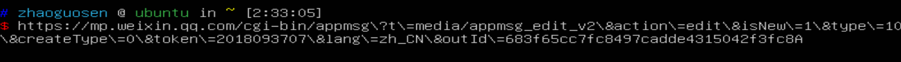

## 森言森语
>我有个不为身边人所知的乳名，读音为`xi xin`，对应的汉字一直没有定论。长大后听父母说，这个小名实际上是我出生后，母亲对我的称谓，母亲原本打算将`xi xin`作为我的正式名字，但由于我哥大我六岁，遵常理，我的名字应该和我哥的名字对应起来，故而没有在正式的名字中沿用`xi xin`，但家人自小管我叫`xi xin`，所以街坊邻居只知道乳名，而不知道官名，而同学朋友只知我官名而不知道小名。思来想去，在微信公众号我就叫`xi xin`吧。
## 进入正文
windows用了那么久，也该用用Linux，于是上周捣鼓了一下虚拟机，感觉还行，于是就决定花几天时间简单写写Linux相关。反正想学一些东西，总会有很多坑，或深或浅。所以写这个系列，主要是梳理一下学习笔记。

在此之前我其实在Windows系统中的Linux子系统，简单运行过本地`blast+`，`mafft`，`hmmer`，`Fasttree`等，当时不知道这实际上就是一些Linux相关命令的操作。实在无知。

所以在这篇推文中主要记录从Windows到Linux这之间的一段路及踩过的一些坑。

## 虚拟机的选择
之前说过，我在Windows用过自带的Linux子系统，后来放弃的原因是因为真的鸡肋，有时本地blast运行时间会较长，那个终端窗口就会一直占用，一不小心鼠标点一下那个窗口，就会自动终止当前命令，也就是后来的`Ctrl+C`效果，鉴于这个因素，果断舍弃。

于是就有了虚拟机的骚操作，暂时选择虚拟机是因为我还没有可用的服务器，这里有几个概念需要厘清，我也花了一两天的时间才大概弄明白。虚拟机，顾名思义，就是可以模拟虚拟操作系统的软件，在虚拟机中可以安装自己想要的任何操作系统，比如可以在Windows10主机上安装Windows11体验，或者Ubuntu，或者CentOS，或者其他。用虚拟机的好处在于，在虚拟机中安装的系统和主机系统是独立的，在虚拟机中可以安装想要测试的系统或软件，而不用担心主机系统被破坏。

那服务器又是什么呢？实际上服务器的本质也是一台电脑，只不过可以简单理解为超级电脑，那服务器有什么用？举个栗子，比如小麦基因组（14G）比对到自身，需要强大的配置，如果在自己的笔记本上面运行，可能就相当吃力，也很耗费电脑硬件，这个时候就可以把数据上传至服务器，通过shell远程命令服务器运行。

那上面说的Ubuntu和CentOS又是啥？怎么一会儿Linux一会儿Ubuntu的，Linux分为内核版本和发行版本。常说的Linux其实按道理指的是Linux内核，而Ubuntu和CentOS就是Linux的发行版本。

最后再来说虚拟机的选择。
目前常用的虚拟机有开源免费的VirtualBox，商业化的VMware，两款都可以，对于初学者来说，没必要花时间在虚拟机的选择上纠结。我纠结了两天，两款虚拟机都安装了一下，总体感觉都差不多，最后卸载了Virtualbox，保留了VMware。
## Linux发行版本的选择
Linux发行版本的选择对于初学者来说真的是一件头疼的事情，Linux和Windows不一样，Windows没得选，就跟IOS一样没得选，买了电脑，就是Windows系统。但Linux不一样，Linux发行版本众多，除了刚才提到的两种之外，还有至少几千种，比较流行的也有十几二十种。

所以对于初学者来说，一定会思考一个问题，那就是选择一个怎样的Linux发行版本，有时候没得选其实也挺好的，就不用纠结，选择多了反而眼花缭乱。白白在选择中浪费时间。

最初我也是纠结的，纠结了两天，看了写视频，最终就选了Ubuntu，而Ubuntu又分桌面版和服务器版。桌面版，实际上就跟Windows差不多，有可视化界面，也可以通过鼠标点点点才操作，但这不是Linux的灵魂所在，反而还要占用更多没必要的内存和磁盘，于是就直截了当的选择了Ubuntu sever版本，服务器版本只有命令行界面，是非常原始的窗口，最开始接触可能真的会很不习惯，因为我之前自己瞎捣鼓过本地blast之类的，其实看着这个古老的界面感觉也就那样。比如下面这样：

其实后来我又安装了CentOS，但是莫名其妙安装了个桌面版的，因为初心就是为了学点命令行，桌面版我就很不爽，于是就把CentOS卸载，只保留了Ubuntu。

其实真实的原因是，最初安装Ubuntu出现坑，一时半会没能解决，于是就安装了CentOS，结果没想到坑依然在，所以又转回去捯饬Ubuntu。

----
下面就记录一下因为无知而在初识Linux时遭遇的一些坑，不管怎么样，总算是解决了。起码可以正常使用Linux了，
### 坑1——主机和虚拟机无法共享粘贴板
这是我遇到的第一个坑，也是我第一个急需解决的问题，因为用的是虚拟机，所以必须实现主机和虚拟机的粘贴板共用，这样才可以实现下面的情况：即从主机浏览器复制的链接粘贴到Linux终端。比如下面这样：

这么长的链接难道要我敲键盘么？这肯定行不通。
于是Google了很多下都不能解决，终于在某个角落发现一种解决办法：
>在主机中复制链接，然后把鼠标切换到虚拟机窗口，然后按ctrl Alt把鼠标切换回主机窗口，然后按ctrl v，即可复制成功。步骤相对繁琐，但起码可以用了，但我总觉得不应该是这样的，应该有更便捷的方式。

### 坑2——主机和虚拟机无法共享文件夹
本以为解决了共享粘贴板的问题后，共享文件夹应该很简单，没想到设置共享文件夹时需要的问题更棘手，在Google的时候发现这个坑的解决办法和坑1的有很多联系，最终的矛头都指向了VMware Tools的安装。

>出现的问题就是在`/mnt/`下面找不到共享文件夹`hgfs`。

### 坑3——VMware Tools的安装
由于初次接触，所以一直不怎么能搞懂它的安装，网上的教程大都是针对桌面版的，但是我感觉也差不多，不就是点击安装Tools之后解压缩么，但始终没有成功。
最后的解决办法如下：
```R
# 创建挂载点目录并挂载 CD-ROM 驱动器：
mkdir /mnt/cdrom && mount /dev/cdrom /mnt/cdrom
# 解压缩安装程序：
tar zxvf /mnt/cdrom/VMwareTools-10.3.2-9925305.tar.gz
# 使用 tab 键自动补全 VMwareTools 包文件名
# 运行安装程序并配置 VMware Tools：
cd vmware-tools-distrib
./vmware-install.pl
# 一般情况下，按照默认设置一直回车就可以了。
Creating a new initrd boot image for the kernel.
The configuration of VMware Tools 10.3.2 build-9925305 for Linux for this 
running kernel completed successfully.

Enjoy,

--the VMware team
# 提示这个，就说明 VMware Tools 安装完成了。
```


反正看了VMware官网的教程，也是上面的步骤，不知道为啥很多次都没有成功，只有这一次成功。反正先这样吧。起码可以看到共享文件夹`/hgfs`了。


## 坑4——Linux主题oh my zsh的安装
命令行也可以有点颜值吧！
起初，命令行长这样：

这实在太丑了，我都分不清哪一行是命令行，哪些行是输出行。
于是准备安装一个主题oh my zsh！
结果oh my zsh官网公布的站点根本用不了。
废了好大劲才找到国内镜像。
```R
#安装 zsh
sudo apt-get install zsh
#安装 oh-my-zsh
wget https://gitee.com/mirrors/oh-my-zsh/raw/master/tools/install.sh
#然后给install.sh添加权限：
chmod +x install.sh
#然后执行install.sh：
bash ./install.sh
#然后保存退出：
:wq
#配置 zsh
vim ~/.zshrc
#修改主题
ZSH_THEME="ys"
```
于是，我的命令行暂时就成了这样：

比刚才好看多了吧，就先暂时配置到这里吧，以后掌握更多技能了再来定制它。

到此，基本上就有了Linux的操作环境。