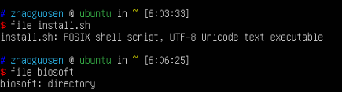
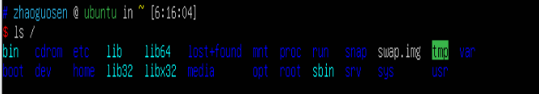
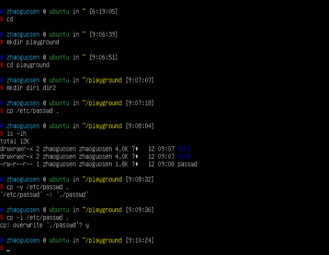
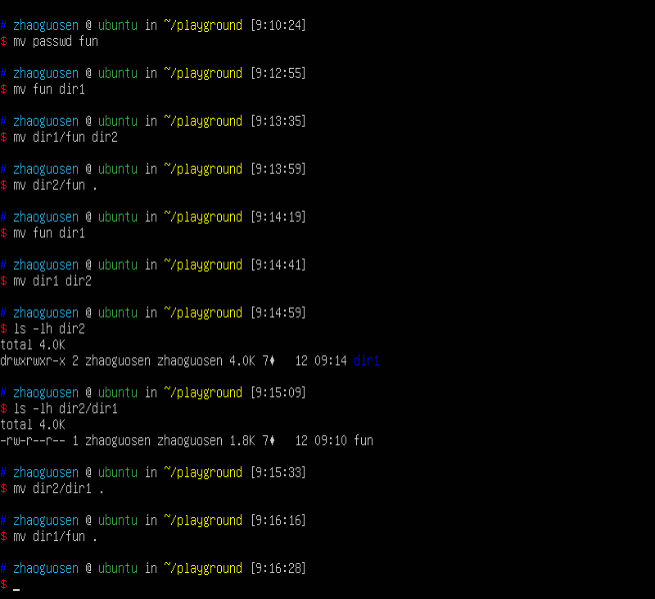
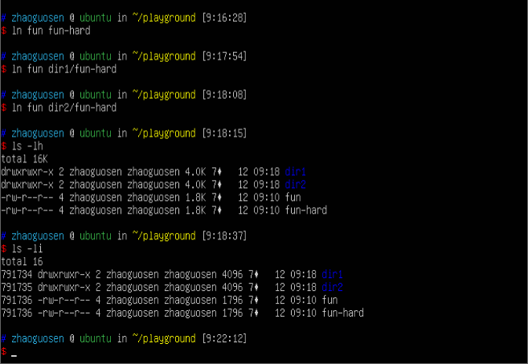
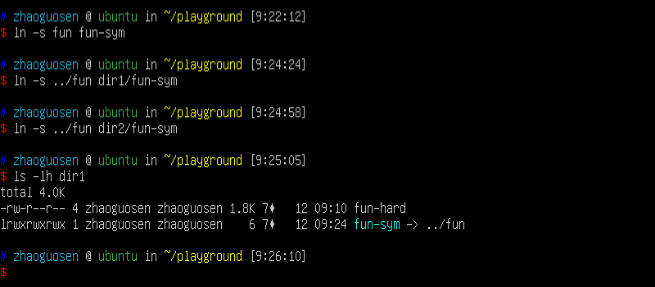
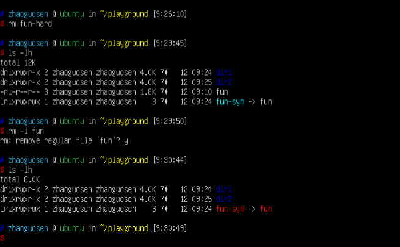
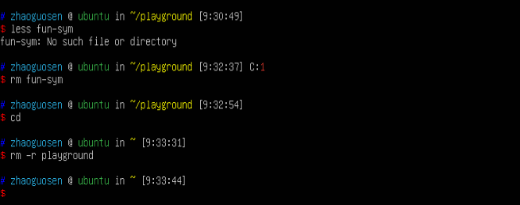

# 1 shell是什么？
>简要了解shell，并第一次输入命令。

 关于鼠标与焦点  
 
 简单输入及格命令试试看 
 ```R 
 date 
 cal 
 df 
 free 
 exit 
 ``` 
 
 # 2 导航 
 >主要学习以下命令 
 >- pwd 
 >- cd 
 >- ls  
 
 理解文件系统树就很重要，这对于不习惯叠衣服的朋友来说可能就比较麻烦，只有很好的理解Linux文件目录架构，才能不那么凌乱。
 
```R
#查看当前工作目录 
pwd 
#列出目录内容 
ls 
#更改当前工作目录 
cd 
#返回上一目录 
cd ..
#进入下一目录 
cd ./bin 
#这里的./通常可以省略 
```  

### 几个有用的快捷键 

```R 
cd 
#将工作目录改变成先前的工作目录，这里的空格不能少！
cd 
#将工作目录改变为username的主目录 
cd ~username 
``` 

注：文件命名中禁止使用空格，可以用_代替空格。
# 3 Linu系统 
> 主要学习以下命令      
ls     
#确定文件类型     
file     
less 

``` 
#以文件修改时间的先后将结果进行排序 
ls -lt 
#以相反的顺序输出 ls -lt -r 
``` 
需要知道，这些命令都可以组合使用，比如`ls -lFrd`。
 
### 使用file命令确定文件类型 
**一切皆文件** 

 

### 使用less命令查看文件内容 

less is more.


### 快速浏览 

 

### 符号链接 
 

# 4 操作文件与目录  

>学习以下命令     
cp      
mv      
mkdir      
rm      
in        

### 通配符 

一时半会儿感觉也用不上，其实也好理解，就先不记了，用的时候再查。

 需要特别注意`rm`命令，Linux一旦使用删除命令，就彻底永久删除了。没有反悔机会。Linux系统默认用户是明智的，并清楚自己在干什么。
 
 另外，`rm`命令与通配符在一起使用时要特别小心。
 
 比如下面的例子： 
 假设我们只希望删除目录中的HTML文件，为此需要输入以下正 确的命令： 
 ``` 
 rm *.html 
 ``` 
 
 如果不小心在*与.html之间多打了一个空格，如下所示： 
 ``` 
 rm * .html 
 ``` 
 
 rm 命令将会删除目录中所有文件，并提示说明目录中没有叫做.html的文件     
 
 提示： 
 
 当rm命令与通配符一起使用时，除仔细检查输入内容外，可使用ls命令预先对通配符做出测试，这将显示欲删除的文件。紧接着，你可以按下向上方向键调用之前的命令，并 使用rm代替ls。     
 
 ### ln——创建链接 
 
 这个地方怎么理解呢？    
 
 硬链接类似于文件本身；    
 
 软链接相当于Windows中的快捷方式。
 ### 实战演练 
 
 #### 创建目录&复制文件 

 
#### 移动和重命名文件 
 
#### 创建硬链接 
 
#### 创建符号链接 
 
#### 移除文件和目录 

由于它是一个符号链接，且指向的文件现在已经不存在，所以链接也就破坏了。
#### 删除playground，实战结束 

  


先学到这里。
  