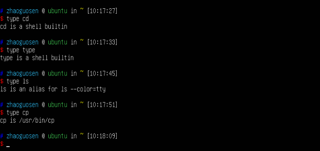
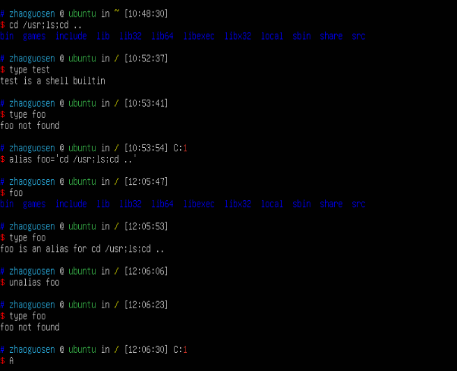
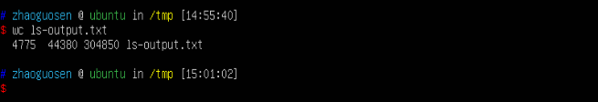
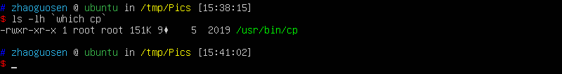

# 5 命令的使用  
>`type`：说明如何解释命令名。     
`which`：显示会执行哪些可执行程序。    
`man`：显示命令的手册页。     
`apropos`：显示一系列合适的命令。     
`info`：显示命令的info条目。     
`whatis`：显示一条命令的简述。     
`alias`：创建一条命令的别名。      

  
#### 使用别名创建自己的命令  
  
# 6 重定向  

>`cat`：合并文件。       
`sort`：对文本行排序。        
`uniq`：报告或删除文件中重复的行。       
`wc`：打印文件中的换行符、字和字节的个数。          
`grep`：打印匹配行。          
`head`：输出文件的第一部分内容。        
`tail`：输出文件的最后一部分内容。         
`tee`：读取标准输入的数据，并将其内容输出到标准输出和文件中。

 重定向很好理解，就跟起初我做本地blast的时候一个概念。
 
 ``` 
 #文件描述符“2”紧放在重定向符之前，将标准错误重定向到ls-error.txt文件中。     
 $ ls -l /bin/usr 2> ls-error.txt 
 #将标准输出和标准错误重定向到同一个文件 $ ls -l /bin/usr > ls-output.txt 2>&1 
 ```  
 
 最近的bash版本提供了效率更高的第二种方法来实现这一联合的重定向操作。
 ``` 
 #在这个例子中，只使用一个标记符“&>”就把标准输出和标准错误都重定向到了ls-output.txt文件中。
$ ls -l /bin/usr &> ls-output.txt 
```  


#### 处理不想要的输出      

``` 
$ ls -l /bin/usr 2> /dev/null 
```  

#### 标准输入重定向      
举个栗子  

``` 

#如果这些文件命名为 
movie.mpeg.001 movie.mpeg.002...movie.mpeg.099 
#我们可以使用这个命令让它们重新连接在一起。
$ cat movie.mpeg.0* > movie.mpeg 
```  

通配符一般都是按照顺序来扩展的，因此这些参数将按正确的顺序来排列。
## 管道  

``` 

$ ls -l /usr/bin | less 
$ ls /bin /usr/bin | sort | less 
#在管道中添加uniq命令，可以确保所有的列表都没有重复行（即在/bin和/usr/bin目录下都出现的相同名字的任意程序）。
$ ls /bin /usr/bin | sort | uniq | less 
#如果反过来想要查看重复行的列表，可以在uniq命令后面添加-d选 项，如下所示。
$ ls /bin /usr/bin | sort | uniq -d | less 
#打印行数、字数和字节数 $ wc ls-output.txt 
#-l选项限制命令只报告行数，把它添加在 管道中可以很方便地实现计数功能。如果我们要查看已排好序的列表中的条目数，可以按以下方式输入。
$ ls /bin /usr/bin | sort | uniq | wc -l 
```  

  

###### grep——打印匹配行  
``` 
#如果想我们从列出的程序中搜索出文件名中包含zip的所有文件，该搜索将获悉系统中与文件压缩相关的程序，操作如下。
 $ ls /bin /usr/bin | sort | uniq | grep zip  
 ```  
 
 grep存在一对方便的选项：-i，该选项使得grep在搜索时忽略大小写（通常情况下，搜索是区分大小写的）；-v，该选项使得grep只输出和模式不匹配的行。
 
 # 7 透过shell看世界  
 >学习`echo`命令  
 
 