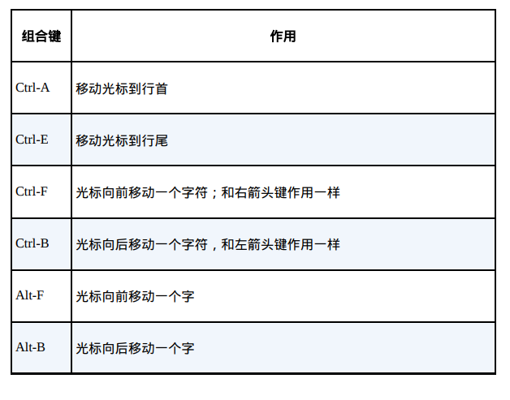
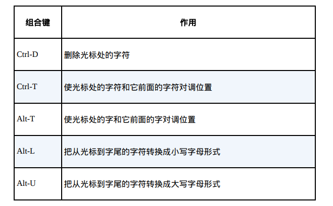
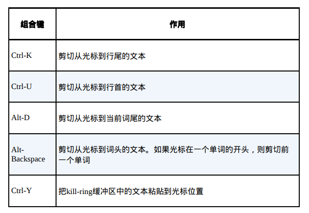
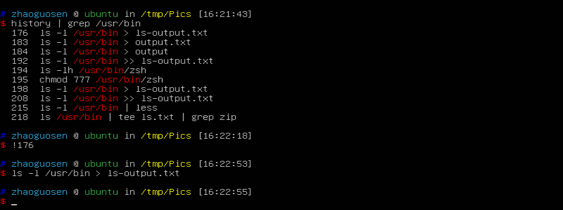
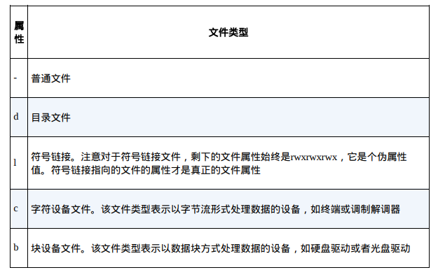
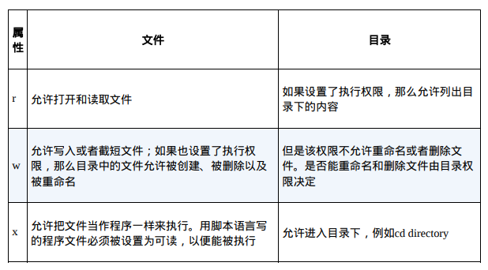

# 8 高级键盘技巧
>学习以下命令    
`clear `   
`history `

# 9 权限
>`id`：显示用户身份标识。     
`chmod`：更改文件的模式。     
`umask`：设置文件的默认权限。    
`su`：以另一个用户的身份运行shell。    
`sudo`：以另一个用户的身份来执行命令。    
`chown`：更改文件所有者。    
`chgrp`：更改文件所属群组。    
`passwd`：更改用户密码。    

## 读取、写入和执行

## 更改身份
su命令和sudo命令之间的一个重要区别在于sudo命令并不需要启动一个新的shell环境，而且也不需要加载另一个用户的运行环境。这意味着，使用sudo命令的时候并不需要用单引号把命令行引起来。
## 更改用户密码
`Passwd [user]`
# 10 进程
>ps：显示当前所有进程的运行情况。             
top：实时显示当前所有任务的资源占用情况。        
jobs：列出所有活动作业的状态信息。         
bg：设置在后台中运行作业。         
fg：设置在前台中运行作业。         
kill：发送信号给某个进程。         
killall：杀死指定名字的进程。            
shutdown：关机或者重启系统。 

# 第一部分 学习shell完结