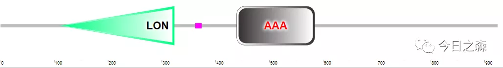
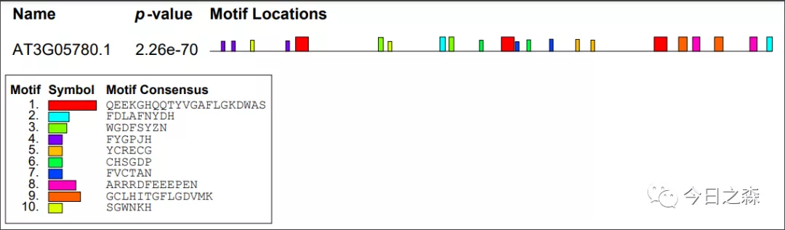

Domain和Motif是我之前一直都捋不清的两个概念，具体刚好想起来，就简单写一下它们之间的区别与联系。

【进入正题】      
这个地方就随便找个拟南芥蛋白举例子。     

>AT3G05780.1      
MMPKRFNTSGFDTTLRLPSYYGFLHLTQSLTLNSRVFYGARHVTPPAIRIGSNPVQSLLLFRAPTQLTGWNRSSRDLLGRRVSFSDRSDGVDLLSSSPILSTNPNLDDSLTVIALPLPHKPLIPGFYMPIHVKDPKVLAALQESTRQQSPYVGAFLLKDCASTDSSSRSETEDNVVEKFKVKGKPKKKRRKELLNRIHQVGTLAQISSIQGEQVILVGRRRLIIEEMVSEDPLTVRVDHLKDKPYDKDNAVIKASYVEVISTLREVLKTNSLWRDQDIGDFSYQHLADFGAGISGANKHKNQGVLTELDVHKRLELTLELVKKQVEINKIKETDDGSSLSAKIRVRIDTKRDKIPKHVIKVMEEEFTKLEMLEENYSDFDLTYNYLHWLTVLPWGNFSYENFDVLRAKKILDEDHYGLSDVKERILEFIAVGRLRGTSQGKIICLSGPPGVGKTSIGRSIARALDRKFFRFSVGGLSDVAEIKGHCQTYVGAMPGKMVQCLKSVGTANPLILFDEIDKLGRCHTGDPASALLEVMDPEQNAKFLDHFLNVTIDLSKVLFVCTANVIEMIPGPLLDRMEVIDLSGYVTDEKMHIARDYLVKKTCRDCGIKPEHVDLSDAALLSLIENYCREAGVRNLQKQIEKIYRKVALELVRQGAVSFDVTDTKDTKSLAKTDSEVKRMKVADIMKILESATGDSTESKTKQSGLVAKTFEKVMIDESNLADYVGKPVFQEEKIYEQTPVGVVMGLAWTSMGGSTLYIETTFVEEGLGKGGLHITGQLGDVMKESAQIAHTVARRIMFEKEPENLFFANSKLHLHVPEGATPKDGPSAGCTMITSFLSLAMKKLVRKDLAMTGEVTLTGRILPIGGVKEKTIAARRSQIKTIIFPEANRRDFEELAENMKEGLDVHFVDEYEKIFDLAFNYDH

将该蛋白序列提交至Smart网站，由下图可见该蛋白主要包含两个结构域，也就是domain。

再将该蛋白序列提交至MEME网站，由下图可知搜索到的10个Motif。
 
通过这两张图，是不是对domain和motif有个大致认识。

【区分】

模体（motif）

motif的概念比domain更加宽泛。它可以是多个domain或domain与其它部分结合形成的行使某个功能的复合物。
是不同蛋白质之间共享的蛋白质三维结构或氨基酸序列的小区域。
是可以通过独特的化学或生物学功能定义的蛋白质结构的可识别区域。
motif大多情况下指的是通过弱的化学键连接的一段序列或结构，所以它是不能分割的。一旦分割，结构就受到了破坏，原先的功能便不复存在。
结构域（domain）
是指蛋白质三级结构中一个稳定的、独立的折叠部分。
是行使功能的基本单元，即便蛋白的其它组成部分缺失，它依然可以发挥功能。