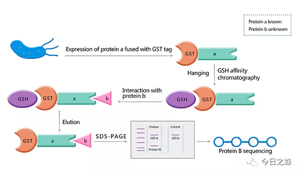
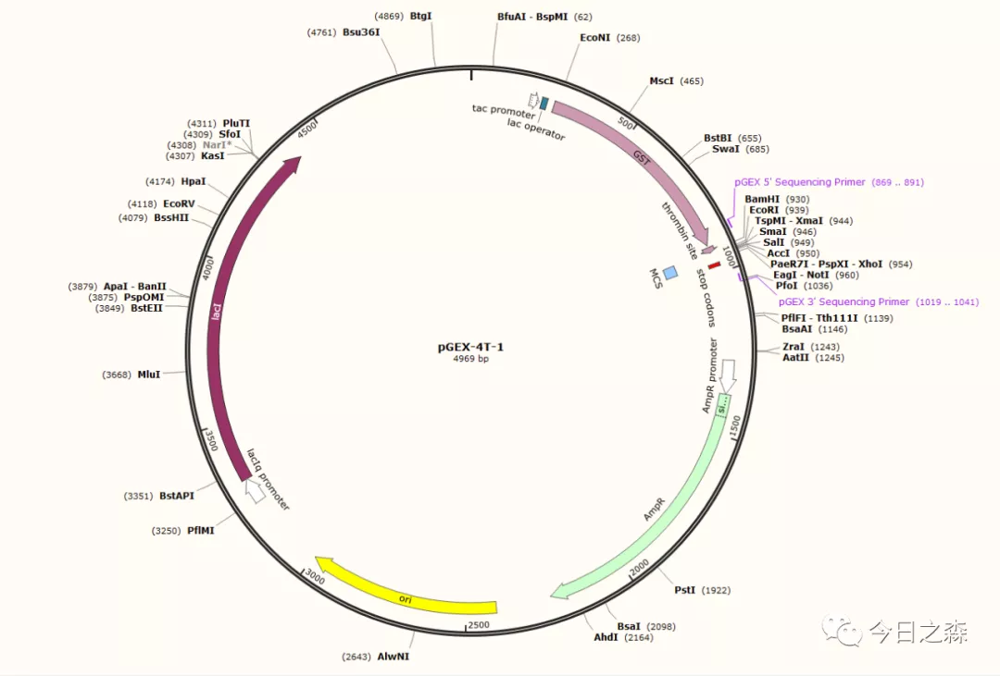

pull down实验又被称为蛋白质体外结合实验（binding assay in vitro），是一种验证酵母双杂交系统的体外试验技术。

1988年，Smith等人利用GST融合标签从细菌中一步纯化出GST融合蛋白[1]。

此后，GST pull down作为体外检测蛋白相互作用的常用方法被广泛使用，可验证已知蛋白之间的互作，也可用于筛选与已知蛋白互作的未知蛋白。

基本原理    

GST-pull down利用GST（谷胱甘肽巯基转移酶，glutathione S transferase，GST） 对GTH（谷胱甘肽，Glutathione，GTH）的亲和性，将bait-GST融合蛋白亲和固化在GTH磁珠上（bait-GST融合蛋白通过GST与固化在磁珠上的GTH结合结合），当目的蛋白溶液过柱孵育时，可从中捕获与之相互作用的prey，洗脱结合物之后可通过SDS-PAGE或Western blot分析，从而证实两种蛋白的相互作用或筛选prey。

其中，bait和prey可通过细胞裂解物、纯化的蛋白、表达系统及体外转录翻译系统等方法获得。
  
图片来源：http://www.merrybio.com.cn/blog/gst-pull-down-introduction.html 

实验思路  

制备并纯化bait-GST融合蛋白，获得结合bait-GST的磁珠；  
制备prey protein（可选择His/Flag/HA/Myc等标签）； 写到这里就在想，这么多不同的标签，在纯化蛋白时，各自的原理又是什么呢？所以，下一篇推文就写不同的标签在蛋白纯化和检测时各自发挥的功能。
使结合bait-GST的磁珠与含有Prey的溶液体外孵育。

需要注意的问题  
GST-pull down 不能用于大范围蛋白间相互作用的筛查；另外由于内源性蛋白的干扰使实验出现假阳性的情况较多。因此，需要考虑以下问题以减少假阳性的出现。

1.高纯度GST融合蛋白的获得（具体操作中就要精细） 
2.载体选择 
pGEX-4T-1是目前构建GST融合蛋白最常用的原核表达载体。
       
  
图片来源：https://www.snapgene.com/resources/plasmid-files/?set=pgex_vectors_(ge_healthcare)&plasmid=pGEX-4T-1  pGEX载体所带的GST标签能够增强下游蛋白的可溶性表达，使融合蛋白易于表达纯化。此外，Ptac位点，能被IPTG诱导表达；lacI位点可控制过表达，能够保证目的蛋白的高质量表达。

3.蛋白表达受影响条件较多，需要不断探索
多数情况下，低温有利于增强蛋白的稳定性和正确折叠，易获得可溶性蛋白，而较高温度的诱导易使蛋白形成包涵体。
此外，还与诱导时间，IPTG浓度，残留的DNA/RNA等有关。

【Reference】    
[1]Smith DB, Johnson KS. Single-step purification of polypeptides expressed in Escherichia coli as fusions with glutathione S-transferase. Gene. 1988 Jul 15;67(1):31-40. doi: 10.1016/0378-1119(88)90005-4. PMID: 3047011.

[2]柴政斌,张更林,韩金祥.GST-pulldown技术在蛋白质相互作用中的应用[J].中国生物制品学杂志,2014,27(10):1354-1358.
   
题外话： 由于pull down是在体外验证两种蛋白间的互作，但在细胞内可能存在两种蛋白不能见面的尴尬，如果强行共孵育，也免不了出现意外情况。因此常作为酵母双杂系统之外的手段在酵母验证互作的情况下进一步证实互作与否。

这就好比人与人相处，实在有趣。  