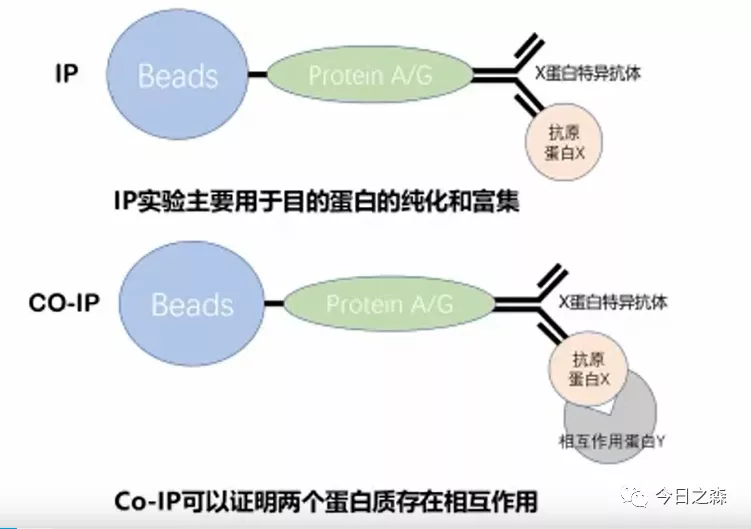

CO-IP，又叫免疫共沉淀（Co-Immunoprecipitation），是以抗体和抗原之间的专一性作用为基础的用于研究蛋白质相互作用的经典方法。

与其它研究蛋白质相互作用的方法相比，免疫共沉淀是在生理条件下检测蛋白质间相互作用，因此，不仅可以检测到体内形成的天然复合体，而且可排除过表达靶蛋白所带来的假阳性；由于内源性的靶蛋白是完全加工、修饰成熟的蛋白质，因此，依赖于修饰的蛋白质间相互作用也可以被检测到。

但是对于刚接触Co-IP实验的小白而言，免不了出现各种疑问。Co-IP的原理是什么？Co-IP结果怎么看？实验过程中哪些关键点需要特别注意？一个成功的Co-IP实验需要由哪些部分组成？
而我也是众多小白之一，所以通过学习针对刚才的问题对Co-IP进行简单总结。

Co-IP基本原理  
当细胞在非变性条件下被裂解时，完整细胞内存在的许多蛋白质-蛋白质（bait-prey，可能不只2个蛋白）相互作用被保留了下来，假如细胞内存在bait-prey蛋白复合物，用bait的抗体免疫沉淀bait，那么与bait在体内结合的蛋白质prey也被沉淀下来。因此在细胞裂解液中加入bait的抗体沉淀蛋白bait，随后利用蛋白印迹(western blot，WB)检测沉淀中是否存在蛋白prey，如果存在，则说明细胞内存在bait-prey蛋白复合物，即蛋白bait-prey存在相互作用。

   
Co-IP流程  
      
看到这里，可能就有疑惑了， 
疑惑点一：抗体？     
基本原理中提到，如果bait-prey存在互作情况，用bait的抗体去沉淀bait时，就可以将bait-prey复合物也沉淀下来。那这里的抗体到底是什么?   
其实通常会给bait加上标签（Myc、HA、Fkag等），标签汇总可参考蛋白标签（检测，表达和示踪标签）都有哪些？然后利用标签抗体沉淀蛋白。   
疑惑点二：实验原理大致清楚了，但是这个实验怎么设置才可以说明问题呢？    

这里涉及的问题就比较多了。
首先需要明确两个概念区分。IP和Co-IP？通过下图理解一下。

     
其次，需要知道，利用内源性 Co-IP 实验验证两个蛋白是否存在已知作用，如果最终的结果为阳性，则可以证明两个蛋白之间存在相互作用；如果结果为阴性，无法证明两个蛋白之间不存在相互作用，也有可能是蛋白在细胞内表达量低、bait-prey结合时间短等原因导致。因此在进行内源性Co-IP验证两个蛋白是否存在相互作用时，可先做过表达Co-IP作为对照。    

既然如此，还需考虑可能出现的假阳性，并针对不同的假阳性情况设置不同的对照试验作为阴性对照。
除了上述情况，Co-IP还需设置一个阳性对照，也就我们常在Co-IP结果中看到的Input组。Input组直接利用bait和prey各自所带标签的抗体对细胞裂解液进行WB检测，以证明细胞裂解液中存在bait和prey。
某些情况下，还会设置Output组，即对IP后的上清分别进行bait和prey的WB检测。

Co-IP结果解读  
先来看一张Co-IP结果图片。
      
 
看图说话：  
由图可得以下信息： 
首先可看到，该图中涉及的Co-IP设置了两个实验组。
第一组：存在GFP标签及EDR1-FLAG蛋白； 
第二组：存在EDR4-GFP蛋白及EDR1-FLAG蛋白； 
图中共有三组胶图，分别是Input组，IP组以及Co-IP组。
蛋白EDR4带有GDP标签，蛋白EDR1带有FLAG标签。

解读： 
首先观察Input组，即阳性对照组。
该组第一块胶图利用anti-Flag沉淀FLAG标签，发现两组实验在130kd处都有条带，说明两组实验都存在EDR1-FLAG蛋白，且大小相同，都为130kd。    
该组第二块胶图利用anti-GFP沉淀GFP标签，发现第一组实验在25kd处有条带，第二组实验在130kd处有条带，说明第一组实验存在GFP蛋白，且大小为25kd；第二组实验存在EDR4-GFP蛋白，且大小为130kd。    

随后观察IP组。    
该组图表示的是利用anti-FLAG对EDR1-FLAG蛋白进行沉淀，图上显示两组实验在130kd都存在蛋白，说明两组实验的EDR1-FLAG被沉淀下来。     

最后观察CO-IP实验组。   

该组图表示在IP组的基础上进一步利用anti-GFP检测GFP标签，图上显示第一组实验没有条带，而第二组实验在130kd处有条带。说明IP组没有把GFP标签共沉淀下来，但是把EDR4-GFP蛋白共沉淀下来了。说明EDR1-FLAG蛋白不能与GFP标签相互作用，但是可以与EDR4-GFP蛋白相互作用。

由此可得到结论：EDR1蛋白可以与EDR4蛋白存在相互作用。

文章开头提到的几个问题中还有一个问题没有回答。

实验过程中哪些关键点需要特别注意？

后面再写。该跑步了图片。
