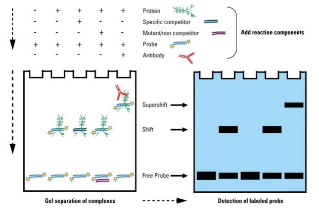

## EMSA实验原理     
凝胶阻滞或电泳迁移率实验（Electrophoretic mobility shift assay，EMSA）
>是一种研究DNA结合蛋白质和相关的DNA结合序列相互作用的技术，可用于定性和定量分析。    
基于DNA-蛋白质或RNA-蛋白质复合体在聚丙烯酰胺凝胶电泳（PAGE）中有不同迁移率的原理，当转录因子与特异的DNA或RNA结合后，其在PAGE中的迁移率将小于未结合核蛋白转录因子的DNA，从而检测到活化的与DNA或RNA结合的蛋白转录或调节因子。

>- **Protein**：细胞提取物中含有的目的转录因子核蛋白，因细胞会提前处理以使得这个核蛋白是激活的  
>- **Specific competitor**：标记探针100倍量的未标记探针  
>- **Mutant/non competitor**：标记探针100倍量的未标记突变探针  
>- **Probe**：同位素标记的探针  
>- **super-shift**：上移，抗体、转录因子、探针形成的复合物分子量更大了，在电泳中的迁移速率下降，因此其条带会出现上移。加入抗体后的反应也就被称为super-shift反应  

## 结果理解
（来自《养鲤鱼》微信公众号）

> - **第1列阴性对照反应**：仅标记探针。按照理论，探针的位置应该位于最下方；否则提示探针里有杂质，影响电泳结果。
> - **第2列常规反应**：激活的目的转录因子的核蛋白＋标记探针。探究目的转录因子是否和探针结合，是实验目的。
> - **第3列探针冷竞争反应**：激活的目的转录因子的核蛋白＋标记探针＋标记探针100倍量的未标记探针。探究探针结合的特异性，如果冷探针（即100倍量的未标记探针）可以竞争结合，阻碍了标记探针（因为未标记探针量太大，标记探针竞争不过它，几乎只有未标记探针和目的转录因子结合），说明第2列中的结合是特异性的（假设如果2中的结合是非特异性的结合，是标记的同位素和目的转录因子相结合，那么3中还会出现标记的同位素和目的转录因子相结合，即会出现第二行的条带）。
> - **第4列突变探针的冷竞争反应**：激活的目的转录因子的核蛋白＋标记探针＋标记探针100倍量的未标记突变探针。按照假设目的转录因子和DNA探针序列相结合，突变的探针应该不能和目的转录因子结合，同样也说明第2列中的结合是特异性的。
> - **第5列Super-shift反应**：激活的目的转录因子的核蛋白＋标记探针＋目的转录因子的特异抗体。探究目的转录因子的特异性，目的转录因子和抗体结合后，因为其形成的复合物分子量更大了，在电泳中迁移速率下降，就会有super-shift。如果没有，说明是其他的转录因子和标记探针结合。
## 常见问题
**1、为什么看不到迁移带？**    
 1）蛋白样本提取质量不高，蛋白降解或者提取量不足。   
 2）样本中没有可以与探针结合的蛋白。   
 3）探针与蛋白无特异性的相互作用。   
 4）转膜效率低，蛋白或者探针未转移到膜上。   
 5）曝光或者成像时间过短。   
 在Super-Shift EMSA测定中看不到Super-Shift DNA/蛋白复合物带还可能有以下原因：    
 6）抗体没有工作。不是所有的抗体都可以用于Super-Shift EMSA，只有对非变性蛋白的表面抗原决定簇起反应的抗体才能够用于Super-Shift EMSA。       
 7）测定的活化的DNA/蛋白复合物中没有希望检测的构成成分存在。此时既看不到Super-Shift的带，也看不到DNA/蛋白复合物的量的减少。    
 8）使用的抗体过度稀释。一般10-20ul的反应液需要使用0.5-1ul原倍的抗体。   
 9）多抗与DNA/蛋白复合物形成大的聚集物而不进胶。在这种情况下，虽然看不到Super-Shift的带，但应当可以看到DAN/蛋白复合物的电泳带明显减少。       
 **2、为什么实验背景高？**    
 1）曝光或者成像时间过长。    
 2）封闭时间不足或者效率不高。    
 3）洗涤效果不佳      
 4）实验过程中膜没有一直处于湿润状态。     
 **3、EMSA测定需要多少量的蛋白与标记的探针？**          
 对每一个特定的结合蛋白和探针，所用的纯化蛋白，部分纯化蛋白，粗制核抽提液需作优化：一般所用纯化蛋白的量在20-2000ng间，可将蛋白:DNA的等摩尔比调整为蛋白的摩尔数是DNA的5倍；用粗制核抽提液，需要2-10ug蛋白形成特异的复合物。   
 部分纯化蛋白与粗制核抽提液应保存在-80℃、探针应保存在-20℃以防止降解。     
 无论探针或是结合蛋白都应避免多次冻融。       
 **4、Poly(dI:dC)，非特异性竞争DNA，特异性竞争DNA在EMSA测定中的作用？**
 Poly(dI:dC)由肌苷和胞嘧啶组成。在EMSA反应中加入poly(dI:dC)，可抑制粗制核抽提液中转录调节因子与标记探针的非特异结合。结合溶液中的poly(dI:dC)的用量需在正式实验前进行优化，一般用量大约在0.05mg/ml左右。当用纯化的蛋白作凝胶迁移反应时，不必一定加入poly(dI:dC)，如加入，则普通反应中所用终浓度不超过50-100ng。对核抽提液，每2-3ug核抽提液用1 ug poly(dI:dC)。    
 
 为确定所形成的复合物的特异性，在含或不含增量的特异竞争DNA或非特异的竞争DNA时，作结合反应的竞争实验。一般，特异竞争探针是非标记的DNA，其序列与标记探针相同，故能与标记探针竞争与结合蛋白的反应。非特异竞争探针的长度组成和DNA探针相同，但序列不同。如果结合蛋白与标记探针的结合被特异竞争探针抑制，而不受非特异探针的影响表明靶结合蛋白的存在。特异与非特异性竞争DNA的用量也需优化或滴定，但竞争DNA通常是标记的探针用量的30-100倍（w/w）。          
 **5、用什么凝胶条件将蛋白质/探针复合物和游离的探针分离开？**
 将结合蛋白或粗制核抽提液和目的探针结合，蛋白/探针复合物和游离探针可在非变性聚丙烯酰胺凝胶中经电泳分离。聚丙烯酰胺的浓度一般为6%，在特定条件下可用高或低的浓度。也可将TGE缓冲液（12.5mM Tris，pH8.3，95mM 甘氨酸，0.5mM EDTA）用于不稳定的蛋白/DNA复合物。在4℃进行结合和电泳实验以阻止不稳定复合物和探针的解离。     
 
 当带型不紧密出现拖尾时，表明复合物存在解离。凝胶必需完全聚合，以避免带型拖尾。如复合物不进入凝胶则表明所用的蛋白或探针过量，或盐的浓度过量不适用于这一反应。在含抽提液的带中不含游离探针或复合物，但只含探针的带中有探针表明抽提物有核酸或磷酸酶污染，应在抽提液中和结合反应中加入相应的抑制剂。