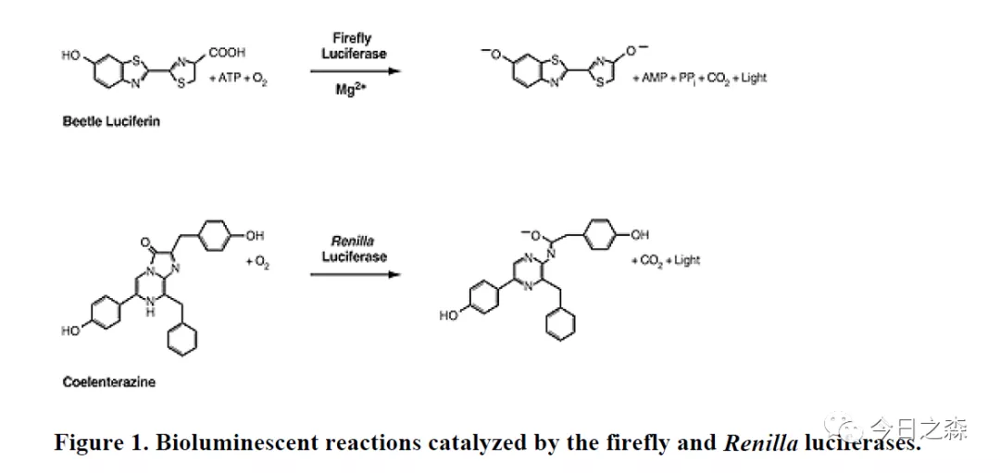
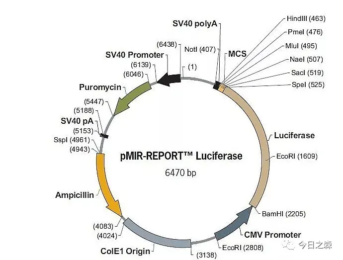
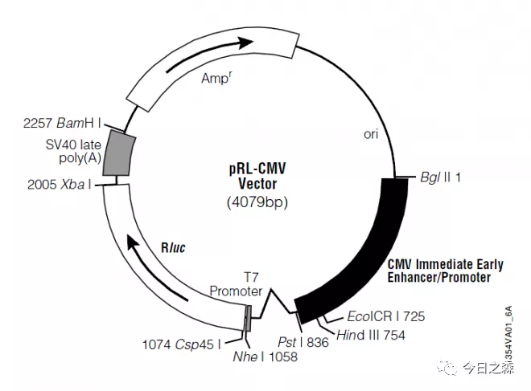
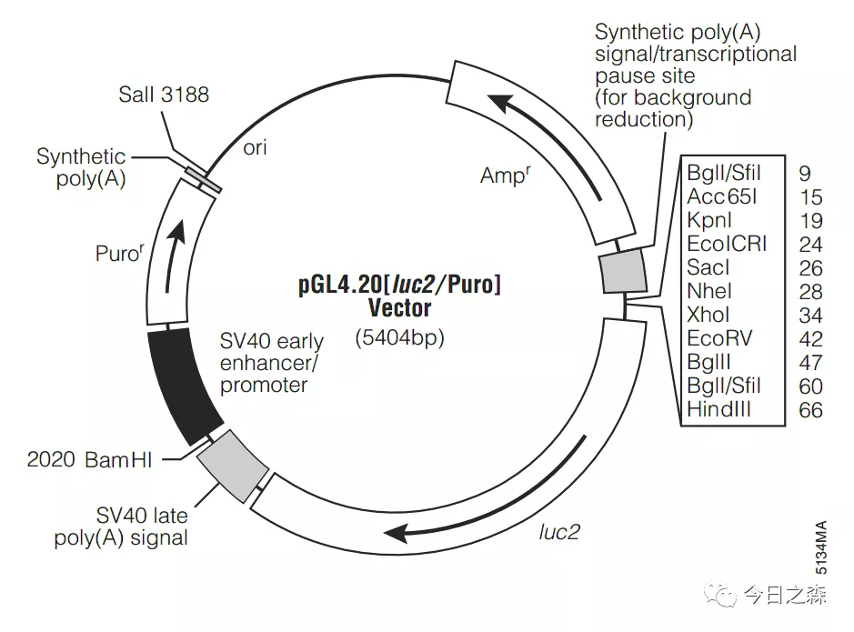
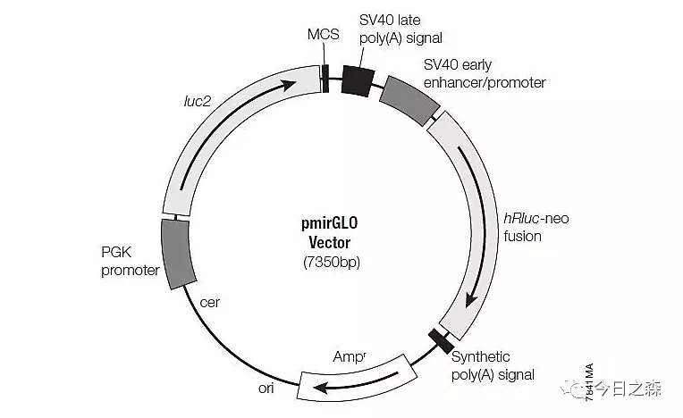
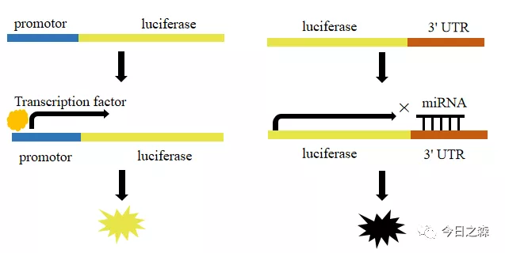
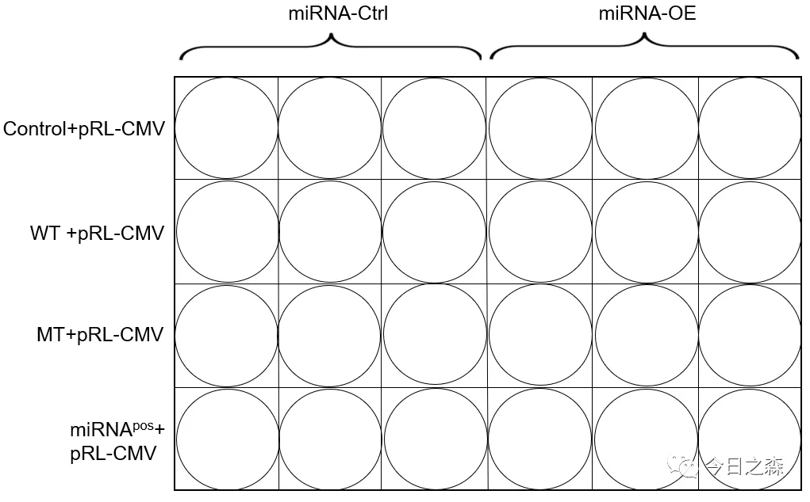
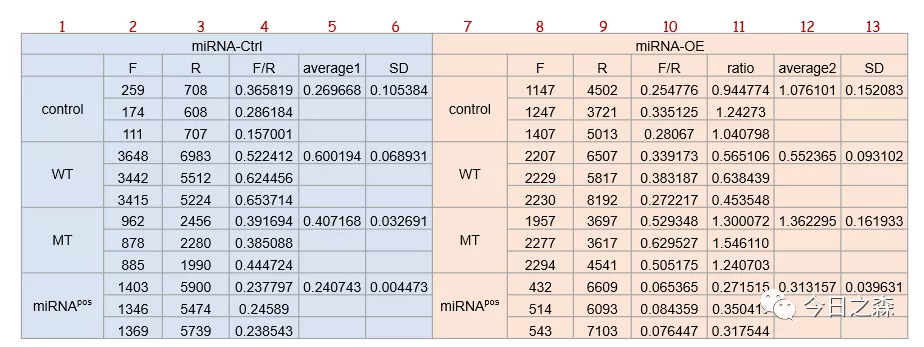
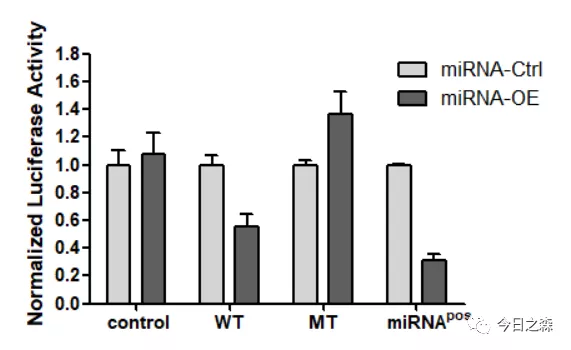

针对2021年3月12日推文“基础实验重新认识（3）——荧光素酶互补（Luc）实验”中对【导入】中提到的双荧光素酶实验进行更正和补充。

以下内容转载自http://lsi.zju.edu.cn/2020/0214/c45388a1959654/page.htm

荧光报告基因实验    
一、什么是荧光素酶和双荧光素酶？      
荧光素酶报告基因检测是以荧光素（luciferin）为底物来检测萤火虫荧光素酶（Firefly Luciferase）活性的一种报告系统。荧光素酶可以催化luciferin氧化成oxyluciferin，在luciferin氧化的过程中，会发出生物荧光（bioluminescence），可通过荧光测定仪设备测定luciferin氧化过程中释放的生物荧光，常应用于miRNA靶基因验证及启动子转录活性调控等方向研究。 
利用荧光素酶与底物结合发生化学发光反应的特性，把感兴趣的基因转录的调控元件克隆在萤火虫荧光素酶基因的上/下游，构建成荧光素酶报告质粒。然后转染细胞，适当刺激或处理后裂解细胞，测定荧光素酶活性。通过荧光素酶活性的高低判断刺激前后或不同刺激对感兴趣的调控元件的影响。
 
双荧光素酶通常是指萤火虫荧光素酶和海肾荧光素酶。萤火虫荧光素酶是从甲虫（Photinus pyralis）中分离得到，分子量为61kDa；海肾荧光素酶（Renilla Luciferase）则是从海肾（Renilla reniformis）中分离，分子量为36kDa。
 
（一）两种酶的区别？    
1. 底物和辅因子不同：萤火虫荧光素酶需要荧光素、氧气、ATP和镁离子同时存在才能发光；而海肾荧光素酶仅需要腔肠素（coelenterazine）和氧气。
                           

2. 发光的颜色不同：萤火虫荧光素酶产生的光颜色呈现黄绿色，波长550-570nm；而海肾荧光素酶产生蓝光，波长480nm。正是由于这两种酶的底物和发光颜色不同，所以在双报告实验中得到广泛应用。
 
（二）为什么采用双荧光素酶报告系统？     
单报告基因实验往往会受到各种实验条件的影响，而双报告基因则通过共转染的“对照”作为内参为试验提供一基准线，从而可以在最大程度上减小细胞活性和转染效率等外在因素对实验的影响，使得数据结果更为可信。一般情况下，海肾荧光素酶基因作为内参使用，将带有海肾荧光素酶基因的质粒与报告基因质粒共转染细胞；或是将两个报告基因构建到同一个质粒上，分别用不同的启动子启动其表达。计算结果时，将萤火虫荧光素酶的检测值比上海肾荧光素酶检测值（Firefly Luciferase/Renilla Luciferase），这样就可以减少内在变化因素对实验准确性的影响，相当于做了标准化，使测试结果不受实验条件变化的干扰。
 
（三）双荧光素酶报告基因检测有哪些常用的载体？       
1. 两种荧光素酶分别位于两个载体上。    
比如研究miRNA的靶基因实验时，这两种载体分别为：    
（1）pMIR-REPORT载体：它用来插入miRNA靶序列，评估细胞内miRNA功能。该载体包含一个CMV启动子控制下的萤火虫荧光素酶报告基因。在荧光素酶基因的3'UTR区域包含一个多克隆位点，用于插入预测miRNA的结合靶序列或其他核苷酸序列。若荧光素酶活性下降，说明该段插入序列受到miRNA调节，这模仿了miRNA靶序列的作用方式。     

（2）pRL系列载体（以pRL-CMV为例），pRL系列载体可在哺乳动物细胞中组成型地表达海肾荧光素酶。     

 
又如，研究转录因子和启动子的实验时，两种载体分别为：    

（1）pGL4.20载体，pGL4.20载体含Luciferase荧光素酶报告基因，无启动子，用于研究目的启动子的功能，在荧光素酶基因的上游包含一个多克隆位点，用于插入启动子序列，若Luciferase荧光素酶活性上升，说明该段启动子受到转录因子的调控。     
（2）pRL系列载体。     

2. 两种荧光素酶位于同一个载体上。这样偏差更小，毕竟转染一个质粒比转染两个质粒要容易，在这方面，根据检索到的资料显示，现在的这类质粒比较有名的是Promega公司的pmirGLO质粒。     

 
二、双荧光素酶报告系统有哪些应用？       
（一）验证microRNA同某基因mRNA靶向互作。将待测mRNA的3’UTR序列插入报告基因载体，再共转入该microRNA，如果萤光素酶活性下降，则提示为其靶序列。      

（二）验证microRNA同lncRNA靶向互作。将候选的lncRNA序列插入报告基因载体中F-Luc的3’UTR区域，检测萤光素酶活性。      
（三）验证特定转录因子同其调控序列的作用。将该序列（通常为启动子区域）插入报告基因载体，同时在实验细胞中共转过表达该转录因子，可分析转录因子过表达是否提高萤光素酶活性。      

 
（四）启动子结构分析。将启动子区域序列（通常2k左右）进行分段截短，或对特定位点进行突变，再分别构建入luciferase报告载体，检测其启动子活性。     
（五）启动子SNP分析。一些基因的启动子区域存在单核苷酸多态性，可运用萤光素酶报告系统分析其相对活性。     
（六）可以分析信号通路是否激活。将该信号通路的下游响应原件序列构建入报告基因载体，在不同上游信号条件下，萤光素酶活性代表了通路的下游响应。如将HIF1α的响应原件hypoxia-responsive element (HRE)插入luciferase报告载体构建稳转细胞株，可以用于低氧相关通路的研究。又如，在GPCR研究中，将cAMP response element（CRE）载入报告基因载体，构建稳定表达细胞株后，可以用于分析GPCR的激活与抑制剂筛选。     
 
三、实验步骤（以验证Gene A为miRNA的靶基因为例）     
主要分为：质粒转染细胞→双报告基因检测→统计学分析。    
1.需要的病毒或者质粒：    
miRNA-Ctrl/miRNA-OE（miRNA的ctrl和OE可以提前包好病毒）   
pMIR-REPORT（不插入任何片段，作为control）   
pMIR-REPORT-WT（将Gene A的3’UTR插入pMIR-REPORT）   
pMIR-REPORT-MT（将Gene A的3’UTR突变后插入pMIR-REPORT）   
pMIR-REPORT-miRNApos（将miRNA的反向互补序列插入，作为阳性对照）   
pRL-CMV（作为内参）    
（根据实验需要也可以再设置siRNA组）     
2.实验步骤（以24孔板为例）     
·  Day1 种细胞于24孔板     
·  Day2 病毒感染（根据实验加入一定量的miRNA-Ctrl/miRNA-OE）      
·  Day3 Report质粒转染（以24孔板一个孔为例，实验时可配置成Mix逐孔加入以减少误差）:    
25ul opti-MEM+300ng plasmid+10ng pRL-CMV   
25ul opti-MEM+0.45ul lip2000    
6h后换液      
（实验分组可参考下图，每个组可以设置3个重复孔）    

·  Day4 双报告基因检测       
（1）1 X cold PBS清洗一遍，加入80-100ul lysis buffer（buffer用量可以根据细胞量进行调整）；    
（2）在摇床上冰上被动裂解30min；   
（3）4℃，12000rpm离心10min；    
（4）吸取上清10ul于luciferase 专用96孔板；   
（5）依次加入50ul Firefly Luciferase Buffer(FB)或50ul Renilla Luciferase Buffer(RB)（RB中加入腔肠素，现用现加,FB和RB可在441室再加入）;     
（6）酶标仪检测发光。    
 
四、数据分析（以miRNA调控靶基因的实验为例）    
1.先计算出每孔的Firefly Luciferase/ Renilla Luciferase 的比值(F/R，第4列和第10列)；   
2.求出miRNA-Ctrl三个重复孔的平均值（下图第5列 average1）；     
3.再以miRNA-Ctrl组的average1为标准1，用miRNA-OE组的F/R三个重复值（第10列）分别除以average1 得到三个ratio(相当于进行了一个标准化);     
4.求出ratio的平均值作为average2。    
5.分别用average1和average2的值作柱状图。     

五、常见问题分析    
正是由于报告基因检测结果受多种因素影响，如载体状态、细胞状态、转染量、转染效率、裂解效率、加样精度、检测过程等，一旦某个细节处理不好，都可能导致实验失败或结果的不准确。    
 
（一）荧光值过高    
荧光值过高可通过以下方式尝试解决：    
1. 减少质粒转染量；    
2. 细胞样品裂解后，离心取上清后可适当稀释后检测。    
注：不建议通过减少底物量来降低荧光值，需要保证底物的饱和来反映荧光素酶真实的表达水平，否则会造成检测结果出现大的偏差  。   
 
（二）荧光值过低     
若检测到的荧光值比较低或无荧光值，可从样品裂解效率、转染效率、检测过程等这几方面进行考虑：    
1.转染效率低   
（1）优化转染实验条件；   
（2）确保转染DNA的质量，可通过酶切或琼脂糖凝胶电泳的方法对DNA质量进行鉴定；   
（3）选择活性较高，处于指数分裂期的细胞进行转染。   
2.检测过程操作不规范   
（1） 需加入足量底物，保证底物的饱和，否则会造成检测结果出现很大偏差；    
（2）室温反应。反应时各个组分（细胞裂解产物，底物工作液等）都需要调整到室温；     
（3）荧光素酶的半衰期一般约30min，加完底物后可立即检测，尽量在30 min内完成。    
3.底物氧化失效    
（1）底物避光密封保存，萤火虫荧光素酶底物-20℃保存；海肾荧光素酶底物推荐-80℃保存；    
（2）反应工作液建议现用现配。    
 
（三）复孔重复性差    
报告基因检测实验受多种因素影响，因此同批次样品检测值也可能出现浮动。除了引入另一个报告基因作为内参照避免实验条件变化的干扰之外，一般还需设置3个复孔。想要得到一个准确的结果，应尽可能减小复孔之间的差异性：     
1. 细胞裂解后建议离心取上清，保证样本的均一性；     
2. 保证加样的准确性，移液器需定期校准，确保移液精准；     
注：荧光素酶报告基因实验的检测结果非常灵敏，复孔之间的数值有一定差异是正常的，一般认为在同一个数量级的差异是可以接受的。     
 
六、荧光素酶报告基因还有哪些其他用法？     
荧光素酶基因还可以用来标记细胞和活体动物，步骤如下：     
·   将荧光素酶基因插到预期分析的细胞染色体内；     
·  通过单克隆细胞技术的筛选，培养出能稳定表达荧光素酶的细胞株，当细胞分裂、转移、分化时, 荧光素酶也会得到持续稳定的表达；     
·  将标记好的细胞接种到实验动物体内后，当外源（腹腔或静脉注射）给予其底物荧光素(luciferin)，即可在几分钟内产生发光现象。这种酶在ATP，氧存在的条件下，催化荧光素的氧化反应才可以发光，因此只有在活细胞内才会产生发光现象，并且发光光强度与标记细胞的数目线性相关。     
 荧光素酶报告基因标记活体动物的应用领域：      
（1）肿瘤学：荧光素酶报告基因活体成像能够让研究人员能够直接快速的测量各种癌症模型中肿瘤的生长、转移以及对药物的反应。非常适合于肿瘤体内生长的定量分析，避免宰杀老鼠。      
（2）干细胞与免疫学：萤火虫荧光素酶报告基因做示踪标记干细胞，将目的基因与萤火虫荧光素酶基因融合融合表达，做成转基因小鼠，进行干细胞移植，可以用活体生物发光成像技术示踪干细胞在体内的增殖、分化及迁徙的过程。     
可以通过标记免疫细胞，观察免疫细胞对肿瘤细胞等的识别和杀死功能，评价免疫细胞的免疫特异性、增殖、迁移及功能等。    
（3）蛋白质相互作用：可利用动物体内生物发光成像技术研究活体动物体内蛋白与蛋白的相互作用。其原理是将分开时都不单独发光的荧光酶的C端和N端分别连接在两个不同的蛋白质上，若是这两个蛋白质之间有相互作用，荧光酶的C端和N端就会被连接到一起，激活荧光素酶的转录表达，在有底物存在时出现生物发光。在活体条件下研究药物对蛋白质相互作用的影响，可以观察到在体外实验中无法模拟的活体环境对蛋白质相互作用的影响。（荧光素酶酶活恢复法检测体内蛋白质互作，来自萤火虫的荧光素酶（Firefly luciferase, LUC）可以分成N和C两段蛋白质而没有酶活，将N和C端各融合另外的两个蛋白质，如果这两个蛋白质在体内可以互作的话，那么LUC的N和C端将在空间上靠近而恢复酶活，因此可以通过检测分段的LUC可否恢复酶活而判断两个蛋白质之间在体内是否存在相互作用。）   

全文转载自：http://lsi.zju.edu.cn/2020/0214/c45388a1959654/page.htm

