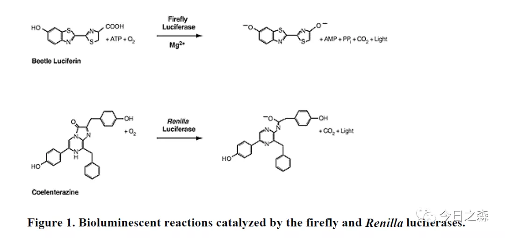
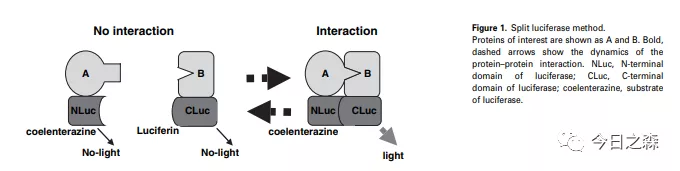
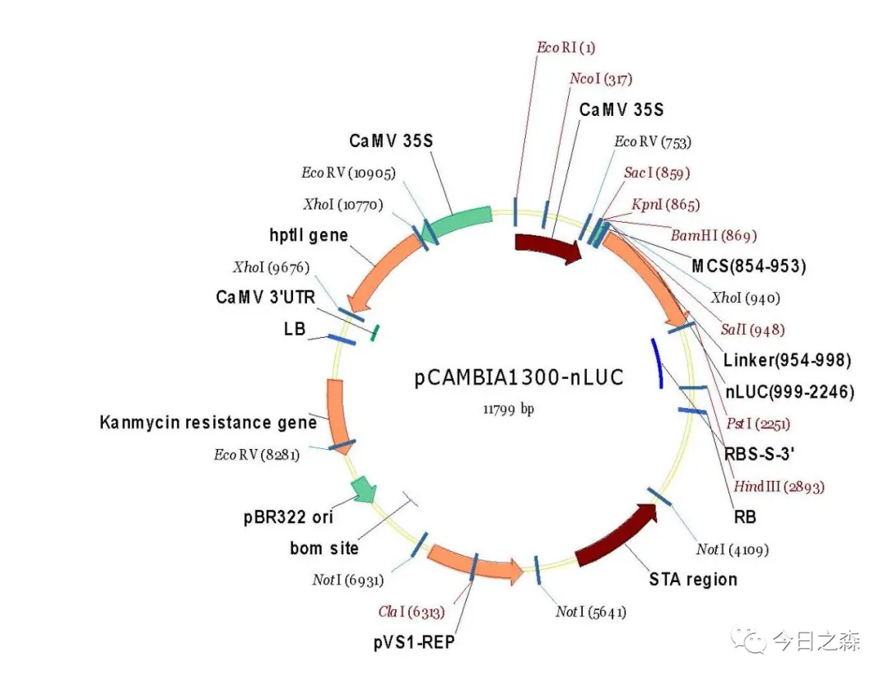
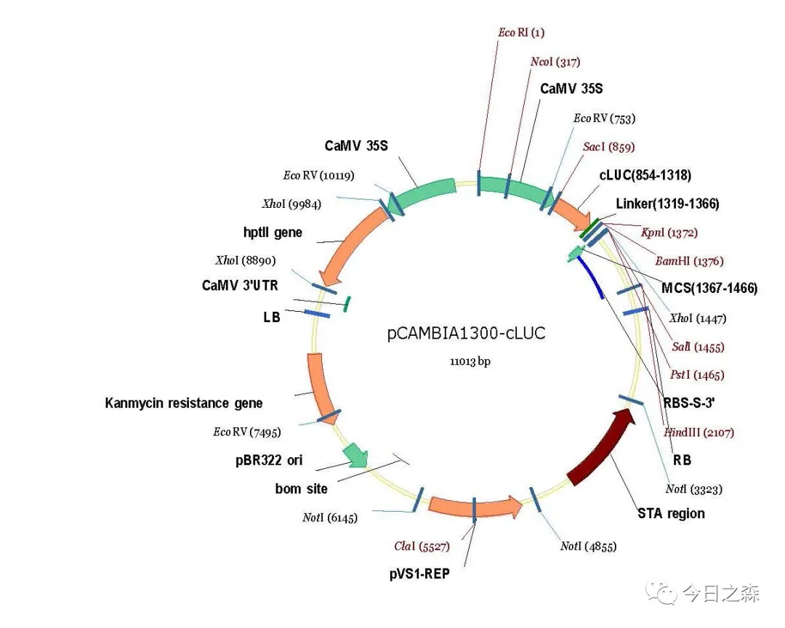

【导入】     
基于荧光素酶（Luciferase）的发光原理，形成了双荧光素酶报告基因检测系统。该系统包括萤火虫荧光素酶（Firefly luciferase）和海参荧光素酶（Renilla luciferase）。两者可与各自的底物发生氧化作用产生生物荧光，产生的荧光值即表示两种酶的表达量多少。       

图片来源[1]   

Firefly luciferase和Renilla luciferase被称为报告基因，是因为在表达调控研究时，利用两者表达产生的荧光比值可监控微观层面上的分子间相互作用。

具体做法：将靶基因的的转录调控元件或5'启动子区融合在Firefly luciferase基因的上游，把3‘-UTR区或IncRNA序列融合在Firefly luciferase基因的下游，以研究启动子的强弱和转录因子对启动子的作用，或miRNA对目的基因/IncRNA的调控作用。

该系统中引入Renilla luciferase基因的TK载体作为内参，以消除细胞转染等因素带来的组间误差。

其中luciferase来源于细菌、萤火虫和发光海洋生物等，可以在哺乳动物细胞和植物细胞中直接表达，无需表达后修饰，直接具备完全酶活性。

与GFP不同之处在于luciferase的发光检测不需要激发光激发，且发光穿透力更强，这使得Luc实验具备可定量、高灵敏度及背景低等特点。

【利用荧光素酶互补实验验证植物蛋白互作】

基本原理

在验证植物蛋白互作时，荧光素酶互补实验 (Luciferase Complementation Assay, LCA) 因其高灵敏度、可定量化、操作简单高效被广泛应用于植物学和动物学蛋白质互作研究[2]。

 

图片来源[2]

目前, 应用最为广泛的荧火素酶基因来源于北美萤火虫 (firefly luciferase), 该基因编码550个氨基酸组成的荧火素酶蛋白 (大小为62 kDa)。
实验中, 荧光素酶蛋白被切成N端和C端2个功能片段, 即NLuc (2–416AA)和 CLuc (398–550AA)。

在一个实验体系中, 待检测的2个目标蛋白分别与NLuc和CLuc融合, 如果2个目标蛋白相互作用, 则荧火素酶的NLuc和CLuc在空间上会足够靠近并正确组装, 从而发挥荧火素酶活性, 即分解底物产生荧光。

实验过程

将含有融合蛋白的植物表达载体转化农杆菌 (Agrobacterium) 后注射烟草叶片。24–48小时后，加入反应底物荧火素, 利用植物活体分子影像系统 (CCD imaging system) 或luminometer来定性定量检测荧光强度, 以判定目标蛋白之间是否存在相互作用及互作的程度。

载体图谱

 

 

图片来源：pCAMBIA-CLuc_载体_北京科瑞思搏生物科技有限公司 (crisprbio.cn)

由于该实验操作简便，已经成为植物蛋白互作验证中被广泛使用的检测方法之一。

【Reference】
[1]Dual-LuciferaseTM Reporter Assay: An Advanced Co-Reporter Technology Integrating Firefly and Renilla Luciferase Assays.
[2]Fujikawa Y, Kato N. Split luciferase complementation assay to study protein-protein interactions in Arabidopsis protoplasts. Plant J. 2007 Oct;52(1):185-95. doi: 10.1111/j.1365-313X.2007.03214.x. Epub 2007 Jul 30. PMID: 17662028.