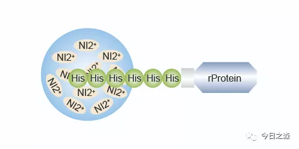
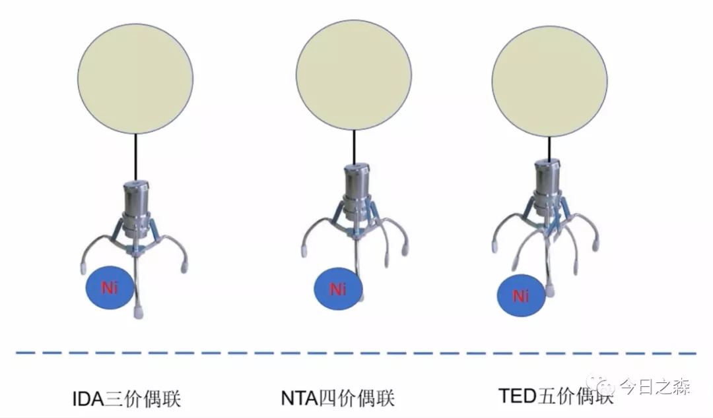

不看不知道，一看吓一跳，融合标签居然这么多。

标签蛋白，蛋白标签，术语为融合蛋白（fusion protein），是一段肽序列，加在目的蛋白的N端或C端，以检测、示踪或纯化蛋白。

总的来说，标签可以根据其功能侧重，大致分为检测标签、示踪标签和表达纯化标签。但其实这三种标签并没有明显的界限，也就是说在某种程度上可以通用，但代价不尽相同。所以，还是有必要深入了解不同标签的特性，以更好地选择合适的标签。   

检测标签    
蛋白质的检测方法包括质谱、酶活检测、免疫分析等，其中应用最为广泛的是免疫分析，常用的方法有：WB（Western Blot）、ELISA（Enzyme Linked Immunosorbent Assay）、IP（Immunoprecipitation）等。   

免疫分析需要将目标蛋白作为抗原，注射动物，然后从免疫血清中分离抗体，根据抗原-抗体间的免疫反应进行特异性检测。这种方法最大的缺陷就是每更换一个目标蛋白就要制备一个对应的抗体，操作繁琐，成本昂贵。融合标签的使用，使蛋白质免疫分析走向通用化和便利化。将特定的标签与目标蛋白融合后，两者是共同表达的，通过检测融合标签，可以得到目标蛋白的表达情况。   
|标签|序列|kDa|融合位置|简单说明|
|---|---|---|---|---|
|His|HHHHHH|0.84|N/C|对目的蛋白的空间结构影响极小，一般无需切除也不会对目标蛋白功能产生太大影响。|
|HA|YPYDVPDYA|1|N/C|源于流感病毒的红细胞凝集素表面抗原决定簇，对目标蛋白的影响较小。|
|c-Myc|EQKLISEEDL|1.1|N/C|来源于人类原癌基因Myc，由于可获得高特异性Myc单克隆抗体，因此在Western blot，免疫荧光和免疫沉淀中被广泛使用。但很少用于蛋白纯化。|
|Flag|DYKDDDDK|1|N|由于其包含肠激酶的识别位点（DDDDK），可方便去除，因此比较适合融合在目标蛋白N端。Flag标签与同类标签相比，更具亲水性，因此通常不会变性或使与其连接的蛋白质失活，常用于真核表达系统中目标蛋白的检测。|
|3×Flag|DYKDHDGDYKDHDIDYKDDDDK|2.7|N/C|可免疫原性和与抗体的亲和性得到极大增强，适用于真核生物低水平表达的蛋白的检测和纯化。|

表达与纯化标签    
蛋白质纯化的方法有很多，离子交换、疏水层析、分子筛和亲和层析，其中纯化效果最好的无疑是亲和层析，它利用基质与蛋白标签间的特异性结合，以极高的得率和纯度获得目标蛋白。   
|标签|简单说明|
|---|---|
|His|1987年，Hochuli等首次提出利用组氨酸标签纯化蛋白质。|
|GST|GST是大标签，它是一个完整的蛋白质，分子量约26KD。GST一方面具有高度可溶性，能够增加目标蛋白的可溶性；另一方面它可以在大肠杆菌中大量表达，提高目标蛋白的表达量。因此被广泛应用于各种融合蛋白的表达，可以在大肠杆菌和酵母菌等宿主细胞中表达。GST标签融合蛋白可直接从细菌裂解液中利用含有还原型谷胱甘肽琼脂糖凝胶的亲和树脂进行纯化，用10mM 还原型谷胱甘肽洗脱，可得到高浓度、高纯度融合蛋白。不过由于GST标签较大，通常需要将该标签切除，因此GST一般融合在靶标的N端。对于目标蛋白为活性酶的情况，如果经过活性验证确认GST对酶的活性没有影响，也可以保留标签。|
|MBP|MBP（麦芽糖结合蛋白），是大标签，分子量大小在40kDa以上，由大肠杆菌K12的malE基因编码。MBP可增加目标蛋白在细菌中的溶解性，尤其是真核蛋白，也可以增加融合蛋白表达量。
 MBP可以和交联淀粉亲和树脂结合，结合的融合蛋白可用10-20mM麦芽糖在温和条件下洗脱，得到高纯度、高浓度目标蛋白。
需要注意的是，MBP序列有两种形式，一种N端含有信号肽，适用于毒性蛋白的表达纯化，一般融合在N端；一种不含信号肽序列，可融合在N端或C端，多融合在N端。|
|SUMO|SUMO标签，是一种小分子泛素样修饰蛋白（Small ubiquitin-like modifier），在一级结构上与泛素只有18%的同源性，但两者的三级结构及其生物学功能却十分相似。研究发现，SUMO可以作为融合标签，不但可以提高融合蛋白的表达量，且具有抗蛋白酶水解以及促进目标蛋白正确折叠，提高重组蛋白可溶性等功能。此外，使用SUMO蛋白水解酶，能识别完整的SUMO标签，并高效的把SUMO从融合蛋白上切割下来。该标签主要用于改善目标蛋白的表达，并非常用的纯化标签，要用于纯化可采用双标签。|

示踪标签   

示踪标签主要是指利用标签本身的荧光或者催化底物发射荧光或者可见光，来检测目标蛋白在生物体内定位、转移、互作的情况。示踪标签一般分子量较大，需要在标签与目标蛋白之间加Linker序列，避免两个蛋白相互影响各自的功能。示踪标签可与检测标签联用，用于目标蛋白的检测分析，也可与纯化标签联用用于后继纯化。    

|标签|简单说明|
|---|---|
|GFP|GFP（Green fluorescent protein，绿色荧光蛋白）标签含有238个氨基酸，分子量约为26.9 KDa，在维多利亚多管发光水母中发现的，在紫外线的照射下会发出绿色的荧光的蛋白，与靶蛋白融合后不会显著地影响天然蛋白质的组装和功能。|
|EGFP|EGFP 标签是增强型绿色荧光蛋白，与GFP相比，具有更高的折叠效率（由于正确折叠的蛋白质比例更高而增加的荧光），荧光强度更强、荧光性质更稳定。|
|YFP|YFP（Yellow Fluorescent Protein，YFP）标签，可以看做绿色荧光蛋白的一种突变体，其荧光向红色光谱偏移。|
|Luciferase （Luc）|常见的有萤火虫荧光素酶、海肾荧光素酶和Guassia荧光素酶，他们可以催化荧光素底物发射荧光，作为示踪标签常用于活体成像。|

几种标签的原理
1.His-tag

His-Tag多为6×His或8×His，是目前用于纯化的融合标签中应用最广泛的。His标签是由6至10个组氨酸残基组成的一种表位标签，很容易被标签特异性抗体识别。His标签是蛋白纯化和检测的常用标签之一，由于其分子量小（只有0.84KD），融合到重组蛋白后，对标记蛋白质的结构和生化特性影响较小。His抗体可以用于检测和His标签融合表达蛋白的表达、细胞内定位，以及纯化、定性或定量检测His融合表达蛋白等，应用十分广泛。

纯化原理：咪唑环作为电子供体结合金属离子形成配位键，添加高浓度游离咪唑基即可将His标签洗脱。

His标签蛋白纯化通常采用固定化金属离子亲和层析（IMAC）纯化的方法，主要利用介质配体螯合的金属离子吸附纯化表面带组氨酸残基的蛋白。

由于His标签可与多种金属离子（如 Ca2+、Mg2+、Ni2+、Cu2+，Fe2+等）发生特殊的相互作用，所以可利用蛋白质表面的特性，使之被吸附在凝胶柱上，从而达到分离纯化蛋白的目的。

组氨酸的残基上带有1个咪唑基团，可与Ni2+、Co2+等过渡金属离子形成配位键而选择性结合在金属离子上，这些金属离子能够用螯合配体固定在层析介质上，因此带有His标签的蛋白在经过装配了金属离子的层析介质时可以选择性结合在介质上，而其他杂质蛋白则不能结合或仅能微弱结合。

结合在介质上的His标签蛋白可以通过提高缓冲液中咪唑浓度进行竞争性洗脱，从而得到纯度较高的His标签蛋白。

 
Ni2+、Co2+和Cu2+是His标签蛋白纯化中使用较为广泛的金属离子，因为它们在水溶液中与组氨酸具有较好的亲和性。
   其中，Ni2+是亲和纯化实验中最常使用的，根据结合基团不同，Ni2+亲和层析柱可分为三类：Ni-IDA，Ni-NTA和Ni-TED。
 
Ni2+有六个螯合价位，其中Ni-IDA螯合了三价，Ni-NTA螯合了四价，Ni-TED螯合了五价。所以，IDA中Ni暴露的多，载量最高，在同样条件下，Ni-IDA洗脱时所需的咪唑浓度要高于Ni-TED，也就是说IDA对Ni结合较弱，而TED与Ni结合较强。     
但IDA弱结合能力使金属离子在洗脱时容易浸出，与目的蛋白紧密结合，从而导致分离蛋白产量偏低，产品不纯及金属离子污染等问题。TED的颗粒粒度均匀，粒径更小，并且螯合镍更稳定，能耐受较高的还原剂，使填料更加稳定，镍离子不易脱落，所以实际实验中往往选择Ni-NTA亲和层析柱进行蛋白纯化。    

金属离子可以结合的氨基酸：His的咪唑基，Cys的巯基，Trp的吲哚基。

Tips：  

His标签原核表达纯化后，电泳会有一些杂带（内源蛋白） 纯化时可加入低浓度咪唑竞争内源性结合，减少杂带。
未完待续…… 