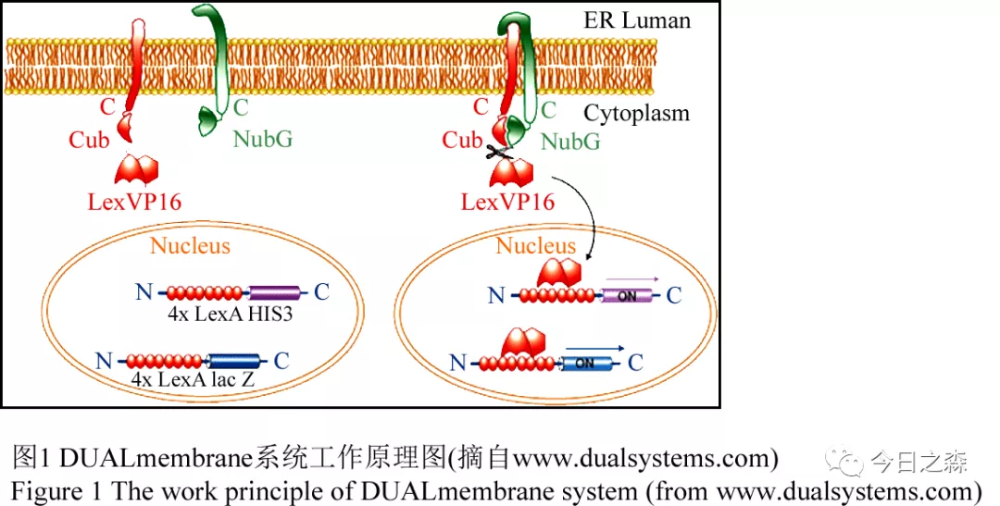
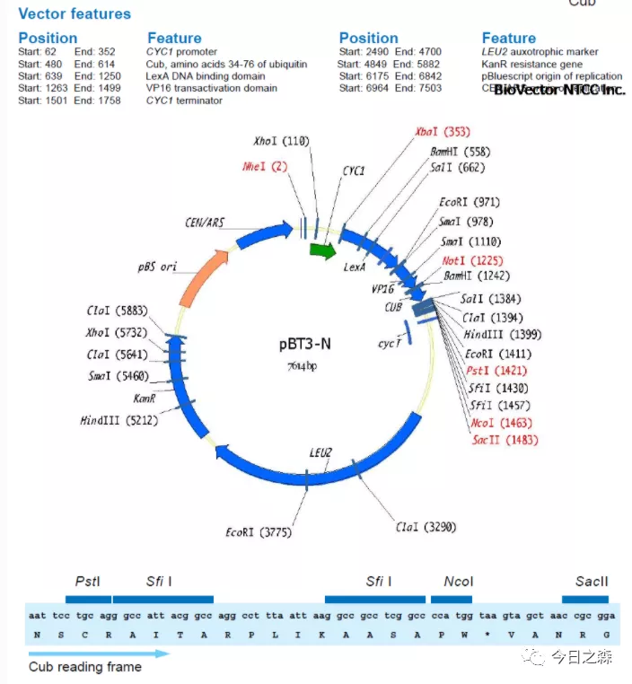
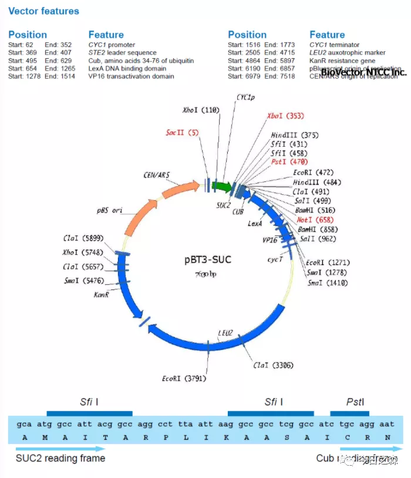
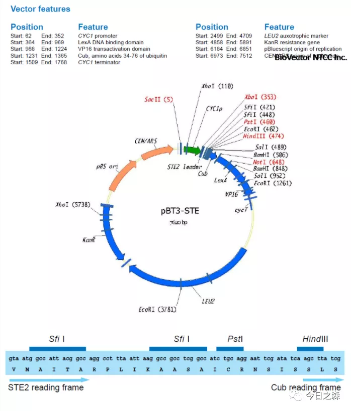
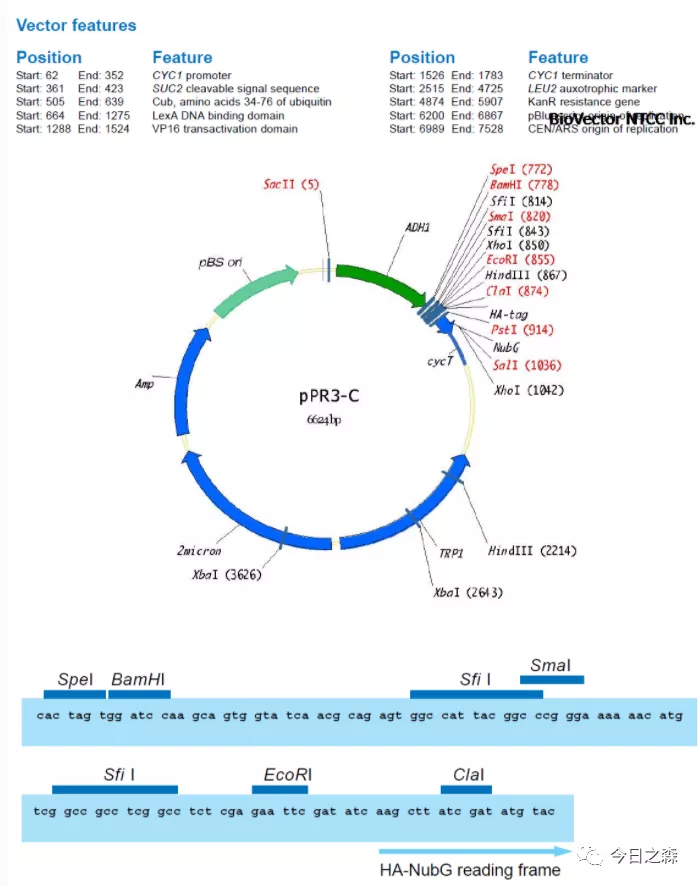
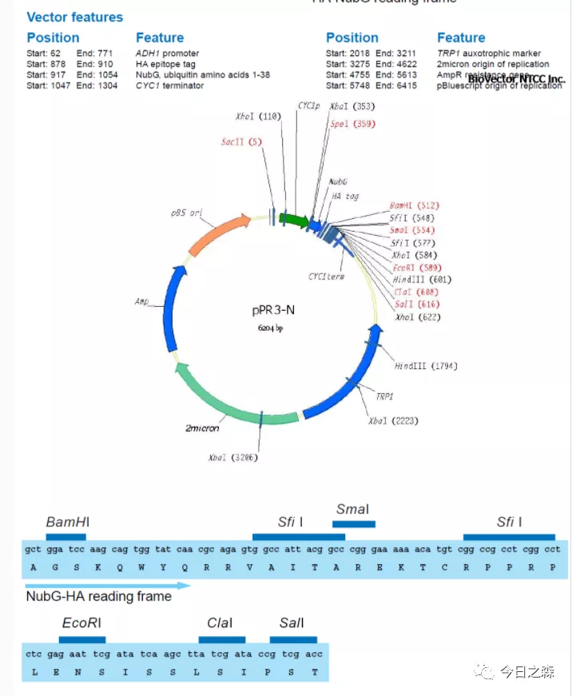

关于膜系统我还是没有怎么搞清楚，以下也只是随便扯扯……      

上一篇推文《基础实验重新认识（1）——酵母双杂交》提到了基于核系统的酵母双杂交原理，但是据推测，真核细胞中约有1/3的蛋白是与膜相关的。由于膜蛋白的疏水性，发生在膜蛋白之间的相互作用就很难用常规的核系统酵母双杂交中进行研究。  

Dualsystems Biotech AG公司开发出来基于分离的泛素(split-ubiquitin)介导的膜蛋白酵母双杂交系统[1]。   
 
该系统可用于膜蛋白-膜蛋白或膜蛋白-可溶性蛋白之间的互作检测。和传统酵母双杂交系统一样，也可以进行表达文库的筛选。   

泛素是一种含76个aa的converse protein，它经常作为降解信号连接在蛋白质的N端。泛素能被其特异性的蛋白酶(ubiquitin-specific proteases, UBPs)识别并从所连接的蛋白上切割下来，切割位点总是位于泛素蛋白的C端。在酵母细胞中，泛素可以分成两部分单独表达，即其N端部分(NubI, 第1~34位aa)和C端部分(Cub, 第35~76位aa)，后者融合有能启动核内报告基因表达的LexA蛋白。    
（这里的泛素分子则相当于传统酵母系统中的Gal4） 

正是由于泛素分子的这一特点，NubI和Cub-LexA在细胞中方能组成可分离的泛素蛋白体系。需要注意，野生型NubI和Cub具有高亲和力，并且可以自发重组形成异源二聚体。但是当野生型NubI的第143位Ile被Ala或Gly取代后，NubI和Cub就不能自发结合，因此，NubG（I13G）和Cub-LexA只有依靠bait和prey相互作用进行连接形成完整的泛素分子。然后诱导UBPs识别并于其C端进行剪切，从而释放出转录因子LexA。最终启动核内报告基因（HIS3和LacZ）的转录。

HIS3作为营养缺陷型选择标记，而LacZ转录后的β-Gal活性则作为阳性克隆的主要选择标记。VP16作为诱饵融合蛋白的识别标签用于融合蛋白的表达和定位检测。
 
因此，当bait和prey不发生蛋白互作时，转录激活蛋白LexA-Vp16被bait固定在膜区域，就不能激活细胞核内的报告基因。当bait和prey发生蛋白互作（结合）时，Cub就被牵引至Nub附近，从而形成完整的泛素分子。
 此时，泛素分子会被细胞内去泛素酶（Deubiquitnation）识别被切断，从而释放出游离的转录激活蛋白（LexA），LexA进入细胞核内激活染色体上的报告基因。
 
    

【以下只是随便扯扯】 

膜系统酵母双杂的原理表明：bait protein的表达必须在膜上准确定位，而且与bait融合的Cub必须位于胞质内，这样才能实现UBP对其的识别和剪切。

 所以当bait的C端在胞质内，则Cub-TF需要被融合在bait的C端；当bait的C端在胞外（或内质网、高尔基体等细胞器的腔内），则Cub-TF需要被融合在bait的N端。
 
……  

对于膜系统的酵母双杂原理上看起来和核系统大同小异，但是仔细探究起来感觉还是好麻烦，特别是针对上面随便扯扯的的情况，就需要针对不同的情况选择不同的载体。

载体：pBT3-N，pBT3-STE，pBT3-SUC，pDHB1，pPR3-N和pPR3-C。

bait载体选择    

1.若bait的N端位于胞质，C端位于胞外或细胞器腔内。则可使用pBT-3N载体。

    
 
2.若bait的C端位于胞质，N端位于胞外或细胞器腔内，且N端具信号肽。则可使用pBT3-SUC载体。
原因：某些哺乳动物细胞的信号肽在酵母中无法识别，而pBT3-SUC中含有一段酵素转化酶（SUC2)基因序列，当其定位在诱饵蛋白N端，能够确保诱饵蛋白正确定位到酵母膜上。具体可载体图谱。
    

3.若bait的C端位于胞质，N端位于胞外或细胞器腔内，且N端不具有信号肽，则可使用pBT3-STE 
  

4.若bait的N端和C端均位于胞质，可用pBT3-N或pBT3-STE。

prey载体选择    

膜体系的prey cDNA文库有2种，NubG-X和X-NubG。所用载体分别为pPR3-N和pPR3-C。

区别在于NubG-X中NubG在prey protein 的N端；X-NubG中NubG在prey protein的C端。

但是一般NubG-X文库丰度比X-NubG更高。因此在选择上可以更倾向于使用NubG-X。（若已知prey蛋白C端位于胞质，也可使用X-NubG）。  

  
  
注：载体图谱均来源于http://www.biovector.net/product/424600.html      
大概先写这么多吧。    

【Reference】    
[1]Stagljar I, Korostensky C, Johnsson N, te Heesen S. A genetic system based on split-ubiquitin for the analysis of interactions between membrane proteins in vivo. Proc Natl Acad Sci U S A. 1998 Apr 28;95(9):5187-92. doi: 10.1073/pnas.95.9.5187. PMID: 9560251; PMCID: PMC20236.     
[2]DUALmembrane系统——一种膜蛋白质互作的研究方法，doi: 10.5376/gab.cn.2010.29.0002  